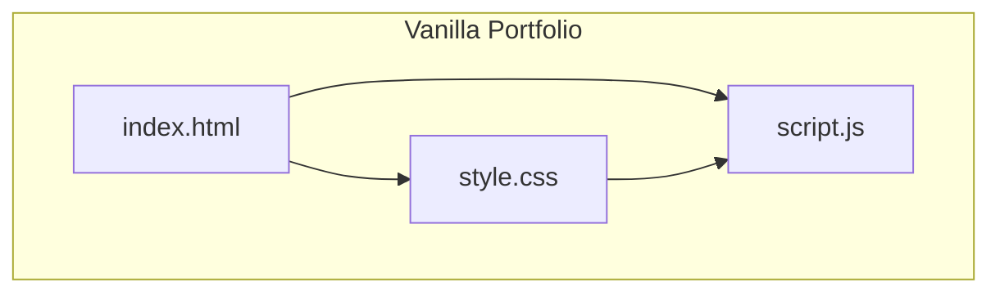
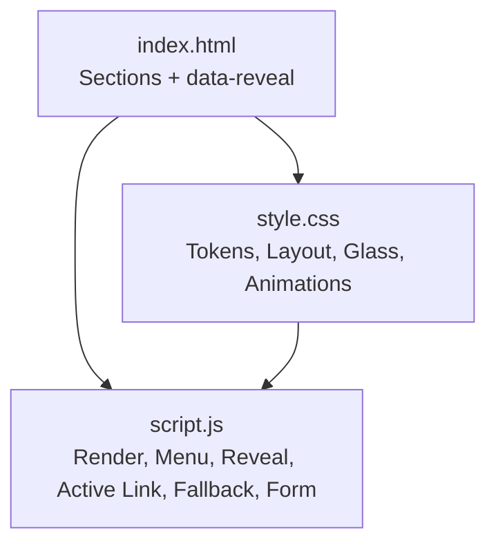
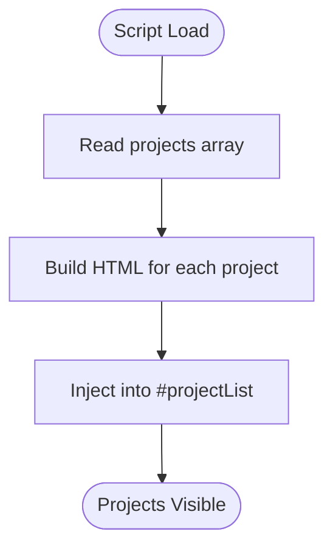
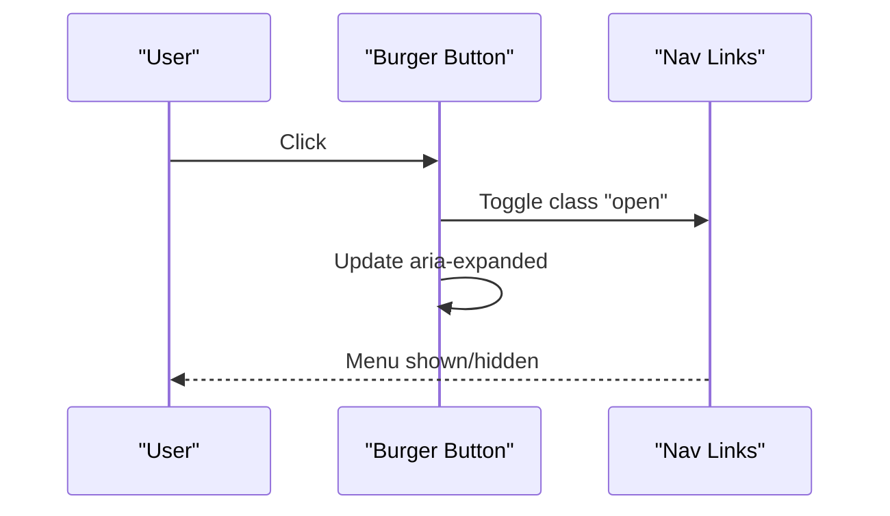
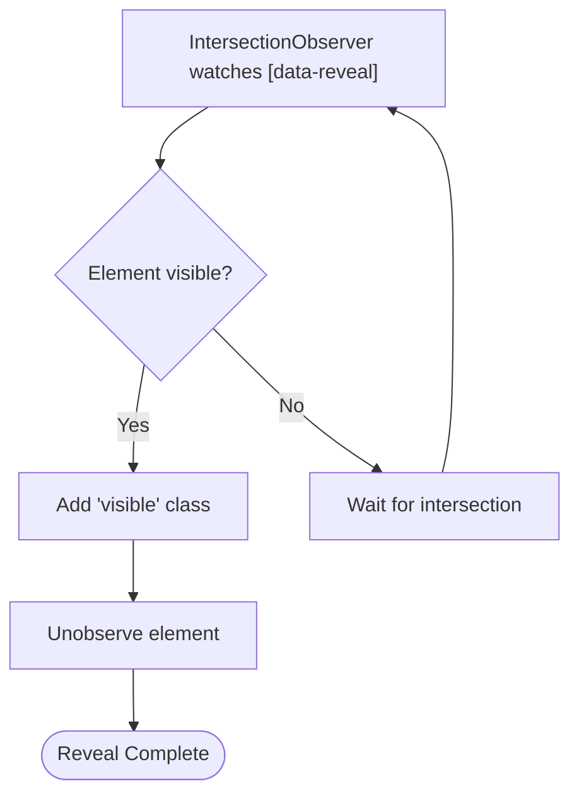
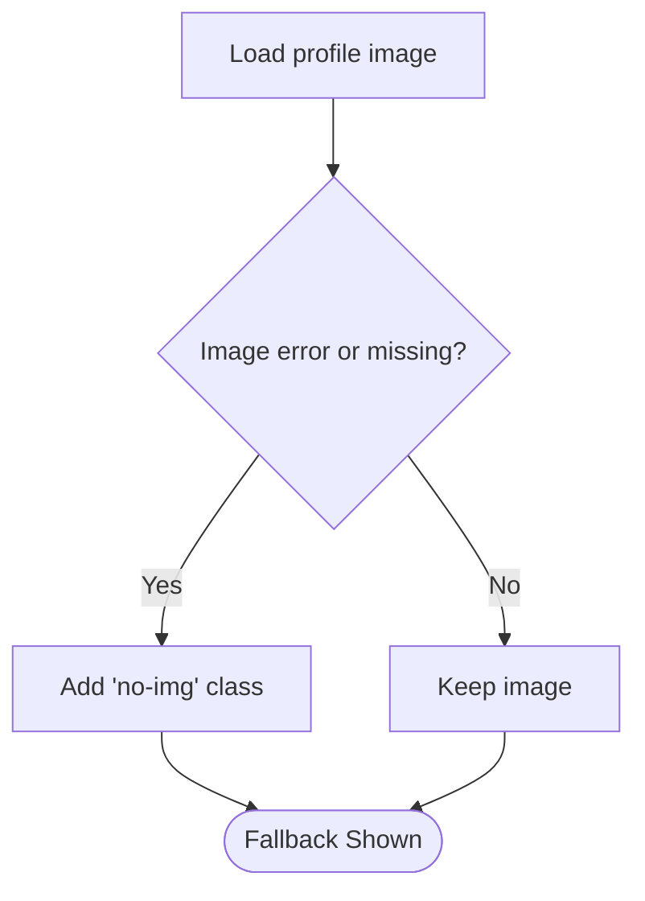
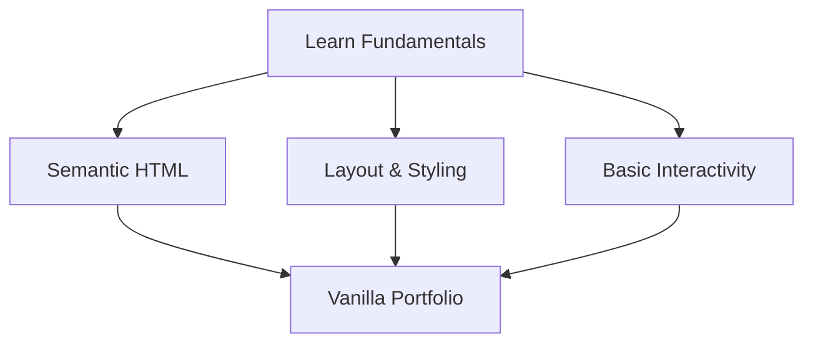
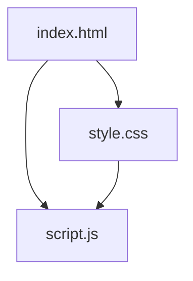

# Alternative Vanilla Version

<cite>
**Referenced Files in This Document**
- [index.html](file://files/arsalan-portfolio-vanilla/site/index.html)
- [script.js](file://files/arsalan-portfolio-vanilla/site/script.js)
- [style.css](file://files/arsalan-portfolio-vanilla/site/style.css)
- [index.html (enhanced)](file://files/index.html)
- [script.js (enhanced)](file://files/script.js)
- [style.css (enhanced)](file://files/style.css)
</cite>

## Table of Contents
1. [Introduction](#introduction)
2. [Project Structure](#project-structure)
3. [Core Components](#core-components)
4. [Architecture Overview](#architecture-overview)
5. [Detailed Component Analysis](#detailed-component-analysis)
6. [Dependency Analysis](#dependency-analysis)
7. [Performance Considerations](#performance-considerations)
8. [Troubleshooting Guide](#troubleshooting-guide)
9. [Conclusion](#conclusion)
10. [Appendices](#appendices)

## Introduction
This document explains the simplified vanilla implementation located under `files/arsalan-portfolio-vanilla/site`. It is a stripped-down, beginner-friendly version of the main enhanced portfolio. The goal is to help you understand core web fundamentals while keeping complexity low and focusing on essential HTML, CSS, and JavaScript patterns.

The vanilla version intentionally omits many advanced interactions present in the enhanced version, such as:
- A cinematic welcome overlay
- Scroll progress bar
- Back-to-top button
- Mouse-reactive ambient glow
- Magnetic pull effects on buttons
- 3D tilt effects on cards
- Animated timeline with per-step activation
- Sliding navigation indicator and section-based background mood shifts

Use this version when you want to learn or teach fundamentals without being overwhelmed by advanced animations and complex JavaScript logic.

**Section sources**
- [index.html (enhanced):1-158](file://files/index.html#L1-L158)
- [script.js (enhanced):1-249](file://files/script.js#L1-L249)
- [style.css (enhanced):1-268](file://files/style.css#L1-L268)

## Project Structure
The vanilla implementation follows a simple three-file structure:
- `index.html`: Semantic page sections for Home, About, Skills, Journey, Projects, Contact, and Footer.
- `style.css`: Design tokens, layout, glassmorphism, responsive rules, and basic animations.
- `script.js`: Project rendering, mobile menu, scroll reveal, active link tracking, image fallback, and UI-only form handling.



**Diagram sources**
- [index.html:1-135](file://files/arsalan-portfolio-vanilla/site/index.html#L1-L135)
- [style.css:1-182](file://files/arsalan-portfolio-vanilla/site/style.css#L1-L182)
- [script.js:1-75](file://files/arsalan-portfolio-vanilla/site/script.js#L1-L75)

**Section sources**
- [index.html:1-135](file://files/arsalan-portfolio-vanilla/site/index.html#L1-L135)
- [style.css:1-182](file://files/arsalan-portfolio-vanilla/site/style.css#L1-L182)
- [script.js:1-75](file://files/arsalan-portfolio-vanilla/site/script.js#L1-L75)

## Core Components
The vanilla version includes these core components:
- Navigation with mobile burger menu
- Hero section with badge, headline, call-to-action buttons, and portrait area
- About section with two paragraphs
- Skills grid showing Foundation, Learning, and Exploring categories
- Timeline showing learning journey steps
- Projects section rendered from a JavaScript array
- Contact section with email/GitHub links and a UI-only form
- Footer with links and dynamic year

Key behaviors implemented in JavaScript:
- Render projects from an array
- Toggle mobile menu
- Reveal elements on scroll using IntersectionObserver
- Highlight active nav link based on current section
- Fallback for missing profile image
- UI-only contact form behavior
- Dynamic copyright year

**Section sources**
- [index.html:13-130](file://files/arsalan-portfolio-vanilla/site/index.html#L13-L130)
- [script.js:1-75](file://files/arsalan-portfolio-vanilla/site/script.js#L1-L75)
- [style.css:1-182](file://files/arsalan-portfolio-vanilla/site/style.css#L1-L182)

## Architecture Overview
At a high level, the vanilla architecture separates concerns cleanly:
- HTML defines semantic sections and data attributes for reveal behavior.
- CSS provides design tokens, layout, glassmorphism, and responsive styles.
- JS handles minimal interactivity and DOM updates.



**Diagram sources**
- [index.html:1-135](file://files/arsalan-portfolio-vanilla/site/index.html#L1-L135)
- [style.css:1-182](file://files/arsalan-portfolio-vanilla/site/style.css#L1-L182)
- [script.js:1-75](file://files/arsalan-portfolio-vanilla/site/script.js#L1-L75)

## Detailed Component Analysis

### Vanilla vs Enhanced: Feature Comparison
| Area | Vanilla Version | Enhanced Version |
|---|---|---|
| Welcome intro | Not present | Cinematic welcome overlay with orbs and text animation |
| Scroll progress | Not present | Top progress bar driven by scroll position |
| Back-to-top button | Not present | Floating button appears after scrolling |
| Ambient glow | Basic static glows | Mouse-reactive ambient glow with subtle movement |
| Button magnetism | None | Magnetic pull effect on primary buttons |
| Card tilt | None | Subtle 3D tilt on portrait and project cards |
| Timeline | Simple list with classes | Animated nodes and cards activated on scroll |
| Nav indicator | No sliding indicator | Sliding underline indicator for active link |
| Section mood | No dynamic mood | Background color shifts per section |
| Complexity | Low | High due to multiple observers and pointer events |

These differences make the vanilla version ideal for learning fundamentals, while the enhanced version demonstrates advanced frontend techniques.

**Section sources**
- [index.html:1-135](file://files/arsalan-portfolio-vanilla/site/index.html#L1-L135)
- [script.js:1-75](file://files/arsalan-portfolio-vanilla/site/script.js#L1-L75)
- [style.css:1-182](file://files/arsalan-portfolio-vanilla/site/style.css#L1-L182)
- [index.html (enhanced):1-158](file://files/index.html#L1-L158)
- [script.js (enhanced):1-249](file://files/script.js#L1-L249)
- [style.css (enhanced):1-268](file://files/style.css#L1-L268)

### Projects Rendering Flow
Projects are defined in a JavaScript array and rendered into the DOM. Each project can include optional preview image, live link, repository link, and tags.



**Diagram sources**
- [script.js:1-34](file://files/arsalan-portfolio-vanilla/site/script.js#L1-L34)

**Section sources**
- [script.js:1-34](file://files/arsalan-portfolio-vanilla/site/script.js#L1-L34)

### Mobile Menu Interaction
The burger button toggles the visibility of the navigation links and updates accessibility attributes.



**Diagram sources**
- [script.js:36-44](file://files/arsalan-portfolio-vanilla/site/script.js#L36-L44)

**Section sources**
- [script.js:36-44](file://files/arsalan-portfolio-vanilla/site/script.js#L36-L44)

### Scroll Reveal Behavior
Elements marked with `data-reveal` fade in and translate upward when they enter the viewport.



**Diagram sources**
- [script.js:46-50](file://files/arsalan-portfolio-vanilla/site/script.js#L46-L50)
- [style.css:152-159](file://files/arsalan-portfolio-vanilla/site/style.css#L152-L159)

**Section sources**
- [script.js:46-50](file://files/arsalan-portfolio-vanilla/site/script.js#L46-L50)
- [style.css:152-159](file://files/arsalan-portfolio-vanilla/site/style.css#L152-L159)

### Active Navigation Link Tracking
As sections scroll into view, the corresponding nav link becomes active.

```mermaid
sequenceDiagram
participant Sections as "Sections"
participant Observer as "SectionObserver"
participant Links as "Nav Links"
Sections->>Observer : Intersection events
Observer->>Links : Toggle 'active' based on href match
Links-->>User : Highlighted active link
```

**Diagram sources**
- [script.js:52-59](file://files/arsalan-portfolio-vanilla/site/script.js#L52-L59)

**Section sources**
- [script.js:52-59](file://files/arsalan-portfolio-vanilla/site/script.js#L52-L59)

### Profile Image Fallback
If the profile image fails to load, a fallback initial letter is displayed.



**Diagram sources**
- [script.js:61-66](file://files/arsalan-portfolio-vanilla/site/script.js#L61-L66)

**Section sources**
- [script.js:61-66](file://files/arsalan-portfolio-vanilla/site/script.js#L61-L66)

### UI-Only Contact Form
The form prevents default submission and visually indicates that no backend is connected.

```mermaid
sequenceDiagram
participant User as "User"
participant Form as "Contact Form"
participant Note as "Form Note"
User->>Form : Submit
Form->>Form : Prevent default
Form->>Note : Change note color
Note-->>User : Visual feedback only
```

**Diagram sources**
- [script.js:68-72](file://files/arsalan-portfolio-vanilla/site/script.js#L68-L72)

**Section sources**
- [script.js:68-72](file://files/arsalan-portfolio-vanilla/site/script.js#L68-L72)

### Conceptual Overview
The vanilla version emphasizes clarity and simplicity. It avoids heavy animation libraries and complex event handling, making it easier to read, modify, and extend.



[No sources needed since this diagram shows conceptual workflow, not actual code structure]

## Dependency Analysis
The vanilla version has minimal dependencies:
- HTML depends on CSS for styling and JS for behavior.
- CSS defines reusable tokens and component styles.
- JS manipulates DOM elements referenced in HTML and relies on CSS classes for visual state.



**Diagram sources**
- [index.html:1-135](file://files/arsalan-portfolio-vanilla/site/index.html#L1-L135)
- [style.css:1-182](file://files/arsalan-portfolio-vanilla/site/style.css#L1-L182)
- [script.js:1-75](file://files/arsalan-portfolio-vanilla/site/script.js#L1-L75)

**Section sources**
- [index.html:1-135](file://files/arsalan-portfolio-vanilla/site/index.html#L1-L135)
- [style.css:1-182](file://files/arsalan-portfolio-vanilla/site/style.css#L1-L182)
- [script.js:1-75](file://files/arsalan-portfolio-vanilla/site/script.js#L1-L75)

## Performance Considerations
- The vanilla version uses lightweight IntersectionObserver instances for reveal and active link tracking.
- There are no continuous pointermove handlers or complex requestAnimationFrame loops.
- Animations are primarily CSS-driven and respect reduced motion preferences.
- Project rendering is straightforward and does not require virtualization.

These choices keep the page fast and accessible, especially on lower-end devices.

[No sources needed since this section provides general guidance]

## Troubleshooting Guide
Common issues and resolutions:
- Missing profile image: Ensure the image path exists; otherwise, the fallback initial will display automatically.
- Projects not appearing: Verify the `projects` array is correctly defined and the `#projectList` container exists.
- Mobile menu not opening: Check that the burger button and nav links IDs match those used in the script.
- Reveal animations not triggering: Confirm elements have the `data-reveal` attribute and the observer is initialized.
- Active link not updating: Ensure sections have `id` attributes matching nav link `href` values.

**Section sources**
- [script.js:61-72](file://files/arsalan-portfolio-vanilla/site/script.js#L61-L72)
- [index.html:13-130](file://files/arsalan-portfolio-vanilla/site/index.html#L13-L130)

## Conclusion
The vanilla portfolio is a focused, educational starting point. It teaches core concepts like semantic markup, CSS design tokens, responsive layouts, and basic JavaScript interactivity. Use it to build confidence before exploring the enhanced version’s advanced features such as cinematic intros, mouse-reactive effects, animated timelines, and dynamic navigation indicators.

[No sources needed since this section summarizes without analyzing specific files]

## Appendices

### When to Use Each Version
- Choose the vanilla version when:
  - You are learning HTML, CSS, and JavaScript fundamentals.
  - You want a clean template to practice adding features gradually.
  - You need a lightweight site with minimal interactivity.
- Choose the enhanced version when:
  - You want to showcase advanced frontend skills.
  - You plan to demonstrate animations, pointer effects, and complex DOM manipulation.
  - You are preparing a polished portfolio for professional contexts.

[No sources needed since this section provides general guidance]

### Migration Guidance
To migrate from vanilla to enhanced:
- Add the welcome overlay and loading gate.
- Introduce the scroll progress bar and back-to-top button.
- Implement mouse-reactive ambient glow and magnetic button effects.
- Add 3D tilt to cards and animated timeline activation.
- Include a sliding navigation indicator and section-based mood changes.
- Refactor JS to use `DOMContentLoaded` and organize observers carefully.

To migrate from enhanced to vanilla:
- Remove the welcome overlay and related CSS.
- Remove scroll progress and back-to-top elements.
- Strip out pointermove handlers and magnetic/tilt logic.
- Simplify timeline to static items.
- Remove navigation indicator and mood variables.
- Keep core functionality: project rendering, mobile menu, reveal, active link, image fallback, and UI-only form.

**Section sources**
- [index.html (enhanced):1-158](file://files/index.html#L1-L158)
- [script.js (enhanced):1-249](file://files/script.js#L1-L249)
- [style.css (enhanced):1-268](file://files/style.css#L1-L268)