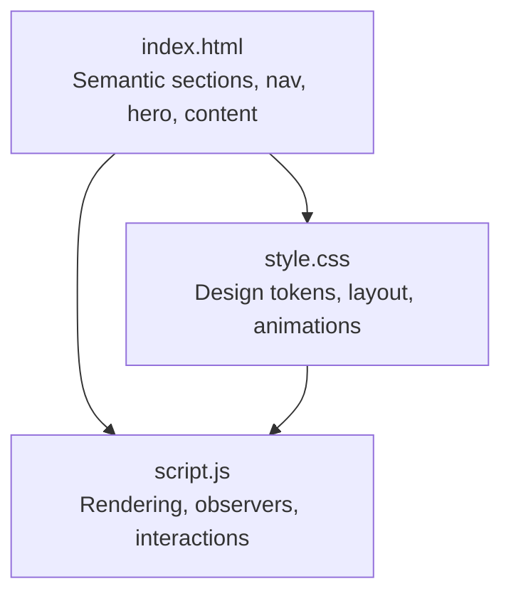
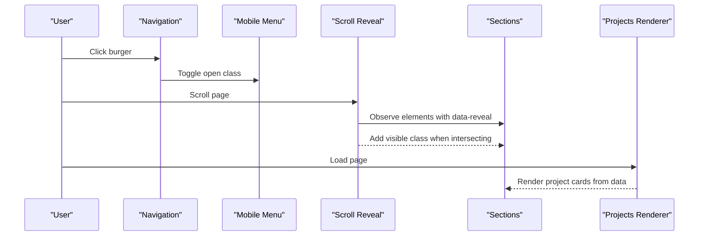
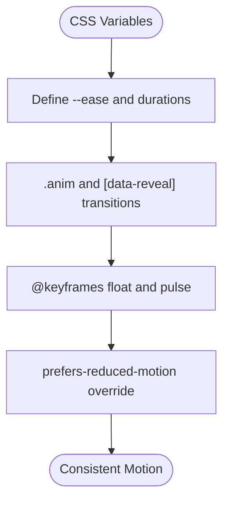
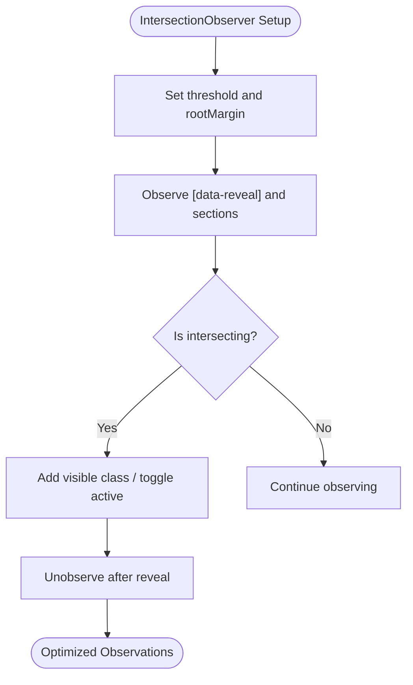
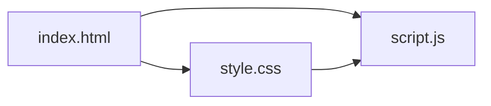

# Advanced Customization

<cite>
**Referenced Files in This Document**
- [index.html](file://files/arsalan-portfolio-vanilla/site/index.html)
- [style.css](file://files/arsalan-portfolio-vanilla/site/style.css)
- [script.js](file://files/arsalan-portfolio-vanilla/site/script.js)
</cite>

## Table of Contents
1. [Introduction](#introduction)
2. [Project Structure](#project-structure)
3. [Core Components](#core-components)
4. [Architecture Overview](#architecture-overview)
5. [Detailed Component Analysis](#detailed-component-analysis)
6. [Dependency Analysis](#dependency-analysis)
7. [Performance Considerations](#performance-considerations)
8. [Troubleshooting Guide](#troubleshooting-guide)
9. [Conclusion](#conclusion)
10. [Appendices](#appendices)

## Introduction
This document provides advanced customization guidance for experienced developers working with this vanilla portfolio site. It explains how to modify animation behaviors, extend interactive effects beyond the existing magnetic buttons and 3D tilting, optimize performance (lazy loading images, optimizing animations, reducing DOM manipulation), extend the welcome overlay system, integrate third-party libraries while preserving the vanilla architecture, add custom CSS classes, modify scroll observer behavior, create new component-like sections, and apply debugging techniques and browser compatibility considerations.

## Project Structure
The project is organized into three primary files:
- HTML structure defines semantic sections, navigation, hero, about, skills, journey, projects, contact, and footer.
- CSS centralizes design tokens, layout, glassmorphism, typography, responsive rules, and animations.
- JavaScript handles project rendering, mobile menu toggling, scroll reveal via IntersectionObserver, active section highlighting, image fallback, and a UI-only form handler.

**Diagram sources**
- [index.html:1-135](file://files/arsalan-portfolio-vanilla/site/index.html#L1-L135)
- [style.css:1-182](file://files/arsalan-portfolio-vanilla/site/style.css#L1-L182)
- [script.js:1-75](file://files/arsalan-portfolio-vanilla/site/script.js#L1-L75)

**Section sources**
- [index.html:1-135](file://files/arsalan-portfolio-vanilla/site/index.html#L1-L135)
- [style.css:1-182](file://files/arsalan-portfolio-vanilla/site/style.css#L1-L182)
- [script.js:1-75](file://files/arsalan-portfolio-vanilla/site/script.js#L1-L75)

## Core Components
- Navigation and mobile menu: Controlled by burger button and nav links; toggles an open class on the nav list and updates aria-expanded.
- Scroll reveal: Elements with data-reveal are animated when intersecting using IntersectionObserver.
- Active section highlight: Observes main sections to toggle active state on nav links based on current viewport intersection.
- Projects rendering: A data array drives dynamic generation of project cards with optional preview images and tags.
- Profile image fallback: Adds a no-img class to show a fallback initial if the profile image fails to load.
- Contact form: Prevents default submission and updates a note element to indicate UI-only behavior.

Key implementation anchors:
- Mobile menu toggle logic and event listeners.
- IntersectionObserver setup for reveal and active link states.
- Dynamic project card creation from a data array.
- Image error handling for fallback.

**Section sources**
- [script.js:36-44](file://files/arsalan-portfolio-vanilla/site/script.js#L36-L44)
- [script.js:46-50](file://files/arsalan-portfolio-vanilla/site/script.js#L46-L50)
- [script.js:52-59](file://files/arsalan-portfolio-vanilla/site/script.js#L52-L59)
- [script.js:14-34](file://files/arsalan-portfolio-vanilla/site/script.js#L14-L34)
- [script.js:61-66](file://files/arsalan-portfolio-vanilla/site/script.js#L61-L66)
- [script.js:68-72](file://files/arsalan-portfolio-vanilla/site/script.js#L68-L72)

## Architecture Overview
The site follows a simple, modular vanilla architecture:
- HTML provides semantic markup and hooks (classes, data attributes).
- CSS encapsulates visual styles, transitions, keyframes, and responsive breakpoints.
- JavaScript attaches minimal interactivity and uses modern APIs like IntersectionObserver.

**Diagram sources**
- [script.js:36-44](file://files/arsalan-portfolio-vanilla/site/script.js#L36-L44)
- [script.js:46-50](file://files/arsalan-portfolio-vanilla/site/script.js#L46-L50)
- [script.js:14-34](file://files/arsalan-portfolio-vanilla/site/script.js#L14-L34)

## Detailed Component Analysis

### Animation System and Transitions
- Global easing and timing are defined via CSS variables for consistent motion.
- Animations include entrance fades and transforms for .anim and [data-reveal] elements.
- Floating and pulsing effects are implemented with @keyframes.
- Reduced motion support disables animations for users who prefer reduced motion.

Customization strategies:
- Adjust transition durations and easing in CSS variables or specific selectors to change feel.
- Extend keyframes for new motion patterns (e.g., slide-in, scale-up).
- Use prefers-reduced-motion media query to ensure accessibility.

**Diagram sources**
- [style.css:1-12](file://files/arsalan-portfolio-vanilla/site/style.css#L1-L12)
- [style.css:152-159](file://files/arsalan-portfolio-vanilla/site/style.css#L152-L159)

**Section sources**
- [style.css:1-12](file://files/arsalan-portfolio-vanilla/site/style.css#L1-L12)
- [style.css:152-159](file://files/arsalan-portfolio-vanilla/site/style.css#L152-L159)

### Interactive Effects Beyond Magnetic Buttons and 3D Tilting
Existing interactions include hover transforms on cards and buttons, floating chips, and reveal-on-scroll. To add new effects:
- Create a new CSS class with transform and transition properties.
- Attach a small JavaScript module that listens for pointermove or mouseenter events and applies transforms conditionally.
- Ensure performance by using transform and opacity only, avoiding layout-triggering properties.

Example approach:
- Add a class like .tilt-card and set up a lightweight tilt effect in script.js.
- Debounce or throttle pointer events to reduce recalculations.
- Respect prefers-reduced-motion by disabling complex effects.

**Section sources**
- [style.css:21-24](file://files/arsalan-portfolio-vanilla/site/style.css#L21-L24)
- [style.css:42-49](file://files/arsalan-portfolio-vanilla/site/style.css#L42-L49)
- [style.css:79-82](file://files/arsalan-portfolio-vanilla/site/style.css#L79-L82)

### Extending the Welcome Overlay System
There is no explicit welcome overlay in the provided codebase. To implement one:
- Add an overlay container in index.html with a dismissible trigger.
- Style it with style.css using fixed positioning, backdrop-filter, and fade/scale transitions.
- Control visibility via a class toggle in script.js on page load and user interaction.
- Integrate with scroll reveal so the overlay disappears when the user scrolls or interacts.

Implementation anchors:
- Insert overlay markup near the top of body.
- Add CSS for overlay layers and transitions.
- Add JS to toggle visibility and handle dismissal.

**Section sources**
- [index.html:10-13](file://files/arsalan-portfolio-vanilla/site/index.html#L10-L13)
- [style.css:152-159](file://files/arsalan-portfolio-vanilla/site/style.css#L152-L159)
- [script.js:36-44](file://files/arsalan-portfolio-vanilla/site/script.js#L36-L44)

### Integrating Third-Party Libraries While Maintaining Vanilla Architecture
- Keep vanilla HTML/CSS/JS as the core.
- Load third-party scripts after the DOM is ready and ensure they do not overwrite global state.
- Wrap library initialization in a function and call it once.
- Provide graceful degradation if the library fails to load.
- Avoid heavy frameworks unless necessary; prefer lightweight utilities.

Integration checklist:
- Include script tag at the end of body.
- Initialize after renderProjects() completes.
- Use feature detection and try/catch around library calls.
- Ensure accessibility attributes remain intact.

**Section sources**
- [index.html:132-133](file://files/arsalan-portfolio-vanilla/site/index.html#L132-L133)
- [script.js:14-34](file://files/arsalan-portfolio-vanilla/site/script.js#L14-L34)

### Adding Custom CSS Classes
- Define new utility classes in style.css under appropriate sections (e.g., buttons, cards).
- Use CSS variables for colors, spacing, and easing to maintain consistency.
- Apply classes to elements in index.html or dynamically generated content in script.js.

Guidelines:
- Prefer BEM-like naming for clarity.
- Keep animations performant (transform, opacity).
- Test across breakpoints.

**Section sources**
- [style.css:1-12](file://files/arsalan-portfolio-vanilla/site/style.css#L1-L12)
- [style.css:42-49](file://files/arsalan-portfolio-vanilla/site/style.css#L42-L49)
- [style.css:161-181](file://files/arsalan-portfolio-vanilla/site/style.css#L161-L181)

### Modifying Scroll Observer Behavior
Current behavior:
- Elements with data-reveal animate when intersecting.
- Active nav links update based on section intersection with rootMargin tuned for mid-section detection.

To customize:
- Adjust threshold and rootMargin to change when elements reveal or when sections become active.
- Add multiple observers for different behaviors (e.g., staggered reveals).
- Unobserve after revealing to avoid unnecessary checks.

**Diagram sources**
- [script.js:46-50](file://files/arsalan-portfolio-vanilla/site/script.js#L46-L50)
- [script.js:52-59](file://files/arsalan-portfolio-vanilla/site/script.js#L52-L59)

**Section sources**
- [script.js:46-50](file://files/arsalan-portfolio-vanilla/site/script.js#L46-L50)
- [script.js:52-59](file://files/arsalan-portfolio-vanilla/site/script.js#L52-L59)

### Creating New Component-Like Sections
- Add a new <section> in index.html with a unique id and data-reveal.
- Style it using existing design tokens and grid/flex layouts.
- If dynamic, extend the data model in script.js and update render logic accordingly.

Steps:
- Define markup structure and accessibility attributes.
- Add CSS classes for layout and styling.
- Wire up any interactions in script.js.

**Section sources**
- [index.html:55-62](file://files/arsalan-portfolio-vanilla/site/index.html#L55-L62)
- [index.html:64-86](file://files/arsalan-portfolio-vanilla/site/index.html#L64-L86)
- [index.html:88-97](file://files/arsalan-portfolio-vanilla/site/index.html#L88-L97)
- [style.css:84-101](file://files/arsalan-portfolio-vanilla/site/style.css#L84-L101)

## Dependency Analysis
The components have clear, low-coupling relationships:
- HTML provides structural hooks consumed by CSS and JS.
- CSS depends on HTML classes and data attributes.
- JS depends on HTML IDs and data attributes, and optionally CSS classes for state.

**Diagram sources**
- [index.html:1-135](file://files/arsalan-portfolio-vanilla/site/index.html#L1-L135)
- [style.css:1-182](file://files/arsalan-portfolio-vanilla/site/style.css#L1-L182)
- [script.js:1-75](file://files/arsalan-portfolio-vanilla/site/script.js#L1-L75)

**Section sources**
- [index.html:1-135](file://files/arsalan-portfolio-vanilla/site/index.html#L1-L135)
- [style.css:1-182](file://files/arsalan-portfolio-vanilla/site/style.css#L1-L182)
- [script.js:1-75](file://files/arsalan-portfolio-vanilla/site/script.js#L1-L75)

## Performance Considerations
- Lazy loading images:
  - Use loading="lazy" on images below the fold.
  - For dynamic project previews, consider lazy-loading via IntersectionObserver before setting src.
- Optimize animations:
  - Prefer transform and opacity changes.
  - Reduce heavy filters and blur where possible.
  - Use will-change sparingly for elements that animate frequently.
- Reduce DOM manipulation:
  - Batch DOM writes and reads to avoid layout thrashing.
  - Use fragment or innerHTML carefully; rebuild lists minimally.
- IntersectionObserver tuning:
  - Set appropriate thresholds and rootMargins to minimize reflows.
  - Unobserve elements after reveal to stop unnecessary checks.

Practical tips:
- Defer non-critical scripts until after initial paint.
- Minimize synchronous network requests during critical rendering path.
- Monitor memory usage and avoid retaining references to removed nodes.

[No sources needed since this section provides general guidance]

## Troubleshooting Guide
Common issues and resolutions:
- Images failing to load:
  - The profile image fallback adds a no-img class to display an initial letter when the image is missing.
  - Project preview images remove themselves on error; ensure alt text and mock placeholders are present.
- Mobile menu not toggling:
  - Verify burger click listener and aria-expanded attribute updates.
  - Check CSS for .nav-links.open state.
- Scroll reveal not triggering:
  - Confirm elements have data-reveal and are within the viewport.
  - Adjust threshold/rootMargin if necessary.
- Active nav link not updating:
  - Ensure sections have ids matching href values.
  - Verify rootMargin settings for accurate detection.

Debugging steps:
- Use browser DevTools to inspect computed styles and animation timelines.
- Log IntersectionObserver entries to verify intersection events.
- Validate accessibility attributes (aria-expanded, role, labels).

**Section sources**
- [script.js:61-66](file://files/arsalan-portfolio-vanilla/site/script.js#L61-L66)
- [script.js:36-44](file://files/arsalan-portfolio-vanilla/site/script.js#L36-L44)
- [script.js:46-50](file://files/arsalan-portfolio-vanilla/site/script.js#L46-L50)
- [script.js:52-59](file://files/arsalan-portfolio-vanilla/site/script.js#L52-L59)

## Conclusion
This portfolio’s vanilla architecture offers a clean foundation for advanced customization. By leveraging CSS variables, IntersectionObserver, and minimal JavaScript, you can extend animations, add interactive effects, optimize performance, and integrate third-party tools without compromising simplicity. Follow the guidelines above to maintain accessibility, performance, and cross-browser compatibility while tailoring the experience to your needs.

[No sources needed since this section summarizes without analyzing specific files]

## Appendices

### API Reference: Data Model for Projects
- name: string — Title of the project.
- description: string — Short description displayed in the card.
- live: string — URL to the live project (optional).
- repo: string — GitHub repository URL (optional).
- image: string — Path to a preview image (optional).
- tags: array of strings — Technology tags displayed beneath the description.

Usage:
- Extend the projects array in script.js to add more items.
- The renderer creates articles with preview images and action buttons based on presence of fields.

**Section sources**
- [script.js:1-12](file://files/arsalan-portfolio-vanilla/site/script.js#L1-L12)
- [script.js:14-34](file://files/arsalan-portfolio-vanilla/site/script.js#L14-L34)

### Browser Compatibility Notes
- IntersectionObserver: Widely supported in modern browsers; provide fallbacks if targeting legacy environments.
- CSS backdrop-filter: Supported in most modern browsers; degrade gracefully by removing blur if unsupported.
- prefers-reduced-motion: Supported in major browsers; use to disable animations for accessibility.

Mitigations:
- Feature-detect backdrop-filter and provide solid backgrounds as fallbacks.
- Offer static versions of animations for reduced-motion users.

**Section sources**
- [style.css:152-159](file://files/arsalan-portfolio-vanilla/site/style.css#L152-L159)