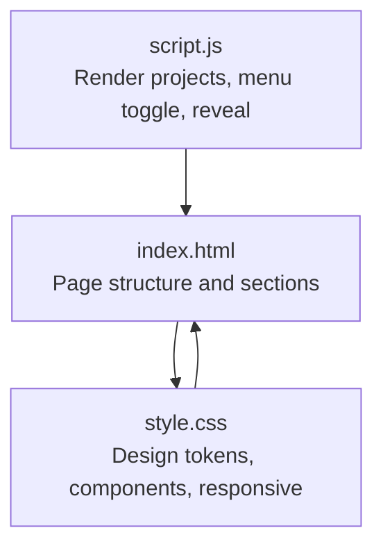
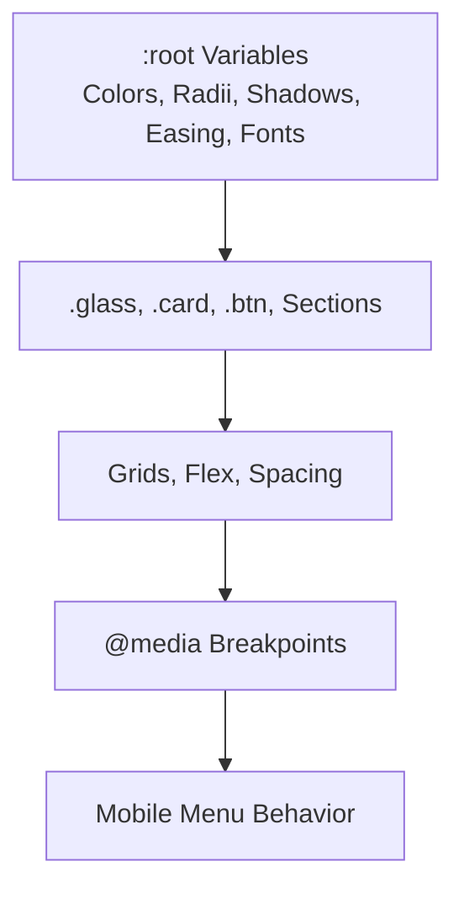
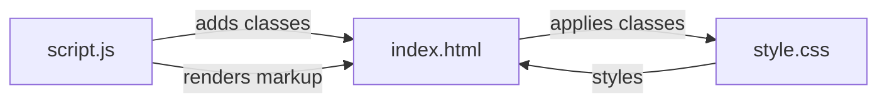

# CSS Customization

<cite>
**Referenced Files in This Document**
- [style.css](file://files/arsalan-portfolio-vanilla/site/style.css)
- [index.html](file://files/arsalan-portfolio-vanilla/site/index.html)
- [script.js](file://files/arsalan-portfolio-vanilla/site/script.js)
</cite>

## Table of Contents
1. [Introduction](#introduction)
2. [Project Structure](#project-structure)
3. [Core Components](#core-components)
4. [Architecture Overview](#architecture-overview)
5. [Detailed Component Analysis](#detailed-component-analysis)
6. [Dependency Analysis](#dependency-analysis)
7. [Performance Considerations](#performance-considerations)
8. [Troubleshooting Guide](#troubleshooting-guide)
9. [Conclusion](#conclusion)
10. [Appendices](#appendices)

## Introduction
This document explains how to customize the portfolio’s visual design using CSS custom properties, glass morphism effects, typography, responsive breakpoints, and animations. It provides practical guidance for changing colors, backgrounds, text styles, blur and transparency, fonts, and component appearances while keeping the codebase organized and maintainable.

## Project Structure
The portfolio is a single-page site with:
- A main stylesheet defining design tokens, layout, components, animations, and responsive rules.
- An HTML page that composes sections and applies utility classes (for example, glass, card, btn).
- A small JavaScript file that renders project cards and toggles UI states (menu open/close, reveal on scroll).

**Diagram sources**
- [index.html:1-135](file://files/arsalan-portfolio-vanilla/site/index.html#L1-L135)
- [style.css:1-182](file://files/arsalan-portfolio-vanilla/site/style.css#L1-L182)
- [script.js:1-75](file://files/arsalan-portfolio-vanilla/site/script.js#L1-L75)

**Section sources**
- [index.html:1-135](file://files/arsalan-portfolio-vanilla/site/index.html#L1-L135)
- [style.css:1-182](file://files/arsalan-portfolio-vanilla/site/style.css#L1-L182)
- [script.js:1-75](file://files/arsalan-portfolio-vanilla/site/script.js#L1-L75)

## Core Components
Key customization entry points live in the stylesheet’s design tokens and component utilities:
- Design tokens under :root define colors, spacing radii, shadows, easing, and fonts.
- Utility classes like .glass, .card, .btn, and section containers provide reusable styling.
- Responsive rules adjust layouts at specific breakpoints.

Practical areas to modify:
- Colors and contrast via variables such as background, text, primary accent, and glass/border alpha values.
- Glass morphism via backdrop-filter blur and border opacity.
- Typography by updating font-family and sizes.
- Breakpoints to adapt grids and navigation behavior.

**Section sources**
- [style.css:1-12](file://files/arsalan-portfolio-vanilla/site/style.css#L1-L12)
- [style.css:21-24](file://files/arsalan-portfolio-vanilla/site/style.css#L21-L24)
- [style.css:42-49](file://files/arsalan-portfolio-vanilla/site/style.css#L42-L49)
- [style.css:161-181](file://files/arsalan-portfolio-vanilla/site/style.css#L161-L181)

## Architecture Overview
The visual system is token-driven. All components reference CSS variables from :root, which centralizes theming and makes global changes straightforward.

**Diagram sources**
- [style.css:1-12](file://files/arsalan-portfolio-vanilla/site/style.css#L1-L12)
- [style.css:21-24](file://files/arsalan-portfolio-vanilla/site/style.css#L21-L24)
- [style.css:42-49](file://files/arsalan-portfolio-vanilla/site/style.css#L42-L49)
- [style.css:161-181](file://files/arsalan-portfolio-vanilla/site/style.css#L161-L181)

## Detailed Component Analysis

### Color Scheme and Theming
- Primary palette:
  - Background color variable controls the page background.
  - Text color variable sets default body text color.
  - White and muted variables control headings and secondary text.
  - Accent colors include cyan, violet, and blue used for gradients, highlights, and hover states.
- Glass and borders:
  - Glass background and soft glass background variables control transparency levels.
  - Border and soft border variables define subtle edge lines.
- How to change:
  - Update the color variables in the root block to re-theme the entire site.
  - Adjust alpha values in glass and border variables to increase or decrease translucency.
  - Modify accent variables to shift gradient directions and highlight colors.

Example targets to inspect:
- Root variables for colors and tokens.
- Glass class for backdrop blur and border.
- Button variants for primary and ghost styles.

**Section sources**
- [style.css:1-12](file://files/arsalan-portfolio-vanilla/site/style.css#L1-L12)
- [style.css:21-24](file://files/arsalan-portfolio-vanilla/site/style.css#L21-L24)
- [style.css:42-49](file://files/arsalan-portfolio-vanilla/site/style.css#L42-L49)

### Glass Morphism
Glass elements use:
- A semi-transparent background variable.
- Backdrop filter blur for frosted effect.
- Subtle border and shadow variables for depth.

Adjustments:
- Increase or decrease blur radius to make glass more or less opaque.
- Tweak border alpha to strengthen or soften edges.
- Adjust shadow variable to enhance depth or reduce it for minimal look.

Common places to apply:
- Navigation container.
- Cards and chips.
- Contact section container.

**Section sources**
- [style.css:21-24](file://files/arsalan-portfolio-vanilla/site/style.css#L21-L24)
- [style.css:51-59](file://files/arsalan-portfolio-vanilla/site/style.css#L51-L59)
- [style.css:130-133](file://files/arsalan-portfolio-vanilla/site/style.css#L130-L133)

### Typography and Google Fonts
- The font family is defined in a variable and applied globally.
- Monospace font is used for labels, tags, and eyebrow text.
- Headings and lead text use fluid sizing with clamp() for responsiveness.

To integrate Google Fonts:
- Add a link tag in the HTML head to load your chosen font(s).
- Update the font variable to include your new font family name first, followed by fallbacks.
- Optionally update monospace variable if you want a different monospace font.

Where to look:
- Font variable definition.
- Body rule applying the font.
- Eyebrow/tag rules using monospace.

**Section sources**
- [style.css:1-12](file://files/arsalan-portfolio-vanilla/site/style.css#L1-L12)
- [style.css:14-16](file://files/arsalan-portfolio-vanilla/site/style.css#L14-L16)
- [style.css:32-40](file://files/arsalan-portfolio-vanilla/site/style.css#L32-L40)

### Buttons
Button styles are centralized:
- Base button class defines padding, radius, transition timing, and cursor.
- Primary variant uses white background with dark text and glow on hover.
- Ghost variant uses glass background with blur and subtle hover state.

Customization tips:
- Change base radius and padding to alter shape and size.
- Adjust transitions for faster/slower interactions.
- Override hover states to match your brand colors.

**Section sources**
- [style.css:42-49](file://files/arsalan-portfolio-vanilla/site/style.css#L42-L49)

### Cards and Project Items
Cards and project items share common behaviors:
- Rounded corners and padding.
- Hover lift and border color change.
- Optional glass background for certain cards.

For project previews:
- Preview container has a gradient background and image overlay.
- Mockup placeholders use accent gradients for skeleton visuals.

Customization tips:
- Adjust corner radius and padding to change card proportions.
- Modify hover transform distance and border color to emphasize interaction.
- Update preview gradient colors to align with your theme.

**Section sources**
- [style.css:21-24](file://files/arsalan-portfolio-vanilla/site/style.css#L21-L24)
- [style.css:114-128](file://files/arsalan-portfolio-vanilla/site/style.css#L114-L128)

### Animations and Motion
Animations include:
- Fade-in and slide-up for content reveal.
- Floating chips and pulsing indicators.
- Reduced motion support to disable animations when preferred.

Customization tips:
- Adjust keyframe timings and delays via CSS variables or inline style overrides.
- Modify transition durations and easing curves for smoother or snappier feel.
- Respect prefers-reduced-motion for accessibility.

**Section sources**
- [style.css:152-159](file://files/arsalan-portfolio-vanilla/site/style.css#L152-L159)
- [script.js:46-50](file://files/arsalan-portfolio-vanilla/site/script.js#L46-L50)

### Responsive Breakpoints
Breakpoints control layout shifts:
- At larger widths, multi-column grids are used for skills, timeline, and projects.
- At medium widths, navigation collapses into a mobile menu; hero stacks vertically.
- At smaller widths, grids collapse to single columns and buttons stack.

How to modify:
- Change max-width values to target different screen sizes.
- Adjust grid-template-columns within each breakpoint to fit your content density.
- Review mobile menu styles to ensure readability and touch targets.

**Section sources**
- [style.css:161-181](file://files/arsalan-portfolio-vanilla/site/style.css#L161-L181)

### Navigation and Mobile Menu
Navigation uses:
- Fixed header with glass styling.
- Desktop links with hover and active states.
- Burger icon for mobile with animated spans.
- Dropdown menu with backdrop blur and fade/slide transitions.

Customization tips:
- Update logo color and accent color.
- Adjust link hover background and active state colors.
- Tweak dropdown positioning and blur intensity.

**Section sources**
- [style.css:51-65](file://files/arsalan-portfolio-vanilla/site/style.css#L51-L65)
- [style.css:168-176](file://files/arsalan-portfolio-vanilla/site/style.css#L168-L176)
- [script.js:36-44](file://files/arsalan-portfolio-vanilla/site/script.js#L36-L44)

### Forms and Inputs
Contact form inputs use:
- Semi-transparent backgrounds and subtle borders.
- Focus state with accent-colored border.
- Consistent radius and padding.

Customization tips:
- Adjust focus border color to match your accent.
- Modify input background alpha for more or less transparency.
- Update placeholder text color via inherited variables.

**Section sources**
- [style.css:139-143](file://files/arsalan-portfolio-vanilla/site/style.css#L139-L143)

## Dependency Analysis
Interactions between files:
- HTML applies semantic sections and utility classes.
- CSS defines all visual behavior and responsive rules.
- JS dynamically renders project cards and toggles UI states.

**Diagram sources**
- [index.html:1-135](file://files/arsalan-portfolio-vanilla/site/index.html#L1-L135)
- [style.css:1-182](file://files/arsalan-portfolio-vanilla/site/style.css#L1-L182)
- [script.js:1-75](file://files/arsalan-portfolio-vanilla/site/script.js#L1-L75)

**Section sources**
- [index.html:1-135](file://files/arsalan-portfolio-vanilla/site/index.html#L1-L135)
- [style.css:1-182](file://files/arsalan-portfolio-vanilla/site/style.css#L1-L182)
- [script.js:1-75](file://files/arsalan-portfolio-vanilla/site/script.js#L1-L75)

## Performance Considerations
- Prefer CSS variables for theming to avoid repeated calculations and improve maintainability.
- Use backdrop-filter sparingly; heavy blur can impact performance on low-end devices.
- Keep animation durations short and respect reduced motion preferences.
- Avoid excessive gradients and large images; optimize assets for web.

## Troubleshooting Guide
Common issues and fixes:
- Colors not updating: Ensure you edit the correct variables in the root block and that no inline styles override them.
- Glass effect too faint: Increase the alpha in glass background and border variables, or reduce backdrop blur radius.
- Fonts not loading: Verify the Google Fonts link is present in the HTML head and that the font variable includes the new font family name.
- Mobile menu not opening: Check that the burger button and nav links IDs match those referenced in the script.
- Animations disabled unexpectedly: Confirm that prefers-reduced-motion is not interfering; test without the media query override.

**Section sources**
- [style.css:1-12](file://files/arsalan-portfolio-vanilla/site/style.css#L1-L12)
- [style.css:152-159](file://files/arsalan-portfolio-vanilla/site/style.css#L152-L159)
- [script.js:36-44](file://files/arsalan-portfolio-vanilla/site/script.js#L36-L44)

## Conclusion
By centralizing design decisions in CSS variables and leveraging utility classes, this portfolio offers a clean and extensible theming system. Adjust colors, glass effects, typography, and breakpoints to match your brand while maintaining consistent interactions and accessibility.

## Appendices

### Quick Customization Checklist
- Colors and contrast:
  - Edit background, text, white, muted, and accent variables.
- Glass morphism:
  - Tweak glass background, border alpha, and backdrop blur radius.
- Typography:
  - Add Google Fonts link and update font variable.
  - Adjust heading sizes and line heights if needed.
- Buttons:
  - Modify base padding, radius, and hover states.
- Cards:
  - Adjust corner radius, padding, and hover transforms.
- Breakpoints:
  - Change max-width thresholds and grid configurations.
- Animations:
  - Adjust transition durations and easing curves.

### Naming Conventions and Organization Tips
- Keep all design tokens in the root block grouped by category (colors, radii, shadows, easing, fonts).
- Use descriptive class names for components (.glass, .card, .btn, .hero, .contact).
- Place related styles together: tokens, base resets, utilities, components, sections, animations, responsive rules.
- Avoid deep nesting; prefer flat selectors tied to clear class names.
- When adding new components, follow existing patterns for variables, transitions, and responsive behavior.