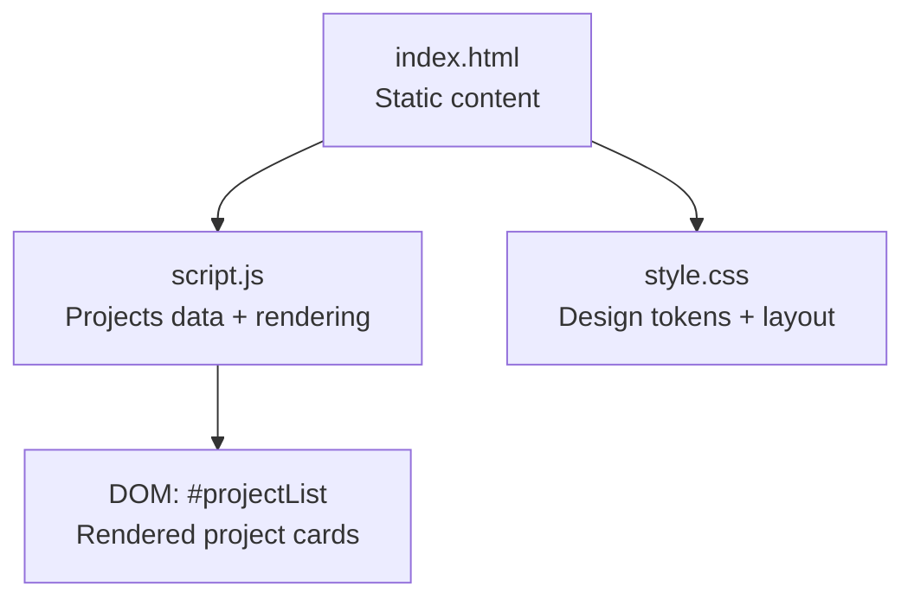
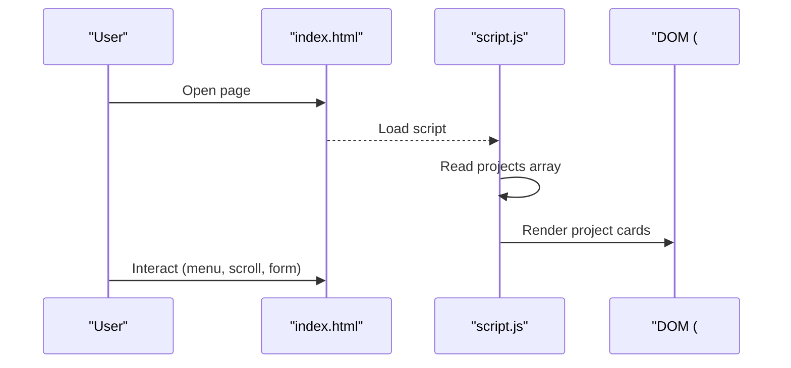
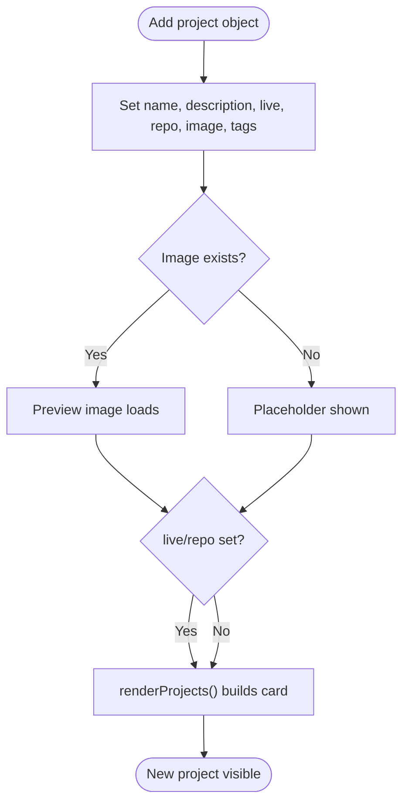
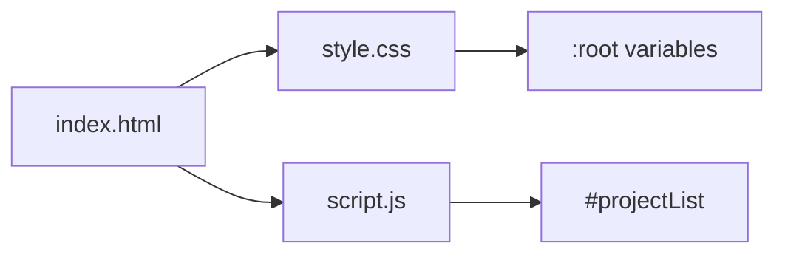

# Content Modification

<cite>
**Referenced Files in This Document**
- [index.html](file://files/arsalan-portfolio-vanilla/site/index.html)
- [script.js](file://files/arsalan-portfolio-vanilla/site/script.js)
- [style.css](file://files/arsalan-portfolio-vanilla/site/style.css)
- [index.html (root)](file://files/index.html)
- [script.js (root)](file://files/script.js)
</cite>

## Table of Contents
1. [Introduction](#introduction)
2. [Project Structure](#project-structure)
3. [Core Components](#core-components)
4. [Architecture Overview](#architecture-overview)
5. [Detailed Component Analysis](#detailed-component-analysis)
6. [Dependency Analysis](#dependency-analysis)
7. [Performance Considerations](#performance-considerations)
8. [Troubleshooting Guide](#troubleshooting-guide)
9. [Conclusion](#conclusion)
10. [Appendices](#appendices)

## Introduction
This guide explains how to modify portfolio content safely and consistently. It covers editing personal information, updating projects, skills, journey timeline entries, social links, and email contacts. It also provides guidance for adding new sections while preserving semantic HTML structure and SEO best practices.

The portfolio has two variants:
- Vanilla site under files/arsalan-portfolio-vanilla/site
- Enhanced site under files with a welcome overlay and additional interactions

Use the variant you intend to publish or maintain. The modification steps are similar across both; differences are noted where relevant.

## Project Structure
At a high level:
- index.html contains the page markup and static content such as name, bio, contact details, skills, and journey timeline.
- script.js defines the projects data array and renders project cards dynamically.
- style.css controls visual design and responsive layout.

**Diagram sources**
- [index.html:1-135](file://files/arsalan-portfolio-vanilla/site/index.html#L1-L135)
- [script.js:1-75](file://files/arsalan-portfolio-vanilla/site/script.js#L1-L75)
- [style.css:1-182](file://files/arsalan-portfolio-vanilla/site/style.css#L1-L182)

**Section sources**
- [index.html:1-135](file://files/arsalan-portfolio-vanilla/site/index.html#L1-L135)
- [script.js:1-75](file://files/arsalan-portfolio-vanilla/site/script.js#L1-L75)
- [style.css:1-182](file://files/arsalan-portfolio-vanilla/site/style.css#L1-L182)

## Core Components
- Personal identity and hero text: Editable directly in the HTML.
- About section: Editable directly in the HTML.
- Skills: Three categories (Foundation, Learning, Exploring) with pill-style items.
- Journey timeline: Ordered list of milestones with status classes.
- Projects: Data-driven via a JavaScript array that is rendered into the DOM.
- Contact and footer: Email and GitHub links appear in multiple places.

Key responsibilities:
- HTML: Holds all user-facing content and semantic structure.
- JS: Manages dynamic behavior and renders project cards from data.
- CSS: Provides design tokens, layout, animations, and responsive rules.

**Section sources**
- [index.html:13-135](file://files/arsalan-portfolio-vanilla/site/index.html#L13-L135)
- [script.js:1-75](file://files/arsalan-portfolio-vanilla/site/script.js#L1-L75)
- [style.css:1-182](file://files/arsalan-portfolio-vanilla/site/style.css#L1-L182)

## Architecture Overview
The portfolio follows a simple separation of concerns:
- Static content lives in HTML.
- Dynamic project listings are generated from a data array in JS.
- Styling is centralized in CSS with design tokens at the top.

**Diagram sources**
- [index.html:99-103](file://files/arsalan-portfolio-vanilla/site/index.html#L99-L103)
- [script.js:1-34](file://files/arsalan-portfolio-vanilla/site/script.js#L1-L34)

## Detailed Component Analysis

### Editing Personal Information (Name, Bio, Hero Text)
Where to edit:
- Page title and description: head section meta tags and title element.
- Hero headline and lead paragraph: hero section.
- About section paragraphs: about section card.
- Profile image: hero portrait img src and alt text.

Guidelines:
- Keep the page title concise and descriptive.
- Update the meta description to reflect current focus and goals.
- Ensure the profile image alt text describes the person accurately.
- Maintain semantic hierarchy: one h1 per page, use h2/h3 for subsections.

SEO tips:
- Include your primary role and location if relevant in the title and description.
- Use meaningful alt text for images.
- Keep language consistent with your target audience.

**Section sources**
- [index.html:3-8](file://files/arsalan-portfolio-vanilla/site/index.html#L3-L8)
- [index.html:33-53](file://files/arsalan-portfolio-vanilla/site/index.html#L33-L53)
- [index.html:55-62](file://files/arsalan-portfolio-vanilla/site/index.html#L55-L62)

### Updating Social Links, GitHub URL, and Email
Locations to update:
- Navigation GitHub link (desktop and mobile).
- Contact section email and GitHub cards.
- Footer GitHub and Email links.
- Hero “Let’s Connect” mailto link.

Steps:
- Replace existing GitHub URLs with your profile URL.
- Replace mailto addresses with your preferred contact email.
- Ensure external links include target="_blank" and rel="noopener" for security.

Consistency:
- Keep the same GitHub handle and email across all locations to avoid confusion.

**Section sources**
- [index.html:17-27](file://files/arsalan-portfolio-vanilla/site/index.html#L17-L27)
- [index.html:38-41](file://files/arsalan-portfolio-vanilla/site/index.html#L38-L41)
- [index.html:111-114](file://files/arsalan-portfolio-vanilla/site/index.html#L111-L114)
- [index.html:126-129](file://files/arsalan-portfolio-vanilla/site/index.html#L126-L129)

### Adding New Projects
Projects are defined in a JavaScript array and rendered into the DOM.

Required fields:
- name: Project title displayed on the card.
- description: Short summary shown below the title.
- live: URL to the live project (optional button shown when present).
- repo: GitHub repository URL (optional button shown when present).
- image: Path to a preview image (optional; placeholder shown if missing).
- tags: Array of technology tags (optional; displayed when provided).

Process:
- Open script.js and locate the projects array.
- Add a new object with the required fields.
- Place an image file in the images folder and reference its path.
- Save and reload the page; the new project will render automatically.

Notes:
- If repo is empty, the GitHub button is hidden.
- If image is missing, a mock placeholder is shown.
- Tags are optional but improve discoverability.

**Diagram sources**
- [script.js:1-34](file://files/arsalan-portfolio-vanilla/site/script.js#L1-L34)

**Section sources**
- [script.js:1-34](file://files/arsalan-portfolio-vanilla/site/script.js#L1-L34)

### Updating Skills Categories and Individual Skills
Skills are organized into three categories:
- Foundation: Core web technologies.
- Currently Learning: Active learning focus.
- Exploring: Technologies you are investigating.

How to update:
- To add a skill, insert a new <li> inside the appropriate category’s pills list.
- To change a category label, edit the h3 heading.
- To adjust the category tag (e.g., “Learning”), edit the span.tag text.
- To reorder skills, move the corresponding <li> elements.

Accessibility:
- Keep the semantic structure: article > header > h3, ul.pills > li.
- Avoid changing class names unless you also update CSS.

**Section sources**
- [index.html:64-86](file://files/arsalan-portfolio-vanilla/site/index.html#L64-L86)

### Modifying Journey Timeline Entries and Dates
The journey timeline uses an ordered list with milestone items. Each item includes:
- A number (auto-incrementing visually).
- A title (h3).
- A short description (p).
- A status class: done, now, next.

How to update:
- Add a new <li> to represent a new milestone.
- Assign the correct status class based on progress:
  - done: completed
  - now: current
  - next: upcoming
- Update titles and descriptions to reflect your actual progress.

Note:
- There are no explicit date fields in the vanilla HTML; dates can be added by including a small date element within each milestone if desired.

**Section sources**
- [index.html:88-97](file://files/arsalan-portfolio-vanilla/site/index.html#L88-L97)

### Adding New Content Sections
To add a new section:
- Insert a new <section> with a unique id after the existing sections.
- Add a matching navigation link in the nav menu.
- Optionally add a reveal animation using data-reveal.
- Style any custom components in style.css.

Semantic guidelines:
- Use section for major content areas.
- Use article for self-contained content like project cards or skill categories.
- Maintain a single h1 per page; use h2 for section headings and h3 for subsections.

Example pattern:
- Section wrapper with container class.
- Eyebrow label and h2 heading.
- Content wrapped in a glass card or grid.

**Section sources**
- [index.html:13-29](file://files/arsalan-portfolio-vanilla/site/index.html#L13-L29)
- [index.html:31-124](file://files/arsalan-portfolio-vanilla/site/index.html#L31-L124)

### Maintaining Semantic HTML Structure
Best practices:
- Use proper heading levels to establish document outline.
- Wrap interactive elements in buttons or anchors with accessible labels.
- Provide aria-label attributes for icons and non-text UI.
- Mark decorative elements with aria-hidden="true".
- Keep lists semantic (ul/ol) for related items.

These patterns are already used throughout the template and should be preserved when adding content.

**Section sources**
- [index.html:13-135](file://files/arsalan-portfolio-vanilla/site/index.html#L13-L135)

### SEO Considerations When Modifying Content
- Title tag: Keep it concise and include your primary role and differentiator.
- Meta description: Summarize who you are, what you build, and your current focus.
- Headings: One h1 per page; use h2 for sections and h3 for subsections.
- Images: Always provide descriptive alt text.
- Links: Use descriptive link text; ensure external links have rel="noopener".
- Structured data: Optional; consider adding JSON-LD for Person or WebSite later.
- Performance: Optimize images and defer non-critical assets.

**Section sources**
- [index.html:3-8](file://files/arsalan-portfolio-vanilla/site/index.html#L3-L8)
- [index.html:17-27](file://files/arsalan-portfolio-vanilla/site/index.html#L17-L27)

## Dependency Analysis
- HTML depends on CSS for styling and JS for interactivity.
- JS reads the projects array and injects HTML into #projectList.
- CSS uses design tokens at the root to control colors, spacing, and typography.

**Diagram sources**
- [index.html:1-135](file://files/arsalan-portfolio-vanilla/site/index.html#L1-L135)
- [script.js:1-75](file://files/arsalan-portfolio-vanilla/site/script.js#L1-L75)
- [style.css:1-12](file://files/arsalan-portfolio-vanilla/site/style.css#L1-L12)

**Section sources**
- [index.html:1-135](file://files/arsalan-portfolio-vanilla/site/index.html#L1-L135)
- [script.js:1-75](file://files/arsalan-portfolio-vanilla/site/script.js#L1-L75)
- [style.css:1-182](file://files/arsalan-portfolio-vanilla/site/style.css#L1-L182)

## Performance Considerations
- Keep project images optimized (WebP/AVIF where possible).
- Avoid excessive inline styles; prefer CSS classes.
- Limit heavy animations; respect prefers-reduced-motion.
- Defer non-critical scripts if needed.
- Reuse CSS variables for consistent theming and minimal overrides.

[No sources needed since this section provides general guidance]

## Troubleshooting Guide
Common issues and fixes:
- Project image not showing:
  - Verify the image path matches the file location.
  - Check browser console for 404 errors.
- GitHub or Live buttons missing:
  - Ensure the live or repo field is set in the project object.
- Menu not opening on mobile:
  - Confirm burger button and navLinks IDs exist.
- Form note color not changing:
  - Ensure the demoForm ID and formNote element exist.
- Year not updating:
  - Confirm the year span exists and script runs.

**Section sources**
- [script.js:14-34](file://files/arsalan-portfolio-vanilla/site/script.js#L14-L34)
- [script.js:36-44](file://files/arsalan-portfolio-vanilla/site/script.js#L36-L44)
- [script.js:68-75](file://files/arsalan-portfolio-vanilla/site/script.js#L68-L75)

## Conclusion
You can confidently update this portfolio by editing static content in HTML and managing dynamic projects through the JavaScript array. Follow the semantic structure and SEO recommendations to keep your site accessible and discoverable. Use the provided patterns to add new sections and maintain consistency across the site.

[No sources needed since this section summarizes without analyzing specific files]

## Appendices

### Quick Reference: Where to Edit What
- Name, bio, hero text: index.html (hero and about sections)
- Skills: index.html (skills section)
- Journey timeline: index.html (journey section)
- Projects: script.js (projects array)
- Social links and email: index.html (nav, contact, footer)
- Styles and design tokens: style.css

**Section sources**
- [index.html:33-129](file://files/arsalan-portfolio-vanilla/site/index.html#L33-L129)
- [script.js:1-34](file://files/arsalan-portfolio-vanilla/site/script.js#L1-L34)
- [style.css:1-182](file://files/arsalan-portfolio-vanilla/site/style.css#L1-L182)

### Variant Differences (Vanilla vs Enhanced)
- Enhanced version adds a welcome overlay, scroll progress bar, back-to-top button, and richer interactions.
- Both variants share the same content modification approach for personal info, skills, journey, and projects.

**Section sources**
- [index.html (root):1-158](file://files/index.html#L1-L158)
- [script.js (root):1-249](file://files/script.js#L1-L249)