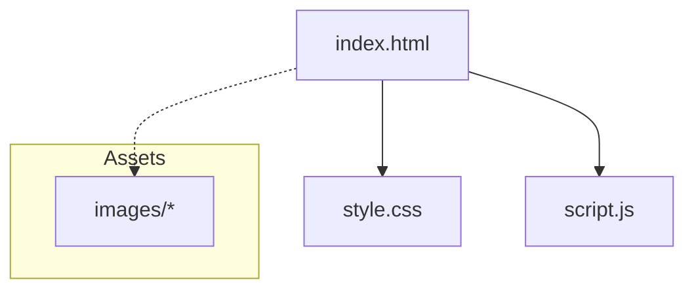
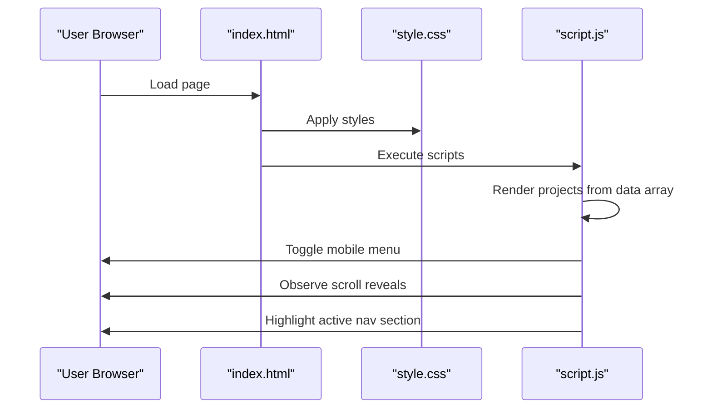
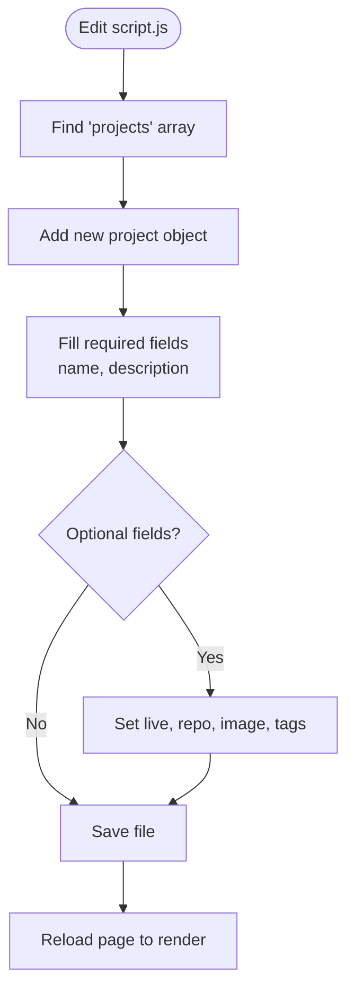
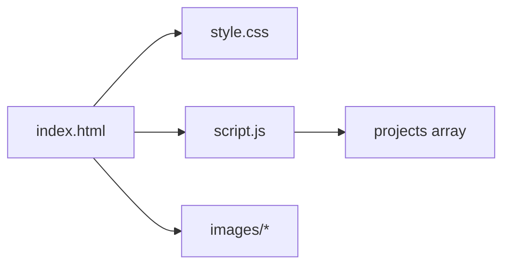

# Customization Guide

<cite>
**Referenced Files in This Document**
- [index.html](file://files/arsalan-portfolio-vanilla/site/index.html)
- [style.css](file://files/arsalan-portfolio-vanilla/site/style.css)
- [script.js](file://files/arsalan-portfolio-vanilla/site/script.js)
</cite>

## Table of Contents
1. [Introduction](#introduction)
2. [Project Structure](#project-structure)
3. [Core Components](#core-components)
4. [Architecture Overview](#architecture-overview)
5. [Detailed Component Analysis](#detailed-component-analysis)
6. [Dependency Analysis](#dependency-analysis)
7. [Performance Considerations](#performance-considerations)
8. [Troubleshooting Guide](#troubleshooting-guide)
9. [Conclusion](#conclusion)
10. [Appendices](#appendices)

## Introduction
This guide explains how to customize the portfolio for your personal brand and content. You will learn how to:
- Change colors using CSS custom properties
- Update text across sections
- Add new projects via a data array
- Customize animations and transitions
- Change fonts, spacing, and glass morphism effects
- Add new sections and integrate external resources
- Optimize performance and maintain code organization

The site is built with vanilla HTML, CSS, and JavaScript, making it straightforward to tailor without complex tooling.

## Project Structure
The portfolio consists of three primary files:
- index.html: Page structure and content
- style.css: Visual design, layout, and animations
- script.js: Dynamic behavior (projects rendering, menu, scroll reveals, active nav)

**Diagram sources**
- [index.html:1-135](file://files/arsalan-portfolio-vanilla/site/index.html#L1-L135)
- [style.css:1-182](file://files/arsalan-portfolio-vanilla/site/style.css#L1-L182)
- [script.js:1-75](file://files/arsalan-portfolio-vanilla/site/script.js#L1-L75)

**Section sources**
- [index.html:1-135](file://files/arsalan-portfolio-vanilla/site/index.html#L1-L135)
- [style.css:1-182](file://files/arsalan-portfolio-vanilla/site/style.css#L1-L182)
- [script.js:1-75](file://files/arsalan-portfolio-vanilla/site/script.js#L1-L75)

## Core Components
- Design tokens: Centralized variables for colors, spacing, radii, shadows, easing, and fonts
- Glass morphism: Reusable card styles with backdrop blur and subtle borders
- Sections: Hero, About, Skills, Journey, Projects, Contact, Footer
- Interactions: Mobile menu toggle, scroll reveal, active section highlighting, project list rendering

Key customization entry points:
- Colors and tokens: style.css :root variables
- Text content: index.html elements
- Projects data: script.js projects array
- Animations: style.css keyframes and transition classes

**Section sources**
- [style.css:1-12](file://files/arsalan-portfolio-vanilla/site/style.css#L1-L12)
- [style.css:21-24](file://files/arsalan-portfolio-vanilla/site/style.css#L21-L24)
- [index.html:31-130](file://files/arsalan-portfolio-vanilla/site/index.html#L31-L130)
- [script.js:1-34](file://files/arsalan-portfolio-vanilla/site/script.js#L1-L34)

## Architecture Overview
The page loads HTML first, then applies styles from CSS, and finally runs JS to render dynamic content and behaviors.

**Diagram sources**
- [index.html:8-9](file://files/arsalan-portfolio-vanilla/site/index.html#L8-L9)
- [index.html:132-133](file://files/arsalan-portfolio-vanilla/site/index.html#L132-L133)
- [script.js:15-34](file://files/arsalan-portfolio-vanilla/site/script.js#L15-L34)
- [script.js:36-44](file://files/arsalan-portfolio-vanilla/site/script.js#L36-L44)
- [script.js:46-59](file://files/arsalan-portfolio-vanilla/site/script.js#L46-L59)

## Detailed Component Analysis

### Color Scheme and Design Tokens
- Where to edit: style.css :root variables
- What you can change:
  - Background and text colors
  - Accent colors (cyan, violet, blue)
  - Glass opacity and border transparency
  - Border radius scale
  - Shadow intensity
  - Easing curves
  - Font families for body and monospace text

Steps:
1. Open style.css and locate the :root block at the top.
2. Modify variable values to match your palette.
3. Preview changes; accents are used in gradients, badges, tags, and hover states.

Tips:
- Keep contrast ratios accessible by adjusting --text and --white accordingly.
- Use consistent naming when adding new tokens (e.g., --accent-secondary).

**Section sources**
- [style.css:1-12](file://files/arsalan-portfolio-vanilla/site/style.css#L1-L12)
- [style.css:32-40](file://files/arsalan-portfolio-vanilla/site/style.css#L32-L40)
- [style.css:42-49](file://files/arsalan-portfolio-vanilla/site/style.css#L42-L49)

### Updating Text Content
- Where to edit: index.html
- Common areas:
  - Title and meta description in head
  - Navigation links and labels
  - Hero headline, subtitle, and call-to-action buttons
  - About paragraph(s)
  - Skills categories and pill items
  - Journey timeline entries
  - Contact email and social links
  - Footer branding and links

Steps:
1. Open index.html.
2. Replace placeholder text with your own copy.
3. For links, update href attributes to point to your URLs or mailto addresses.
4. Save and refresh to see updates.

Best practices:
- Keep headings descriptive and concise.
- Use semantic tags already present (h1, h2, p, ul/li).
- Maintain aria-labels where provided for accessibility.

**Section sources**
- [index.html:3-8](file://files/arsalan-portfolio-vanilla/site/index.html#L3-L8)
- [index.html:14-29](file://files/arsalan-portfolio-vanilla/site/index.html#L14-L29)
- [index.html:32-53](file://files/arsalan-portfolio-vanilla/site/index.html#L32-L53)
- [index.html:55-62](file://files/arsalan-portfolio-vanilla/site/index.html#L55-L62)
- [index.html:64-86](file://files/arsalan-portfolio-vanilla/site/index.html#L64-L86)
- [index.html:88-97](file://files/arsalan-portfolio-vanilla/site/index.html#L88-L97)
- [index.html:105-123](file://files/arsalan-portfolio-vanilla/site/index.html#L105-L123)
- [index.html:126-130](file://files/arsalan-portfolio-vanilla/site/index.html#L126-L130)

### Adding New Projects
Projects are rendered from a JavaScript array. To add a project:
1. Open script.js.
2. Locate the projects array near the top.
3. Add a new object with fields: name, description, live, repo, image, tags.
4. Save and reload the page.

Field guidance:
- name: Project title
- description: Short summary
- live: URL to live demo (optional)
- repo: GitHub link (optional; hides button if empty)
- image: Path to preview image (optional)
- tags: Array of strings for technology tags (optional)

**Diagram sources**
- [script.js:1-12](file://files/arsalan-portfolio-vanilla/site/script.js#L1-L12)
- [script.js:15-34](file://files/arsalan-portfolio-vanilla/site/script.js#L15-L34)

**Section sources**
- [script.js:1-34](file://files/arsalan-portfolio-vanilla/site/script.js#L1-L34)

### Customizing Animations and Transitions
- Entry animations: Elements with class anim receive a fade-in and slide-up effect.
- Scroll reveals: Elements with data-reveal animate when scrolled into view.
- Floating chips and pulse indicators use keyframe animations.
- Hover effects on cards and buttons include transform and color transitions.

How to adjust:
- Timing: Modify transition durations and animation delays inline via style="--d:..." or in CSS.
- Intensity: Adjust transform distances and opacities in .anim and [data-reveal].
- Motion preferences: The stylesheet respects prefers-reduced-motion to disable animations for users who prefer reduced motion.

To disable or tweak:
- Edit .anim and [data-reveal] rules in style.css.
- Remove or modify @keyframes float and pulse.
- Ensure accessibility by honoring prefers-reduced-motion.

**Section sources**
- [style.css:152-159](file://files/arsalan-portfolio-vanilla/site/style.css#L152-L159)
- [style.css:67-83](file://files/arsalan-portfolio-vanilla/site/style.css#L67-L83)
- [style.css:21-24](file://files/arsalan-portfolio-vanilla/site/style.css#L21-L24)

### Changing Fonts
- Body font family is defined in the :root variable for --font.
- Monospace font family is defined in --mono.

Steps:
1. Open style.css :root.
2. Replace the font-family values with your preferred fonts.
3. If loading external fonts, add a <link> tag in index.html head before the CSS link.

Notes:
- Ensure fallback stacks remain robust for offline scenarios.
- Test readability at various sizes and screen densities.

**Section sources**
- [style.css:1-12](file://files/arsalan-portfolio-vanilla/site/style.css#L1-L12)
- [index.html:3-9](file://files/arsalan-portfolio-vanilla/site/index.html#L3-L9)

### Adjusting Layout Spacing
- Section padding uses clamp() for responsive vertical spacing.
- Container width is constrained to a max width with horizontal margins.
- Grid gaps control spacing between columns in skills, timeline, contact cards, and form rows.

Where to edit:
- .section for vertical rhythm
- .container for overall width
- Grid-specific gap properties under each section’s styles

Tips:
- Increase gaps for more breathing room.
- Reduce container width for tighter layouts on small screens.

**Section sources**
- [style.css:18-19](file://files/arsalan-portfolio-vanilla/site/style.css#L18-L19)
- [style.css:88-101](file://files/arsalan-portfolio-vanilla/site/style.css#L88-L101)
- [style.css:103-112](file://files/arsalan-portfolio-vanilla/site/style.css#L103-L112)
- [style.css:136-143](file://files/arsalan-portfolio-vanilla/site/style.css#L136-L143)

### Modifying Glass Morphism Effects
Glass components rely on:
- Semi-transparent backgrounds (--glass, --glass-soft)
- Backdrop-filter blur
- Subtle borders and shadows

How to customize:
- Adjust --glass and --glass-soft for more or less transparency.
- Tweak backdrop-filter blur amount for stronger or softer frosted look.
- Modify border and shadow variables to enhance depth.

Considerations:
- Excessive blur may impact performance on low-end devices.
- Ensure sufficient contrast for text over glass surfaces.

**Section sources**
- [style.css:1-12](file://files/arsalan-portfolio-vanilla/site/style.css#L1-L12)
- [style.css:21-24](file://files/arsalan-portfolio-vanilla/site/style.css#L21-L24)

### Changing the Profile Image
- The profile image element is referenced by id in the hero section.
- An error handler shows a fallback initial letter if the image fails to load.

Steps:
1. Place your image in the images folder.
2. Update the img src attribute in index.html to point to your file.
3. Optionally adjust aspect ratio and border radius in style.css portrait styles.

Fallback behavior:
- If the image fails, the script adds a class to display an initial letter instead.

**Section sources**
- [index.html:43-49](file://files/arsalan-portfolio-vanilla/site/index.html#L43-L49)
- [style.css:72-78](file://files/arsalan-portfolio-vanilla/site/style.css#L72-L78)
- [script.js:61-66](file://files/arsalan-portfolio-vanilla/site/script.js#L61-L66)

### Updating Social Media Links
- Navigation includes a GitHub link.
- Contact section contains email and GitHub links.
- Footer includes GitHub and Email links.

Steps:
1. Open index.html.
2. Update href attributes for your profiles and email address.
3. Keep target="_blank" and rel="noopener" for security when opening external links.

**Section sources**
- [index.html:14-29](file://files/arsalan-portfolio-vanilla/site/index.html#L14-L29)
- [index.html:105-123](file://files/arsalan-portfolio-vanilla/site/index.html#L105-L123)
- [index.html:126-130](file://files/arsalan-portfolio-vanilla/site/index.html#L126-L130)

### Modifying Skill Categories
Skills are organized into three cards:
- Foundation
- Currently Learning
- Exploring

Each card has pills representing technologies.

Steps:
1. Open index.html.
2. Edit the skill titles and pill items within the skills grid.
3. Adjust tags’ visual state by modifying the corresponding tag classes (foundation, learning, exploring).

Tips:
- Keep pill counts balanced for a clean grid.
- Use short labels for better responsiveness.

**Section sources**
- [index.html:64-86](file://files/arsalan-portfolio-vanilla/site/index.html#L64-L86)
- [style.css:88-101](file://files/arsalan-portfolio-vanilla/site/style.css#L88-L101)

### Adding New Sections
To add a new section:
1. In index.html, insert a new <section> with a unique id after an existing section.
2. Add a navigation link pointing to that id.
3. Style the section using existing utilities (container, section, glass, card).
4. If needed, add specific styles in style.css.

Example steps:
- Insert section markup with a heading and content.
- Link from the nav to the new section id.
- Optionally add data-reveal for scroll animations.

**Section sources**
- [index.html:14-29](file://files/arsalan-portfolio-vanilla/site/index.html#L14-L29)
- [index.html:31-130](file://files/arsalan-portfolio-vanilla/site/index.html#L31-L130)
- [style.css:18-19](file://files/arsalan-portfolio-vanilla/site/style.css#L18-L19)

### Integrating External Resources
Common integrations:
- Fonts: Add a <link> tag in the head of index.html before the main CSS.
- Icons: Include an icon library CDN link in the head.
- Analytics: Add your analytics snippet in the head or before closing body.

Guidelines:
- Keep third-party scripts minimal to avoid blocking rendering.
- Use async or defer for non-critical scripts.
- Validate all external links and ensure they load reliably.

**Section sources**
- [index.html:3-9](file://files/arsalan-portfolio-vanilla/site/index.html#L3-L9)

### Optimizing Performance
Recommendations:
- Compress images and use appropriate formats (WebP/AVIF).
- Lazy-load offscreen images if you add many.
- Minify CSS and JS in production builds.
- Avoid heavy backdrop-filter blur on large areas.
- Respect prefers-reduced-motion to improve UX for sensitive users.
- Keep the number of DOM nodes reasonable; reuse components where possible.

**Section sources**
- [style.css:152-159](file://files/arsalan-portfolio-vanilla/site/style.css#L152-L159)
- [style.css:21-24](file://files/arsalan-portfolio-vanilla/site/style.css#L21-L24)

## Dependency Analysis
The following diagram shows how the core files depend on each other and assets.

**Diagram sources**
- [index.html:8-9](file://files/arsalan-portfolio-vanilla/site/index.html#L8-L9)
- [index.html:132-133](file://files/arsalan-portfolio-vanilla/site/index.html#L132-L133)
- [script.js:1-12](file://files/arsalan-portfolio-vanilla/site/script.js#L1-L12)

**Section sources**
- [index.html:1-135](file://files/arsalan-portfolio-vanilla/site/index.html#L1-L135)
- [style.css:1-182](file://files/arsalan-portfolio-vanilla/site/style.css#L1-L182)
- [script.js:1-75](file://files/arsalan-portfolio-vanilla/site/script.js#L1-L75)

## Performance Considerations
- Prefer system fonts or self-hosted fonts with proper caching headers.
- Limit the number of animated elements on screen simultaneously.
- Use CSS containment where appropriate for complex layouts.
- Avoid excessive nested transforms and filters.
- Monitor Lighthouse metrics for performance, accessibility, and best practices.

[No sources needed since this section provides general guidance]

## Troubleshooting Guide
Common issues and fixes:
- Profile image not showing:
  - Verify the image path and filename.
  - Check browser console for 404 errors.
  - Fallback initial letter appears automatically on error.

- Projects not rendering:
  - Ensure the projects array exists and objects have correct keys.
  - Confirm the #projectList element exists in the HTML.

- Animations not playing:
  - Check for prefers-reduced-motion settings.
  - Inspect computed styles for .anim and [data-reveal].

- Mobile menu not toggling:
  - Verify burger button and navLinks IDs exist.
  - Ensure event listeners are attached after DOM ready.

- Active nav not updating:
  - Confirm sections have ids matching nav hrefs.
  - Check IntersectionObserver configuration thresholds.

**Section sources**
- [script.js:61-66](file://files/arsalan-portfolio-vanilla/site/script.js#L61-L66)
- [script.js:15-34](file://files/arsalan-portfolio-vanilla/site/script.js#L15-L34)
- [script.js:36-44](file://files/arsalan-portfolio-vanilla/site/script.js#L36-L44)
- [script.js:46-59](file://files/arsalan-portfolio-vanilla/site/script.js#L46-L59)

## Conclusion
You now have a complete roadmap to personalize every aspect of the portfolio—from colors and typography to content and interactions. Start with design tokens for global styling, then refine content and features. Keep changes modular, test across devices, and prioritize performance and accessibility.

[No sources needed since this section summarizes without analyzing specific files]

## Appendices

### Quick Reference: Where to Edit
- Global styles and tokens: style.css :root
- Page content: index.html
- Dynamic behavior and data: script.js
- Images: images folder

**Section sources**
- [style.css:1-12](file://files/arsalan-portfolio-vanilla/site/style.css#L1-L12)
- [index.html:1-135](file://files/arsalan-portfolio-vanilla/site/index.html#L1-L135)
- [script.js:1-75](file://files/arsalan-portfolio-vanilla/site/script.js#L1-L75)