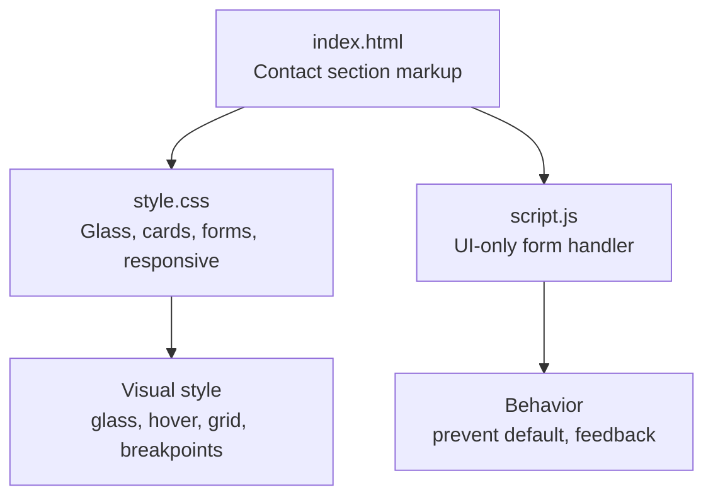
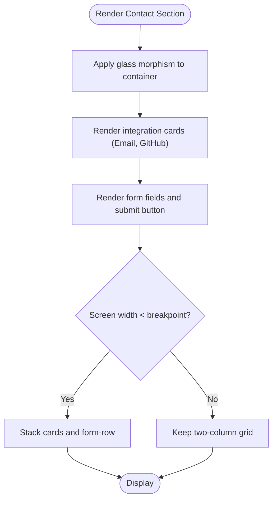
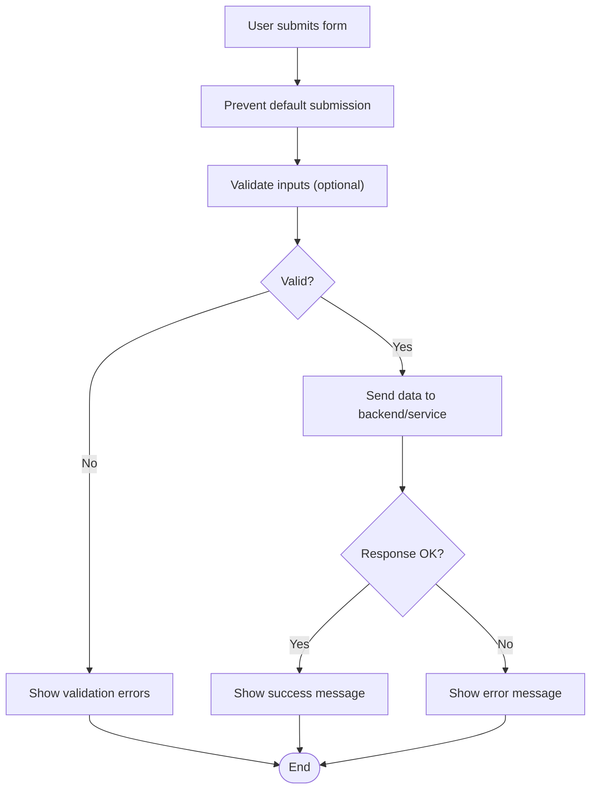
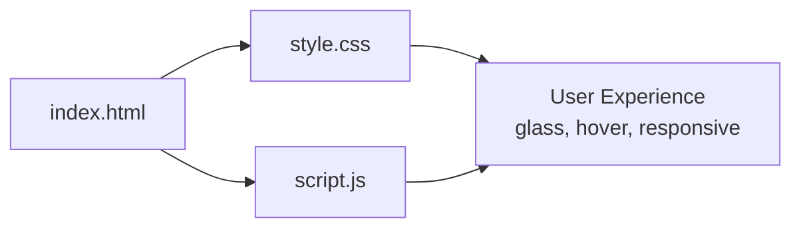
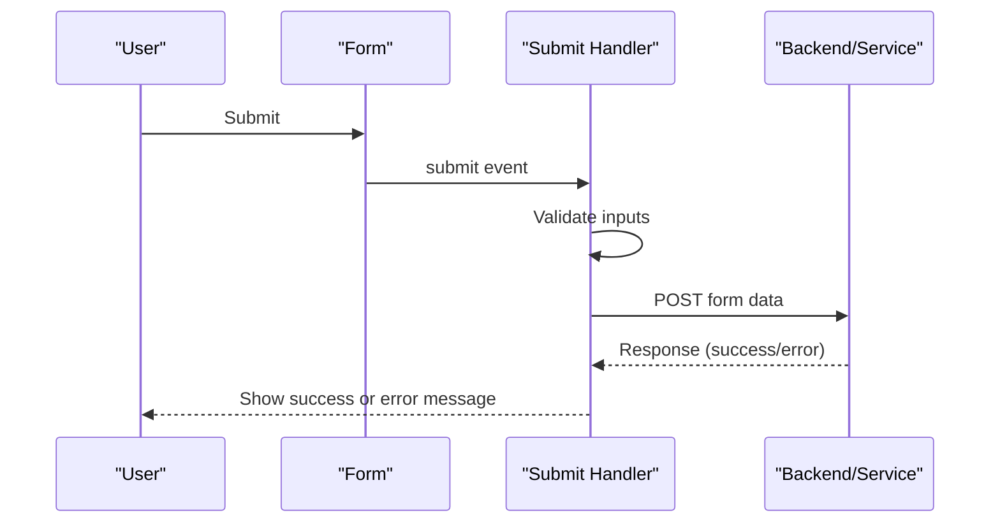

# Contact Section

<cite>
**Referenced Files in This Document**
- [index.html](file://files/arsalan-portfolio-vanilla/site/index.html)
- [style.css](file://files/arsalan-portfolio-vanilla/site/style.css)
- [script.js](file://files/arsalan-portfolio-vanilla/site/script.js)
</cite>

## Table of Contents
1. [Introduction](#introduction)
2. [Project Structure](#project-structure)
3. [Core Components](#core-components)
4. [Architecture Overview](#architecture-overview)
5. [Detailed Component Analysis](#detailed-component-analysis)
6. [Dependency Analysis](#dependency-analysis)
7. [Performance Considerations](#performance-considerations)
8. [Troubleshooting Guide](#troubleshooting-guide)
9. [Conclusion](#conclusion)
10. [Appendices](#appendices)

## Introduction
This document explains the contact section of the portfolio site, focusing on its UI-only form handling, email and GitHub integration cards, glass morphism styling, validation setup, user feedback mechanisms, and responsive design patterns. It also provides guidance for connecting the form to backend services, customizing contact information, and implementing proper submission workflows.

## Project Structure
The contact section is implemented across three files:
- HTML defines the contact container, two integration cards (email and GitHub), and a UI-only form.
- CSS styles the glass morphism theme, card layout, hover effects, and responsive breakpoints.
- JavaScript handles mobile menu behavior, scroll reveals, active nav highlighting, profile image fallback, and the UI-only form submission.



**Diagram sources**
- [index.html:105-123](file://files/arsalan-portfolio-vanilla/site/index.html#L105-L123)
- [style.css:130-144](file://files/arsalan-portfolio-vanilla/site/style.css#L130-L144)
- [script.js:68-72](file://files/arsalan-portfolio-vanilla/site/script.js#L68-L72)

**Section sources**
- [index.html:105-123](file://files/arsalan-portfolio-vanilla/site/index.html#L105-L123)
- [style.css:130-144](file://files/arsalan-portfolio-vanilla/site/style.css#L130-L144)
- [script.js:68-72](file://files/arsalan-portfolio-vanilla/site/script.js#L68-L72)

## Core Components
- Contact container with glass morphism background and centered content.
- Two integration cards:
  - Email card using a mailto link.
  - GitHub card linking to the repository profile.
- UI-only form with name, email, message fields and a submit button. A note clarifies that the form does not send data.

Key responsibilities:
- HTML provides semantic structure and accessibility attributes.
- CSS applies glass morphism, hover effects, grid layouts, and responsive rules.
- JavaScript prevents default submission and updates the note’s color as immediate feedback.

**Section sources**
- [index.html:105-123](file://files/arsalan-portfolio-vanilla/site/index.html#L105-L123)
- [style.css:21-24](file://files/arsalan-portfolio-vanilla/site/style.css#L21-L24)
- [style.css:130-144](file://files/arsalan-portfolio-vanilla/site/style.css#L130-L144)
- [script.js:68-72](file://files/arsalan-portfolio-vanilla/site/script.js#L68-L72)

## Architecture Overview
The contact section follows a simple client-side architecture:
- The browser renders the contact section from HTML.
- CSS styles the section with glass morphism and responsive grids.
- JavaScript intercepts form submission to provide UI-only feedback without network requests.

```mermaid
sequenceDiagram
participant User as "User"
participant Form as "Form (HTML)"
participant Script as "script.js"
participant Note as "Note Element"
User->>Form : Click "Send"
Form->>Script : submit event
Script->>Script : preventDefault()
Script->>Note : Update note color to highlight
Script-->>User : No network request; UI feedback shown
```

**Diagram sources**
- [index.html:116-121](file://files/arsalan-portfolio-vanilla/site/index.html#L116-L121)
- [script.js:68-72](file://files/arsalan-portfolio-vanilla/site/script.js#L68-L72)

## Detailed Component Analysis

### Contact Card Layout and Styling
- Container uses a glass morphism class with rounded corners, subtle border, and backdrop blur.
- A decorative glow pseudo-element adds a soft cyan highlight behind the section.
- Integration cards are styled as glass cards with labels and links.
- The form uses a two-column row for name and email inputs, a textarea for the message, and a ghost-style submit button.

Responsive behavior:
- On small screens, the integration cards stack vertically.
- The form input row stacks into a single column.

Hover effects:
- Cards lift slightly and gain a colored border on hover.
- Inputs show a focused border color.



**Diagram sources**
- [style.css:21-24](file://files/arsalan-portfolio-vanilla/site/style.css#L21-L24)
- [style.css:130-144](file://files/arsalan-portfolio-vanilla/site/style.css#L130-L144)
- [style.css:177-181](file://files/arsalan-portfolio-vanilla/site/style.css#L177-L181)

**Section sources**
- [index.html:105-123](file://files/arsalan-portfolio-vanilla/site/index.html#L105-L123)
- [style.css:21-24](file://files/arsalan-portfolio-vanilla/site/style.css#L21-L24)
- [style.css:130-144](file://files/arsalan-portfolio-vanilla/site/style.css#L130-L144)
- [style.css:177-181](file://files/arsalan-portfolio-vanilla/site/style.css#L177-L181)

### Form Validation Setup
- The form uses HTML5 attributes such as type="email" and placeholder text to guide users.
- There is no explicit JavaScript validation logic; the form relies on native browser validation when enabled.
- The form has novalidate set, which disables automatic browser validation messages by default.

Recommendations:
- Enable native validation by removing novalidate or adding required attributes to fields.
- Add custom validation via JavaScript if you need tailored error messages and real-time feedback.

**Section sources**
- [index.html:116-121](file://files/arsalan-portfolio-vanilla/site/index.html#L116-L121)
- [style.css:141-143](file://files/arsalan-portfolio-vanilla/site/style.css#L141-L143)

### User Feedback Mechanisms
- On form submission, JavaScript prevents the default action and changes the note element’s color to a highlight color to indicate interaction.
- The note explicitly states that the form is UI-only and directs users to use the email button above.

Enhancement ideas:
- Show success/error messages based on validation results.
- Provide inline field-level feedback for invalid inputs.
- Disable the submit button while processing to prevent duplicate submissions.

**Section sources**
- [script.js:68-72](file://files/arsalan-portfolio-vanilla/site/script.js#L68-L72)
- [index.html:116-121](file://files/arsalan-portfolio-vanilla/site/index.html#L116-L121)

### Distinction Between UI-Only Functionality and Backend Integration
- Current state: The form does not send data anywhere; it only updates UI feedback.
- Integration point: The submit event listener is the place to add API calls or third-party form handlers.

Migration path:
- Replace the current submit handler with an asynchronous function that sends form data to your backend or a service like Formspree, Netlify Forms, or a custom API.
- Handle loading states, success responses, and errors appropriately.



[No sources needed since this diagram shows conceptual workflow, not actual code structure]

### Email and GitHub Integration Cards
- Email card uses a mailto link to open the user’s default email client.
- GitHub card opens the repository profile in a new tab with security attributes.

Customization:
- Update the email address and GitHub username to match your contact details.
- Optionally add icons or additional social links following the same pattern.

**Section sources**
- [index.html:111-114](file://files/arsalan-portfolio-vanilla/site/index.html#L111-L114)

### Glass Morphism Styling
- The glass effect is achieved through a semi-transparent background, backdrop blur, subtle borders, and shadows.
- Cards inherit these properties and add hover transforms and border color transitions.

Best practices:
- Ensure sufficient contrast between text and background for readability.
- Use backdrop-filter sparingly to maintain performance on low-end devices.

**Section sources**
- [style.css:21-24](file://files/arsalan-portfolio-vanilla/site/style.css#L21-L24)

### Responsive Design Patterns
- Breakpoints at 960px, 820px, and 560px adjust grids, navigation, hero layout, and contact components.
- Contact cards and form rows collapse to single columns on narrow screens.

Implementation notes:
- Use CSS Grid for flexible layouts.
- Apply clamp() for fluid typography and spacing.
- Respect prefers-reduced-motion to disable animations for users who prefer reduced motion.

**Section sources**
- [style.css:161-181](file://files/arsalan-portfolio-vanilla/site/style.css#L161-L181)

## Dependency Analysis
The contact section depends on:
- HTML structure for semantics and accessibility.
- CSS classes for visual presentation and responsiveness.
- JavaScript for minimal interactive behavior.



**Diagram sources**
- [index.html:105-123](file://files/arsalan-portfolio-vanilla/site/index.html#L105-L123)
- [style.css:130-144](file://files/arsalan-portfolio-vanilla/site/style.css#L130-L144)
- [script.js:68-72](file://files/arsalan-portfolio-vanilla/site/script.js#L68-L72)

**Section sources**
- [index.html:105-123](file://files/arsalan-portfolio-vanilla/site/index.html#L105-L123)
- [style.css:130-144](file://files/arsalan-portfolio-vanilla/site/style.css#L130-L144)
- [script.js:68-72](file://files/arsalan-portfolio-vanilla/site/script.js#L68-L72)

## Performance Considerations
- Avoid excessive backdrop-filter usage; it can be GPU-intensive on some devices.
- Keep animations minimal and respect prefers-reduced-motion.
- Prefer CSS transitions over JavaScript-driven animations where possible.
- Lazy-load images outside the critical path; the contact section does not include heavy assets.

[No sources needed since this section provides general guidance]

## Troubleshooting Guide
Common issues and resolutions:
- Form does not validate:
  - Remove novalidate or add required attributes to enable native validation.
  - Implement custom validation in JavaScript if needed.
- No feedback after clicking Send:
  - Verify the submit event listener is attached and not overridden elsewhere.
  - Check console for JavaScript errors.
- Links not opening correctly:
  - Ensure mailto and GitHub URLs are correct.
  - Confirm target="_blank" and rel="noopener" are present for external links.

**Section sources**
- [index.html:116-121](file://files/arsalan-portfolio-vanilla/site/index.html#L116-L121)
- [script.js:68-72](file://files/arsalan-portfolio-vanilla/site/script.js#L68-L72)

## Conclusion
The contact section provides a clean, accessible, and visually consistent interface with glass morphism styling, clear integration cards, and a UI-only form. To evolve beyond UI-only behavior, integrate a backend or third-party service within the existing submit handler, implement robust validation, and enhance user feedback for both success and error states. Customize contact details and extend the card layout as needed while maintaining responsive and accessible design principles.

[No sources needed since this section summarizes without analyzing specific files]

## Appendices

### Connecting the Form to Backend Services
Steps to implement:
- Choose a service (e.g., Formspree, Netlify Forms, custom API).
- In the submit handler, serialize form data and send it via fetch or XMLHttpRequest.
- Handle loading, success, and error states with appropriate messages.
- Maintain accessibility by updating aria-live regions or screen-reader-friendly notifications.

Example flow:


[No sources needed since this diagram shows conceptual workflow, not actual code structure]

### Customizing Contact Information
- Update the email address in the mailto link.
- Change the GitHub username and URL to your profile or repository.
- Add additional cards following the same structure for LinkedIn, Twitter, or other platforms.

**Section sources**
- [index.html:111-114](file://files/arsalan-portfolio-vanilla/site/index.html#L111-L114)