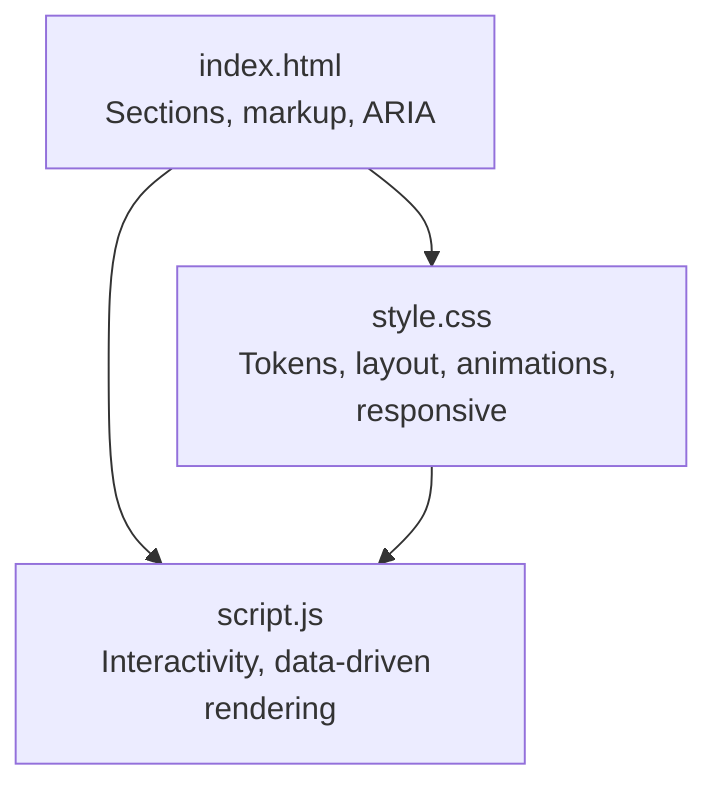
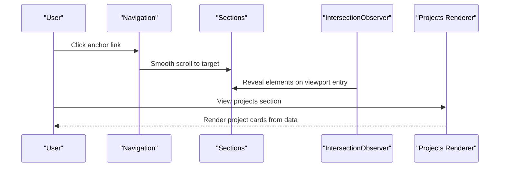
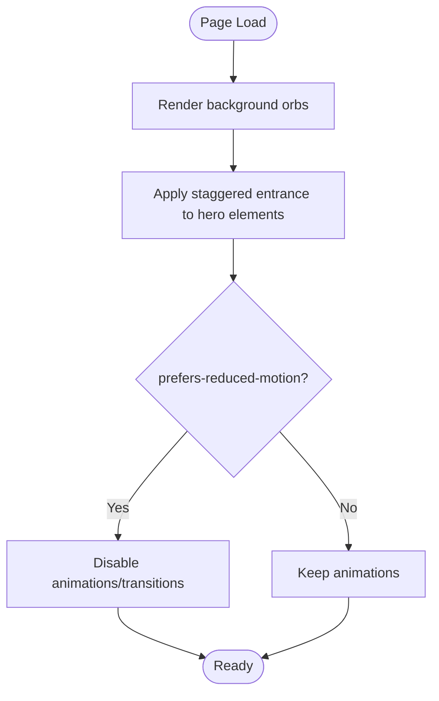
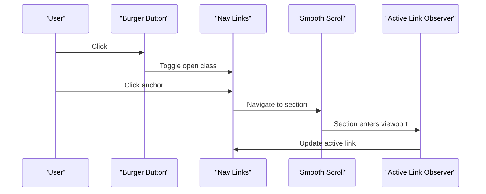
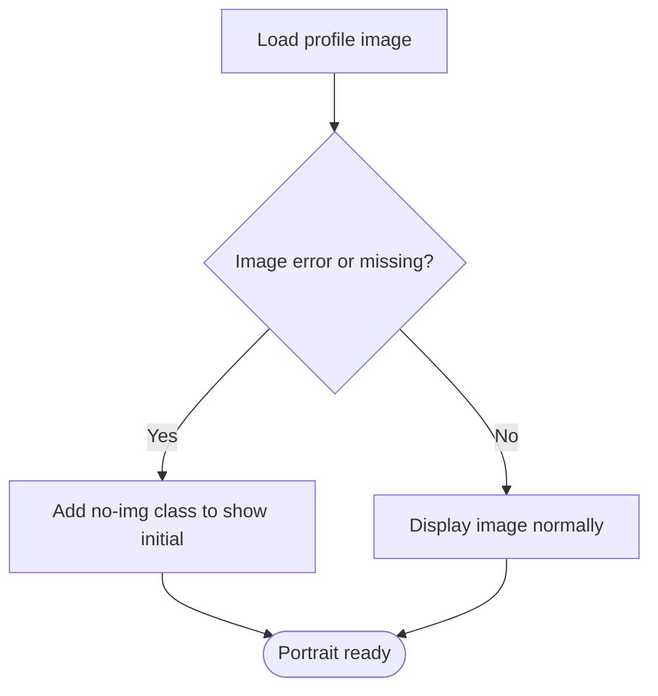
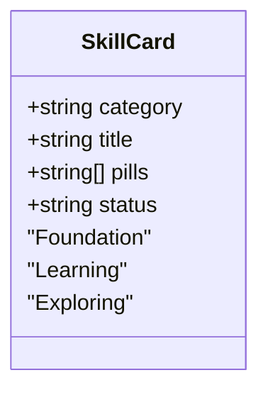
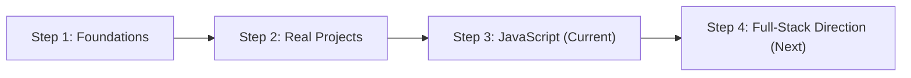
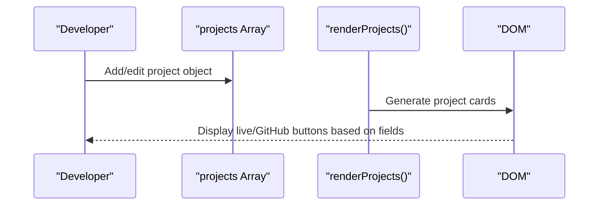
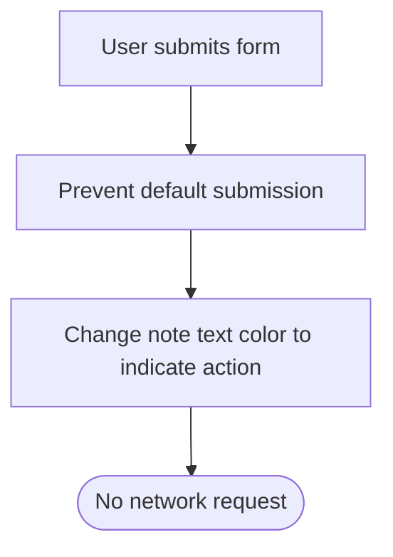
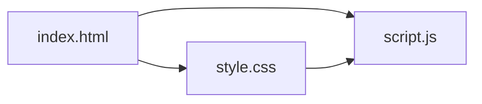

# Features Guide

<cite>
**Referenced Files in This Document**
- [index.html](file://files/arsalan-portfolio-vanilla/site/index.html)
- [style.css](file://files/arsalan-portfolio-vanilla/site/style.css)
- [script.js](file://files/arsalan-portfolio-vanilla/site/script.js)
</cite>

## Table of Contents
1. [Introduction](#introduction)
2. [Project Structure](#project-structure)
3. [Core Components](#core-components)
4. [Architecture Overview](#architecture-overview)
5. [Detailed Component Analysis](#detailed-component-analysis)
6. [Dependency Analysis](#dependency-analysis)
7. [Performance Considerations](#performance-considerations)
8. [Troubleshooting Guide](#troubleshooting-guide)
9. [Conclusion](#conclusion)

## Introduction
This guide documents the interactive features and user experiences of the portfolio site, including:
- Welcome experience with animated orb backgrounds and staggered text reveals
- Responsive navigation with a mobile hamburger menu and smooth scrolling
- Hero section with an interactive portrait and floating chips
- Skills categorization system
- Journey timeline visualization
- Dynamic project gallery with live links
- Contact section with UI-only form handling

It explains how these features work together to create a cohesive, accessible, and responsive user experience across devices and browsers.

## Project Structure
The portfolio is a vanilla HTML/CSS/JS site organized into three primary files:
- index.html: Semantic structure, sections, and content
- style.css: Design tokens, layout, animations, and responsive rules
- script.js: Interactivity for projects rendering, mobile menu, scroll reveals, active nav highlighting, image fallbacks, and UI-only form behavior

**Diagram sources**
- [index.html:1-135](file://files/arsalan-portfolio-vanilla/site/index.html#L1-L135)
- [style.css:1-182](file://files/arsalan-portfolio-vanilla/site/style.css#L1-L182)
- [script.js:1-75](file://files/arsalan-portfolio-vanilla/site/script.js#L1-L75)

**Section sources**
- [index.html:1-135](file://files/arsalan-portfolio-vanilla/site/index.html#L1-L135)
- [style.css:1-182](file://files/arsalan-portfolio-vanilla/site/style.css#L1-L182)
- [script.js:1-75](file://files/arsalan-portfolio-vanilla/site/script.js#L1-L75)

## Core Components
- Welcome Experience: Animated background orbs and staggered entrance animations for hero elements
- Navigation: Fixed glassmorphic header with desktop links and a mobile hamburger menu; smooth anchor scrolling
- Hero Section: Two-column layout with badge, headline, call-to-action buttons, interactive portrait, and floating chips
- Skills Categorization: Three-tier grid (Foundation, Learning, Exploring) with pill tags and visual emphasis
- Journey Timeline: Four-step horizontal timeline with status indicators and pulse animation for current step
- Projects Gallery: Data-driven list rendered from a JavaScript array with optional images, tags, live/demo links, and GitHub links
- Contact Section: Email and GitHub cards plus a UI-only form that prevents submission and shows feedback

**Section sources**
- [index.html:10-130](file://files/arsalan-portfolio-vanilla/site/index.html#L10-L130)
- [style.css:21-182](file://files/arsalan-portfolio-vanilla/site/style.css#L21-L182)
- [script.js:1-75](file://files/arsalan-portfolio-vanilla/site/script.js#L1-L75)

## Architecture Overview
The site follows a simple, layered architecture:
- Markup defines semantic sections and accessibility attributes
- Styles provide design tokens, glassmorphism, animations, and responsive breakpoints
- Script enhances interactivity without altering core semantics

**Diagram sources**
- [index.html:14-130](file://files/arsalan-portfolio-vanilla/site/index.html#L14-L130)
- [style.css:14-159](file://files/arsalan-portfolio-vanilla/site/style.css#L14-L159)
- [script.js:36-75](file://files/arsalan-portfolio-vanilla/site/script.js#L36-L75)

## Detailed Component Analysis

### Welcome Experience: Animated Orbs and Staggered Reveals
- Background Orbs: Two large blurred circles create ambient color gradients behind content
- Staggered Animations: Elements with a class and inline delay variable animate in sequentially
- Reduced Motion: Animations are disabled when the user prefers reduced motion

Configuration and customization:
- Colors, blur, and sizes are controlled via CSS variables
- Animation timing uses a shared easing function
- Delays are set per element using a custom property

Accessibility:
- Background glow is marked as decorative
- All animations respect prefers-reduced-motion

**Diagram sources**
- [style.css:27-30](file://files/arsalan-portfolio-vanilla/site/style.css#L27-L30)
- [style.css:152-159](file://files/arsalan-portfolio-vanilla/site/style.css#L152-L159)
- [index.html:11-11](file://files/arsalan-portfolio-vanilla/site/index.html#L11-L11)

**Section sources**
- [style.css:27-30](file://files/arsalan-portfolio-vanilla/site/style.css#L27-L30)
- [style.css:152-159](file://files/arsalan-portfolio-vanilla/site/style.css#L152-L159)
- [index.html:11-11](file://files/arsalan-portfolio-vanilla/site/index.html#L11-L11)

### Responsive Navigation with Hamburger Menu and Smooth Scrolling
- Desktop: Horizontal links with hover states and an active state based on scroll position
- Mobile: Hamburger button toggles a glassmorphic dropdown menu
- Smooth Scrolling: Native CSS smooth scrolling with top padding offset for fixed header
- Active Link Highlighting: IntersectionObserver updates the active link as sections enter the viewport

Configuration and customization:
- Breakpoints control mobile menu visibility and layout changes
- Glass effects and transitions are defined in CSS variables
- Active link detection uses section IDs and anchor hrefs

Accessibility:
- Burger button has aria-label and aria-expanded
- Links use semantic anchors with descriptive text

**Diagram sources**
- [index.html:14-28](file://files/arsalan-portfolio-vanilla/site/index.html#L14-L28)
- [style.css:51-65](file://files/arsalan-portfolio-vanilla/site/style.css#L51-L65)
- [style.css:14-14](file://files/arsalan-portfolio-vanilla/site/style.css#L14-L14)
- [script.js:36-59](file://files/arsalan-portfolio-vanilla/site/script.js#L36-L59)

**Section sources**
- [index.html:14-28](file://files/arsalan-portfolio-vanilla/site/index.html#L14-L28)
- [style.css:51-65](file://files/arsalan-portfolio-vanilla/site/style.css#L51-L65)
- [style.css:14-14](file://files/arsalan-portfolio-vanilla/site/style.css#L14-L14)
- [script.js:36-59](file://files/arsalan-portfolio-vanilla/site/script.js#L36-L59)

### Hero Section: Interactive Portrait and Floating Chips
- Layout: Two-column grid with text and visual area
- Badge: Pulsing dot indicates “in progress”
- Portrait: Image with a graceful fallback initial if the image fails to load
- Floating Chips: Two glassmorphic chips float around the portrait with staggered delays

Configuration and customization:
- Portrait aspect ratio and border radius are styled via CSS
- Fallback logic is handled in script by adding a class when image loading fails
- Chip positions and animations are defined in CSS

Accessibility:
- Profile image has alt text
- Decorative elements are hidden from assistive tech where appropriate

**Diagram sources**
- [index.html:43-52](file://files/arsalan-portfolio-vanilla/site/index.html#L43-L52)
- [style.css:67-82](file://files/arsalan-portfolio-vanilla/site/style.css#L67-L82)
- [script.js:61-66](file://files/arsalan-portfolio-vanilla/site/script.js#L61-L66)

**Section sources**
- [index.html:43-52](file://files/arsalan-portfolio-vanilla/site/index.html#L43-L52)
- [style.css:67-82](file://files/arsalan-portfolio-vanilla/site/style.css#L67-L82)
- [script.js:61-66](file://files/arsalan-portfolio-vanilla/site/script.js#L61-L66)

### Skills Categorization System
- Three categories: Foundation, Currently Learning, Exploring
- Visual distinction: Solid borders for completed/current skills, dashed borders for exploring
- Pill tags: Monospace icons and labels for each skill

Configuration and customization:
- Add/remove skills by editing the HTML lists
- Change category colors and styles via CSS classes and variables

Accessibility:
- Each skill card is a semantic article with headings
- Tags are presented as list items

**Diagram sources**
- [index.html:64-85](file://files/arsalan-portfolio-vanilla/site/index.html#L64-L85)
- [style.css:88-101](file://files/arsalan-portfolio-vanilla/site/style.css#L88-L101)

**Section sources**
- [index.html:64-85](file://files/arsalan-portfolio-vanilla/site/index.html#L64-L85)
- [style.css:88-101](file://files/arsalan-portfolio-vanilla/site/style.css#L88-L101)

### Journey Timeline Visualization
- Four steps displayed in a grid with a connecting line
- Status indicators: Completed, Current (with pulse), Next (dashed)
- Responsive: Collapses to two columns on smaller screens

Configuration and customization:
- Add or reorder steps by editing the ordered list
- Adjust colors and pulse animation via CSS variables and keyframes

Accessibility:
- Steps are semantically represented as list items
- Visual indicators are purely decorative

**Diagram sources**
- [index.html:88-96](file://files/arsalan-portfolio-vanilla/site/index.html#L88-L96)
- [style.css:103-112](file://files/arsalan-portfolio-vanilla/site/style.css#L103-L112)

**Section sources**
- [index.html:88-96](file://files/arsalan-portfolio-vanilla/site/index.html#L88-L96)
- [style.css:103-112](file://files/arsalan-portfolio-vanilla/site/style.css#L103-L112)

### Dynamic Project Gallery with Live Links
- Data-driven rendering: Projects are defined in a JavaScript array and rendered into the DOM
- Optional fields: Preview image, live demo link, repository link, and tags
- Graceful degradation: Missing images are removed; buttons hide when links are empty

Configuration and customization:
- Add new projects by appending objects to the array
- Control visibility of buttons by providing or omitting fields
- Style tags and actions via CSS classes

Accessibility:
- Images include alt text
- External links use rel="noopener" for security

**Diagram sources**
- [script.js:1-34](file://files/arsalan-portfolio-vanilla/site/script.js#L1-L34)
- [index.html:99-103](file://files/arsalan-portfolio-vanilla/site/index.html#L99-L103)
- [style.css:114-129](file://files/arsalan-portfolio-vanilla/site/style.css#L114-L129)

**Section sources**
- [script.js:1-34](file://files/arsalan-portfolio-vanilla/site/script.js#L1-L34)
- [index.html:99-103](file://files/arsalan-portfolio-vanilla/site/index.html#L99-L103)
- [style.css:114-129](file://files/arsalan-portfolio-vanilla/site/style.css#L114-L129)

### Contact Section with UI-Only Form Handling
- Contact cards: Direct links to email and GitHub
- UI-only form: Prevents default submission and provides feedback via text color change
- No backend integration: The form does not send data

Configuration and customization:
- Replace placeholder contact details with your own
- Extend form behavior by adding validation or integrating a third-party service

Accessibility:
- Inputs have aria-labels
- Note text clarifies the form’s limitations

**Diagram sources**
- [index.html:105-123](file://files/arsalan-portfolio-vanilla/site/index.html#L105-L123)
- [script.js:68-72](file://files/arsalan-portfolio-vanilla/site/script.js#L68-L72)
- [style.css:130-144](file://files/arsalan-portfolio-vanilla/site/style.css#L130-L144)

**Section sources**
- [index.html:105-123](file://files/arsalan-portfolio-vanilla/site/index.html#L105-L123)
- [script.js:68-72](file://files/arsalan-portfolio-vanilla/site/script.js#L68-L72)
- [style.css:130-144](file://files/arsalan-portfolio-vanilla/site/style.css#L130-L144)

## Dependency Analysis
- HTML depends on CSS for styling and animations
- JavaScript depends on HTML structure (IDs and classes) and CSS classes for state (e.g., open menu, visible reveal)
- CSS variables centralize theming and reduce duplication
- IntersectionObserver drives both scroll reveals and active link highlighting

**Diagram sources**
- [index.html:1-135](file://files/arsalan-portfolio-vanilla/site/index.html#L1-L135)
- [style.css:1-182](file://files/arsalan-portfolio-vanilla/site/style.css#L1-L182)
- [script.js:1-75](file://files/arsalan-portfolio-vanilla/site/script.js#L1-L75)

**Section sources**
- [index.html:1-135](file://files/arsalan-portfolio-vanilla/site/index.html#L1-L135)
- [style.css:1-182](file://files/arsalan-portfolio-vanilla/site/style.css#L1-L182)
- [script.js:1-75](file://files/arsalan-portfolio-vanilla/site/script.js#L1-L75)

## Performance Considerations
- Use CSS variables for consistent theming and minimal repaint/reflow
- Prefer transform and opacity for animations to leverage GPU acceleration
- Limit heavy backdrop-filter usage to necessary areas; consider performance on low-end devices
- Defer non-critical scripts or place at the end of the body (already done)
- Avoid excessive DOM manipulation; render projects once from data

[No sources needed since this section provides general guidance]

## Troubleshooting Guide
- Images not showing:
  - Ensure image paths are correct and accessible
  - The site includes a fallback initial when the image fails to load
- Mobile menu not opening:
  - Verify the burger button exists and has the expected ID
  - Check that the nav links container has the expected ID and class toggling works
- Projects not rendering:
  - Confirm the projects array is defined and the container element exists
  - Validate image URLs and optional fields
- Form appears broken:
  - The form is intentionally UI-only; it will not submit data
  - To integrate a backend, replace the preventDefault handler with a fetch call

**Section sources**
- [script.js:61-72](file://files/arsalan-portfolio-vanilla/site/script.js#L61-L72)
- [index.html:43-52](file://files/arsalan-portfolio-vanilla/site/index.html#L43-L52)
- [index.html:99-103](file://files/arsalan-portfolio-vanilla/site/index.html#L99-L103)
- [index.html:105-123](file://files/arsalan-portfolio-vanilla/site/index.html#L105-L123)

## Conclusion
This portfolio combines thoughtful visuals, clear structure, and lightweight interactivity to deliver a cohesive user experience. The design system built on CSS variables ensures consistency, while JavaScript adds dynamic behaviors like project rendering and scroll-based interactions. Accessibility considerations such as ARIA attributes, semantic markup, and reduced motion support help ensure inclusive experiences across devices and browsers.

[No sources needed since this section summarizes without analyzing specific files]