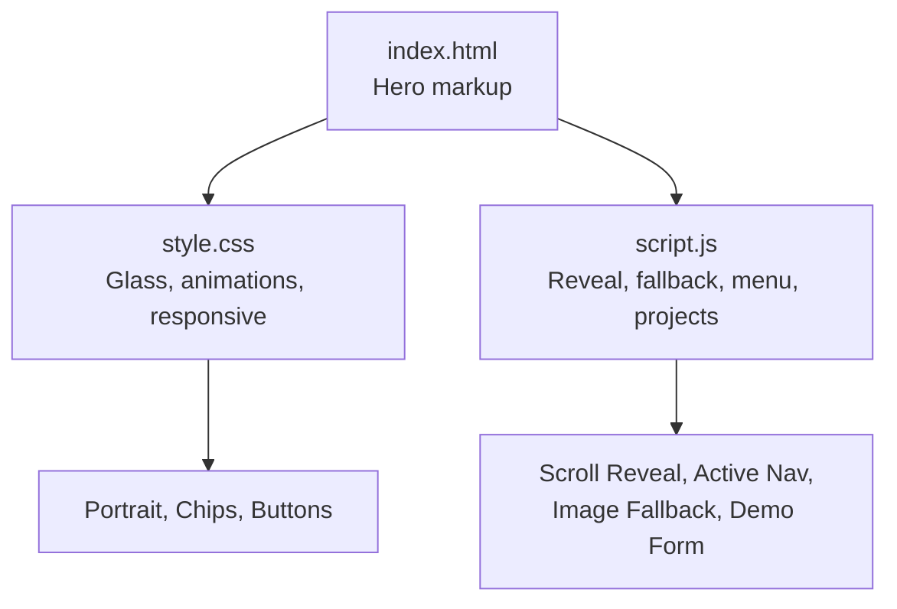
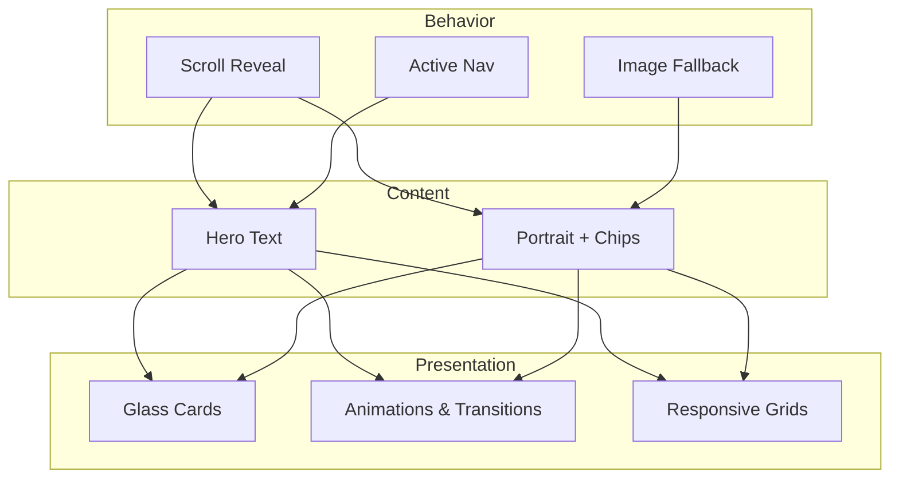
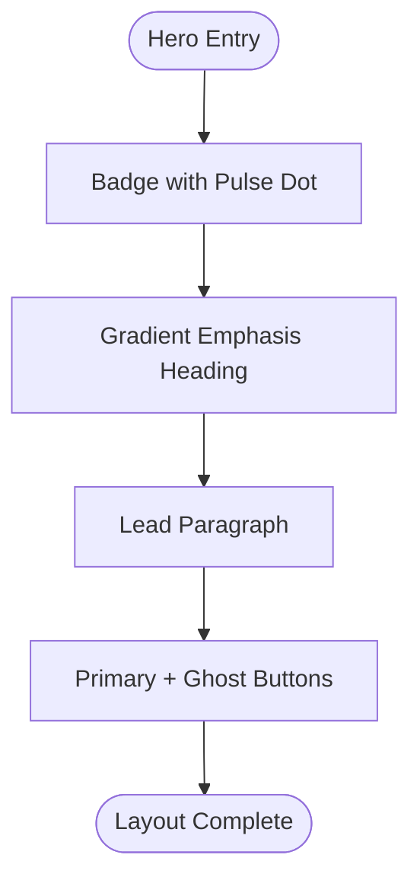
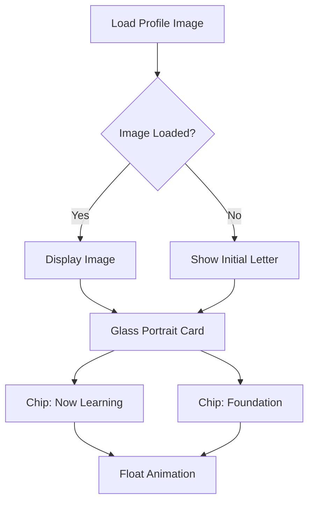
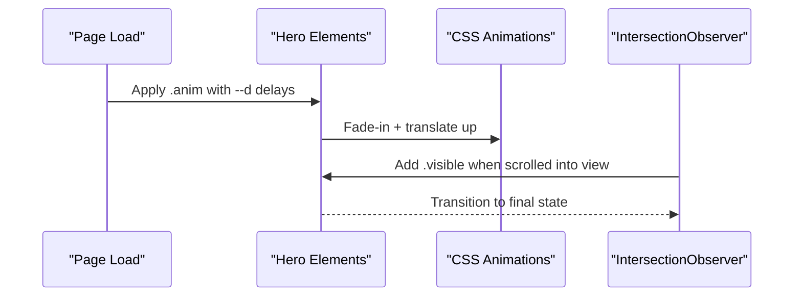
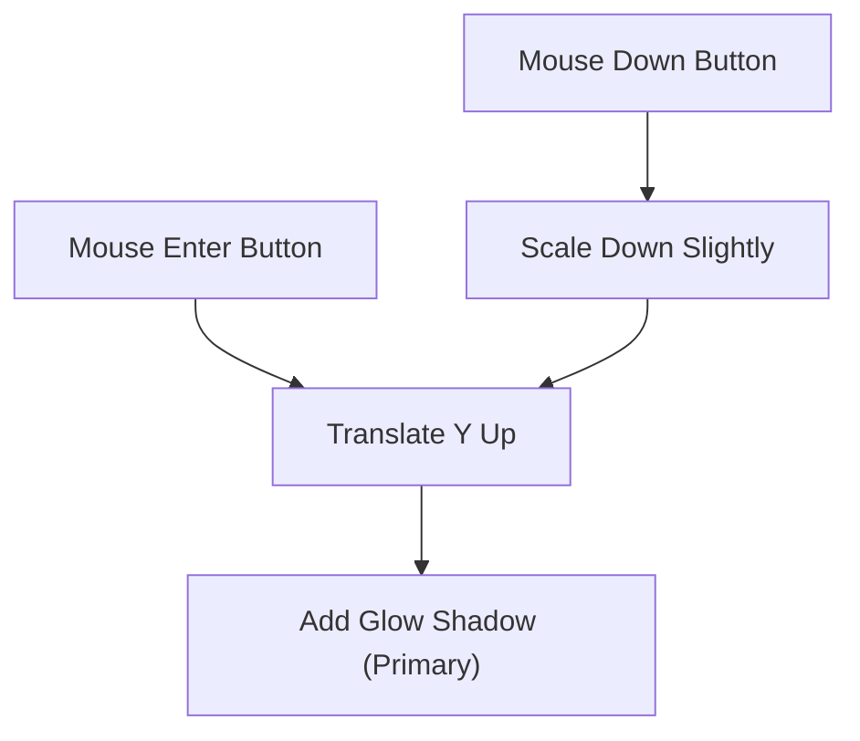
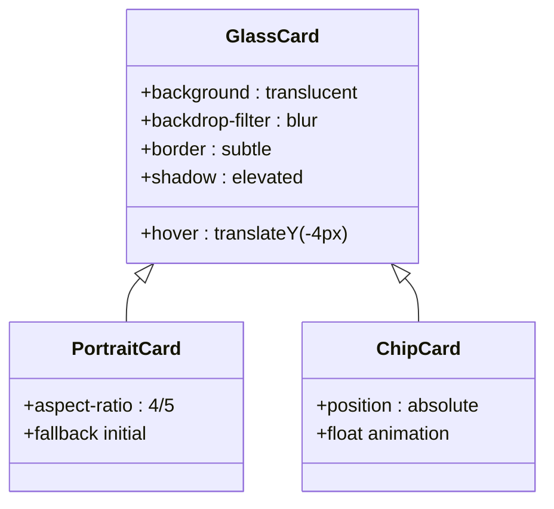
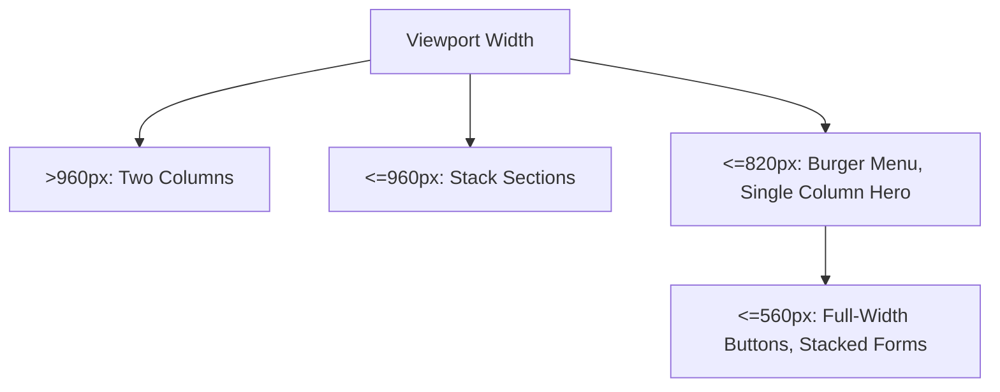
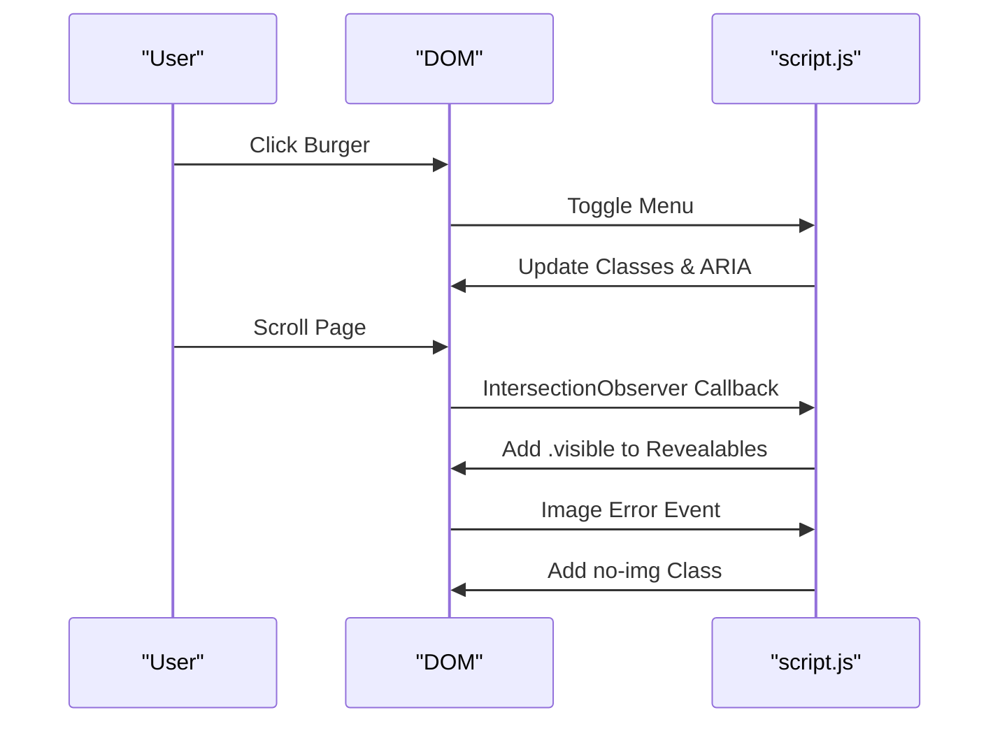
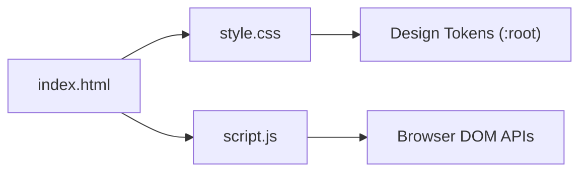

# Hero Section

<cite>
**Referenced Files in This Document**
- [index.html](file://files/arsalan-portfolio-vanilla/site/index.html)
- [style.css](file://files/arsalan-portfolio-vanilla/site/style.css)
- [script.js](file://files/arsalan-portfolio-vanilla/site/script.js)
</cite>

## Table of Contents
1. [Introduction](#introduction)
2. [Project Structure](#project-structure)
3. [Core Components](#core-components)
4. [Architecture Overview](#architecture-overview)
5. [Detailed Component Analysis](#detailed-component-analysis)
6. [Dependency Analysis](#dependency-analysis)
7. [Performance Considerations](#performance-considerations)
8. [Troubleshooting Guide](#troubleshooting-guide)
9. [Conclusion](#conclusion)
10. [Appendices](#appendices)

## Introduction
This document explains the hero section that features:
- An interactive portrait container with glass morphism styling and floating status chips
- Staggered animation reveals for text, badges, actions, and visuals
- Magnetic button effects via CSS transitions
- Responsive layout patterns for mobile and tablet breakpoints
- JavaScript behaviors including scroll reveal, active navigation highlighting, image fallback, and a UI-only contact form

Note: The repository does not include mouse-tracking or 3D tilt logic for the portrait. The implementation focuses on CSS animations and transitions for visual polish.

## Project Structure
The hero section is composed of HTML markup, CSS styles, and minimal JavaScript behavior:
- HTML defines the hero grid, badge, heading, lead paragraph, action buttons, portrait container, and two floating chips
- CSS provides glass morphism, gradients, typography, responsive grids, and keyframe animations
- JavaScript handles project rendering, mobile menu toggling, scroll-based reveal, active nav link tracking, profile image fallback, and a demo form interaction

**Diagram sources**
- [index.html:31-53](file://files/arsalan-portfolio-vanilla/site/index.html#L31-L53)
- [style.css:21-83](file://files/arsalan-portfolio-vanilla/site/style.css#L21-L83)
- [script.js:14-34](file://files/arsalan-portfolio-vanilla/site/script.js#L14-L34)

**Section sources**
- [index.html:31-53](file://files/arsalan-portfolio-vanilla/site/index.html#L31-L53)
- [style.css:1-182](file://files/arsalan-portfolio-vanilla/site/style.css#L1-L182)
- [script.js:1-75](file://files/arsalan-portfolio-vanilla/site/script.js#L1-L75)

## Core Components
- Hero Grid Layout: Two-column grid (text left, visual right) that collapses to a single column on smaller screens
- Badge: Pill-shaped label with a pulsing dot indicating “in progress”
- Heading and Lead: Gradient-highlighted emphasis and accessible lead copy
- Action Buttons: Primary and ghost buttons with hover and active states
- Portrait Container: Glass card with aspect-ratio image and fallback initial when image fails to load
- Floating Chips: Glass-styled labels showing current learning status and foundation skills
- Animations: Staggered fade-in-up for hero elements; continuous float for chips; pulse for badge dot
- Scroll Reveal: Elements with data-reveal animate into view as they enter the viewport
- Active Navigation: Highlights the nav link corresponding to the currently visible section

**Section sources**
- [index.html:33-52](file://files/arsalan-portfolio-vanilla/site/index.html#L33-L52)
- [style.css:42-83](file://files/arsalan-portfolio-vanilla/site/style.css#L42-L83)
- [style.css:152-159](file://files/arsalan-portfolio-vanilla/site/style.css#L152-L159)
- [script.js:46-59](file://files/arsalan-portfolio-vanilla/site/script.js#L46-L59)
- [script.js:61-66](file://files/arsalan-portfolio-vanilla/site/script.js#L61-L66)

## Architecture Overview
The hero section follows a simple, layered architecture:
- Presentation layer (CSS): Glass morphism, gradients, typography, responsive grids, and animations
- Content layer (HTML): Semantic structure with accessibility attributes
- Behavior layer (JS): Lightweight interactions and dynamic content rendering

**Diagram sources**
- [style.css:21-83](file://files/arsalan-portfolio-vanilla/site/style.css#L21-L83)
- [style.css:152-159](file://files/arsalan-portfolio-vanilla/site/style.css#L152-L159)
- [script.js:46-59](file://files/arsalan-portfolio-vanilla/site/script.js#L46-L59)
- [script.js:61-66](file://files/arsalan-portfolio-vanilla/site/script.js#L61-L66)

## Detailed Component Analysis

### Hero Layout and Typography
- Uses a CSS grid with two columns on desktop and one column on mobile
- Badge includes an animated dot to indicate ongoing learning
- Heading uses gradient text for emphasis; lead text is constrained for readability
- Action buttons provide clear calls-to-action with hover and active states

**Diagram sources**
- [index.html:33-42](file://files/arsalan-portfolio-vanilla/site/index.html#L33-L42)
- [style.css:32-48](file://files/arsalan-portfolio-vanilla/site/style.css#L32-L48)

**Section sources**
- [index.html:33-42](file://files/arsalan-portfolio-vanilla/site/index.html#L33-L42)
- [style.css:32-48](file://files/arsalan-portfolio-vanilla/site/style.css#L32-L48)

### Interactive Portrait and Floating Chips
- Portrait container applies glass morphism and a subtle gradient background
- Image maintains a 4:5 aspect ratio and falls back to an initial letter if loading fails
- Two floating chips display current learning status and foundational skills
- Chips use a continuous floating animation with staggered delays

**Diagram sources**
- [index.html:43-52](file://files/arsalan-portfolio-vanilla/site/index.html#L43-L52)
- [style.css:72-83](file://files/arsalan-portfolio-vanilla/site/style.css#L72-L83)
- [script.js:61-66](file://files/arsalan-portfolio-vanilla/site/script.js#L61-L66)

**Section sources**
- [index.html:43-52](file://files/arsalan-portfolio-vanilla/site/index.html#L43-L52)
- [style.css:72-83](file://files/arsalan-portfolio-vanilla/site/style.css#L72-L83)
- [script.js:61-66](file://files/arsalan-portfolio-vanilla/site/script.js#L61-L66)

### Staggered Animation Reveals
- Hero elements have inline delay variables to stagger their entrance
- Global animation class fades elements in and translates them upward
- Scroll-triggered reveal adds a visible class when elements enter the viewport

**Diagram sources**
- [index.html:33-52](file://files/arsalan-portfolio-vanilla/site/index.html#L33-L52)
- [style.css:152-159](file://files/arsalan-portfolio-vanilla/site/style.css#L152-L159)
- [script.js:46-50](file://files/arsalan-portfolio-vanilla/site/script.js#L46-L50)

**Section sources**
- [index.html:33-52](file://files/arsalan-portfolio-vanilla/site/index.html#L33-L52)
- [style.css:152-159](file://files/arsalan-portfolio-vanilla/site/style.css#L152-L159)
- [script.js:46-50](file://files/arsalan-portfolio-vanilla/site/script.js#L46-L50)

### Magnetic Button Effects
- Buttons use transform transitions for hover lift and active press
- Ghost buttons apply glass morphism with backdrop blur
- Hover and active states are defined globally for consistency

**Diagram sources**
- [style.css:42-49](file://files/arsalan-portfolio-vanilla/site/style.css#L42-L49)

**Section sources**
- [style.css:42-49](file://files/arsalan-portfolio-vanilla/site/style.css#L42-L49)

### Glass Morphism Card Styling
- Glass cards share a common style with translucent backgrounds, borders, and backdrop blur
- Cards elevate on hover with a subtle border color change
- Consistent radius and shadow tokens ensure cohesive design

**Diagram sources**
- [style.css:21-24](file://files/arsalan-portfolio-vanilla/site/style.css#L21-L24)
- [style.css:72-83](file://files/arsalan-portfolio-vanilla/site/style.css#L72-L83)

**Section sources**
- [style.css:21-24](file://files/arsalan-portfolio-vanilla/site/style.css#L21-L24)
- [style.css:72-83](file://files/arsalan-portfolio-vanilla/site/style.css#L72-L83)

### Responsive Layout Patterns
- Desktop: Two-column hero grid
- Tablet: Skills and timeline adjust; about and project sections stack
- Mobile: Single-column layouts, burger menu, adjusted chip positions, full-width buttons

**Diagram sources**
- [style.css:161-181](file://files/arsalan-portfolio-vanilla/site/style.css#L161-L181)

**Section sources**
- [style.css:161-181](file://files/arsalan-portfolio-vanilla/site/style.css#L161-L181)

### JavaScript Behaviors
- Projects Rendering: Builds project cards from a data array
- Mobile Menu: Toggles open state and updates aria-expanded
- Scroll Reveal: Observes elements with data-reveal and adds visible class
- Active Nav: Highlights the nav link for the current section
- Image Fallback: Shows an initial letter if the profile image fails to load
- Demo Form: Prevents default submission and updates note color

**Diagram sources**
- [script.js:14-34](file://files/arsalan-portfolio-vanilla/site/script.js#L14-L34)
- [script.js:36-44](file://files/arsalan-portfolio-vanilla/site/script.js#L36-L44)
- [script.js:46-50](file://files/arsalan-portfolio-vanilla/site/script.js#L46-L50)
- [script.js:52-59](file://files/arsalan-portfolio-vanilla/site/script.js#L52-L59)
- [script.js:61-66](file://files/arsalan-portfolio-vanilla/site/script.js#L61-L66)
- [script.js:68-72](file://files/arsalan-portfolio-vanilla/site/script.js#L68-L72)

**Section sources**
- [script.js:14-34](file://files/arsalan-portfolio-vanilla/site/script.js#L14-L34)
- [script.js:36-44](file://files/arsalan-portfolio-vanilla/site/script.js#L36-L44)
- [script.js:46-59](file://files/arsalan-portfolio-vanilla/site/script.js#L46-L59)
- [script.js:61-72](file://files/arsalan-portfolio-vanilla/site/script.js#L61-L72)

## Dependency Analysis
- HTML depends on CSS for presentation and on JS for interactivity
- CSS relies on design tokens for consistent colors, spacing, and easing
- JS depends on DOM APIs (IntersectionObserver, event listeners) and does not introduce external libraries

**Diagram sources**
- [index.html:1-10](file://files/arsalan-portfolio-vanilla/site/index.html#L1-L10)
- [style.css:1-12](file://files/arsalan-portfolio-vanilla/site/style.css#L1-L12)
- [script.js:46-59](file://files/arsalan-portfolio-vanilla/site/script.js#L46-L59)

**Section sources**
- [index.html:1-10](file://files/arsalan-portfolio-vanilla/site/index.html#L1-L10)
- [style.css:1-12](file://files/arsalan-portfolio-vanilla/site/style.css#L1-L12)
- [script.js:46-59](file://files/arsalan-portfolio-vanilla/site/script.js#L46-L59)

## Performance Considerations
- Prefer CSS animations over JavaScript for smooth, GPU-accelerated effects
- Use IntersectionObserver thresholds judiciously to avoid excessive callbacks
- Keep images optimized; leverage fallback initials to prevent layout shifts
- Respect prefers-reduced-motion to disable animations for users who prefer reduced motion

[No sources needed since this section provides general guidance]

## Troubleshooting Guide
- Missing Profile Image: The script automatically shows an initial letter when the image fails to load
- Animations Not Triggering: Ensure elements have the correct classes and data attributes; verify media queries do not override intended styles
- Buttons Not Responding: Check hover and active state rules; confirm no pointer-events are blocking interactions
- Mobile Menu Issues: Confirm burger toggle updates both class and aria-expanded attributes

**Section sources**
- [script.js:61-66](file://files/arsalan-portfolio-vanilla/site/script.js#L61-L66)
- [style.css:42-49](file://files/arsalan-portfolio-vanilla/site/style.css#L42-L49)
- [script.js:36-44](file://files/arsalan-portfolio-vanilla/site/script.js#L36-L44)

## Conclusion
The hero section combines semantic HTML, glass morphism CSS, and lightweight JavaScript to deliver a polished, accessible experience. It emphasizes clarity, responsiveness, and performance while providing clear customization points for content and visuals.

[No sources needed since this section summarizes without analyzing specific files]

## Appendices

### Customization Guidance
- Portrait Images
  - Replace the image source path in the portrait container
  - If the image fails to load, an initial letter will be shown automatically
- Chip Content
  - Edit the text inside the floating chips to reflect current learning status and foundations
- Animation Behaviors
  - Adjust stagger delays using inline delay variables on animated elements
  - Modify keyframes and transition timings in the global animation rules
- Magnetic Button Effects
  - Customize hover and active transforms in the button styles
- Glass Morphism Styling
  - Adjust glass background, border, and backdrop blur values in the shared glass class
- Responsive Layouts
  - Tweak breakpoint-specific rules to match your desired layout at different screen sizes

**Section sources**
- [index.html:43-52](file://files/arsalan-portfolio-vanilla/site/index.html#L43-L52)
- [style.css:21-24](file://files/arsalan-portfolio-vanilla/site/style.css#L21-L24)
- [style.css:42-49](file://files/arsalan-portfolio-vanilla/site/style.css#L42-L49)
- [style.css:152-159](file://files/arsalan-portfolio-vanilla/site/style.css#L152-L159)
- [style.css:161-181](file://files/arsalan-portfolio-vanilla/site/style.css#L161-L181)
- [script.js:61-66](file://files/arsalan-portfolio-vanilla/site/script.js#L61-L66)