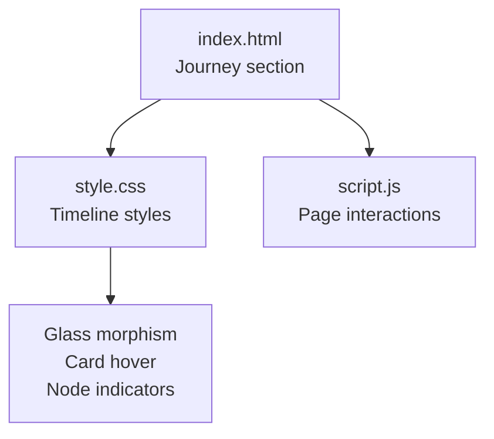
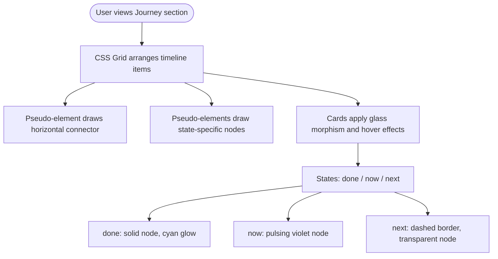
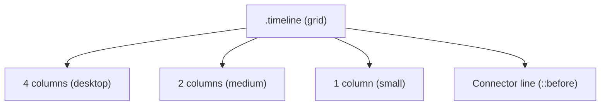
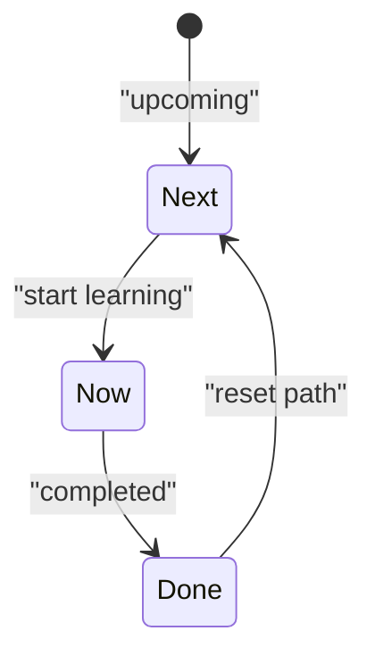
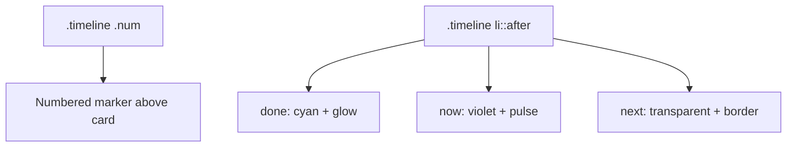
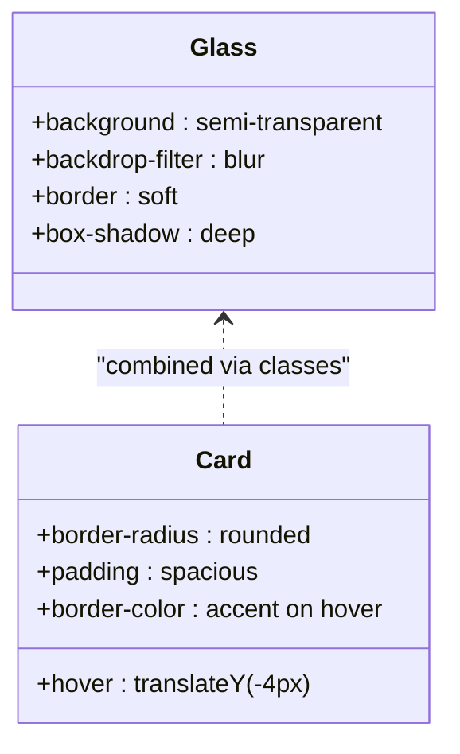
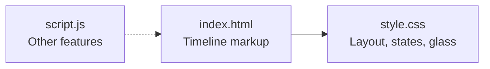

# Journey Timeline

<cite>
**Referenced Files in This Document**
- [index.html](file://files/arsalan-portfolio-vanilla/site/index.html)
- [style.css](file://files/arsalan-portfolio-vanilla/site/style.css)
- [script.js](file://files/arsalan-portfolio-vanilla/site/script.js)
</cite>

## Table of Contents
1. [Introduction](#introduction)
2. [Project Structure](#project-structure)
3. [Core Components](#core-components)
4. [Architecture Overview](#architecture-overview)
5. [Detailed Component Analysis](#detailed-component-analysis)
6. [Dependency Analysis](#dependency-analysis)
7. [Performance Considerations](#performance-considerations)
8. [Troubleshooting Guide](#troubleshooting-guide)
9. [Conclusion](#conclusion)
10. [Appendices](#appendices)

## Introduction
This document explains the interactive journey timeline visualization that shows a learning progression from HTML and CSS foundations through JavaScript and toward full-stack development goals. It covers:
- Timeline item states: done, now, next
- Node indicators and numbered progress markers
- Card-based content layout
- CSS styling for timeline connections, glass morphism effects, and responsive behavior
- How to add new timeline entries, modify the learning path, and customize visual appearance per state

## Project Structure
The timeline is part of a single-page portfolio site. The relevant files are:
- index.html: Contains the section markup for the timeline and its items
- style.css: Defines the visual design, including timeline layout, node indicators, and glass morphism
- script.js: Handles page interactions (not directly used by the timeline itself)

**Diagram sources**
- [index.html:88-97](file://files/arsalan-portfolio-vanilla/site/index.html#L88-L97)
- [style.css:103-113](file://files/arsalan-portfolio-vanilla/site/style.css#L103-L113)
- [style.css:21-24](file://files/arsalan-portfolio-vanilla/site/style.css#L21-L24)

**Section sources**
- [index.html:88-97](file://files/arsalan-portfolio-vanilla/site/index.html#L88-L97)
- [style.css:103-113](file://files/arsalan-portfolio-vanilla/site/style.css#L103-L113)

## Core Components
- Timeline container: An ordered list with class timeline that uses CSS grid for layout and a pseudo-element for the horizontal connection line.
- Timeline items: List elements with classes done, now, or next to indicate state. Each item includes a number span and card content.
- Numbered progress indicators: Large numbers above each card, styled via .timeline .num.
- Node indicators: Circular dots on the right side of each item, styled via .timeline li::after, with different colors and animations per state.
- Card-based content: Glass-morphism cards using shared .glass and .card classes.

Key responsibilities:
- HTML defines structure and state classes
- CSS handles layout, connections, numbering, nodes, and glass effects
- JS does not directly control the timeline; it manages other features like projects and navigation

**Section sources**
- [index.html:88-97](file://files/arsalan-portfolio-vanilla/site/index.html#L88-L97)
- [style.css:103-113](file://files/arsalan-portfolio-vanilla/site/style.css#L103-L113)
- [style.css:21-24](file://files/arsalan-portfolio-vanilla/site/style.css#L21-L24)

## Architecture Overview
The timeline is a self-contained UI component driven by static HTML and CSS. Its architecture can be viewed as:
- Markup layer: Semantic <ol> and <li> elements with state classes
- Style layer: Grid layout, pseudo-elements for connectors and nodes, glass morphism
- Interaction layer: Hover effects and reveal-on-scroll animations (shared across cards)

**Diagram sources**
- [style.css:103-113](file://files/arsalan-portfolio-vanilla/site/style.css#L103-L113)
- [style.css:21-24](file://files/arsalan-portfolio-vanilla/site/style.css#L21-L24)

## Detailed Component Analysis

### Timeline Container and Layout
- Uses CSS grid with four columns on desktop, two columns on medium screens, and one column on small screens.
- A top pseudo-element creates a gradient connector line spanning most of the width.
- Numbers are displayed above each card using a dedicated selector.

**Diagram sources**
- [style.css:103-108](file://files/arsalan-portfolio-vanilla/site/style.css#L103-L108)
- [style.css:161-181](file://files/arsalan-portfolio-vanilla/site/style.css#L161-L181)

**Section sources**
- [style.css:103-108](file://files/arsalan-portfolio-vanilla/site/style.css#L103-L108)
- [style.css:161-181](file://files/arsalan-portfolio-vanilla/site/style.css#L161-L181)

### Timeline Item States
Three states are supported via class names on each <li>:
- done: Completed step; solid cyan node with glow
- now: Active step; pulsing violet node
- next: Upcoming step; dashed card border and transparent node

**Diagram sources**
- [style.css:109-112](file://files/arsalan-portfolio-vanilla/site/style.css#L109-L112)

**Section sources**
- [style.css:109-112](file://files/arsalan-portfolio-vanilla/site/style.css#L109-L112)

### Node Indicators and Numbered Progress
- Node indicators are circular dots positioned on the right side of each item using ::after pseudo-elements.
- Colors and animation differ by state:
  - done: cyan background and glow
  - now: violet background and glow with pulse animation
  - next: transparent background with muted border
- Numbered progress indicators are large monospaced numbers above each card.

**Diagram sources**
- [style.css:107-112](file://files/arsalan-portfolio-vanilla/site/style.css#L107-L112)

**Section sources**
- [style.css:107-112](file://files/arsalan-portfolio-vanilla/site/style.css#L107-L112)

### Card-Based Content and Glass Morphism
- Cards use shared .glass and .card classes for consistent look and feel.
- Glass morphism applies subtle transparency, backdrop blur, and soft borders.
- Hover effect lifts the card slightly and highlights the border color.

**Diagram sources**
- [style.css:21-24](file://files/arsalan-portfolio-vanilla/site/style.css#L21-L24)

**Section sources**
- [style.css:21-24](file://files/arsalan-portfolio-vanilla/site/style.css#L21-L24)

### Adding New Timeline Entries
To add a new step to the learning path:
1. Open index.html and locate the timeline section.
2. Add a new <li> inside the <ol class="timeline">.
3. Assign the appropriate state class:
   - Use done for completed steps
   - Use now for the current step
   - Use next for upcoming steps
4. Include a number span and descriptive content (title and paragraph).

Example pattern (do not paste code here):
- <li class="glass card STATE" data-reveal>NN<h3>Title</h3>
Description
</li>

Where STATE is one of done, now, or next.

**Section sources**
- [index.html:88-97](file://files/arsalan-portfolio-vanilla/site/index.html#L88-L97)

### Modifying the Learning Path
- Reorder <li> elements to change sequence.
- Change state classes to reflect progress:
  - Move an item from next to now when starting
  - Move from now to done upon completion
- Update titles and descriptions to reflect current skills and goals.

No additional JavaScript is required; the timeline is purely declarative.

**Section sources**
- [index.html:88-97](file://files/arsalan-portfolio-vanilla/site/index.html#L88-L97)

### Customizing Visual Appearance
- Connector line: Adjust the gradient and opacity in the timeline’s ::before pseudo-element.
- Node colors and glow: Modify the ::after pseudo-element rules for each state.
- Card styling: Tweak .glass and .card properties for blur, borders, shadows, and hover transitions.
- Responsive breakpoints: Adjust grid columns and connector visibility at specific widths.

Relevant areas to edit:
- Timeline layout and connector: lines defining .timeline and .timeline::before
- Node indicators: lines defining .timeline li::after and state variants
- Glass morphism: lines defining .glass and .card
- Responsive behavior: media queries affecting .timeline

**Section sources**
- [style.css:103-113](file://files/arsalan-portfolio-vanilla/site/style.css#L103-L113)
- [style.css:21-24](file://files/arsalan-portfolio-vanilla/site/style.css#L21-L24)
- [style.css:161-181](file://files/arsalan-portfolio-vanilla/site/style.css#L161-L181)

## Dependency Analysis
The timeline has minimal dependencies:
- HTML provides semantic structure and state classes
- CSS provides all visual behavior
- JavaScript does not interact with the timeline directly

**Diagram sources**
- [index.html:88-97](file://files/arsalan-portfolio-vanilla/site/index.html#L88-L97)
- [style.css:103-113](file://files/arsalan-portfolio-vanilla/site/style.css#L103-L113)
- [script.js:1-75](file://files/arsalan-portfolio-vanilla/site/script.js#L1-L75)

**Section sources**
- [index.html:88-97](file://files/arsalan-portfolio-vanilla/site/index.html#L88-L97)
- [style.css:103-113](file://files/arsalan-portfolio-vanilla/site/style.css#L103-L113)
- [script.js:1-75](file://files/arsalan-portfolio-vanilla/site/script.js#L1-L75)

## Performance Considerations
- The timeline is pure CSS-driven; no runtime overhead from JavaScript.
- Glass morphism uses backdrop-filter, which may impact performance on low-end devices. Consider reducing blur radius or disabling on constrained environments if needed.
- Animations (pulse, float, reveal) are lightweight but should be tested on mobile devices.

[No sources needed since this section provides general guidance]

## Troubleshooting Guide
Common issues and fixes:
- Connector line not visible: Ensure the timeline container has enough height and the ::before pseudo-element is not overridden. Check the grid layout and spacing around the timeline.
- Node indicator misaligned: Verify that the ::after pseudo-element positioning matches the card dimensions. Adjust top/right values if necessary.
- State not applying: Confirm the correct class name is applied to the <li> element (done, now, next).
- Glass effect too heavy: Reduce backdrop-filter blur or disable on reduced-motion preferences.

**Section sources**
- [style.css:103-113](file://files/arsalan-portfolio-vanilla/site/style.css#L103-L113)
- [style.css:21-24](file://files/arsalan-portfolio-vanilla/site/style.css#L21-L24)

## Conclusion
The journey timeline is a clean, declarative component that communicates learning progression through well-defined states, clear numbering, and visually distinct nodes. It relies on CSS for layout, connectors, and glass morphism, making it easy to extend and customize without JavaScript changes.

[No sources needed since this section summarizes without analyzing specific files]

## Appendices

### Quick Reference: Timeline States
- done: Completed step; solid cyan node with glow
- now: Active step; pulsing violet node
- next: Upcoming step; dashed card border and transparent node

**Section sources**
- [style.css:109-112](file://files/arsalan-portfolio-vanilla/site/style.css#L109-L112)