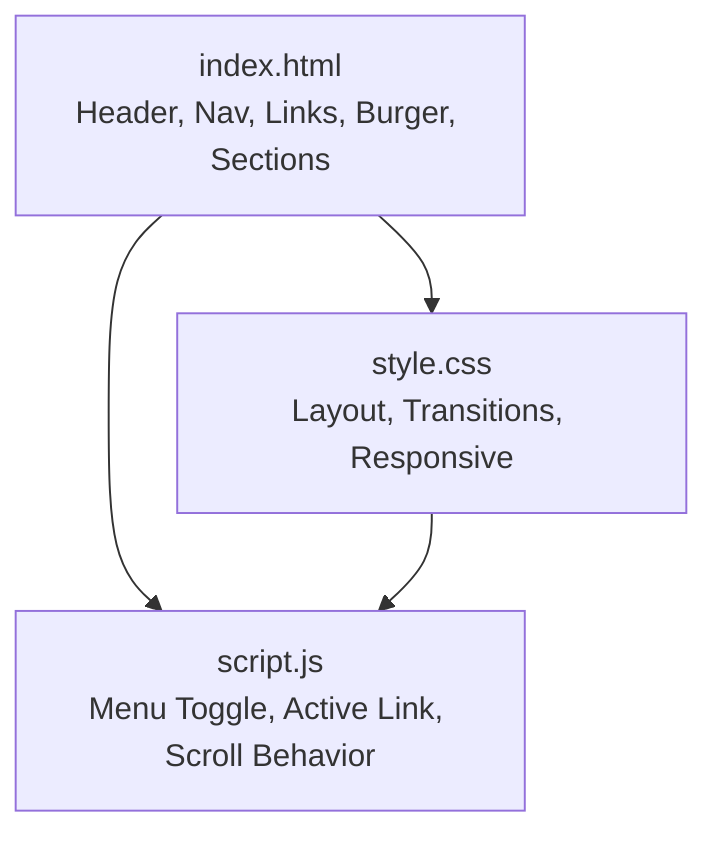
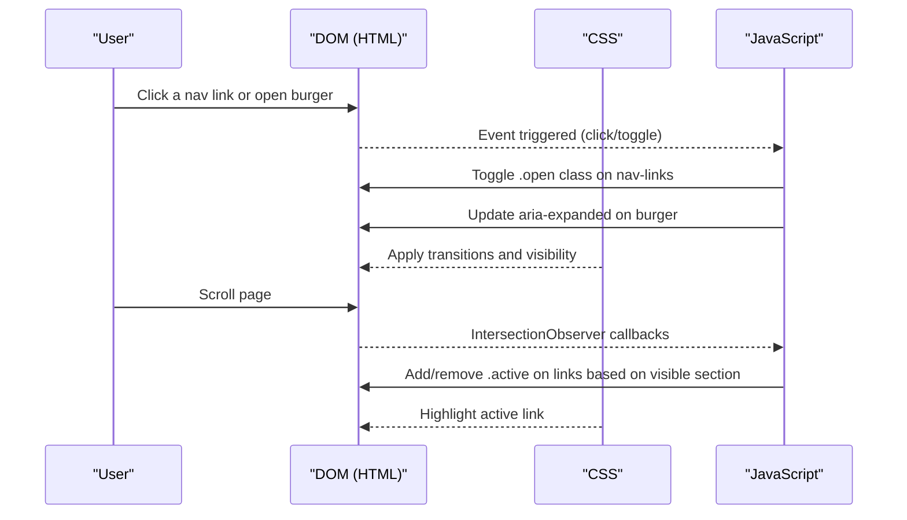
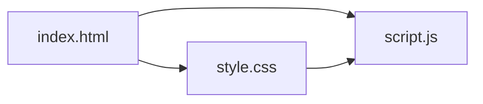
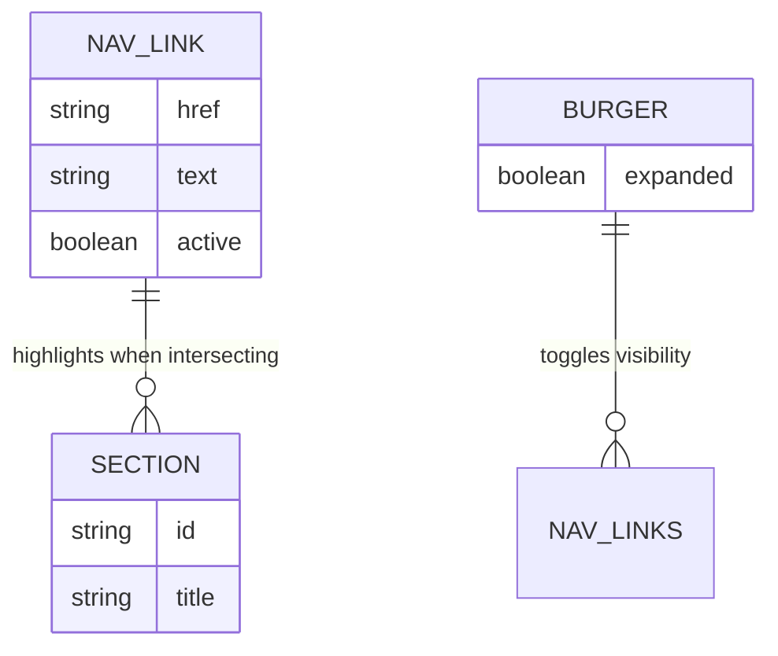

# Navigation System

<cite>
**Referenced Files in This Document**
- [index.html](file://files/arsalan-portfolio-vanilla/site/index.html)
- [style.css](file://files/arsalan-portfolio-vanilla/site/style.css)
- [script.js](file://files/arsalan-portfolio-vanilla/site/script.js)
</cite>

## Table of Contents
1. [Introduction](#introduction)
2. [Project Structure](#project-structure)
3. [Core Components](#core-components)
4. [Architecture Overview](#architecture-overview)
5. [Detailed Component Analysis](#detailed-component-analysis)
6. [Dependency Analysis](#dependency-analysis)
7. [Performance Considerations](#performance-considerations)
8. [Troubleshooting Guide](#troubleshooting-guide)
9. [Conclusion](#conclusion)
10. [Appendices](#appendices)

## Introduction
This document explains the responsive navigation system implemented across a single-page portfolio site. It covers:
- Sticky header with scroll-aware active link highlighting
- Mobile hamburger menu with animated toggle
- Smooth scrolling behavior and scroll padding
- Accessibility features (ARIA attributes, keyboard-friendly structure)
- CSS transitions for menu animations
- JavaScript event handling for scroll detection and state management
- Customization options for styling and behavior

The implementation is vanilla HTML/CSS/JS with no external dependencies.

## Project Structure
The navigation is composed of three files:
- index.html: Defines the semantic markup for the header, nav, links, burger button, and sections used for scroll-based active states.
- style.css: Provides design tokens, glassmorphism styles, sticky header layout, mobile menu positioning and transitions, and responsive breakpoints.
- script.js: Manages mobile menu toggling, active section detection via IntersectionObserver, and other UI behaviors.

**Diagram sources**
- [index.html:14-29](file://files/arsalan-portfolio-vanilla/site/index.html#L14-L29)
- [style.css:51-65](file://files/arsalan-portfolio-vanilla/site/style.css#L51-L65)
- [script.js:36-59](file://files/arsalan-portfolio-vanilla/site/script.js#L36-L59)

**Section sources**
- [index.html:14-29](file://files/arsalan-portfolio-vanilla/site/index.html#L14-L29)
- [style.css:1-12](file://files/arsalan-portfolio-vanilla/site/style.css#L1-L12)
- [script.js:1-12](file://files/arsalan-portfolio-vanilla/site/script.js#L1-L12)

## Core Components
- Sticky Header: Fixed at the top with rounded glass container; remains visible while scrolling.
- Desktop Navigation: Horizontal list of anchor links with hover and active states.
- Mobile Hamburger Menu: Hidden on desktop; appears on smaller screens with an animated toggle.
- Active Link Highlighting: Uses IntersectionObserver to highlight the link corresponding to the currently visible section.
- Smooth Scrolling: Native smooth scrolling with scroll-padding-top to avoid overlap with the fixed header.

Key responsibilities:
- HTML provides semantic structure and ARIA attributes for accessibility.
- CSS handles layout, transitions, and responsive behavior.
- JS manages interactive states and scroll-driven updates.

**Section sources**
- [index.html:14-29](file://files/arsalan-portfolio-vanilla/site/index.html#L14-L29)
- [style.css:51-65](file://files/arsalan-portfolio-vanilla/site/style.css#L51-L65)
- [script.js:36-59](file://files/arsalan-portfolio-vanilla/site/script.js#L36-L59)

## Architecture Overview
The navigation architecture follows a simple separation of concerns:
- Markup defines the header/nav structure and target sections.
- Styles define the visual appearance and transitions.
- Script wires up interactions and scroll-based state.

**Diagram sources**
- [script.js:36-59](file://files/arsalan-portfolio-vanilla/site/script.js#L36-L59)
- [style.css:51-65](file://files/arsalan-portfolio-vanilla/site/style.css#L51-L65)
- [index.html:14-29](file://files/arsalan-portfolio-vanilla/site/index.html#L14-L29)

## Detailed Component Analysis

### Sticky Header and Layout
- The header wrapper is fixed to the viewport top with horizontal margins and z-index above content.
- The nav container uses flexbox to align logo, links, and controls.
- Glass effect is applied via backdrop-filter and semi-transparent backgrounds.

Customization points:
- Adjust --bg, --glass, --border, and --shadow variables to change color scheme and depth.
- Modify .nav-wrap padding and .nav max-width to control spacing and width.

**Section sources**
- [style.css:1-12](file://files/arsalan-portfolio-vanilla/site/style.css#L1-L12)
- [style.css:51-59](file://files/arsalan-portfolio-vanilla/site/style.css#L51-L59)

### Mobile Hamburger Menu
- On screens ≤820px, the burger button becomes visible and the link list switches to a full-width dropdown.
- The dropdown is positioned absolutely below the nav, with opacity, visibility, and transform transitions for smooth open/close.
- The burger icon animates into an “X” using transforms when aria-expanded is true.

Accessibility:
- The burger has aria-label="Toggle menu" and aria-expanded reflects current state.
- Keyboard users can focus the burger and press Enter/Space to toggle.

Customization points:
- Change transition timing and easing in .nav-links and .burger span rules.
- Adjust backdrop blur and background colors for the dropdown panel.

**Section sources**
- [style.css:61-65](file://files/arsalan-portfolio-vanilla/site/style.css#L61-L65)
- [style.css:168-173](file://files/arsalan-portfolio-vanilla/site/style.css#L168-L173)
- [index.html:27](file://files/arsalan-portfolio-vanilla/site/index.html#L27)
- [script.js:36-44](file://files/arsalan-portfolio-vanilla/site/script.js#L36-L44)

### Active Link Highlighting
- All anchor links within the nav that point to internal sections are observed.
- An IntersectionObserver watches each section; when a section enters the viewport near the top, the corresponding link receives the .active class.
- The observer’s rootMargin prioritizes the top portion of the viewport so the active state updates before the section reaches the very top.

Behavioral notes:
- The active link highlights via CSS (.nav-links a.active).
- The threshold and rootMargin values can be tuned to adjust when the active state changes.

**Section sources**
- [script.js:52-59](file://files/arsalan-portfolio-vanilla/site/script.js#L52-L59)
- [style.css:55-58](file://files/arsalan-portfolio-vanilla/site/style.css#L55-L58)

### Smooth Scrolling and Scroll Padding
- The html element enables native smooth scrolling.
- scroll-padding-top ensures that clicking a nav link does not hide the target under the fixed header.

Customization points:
- Increase or decrease scroll-padding-top to match header height plus any desired offset.

**Section sources**
- [style.css:14](file://files/arsalan-portfolio-vanilla/site/style.css#L14)

### Back-to-Top Button
- There is no back-to-top button implemented in the provided codebase.
- If needed, you can add a fixed-position button and attach a click handler that scrolls to the top using window.scrollTo({ top: 0, behavior: 'smooth' }).

[No sources needed since this section describes a missing feature]

### CSS Transitions and Animations
- Menu open/close uses opacity, visibility, and transform transitions for a smooth reveal.
- Burger icon transitions rotate and reposition spans to form an X shape.
- Hover effects on links and buttons use transform and background transitions.

Customization points:
- Adjust transition durations and cubic-bezier curves for different motion feels.
- Use prefers-reduced-motion media query to disable animations for users who prefer reduced motion.

**Section sources**
- [style.css:55-65](file://files/arsalan-portfolio-vanilla/site/style.css#L55-L65)
- [style.css:152-159](file://files/arsalan-portfolio-vanilla/site/style.css#L152-L159)

### JavaScript Event Handling
- Mobile menu toggle:
  - Adds/removes .open class on the nav-links container.
  - Updates aria-expanded on the burger button.
  - Closes the menu when any nav link is clicked.
- Active link detection:
  - Observes all main sections with IDs.
  - Toggles .active on links whose href matches the visible section id.

Event flow:
- Click on burger → toggle menu state.
- Click on any nav link → close menu and navigate smoothly.
- Scroll → IntersectionObserver updates active link.

**Section sources**
- [script.js:36-59](file://files/arsalan-portfolio-vanilla/site/script.js#L36-L59)

### Accessibility Features
- Semantic elements: header, nav, ul/li, a, section.
- ARIA:
  - aria-label="Main" on the nav element.
  - aria-label="Toggle menu" on the burger button.
  - aria-expanded toggled by JS to reflect menu state.
- Keyboard navigation:
  - Links are naturally focusable and navigable via Tab.
  - Burger button is focusable and supports Enter/Space activation.
- Reduced motion:
  - prefers-reduced-motion disables animations and transitions.

**Section sources**
- [index.html:15-28](file://files/arsalan-portfolio-vanilla/site/index.html#L15-L28)
- [script.js:36-44](file://files/arsalan-portfolio-vanilla/site/script.js#L36-L44)
- [style.css:159](file://files/arsalan-portfolio-vanilla/site/style.css#L159)

### Customization Options
- Colors and tokens:
  - Modify :root variables (--bg, --text, --cyan, --violet, --blue, --glass, --border, etc.) to restyle the entire navigation and site.
- Spacing and sizing:
  - Adjust .nav-wrap padding, .nav padding, and font sizes to fit your brand.
- Transitions:
  - Change transition timings and easing in .nav-links and .burger rules.
- Responsive behavior:
  - Adjust the breakpoint at 820px to show/hide the burger and dropdown at different widths.
- Scroll behavior:
  - Tune scroll-padding-top to prevent header overlap.
  - Adjust IntersectionObserver rootMargin to change when active links update.

**Section sources**
- [style.css:1-12](file://files/arsalan-portfolio-vanilla/site/style.css#L1-L12)
- [style.css:51-65](file://files/arsalan-portfolio-vanilla/site/style.css#L51-L65)
- [style.css:168-173](file://files/arsalan-portfolio-vanilla/site/style.css#L168-L173)
- [style.css:14](file://files/arsalan-portfolio-vanilla/site/style.css#L14)
- [script.js:52-59](file://files/arsalan-portfolio-vanilla/site/script.js#L52-L59)

## Dependency Analysis
- HTML depends on CSS for layout and animation, and on JS for interactivity.
- CSS defines classes consumed by JS (e.g., .open, .active).
- JS manipulates DOM classes and attributes without directly reading computed styles.

**Diagram sources**
- [index.html:14-29](file://files/arsalan-portfolio-vanilla/site/index.html#L14-L29)
- [style.css:51-65](file://files/arsalan-portfolio-vanilla/site/style.css#L51-L65)
- [script.js:36-59](file://files/arsalan-portfolio-vanilla/site/script.js#L36-L59)

**Section sources**
- [index.html:14-29](file://files/arsalan-portfolio-vanilla/site/index.html#L14-L29)
- [style.css:51-65](file://files/arsalan-portfolio-vanilla/site/style.css#L51-L65)
- [script.js:36-59](file://files/arsalan-portfolio-vanilla/site/script.js#L36-L59)

## Performance Considerations
- IntersectionObserver is efficient for scroll-based active link detection compared to scroll event listeners.
- CSS transitions are GPU-accelerated where possible; keep transform and opacity changes minimal.
- Avoid heavy computations inside scroll handlers; none are present here.
- Respect prefers-reduced-motion to improve performance and comfort for sensitive users.

[No sources needed since this section provides general guidance]

## Troubleshooting Guide
- Menu does not open on mobile:
  - Ensure the burger button exists and has the correct id.
  - Verify that .nav-links has the .open class toggled by JS.
  - Check that the responsive breakpoint includes the burger display rule.
- Active link not updating:
  - Confirm that each section has a unique id matching the nav link hrefs.
  - Verify that the IntersectionObserver is observing all sections and that rootMargin is appropriate.
- Smooth scroll jumps:
  - Ensure html has scroll-behavior: smooth and scroll-padding-top set to account for the fixed header.
- Accessibility issues:
  - Confirm aria-expanded toggles correctly.
  - Test keyboard navigation with Tab and Enter/Space.

**Section sources**
- [script.js:36-59](file://files/arsalan-portfolio-vanilla/site/script.js#L36-L59)
- [style.css:14](file://files/arsalan-portfolio-vanilla/site/style.css#L14)
- [style.css:168-173](file://files/arsalan-portfolio-vanilla/site/style.css#L168-L173)

## Conclusion
The navigation system combines a sticky header, a responsive mobile menu, and scroll-aware active link highlighting using modern, lightweight techniques. It is accessible, customizable, and performant. You can tailor its appearance and behavior through CSS variables and breakpoints, and extend functionality by adding features like a back-to-top button or additional scroll effects.

[No sources needed since this section summarizes without analyzing specific files]

## Appendices

### Data Model: Navigation Elements

[No sources needed since this diagram shows conceptual relationships]