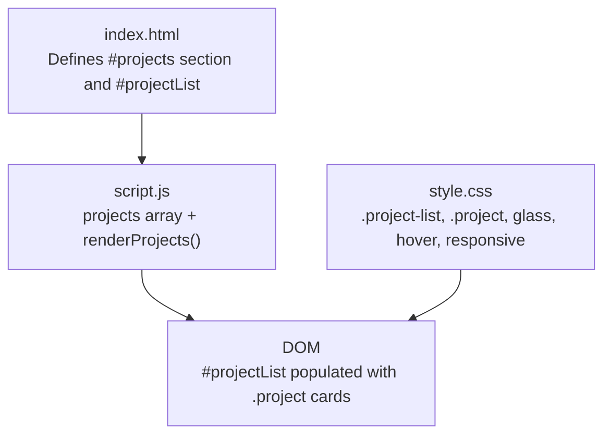
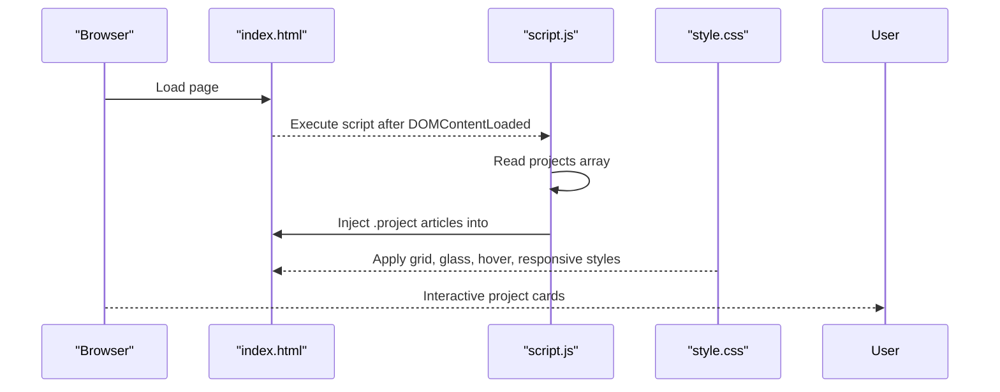
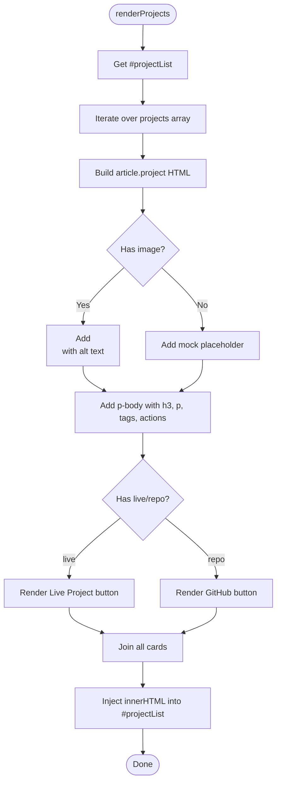
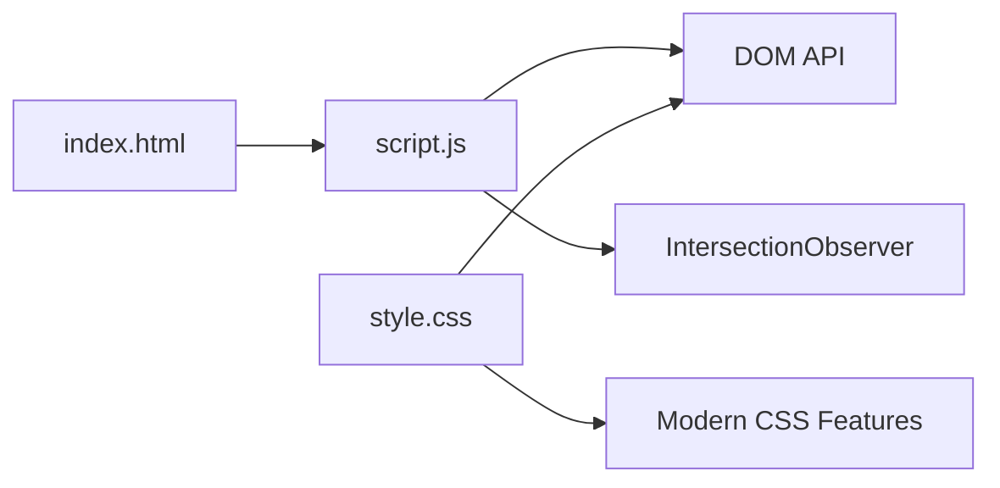

# Project Gallery

<cite>
**Referenced Files in This Document**
- [index.html](file://files/index.html)
- [script.js](file://files/script.js)
- [style.css](file://files/style.css)
</cite>

## Table of Contents
1. [Introduction](#introduction)
2. [Project Structure](#project-structure)
3. [Core Components](#core-components)
4. [Architecture Overview](#architecture-overview)
5. [Detailed Component Analysis](#detailed-component-analysis)
6. [Dependency Analysis](#dependency-analysis)
7. [Performance Considerations](#performance-considerations)
8. [Troubleshooting Guide](#troubleshooting-guide)
9. [Conclusion](#conclusion)

## Introduction
This document explains the dynamic project gallery system that renders project cards from a JavaScript data array. It covers:
- The projects data structure and how each field is used
- Card generation logic and live link integration
- Responsive grid layout, hover effects, and glass morphism styling
- How to add new projects, customize card appearance, and manage external links
- Performance considerations for large project collections
- Accessibility features for screen readers

## Project Structure
The gallery is part of a single-page portfolio with three core files:
- HTML defines the page skeleton and a container element where project cards are rendered
- JavaScript holds the projects data array and builds the DOM nodes for each card
- CSS styles the responsive grid, hover effects, glass morphism, and animations

**Diagram sources**
- [index.html:120-124](file://files/index.html#L120-L124)
- [script.js:216-248](file://files/script.js#L216-L248)
- [style.css:181-199](file://files/style.css#L181-L199)

**Section sources**
- [index.html:120-124](file://files/index.html#L120-L124)
- [script.js:216-248](file://files/script.js#L216-L248)
- [style.css:181-199](file://files/style.css#L181-L199)

## Core Components
- Projects data array: A plain JavaScript array of objects, one per project
- Render function: Builds HTML for each project and injects it into the page
- Container: An empty div with id "projectList" that receives the generated markup
- Styling: Grid layout, glass morphism, hover transitions, and responsive breakpoints

Key responsibilities:
- Data: Define name, description, live URL, repo URL, optional image, and optional tags
- Rendering: Map data to article elements with preview, body, tags, and actions
- Styling: Apply glass morphism, hover lift, image zoom, and responsive stacking

**Section sources**
- [script.js:216-248](file://files/script.js#L216-L248)
- [index.html:120-124](file://files/index.html#L120-L124)
- [style.css:181-199](file://files/style.css#L181-L199)

## Architecture Overview
The gallery follows a simple data-driven rendering pattern:
1. On load, the script reads the projects array
2. It generates HTML for each project and inserts it into #projectList
3. CSS applies a two-column grid on desktop and stacks on smaller screens
4. Hover and tilt effects enhance interactivity; glass morphism provides visual depth

**Diagram sources**
- [index.html:120-124](file://files/index.html#L120-L124)
- [script.js:216-248](file://files/script.js#L216-L248)
- [style.css:181-199](file://files/style.css#L181-L199)

## Detailed Component Analysis

### Projects Data Structure
Each project object supports these fields:
- name: string — displayed as the card title
- description: string — short summary shown below the title
- live: string (optional) — URL to the live project; if present, a primary button is rendered
- repo: string (optional) — GitHub repository URL; if present, a secondary button is rendered
- image: string (optional) — path to a preview image; if missing, a mock placeholder is shown
- tags: array of strings (optional) — technology or category tags rendered as small badges

Behavioral rules:
- If live is provided, a "Live Project" button appears
- If repo is provided, a "GitHub" button appears
- If image is provided, it overlays the preview area; otherwise, a mock UI placeholder is shown
- If tags exist and are non-empty, they are rendered as pill badges

Complexity:
- Rendering time is O(n) where n is the number of projects
- Memory usage scales linearly with the size of the projects array

**Section sources**
- [script.js:216-248](file://files/script.js#L216-L248)

### Card Generation Logic
The render function:
- Selects the #projectList container
- Maps each project object to an article element with class "project"
- Includes a preview area with either an image or a mock placeholder
- Adds a body section with title, description, optional tags, and action buttons
- Uses target="_blank" and rel="noopener" for external links

**Diagram sources**
- [script.js:229-248](file://files/script.js#L229-L248)

**Section sources**
- [script.js:229-248](file://files/script.js#L229-L248)

### Live Link Integration
- External links use target="_blank" and rel="noopener" for security and performance
- The "Live Project" button is only rendered when the live field is truthy
- The "GitHub" button is only rendered when the repo field is truthy
- Both buttons inherit shared button styles and include subtle hover animations

Accessibility:
- External links open in a new tab; users are informed via the arrow icon and button label
- Images have descriptive alt text based on the project name

**Section sources**
- [script.js:229-248](file://files/script.js#L229-L248)

### Responsive Grid Layout
- Desktop: Two-column layout with a larger preview column and a narrower content column
- Tablet/mobile: Single-column stacking for better readability
- Gaps and padding adapt using clamp() and CSS variables

Breakpoints:
- At 960px, the project grid switches to a single column
- Navigation and other sections also adjust at 820px and 560px

**Section sources**
- [style.css:181-199](file://files/style.css#L181-L199)
- [style.css:242-267](file://files/style.css#L242-L267)

### Hover Effects and Glass Morphism
- Cards use a glass morphism style with semi-transparent background, backdrop blur, border, and shadow
- On hover, cards lift slightly, scale subtly, and show a glow overlay
- Images zoom and saturate on hover; mock placeholders scale slightly
- A diagonal light reflection sweeps across cards on hover

Glass morphism implementation:
- Background uses a low-opacity white color
- Backdrop-filter applies blur
- Border and box-shadow provide depth
- Pseudo-elements create a sweeping highlight effect

**Section sources**
- [style.css:43-49](file://files/style.css#L43-L49)
- [style.css:181-199](file://files/style.css#L181-L199)

### Tilt and Pointer Interactions
- Featured project cards support a subtle 3D tilt effect driven by pointer movement
- Tilt angles are computed relative to the card’s center and applied via CSS custom properties
- Tilt is disabled on coarse pointers or when reduced motion is preferred

**Section sources**
- [script.js:184-197](file://files/script.js#L184-L197)
- [style.css:181-184](file://files/style.css#L181-L184)

### Adding New Projects
To add a new project:
1. Open the script file containing the projects array
2. Append a new object with the required fields
3. Provide a valid image path if you want a preview image
4. Set live and/or repo URLs to enable buttons
5. Optionally add tags to display technology badges

Example steps:
- Add a new entry to the projects array
- Ensure image paths are correct relative to the site root
- Verify external links open correctly and securely

**Section sources**
- [script.js:216-227](file://files/script.js#L216-L227)
- [script.js:229-248](file://files/script.js#L229-L248)

### Customizing Card Appearance
You can customize the gallery by editing CSS:
- Colors and spacing: Adjust design tokens in the :root block
- Glass morphism: Modify --glass, --border, and --shadow variables
- Hover behavior: Change transform, box-shadow, and opacity values for .project:hover
- Typography: Update font sizes and weights for headings and tags
- Grid gaps: Adjust gap values in .project-list and .p-actions

Recommended approach:
- Use CSS variables for consistent theming
- Keep hover transforms minimal to avoid jank
- Test responsiveness across breakpoints

**Section sources**
- [style.css:1-12](file://files/style.css#L1-L12)
- [style.css:43-49](file://files/style.css#L43-L49)
- [style.css:181-199](file://files/style.css#L181-L199)

### Managing External Project Links
- Always set rel="noopener" for external links to prevent tabnabbing
- Use target="_blank" to open links in a new tab
- Provide meaningful labels like "Live Project" and "GitHub"
- Validate URLs before publishing to avoid broken links

**Section sources**
- [script.js:229-248](file://files/script.js#L229-L248)

## Dependency Analysis
The gallery has minimal dependencies:
- HTML provides the container element
- JavaScript depends on the DOM API and IntersectionObserver for reveal animations
- CSS relies on modern features like backdrop-filter, clamp(), and CSS variables

**Diagram sources**
- [index.html:120-124](file://files/index.html#L120-L124)
- [script.js:216-248](file://files/script.js#L216-L248)
- [style.css:181-199](file://files/style.css#L181-L199)

**Section sources**
- [index.html:120-124](file://files/index.html#L120-L124)
- [script.js:216-248](file://files/script.js#L216-L248)
- [style.css:181-199](file://files/style.css#L181-L199)

## Performance Considerations
For large project collections:
- Virtualize or paginate the list to reduce initial DOM size
- Lazy-load images using loading="lazy" and consider responsive srcset
- Debounce or throttle pointer events if adding more interactive effects
- Avoid heavy animations on scroll; prefer CSS transitions and will-change sparingly
- Use requestAnimationFrame for smooth updates (already used for ambient glow and magnetic buttons)

Current optimizations:
- Scroll handlers are throttled via requestAnimationFrame
- Reduced motion preferences disable animations
- Image error handling removes broken images gracefully

**Section sources**
- [script.js:51-76](file://files/script.js#L51-L76)
- [script.js:141-197](file://files/script.js#L141-L197)
- [style.css:234-240](file://files/style.css#L234-L240)

## Troubleshooting Guide
Common issues and resolutions:
- No cards appear:
  - Ensure the projects array is defined and not empty
  - Verify the #projectList element exists in the HTML
- Images not showing:
  - Check image paths and ensure files exist
  - Broken images are removed automatically; verify onerror behavior
- External links not opening:
  - Confirm href values are valid and accessible
  - Ensure target="_blank" and rel="noopener" are present
- Styles not applied:
  - Verify CSS file is linked and loaded
  - Check browser support for backdrop-filter and modern CSS features
- Animations feel sluggish:
  - Respect prefers-reduced-motion
  - Reduce animation complexity and avoid heavy filters

Accessibility checks:
- All interactive elements should be keyboard accessible
- Images must have descriptive alt text
- Focus indicators should remain visible
- Screen readers should announce button labels clearly

**Section sources**
- [script.js:200-205](file://files/script.js#L200-L205)
- [script.js:229-248](file://files/script.js#L229-L248)
- [style.css:234-240](file://files/style.css#L234-L240)

## Conclusion
The project gallery is a clean, data-driven component that renders cards from a JavaScript array. It combines a responsive grid, glass morphism, and subtle interactions to deliver a polished user experience. By following the guidelines above, you can extend the gallery with new projects, customize its appearance, and maintain strong performance and accessibility standards.