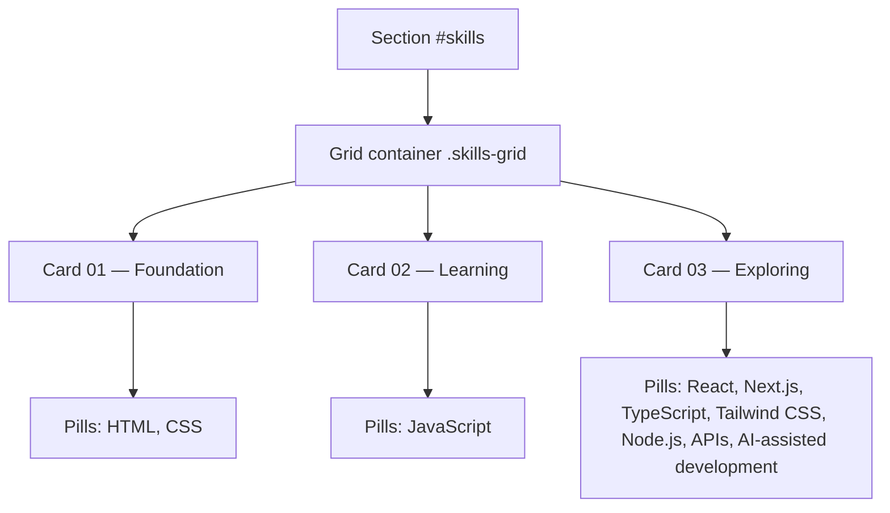
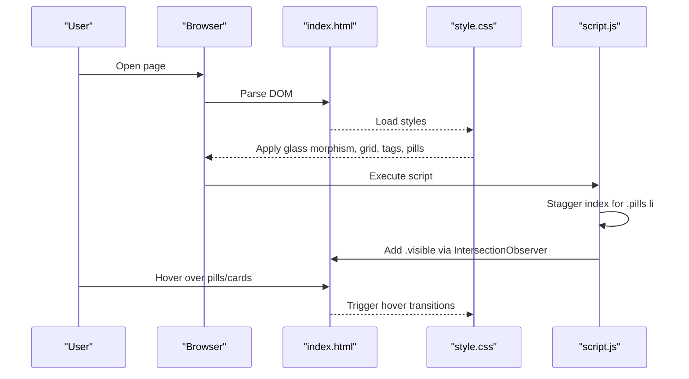
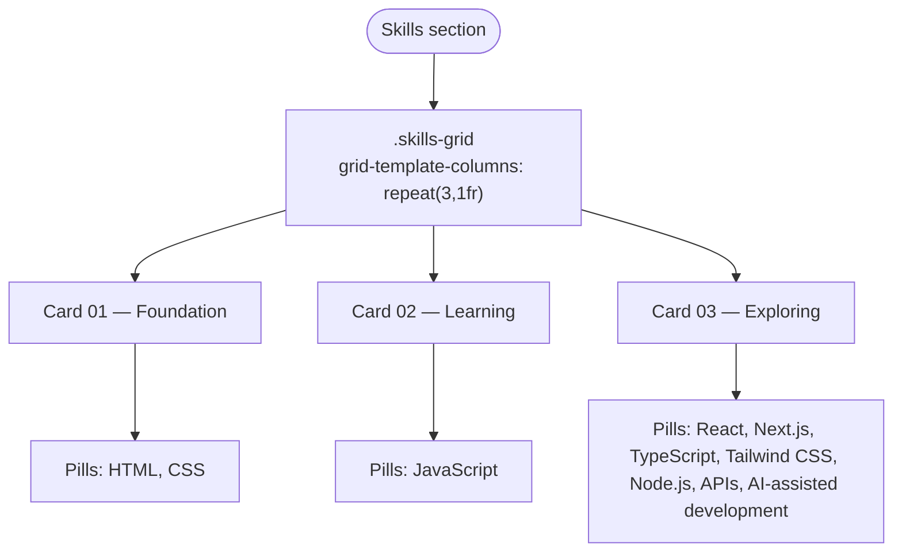
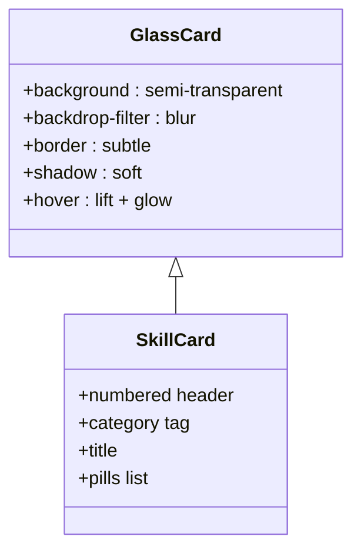
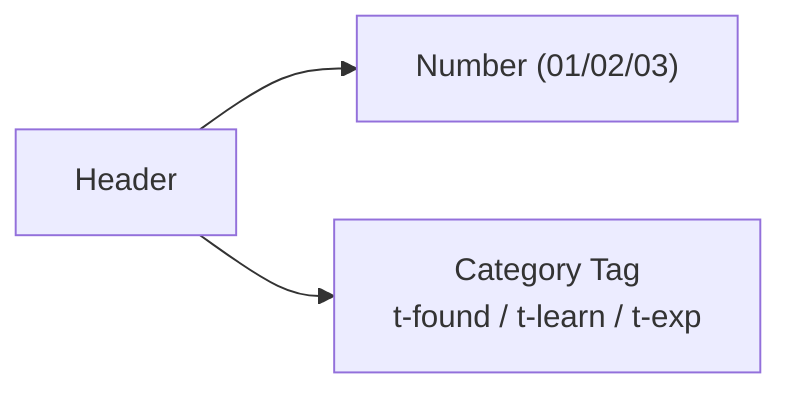
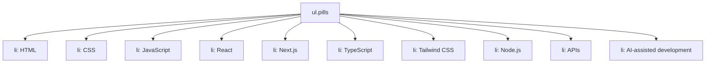
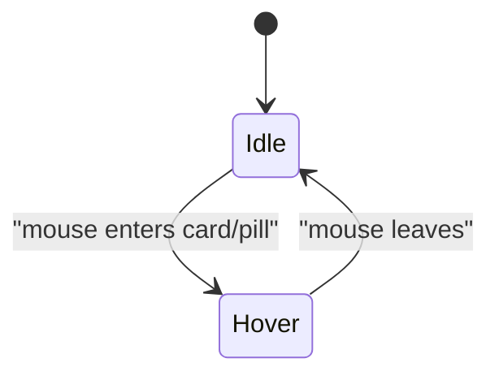
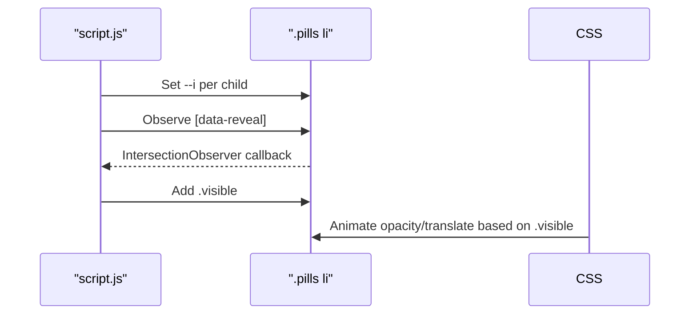
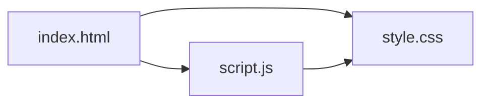

# Skills Display

<cite>
**Referenced Files in This Document**
- [index.html](file://files/index.html)
- [style.css](file://files/style.css)
- [script.js](file://files/script.js)
</cite>

## Table of Contents
1. [Introduction](#introduction)
2. [Project Structure](#project-structure)
3. [Core Components](#core-components)
4. [Architecture Overview](#architecture-overview)
5. [Detailed Component Analysis](#detailed-component-analysis)
6. [Dependency Analysis](#dependency-analysis)
7. [Performance Considerations](#performance-considerations)
8. [Troubleshooting Guide](#troubleshooting-guide)
9. [Conclusion](#conclusion)
10. [Appendices](#appendices)

## Introduction
This document explains the skills categorization system that organizes technical abilities into three distinct categories:
- Foundation (HTML/CSS)
- Learning (JavaScript)
- Exploring (React, Next.js, TypeScript, Tailwind CSS, Node.js, APIs, AI-assisted development)

It covers the visual hierarchy using numbered cards, color-coded tags for skill levels, and pill-style technology indicators. It also details the CSS Grid layout implementation, glass morphism card styling, hover effects, and provides instructions for adding new skills, modifying categories, and customizing the visual presentation.

## Project Structure
The skills section is implemented as a dedicated HTML section with a grid of three skill cards. Each card contains:
- A header with a number and a category tag
- A title
- A list of technology pills

**Diagram sources**
- [index.html:73-95](file://files/index.html#L73-L95)

**Section sources**
- [index.html:73-95](file://files/index.html#L73-L95)

## Core Components
- Numbered cards: Each skill card has a numeric label to establish a clear progression from foundational to exploratory skills.
- Color-coded tags: Category tags use distinct colors to indicate skill maturity:
  - Foundation: cyan-tinted tag
  - Learning: violet-tinted tag
  - Exploring: muted tag with dashed borders
- Pill-style technology indicators: Each technology appears as a small pill with an optional icon prefix and hover interaction.

Visual states:
- Current learning card is highlighted with a subtle border glow.
- Exploring card uses a softer background and dashed borders to signal “future” or “in-progress.”
- Pills animate on reveal and have hover lift and glow effects.

**Section sources**
- [index.html:77-93](file://files/index.html#L77-L93)
- [style.css:137-155](file://files/style.css#L137-L155)

## Architecture Overview
The skills display is a static, content-driven component styled entirely with CSS. The script enhances it by staggering pill animations and enabling scroll-based reveals.

**Diagram sources**
- [index.html:73-95](file://files/index.html#L73-L95)
- [style.css:137-155](file://files/style.css#L137-L155)
- [script.js:46-49](file://files/script.js#L46-L49)
- [script.js:92-96](file://files/script.js#L92-L96)

## Detailed Component Analysis

### Skills Section Layout (CSS Grid)
- Container: .skills-grid uses a responsive grid with three equal columns on desktop.
- Responsive behavior: On smaller screens, the grid collapses to a single column.
- Spacing: Consistent gap between cards; margins align with the rest of the page.

**Diagram sources**
- [style.css:137-138](file://files/style.css#L137-L138)
- [style.css:242-247](file://files/style.css#L242-L247)
- [index.html:76-94](file://files/index.html#L76-L94)

**Section sources**
- [style.css:137-138](file://files/style.css#L137-L138)
- [style.css:242-247](file://files/style.css#L242-L247)
- [index.html:76-94](file://files/index.html#L76-L94)

### Glass Morphism Cards
- Base glass effect: Semi-transparent background with backdrop blur and subtle border.
- Reflection highlight: A pseudo-element creates a diagonal light sweep on hover.
- Hover elevation: Cards lift slightly and gain a colored border and enhanced shadow.

**Diagram sources**
- [style.css:43-49](file://files/style.css#L43-L49)
- [style.css:137-155](file://files/style.css#L137-L155)
- [index.html:77-93](file://files/index.html#L77-L93)

**Section sources**
- [style.css:43-49](file://files/style.css#L43-L49)
- [style.css:137-155](file://files/style.css#L137-L155)
- [index.html:77-93](file://files/index.html#L77-L93)

### Numbered Cards and Category Tags
- Numbers: Monospaced, low-opacity labels to emphasize sequence.
- Tags: Pill-shaped badges with color and border matching the category:
  - t-found: cyan theme
  - t-learn: violet theme
  - t-exp: muted theme

**Diagram sources**
- [index.html:78-89](file://files/index.html#L78-L89)
- [style.css:139-144](file://files/style.css#L139-L144)

**Section sources**
- [index.html:78-89](file://files/index.html#L78-L89)
- [style.css:139-144](file://files/style.css#L139-L144)

### Pill-Style Technology Indicators
- Structure: Unordered list with list items representing technologies.
- Styling: Rounded rectangles with subtle borders and backgrounds.
- Icon prefix: Optional monospace icon inside bold text for visual distinction.
- Hover: Lifts up, brightens background, and shifts the icon slightly.

**Diagram sources**
- [index.html:80-92](file://files/index.html#L80-L92)
- [style.css:145-151](file://files/style.css#L145-L151)

**Section sources**
- [index.html:80-92](file://files/index.html#L80-L92)
- [style.css:145-151](file://files/style.css#L145-L151)

### Hover Effects and Interactions
- Card hover: Slight upward translation, scale increase, colored border, and enhanced shadow.
- Pill hover: Upward translation, brighter background, and icon shift.
- Glass reflection: Diagonal light sweep animates across the card on hover.

**Diagram sources**
- [style.css:47-49](file://files/style.css#L47-L49)
- [style.css:147-151](file://files/style.css#L147-L151)

**Section sources**
- [style.css:47-49](file://files/style.css#L47-L49)
- [style.css:147-151](file://files/style.css#L147-L151)

### Animation and Reveal Behavior
- Staggered pills: Script assigns a stagger index to each pill to create a cascading entrance.
- Scroll reveal: Elements with data-reveal fade and slide in when entering the viewport.
- Reduced motion: Animations are disabled for users who prefer reduced motion.

**Diagram sources**
- [script.js:46-49](file://files/script.js#L46-L49)
- [script.js:92-96](file://files/script.js#L92-L96)
- [style.css:223-225](file://files/style.css#L223-L225)
- [style.css:148-149](file://files/style.css#L148-L149)

**Section sources**
- [script.js:46-49](file://files/script.js#L46-L49)
- [script.js:92-96](file://files/script.js#L92-L96)
- [style.css:223-225](file://files/style.css#L223-L225)
- [style.css:148-149](file://files/style.css#L148-L149)

## Dependency Analysis
- HTML defines structure and semantic grouping for skills and technologies.
- CSS provides all visual styling, including grid, glass morphism, tags, pills, and hover effects.
- JS adds interactivity: stagger indices, scroll-based reveals, and accessibility toggles.

**Diagram sources**
- [index.html:73-95](file://files/index.html#L73-L95)
- [style.css:137-155](file://files/style.css#L137-L155)
- [script.js:46-49](file://files/script.js#L46-L49)

**Section sources**
- [index.html:73-95](file://files/index.html#L73-L95)
- [style.css:137-155](file://files/style.css#L137-L155)
- [script.js:46-49](file://files/script.js#L46-L49)

## Performance Considerations
- Use CSS transforms and opacity for animations to leverage GPU acceleration.
- Keep hover effects minimal to avoid layout thrashing.
- Respect prefers-reduced-motion to improve accessibility and performance on constrained devices.
- Avoid heavy backdrop-filter usage on low-end devices if necessary.

[No sources needed since this section provides general guidance]

## Troubleshooting Guide
- Skills not visible on mobile: Ensure the responsive breakpoint is applied; the grid collapses to one column at smaller widths.
- Pills not animating: Verify that the stagger index is set and that elements receive the .visible class via IntersectionObserver.
- Glass effect looks incorrect: Check backdrop-filter support and ensure the parent container does not clip overflow unexpectedly.
- Hover effects not working: Confirm that hover rules target the correct classes (.card, .pills li).

**Section sources**
- [style.css:242-247](file://files/style.css#L242-L247)
- [script.js:46-49](file://files/script.js#L46-L49)
- [script.js:92-96](file://files/script.js#L92-L96)
- [style.css:43-49](file://files/style.css#L43-L49)
- [style.css:147-151](file://files/style.css#L147-L151)

## Conclusion
The skills display presents a clean, accessible, and visually engaging breakdown of current and future technical abilities. The combination of CSS Grid, glass morphism, color-coded tags, and pill-style indicators communicates both status and progression. With straightforward customization points, you can easily add new skills, adjust categories, and refine the visual design.

[No sources needed since this section summarizes without analyzing specific files]

## Appendices

### How to Add New Skills
- Locate the relevant skill card within the skills section.
- Add a new list item under the corresponding ul.pills.
- Optionally include a short icon prefix inside a bold element for emphasis.

Example locations:
- Foundation card: [index.html:80](file://files/index.html#L80)
- Learning card: [index.html:85](file://files/index.html#L85)
- Exploring card: [index.html:90-92](file://files/index.html#L90-L92)

**Section sources**
- [index.html:80-92](file://files/index.html#L80-L92)

### How to Modify Categories
- Change the tag text and class to match the desired category:
  - t-found for Foundation
  - t-learn for Learning
  - t-exp for Exploring
- Adjust the tag’s color and border by editing the corresponding CSS classes.

Reference:
- Tag classes and colors: [style.css:141-144](file://files/style.css#L141-L144)

**Section sources**
- [style.css:141-144](file://files/style.css#L141-L144)

### How to Customize Visual Presentation
- Colors and spacing: Edit CSS variables in the root scope to change palette, shadows, and radii.
- Glass morphism: Adjust backdrop-filter blur and border transparency.
- Hover effects: Tweak transform, box-shadow, and border-color on hover states.
- Typography: Update font families and sizes for headings, tags, and pills.

Reference:
- Design tokens and glass styles: [style.css:1-12](file://files/style.css#L1-L12), [style.css:43-49](file://files/style.css#L43-L49)
- Pill hover and animation: [style.css:145-151](file://files/style.css#L145-L151)

**Section sources**
- [style.css:1-12](file://files/style.css#L1-L12)
- [style.css:43-49](file://files/style.css#L43-L49)
- [style.css:145-151](file://files/style.css#L145-L151)