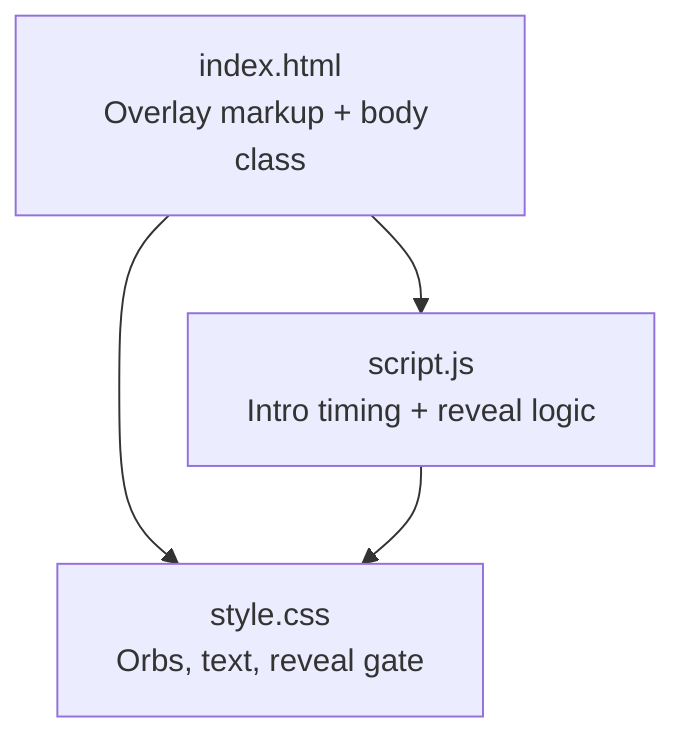
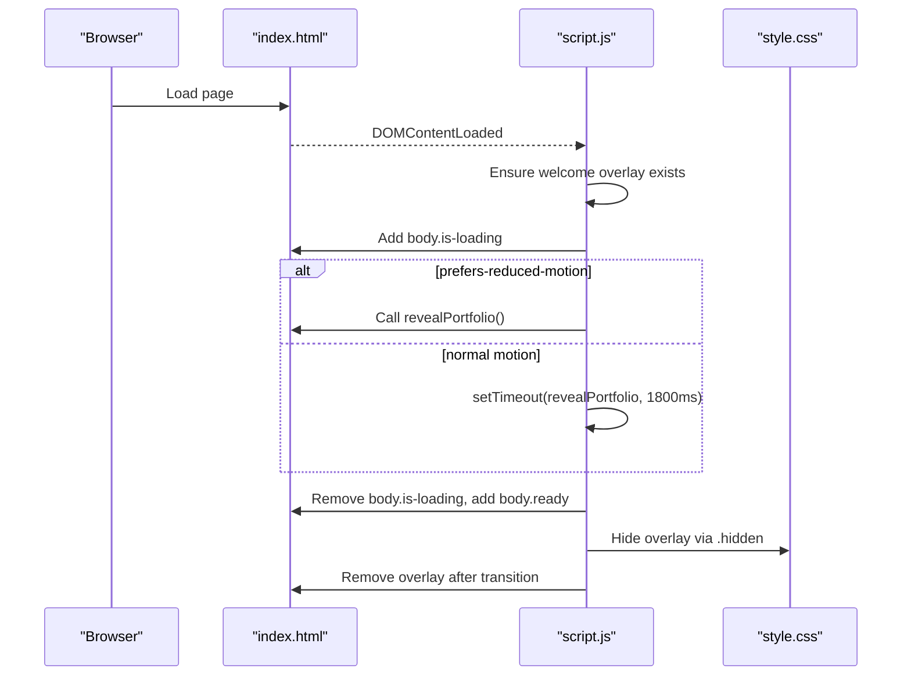
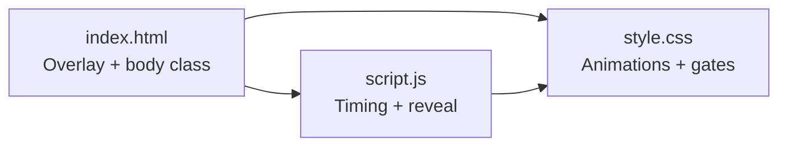

# Welcome Experience

<cite>
**Referenced Files in This Document**
- [index.html](file://files/index.html)
- [script.js](file://files/script.js)
- [style.css](file://files/style.css)
</cite>

## Table of Contents
1. [Introduction](#introduction)
2. [Project Structure](#project-structure)
3. [Core Components](#core-components)
4. [Architecture Overview](#architecture-overview)
5. [Detailed Component Analysis](#detailed-component-analysis)
6. [Dependency Analysis](#dependency-analysis)
7. [Performance Considerations](#performance-considerations)
8. [Troubleshooting Guide](#troubleshooting-guide)
9. [Conclusion](#conclusion)

## Introduction
This document explains the cinematic welcome overlay system that introduces the portfolio with animated orb backgrounds, a staggered “Welcome” text reveal, and a portfolio reveal gate. It covers how the overlay controls page loading states, manages animation timing, and transitions to the main content. It also documents configuration options for animation duration, orb colors, and text effects, and outlines accessibility considerations including ARIA labels and keyboard navigation support.

## Project Structure
The welcome experience is implemented across three files:
- HTML defines the overlay structure and initial body state.
- CSS styles the overlay, orbs, text animations, and the reveal gate.
- JavaScript orchestrates the intro timing, respects reduced motion preferences, and reveals the portfolio.

**Diagram sources**
- [index.html:10-18](file://files/index.html#L10-L18)
- [script.js:1-38](file://files/script.js#L1-L38)
- [style.css:24-41](file://files/style.css#L24-L41)

**Section sources**
- [index.html:10-18](file://files/index.html#L10-L18)
- [script.js:1-38](file://files/script.js#L1-L38)
- [style.css:24-41](file://files/style.css#L24-L41)

## Core Components
- Welcome Overlay Container: Full-screen container with ARIA live region and label.
- Animated Orbs: Three blurred radial gradients with staggered entrance.
- Welcome Text: Staggered blur-to-sharp reveal with scale and letter-spacing changes.
- Portfolio Reveal Gate: Body classes control visibility and transitions of nav, main, and footer.
- Timing Controller: JavaScript decides between immediate reveal (reduced motion) or timed reveal.

Key responsibilities:
- HTML provides semantic structure and accessibility attributes.
- CSS handles visual presentation and animations.
- JavaScript coordinates lifecycle events and user preference handling.

**Section sources**
- [index.html:10-18](file://files/index.html#L10-L18)
- [style.css:24-41](file://files/style.css#L24-L41)
- [script.js:1-38](file://files/script.js#L1-L38)

## Architecture Overview
The welcome experience follows a simple flow:
1. On DOM ready, ensure the overlay exists and add a loading class to the body.
2. If the user prefers reduced motion, immediately reveal the portfolio; otherwise, wait a fixed duration.
3. Remove the loading class, add a ready class, hide the overlay, and remove it from the DOM after its exit animation.

**Diagram sources**
- [script.js:1-38](file://files/script.js#L1-L38)
- [style.css:24-41](file://files/style.css#L24-L41)
- [index.html:10-18](file://files/index.html#L10-L18)

## Detailed Component Analysis

### Welcome Overlay Markup and Accessibility
- The overlay includes:
  - ARIA live region to announce changes to assistive technologies.
  - ARIA label for screen readers.
  - Decorative orbs marked aria-hidden.
  - The welcome word with an accessible label.

Accessibility highlights:
- aria-live="polite" ensures non-intrusive announcements.
- aria-label="Welcome" describes the overlay’s purpose.
- Decorative elements use aria-hidden="true".

**Section sources**
- [index.html:13-18](file://files/index.html#L13-L18)

### Animated Orb Backgrounds
- Three orbs are styled with large blur filters and radial gradients.
- Each orb has a unique size, position, color, and staggered animation delay.
- Entrance animation fades them in over ~1.4 seconds.

Configuration points:
- Colors: Defined by CSS variables and gradient stops per orb.
- Sizes: Set via width and aspect-ratio.
- Animation delays: Controlled inline on each orb class.

Performance notes:
- Heavy blurs can be GPU-intensive; consider reducing blur radius on low-end devices if needed.

**Section sources**
- [style.css:27-31](file://files/style.css#L27-L31)

### Staggered Text Reveal Effect
- The welcome word starts blurred, slightly scaled down, and with wide letter spacing.
- It animates to full opacity, sharp focus, natural scale, and tighter letter spacing.
- Exit animation reverses these properties when the overlay hides.

Configuration points:
- Duration and easing: Defined in the keyframe and transition rules.
- Initial/final states: Blur, scale, letter-spacing, and text-shadow.

**Section sources**
- [style.css:32-35](file://files/style.css#L32-L35)

### Portfolio Reveal Gate Mechanism
- While loading:
  - body.is-loading hides nav, main, and footer with opacity and subtle translate.
- After reveal:
  - body.ready enables background glow and triggers hero/content animations.
  - The overlay gets .hidden to fade out and become non-interactive.

Timing control:
- Reduced motion: Immediate reveal.
- Normal motion: 1800ms delay before reveal.

**Section sources**
- [style.css:37-41](file://files/style.css#L37-L41)
- [script.js:25-38](file://files/script.js#L25-L38)

### Animation Timing and State Management
- The script adds body.is-loading at startup to lock scrolling and hide content.
- It removes body.is-loading and adds body.ready to unlock and animate content.
- The overlay is hidden via CSS class and removed after its transition completes.

Reduced motion handling:
- Detects prefers-reduced-motion and bypasses the timed intro.

**Section sources**
- [script.js:1-38](file://files/script.js#L1-L38)

### Configuration Options

Animation durations
- Welcome text entrance/exit durations and easing are defined in CSS keyframes and transitions.
- Orb entrance duration is set in the orb animation rule.
- Portfolio reveal gate transitions are controlled by CSS transitions on nav/main/footer.

Orb colors
- Orb colors are defined via radial-gradient color stops in CSS.
- Global design tokens include cyan, violet, and blue used across orbs and glows.

Text effects
- Blur, scale, letter-spacing, and text-shadow are configured in the welcome text rules.

How to adjust
- Modify CSS variables and specific selectors for orbs and text to change colors, sizes, and timings.
- Adjust the timeout value in JavaScript to change the intro duration.

**Section sources**
- [style.css:2-12](file://files/style.css#L2-L12)
- [style.css:27-35](file://files/style.css#L27-L35)
- [style.css:37-41](file://files/style.css#L37-L41)
- [script.js:37-38](file://files/script.js#L37-L38)

### Accessibility Considerations
- ARIA labels and live regions:
  - Overlay uses aria-live="polite" and aria-label="Welcome".
  - Decorative orbs use aria-hidden="true".
- Keyboard navigation:
  - Focus styles are defined globally for visible focus indicators.
  - Navigation links and buttons remain keyboard-accessible once the overlay is hidden.
- Reduced motion:
  - When prefers-reduced-motion is enabled, the welcome overlay is not shown, and animations are disabled.

Recommendations
- Ensure any interactive elements added to the overlay are reachable via keyboard and have appropriate roles and labels.
- Keep the overlay short-lived to avoid blocking access to content.

**Section sources**
- [index.html:13-18](file://files/index.html#L13-L18)
- [style.css:19](file://files/style.css#L19)
- [style.css:234-240](file://files/style.css#L234-L240)

## Dependency Analysis
The welcome experience depends on coordinated behavior across HTML, CSS, and JS:
- HTML provides the overlay structure and initial body class.
- CSS defines the visual appearance and animations.
- JS controls timing and toggles body classes to gate content visibility.

**Diagram sources**
- [index.html:10-18](file://files/index.html#L10-L18)
- [script.js:1-38](file://files/script.js#L1-L38)
- [style.css:24-41](file://files/style.css#L24-L41)

**Section sources**
- [index.html:10-18](file://files/index.html#L10-L18)
- [script.js:1-38](file://files/script.js#L1-L38)
- [style.css:24-41](file://files/style.css#L24-L41)

## Performance Considerations
- Heavy blurs on orbs and glows can impact performance on low-end devices.
- The welcome overlay is removed from the DOM after its exit animation, preventing unnecessary rendering.
- Reduced motion mode disables animations entirely, improving performance and accessibility.

Optimization tips
- Reduce blur radii or disable heavy effects on constrained devices using feature detection or media queries.
- Keep the intro duration reasonable to avoid delaying content availability.

[No sources needed since this section provides general guidance]

## Troubleshooting Guide
Common issues and resolutions:
- Overlay does not disappear:
  - Verify body.ready is applied and overlay .hidden class is present.
  - Check that the timeout or reduced motion branch executes.
- Content remains hidden:
  - Ensure body.is-loading is removed and body.ready is added.
- Animations do not play:
  - Confirm prefers-reduced-motion is not forcing no-animation behavior.
  - Inspect CSS keyframes and transitions for syntax errors.
- Accessibility concerns:
  - Ensure aria-live and aria-label are present on the overlay.
  - Verify decorative elements use aria-hidden="true".

**Section sources**
- [script.js:25-38](file://files/script.js#L25-L38)
- [style.css:234-240](file://files/style.css#L234-L240)
- [index.html:13-18](file://files/index.html#L13-L18)

## Conclusion
The welcome overlay system delivers a polished cinematic entrance through animated orbs, a staggered text reveal, and a robust reveal gate. It respects user preferences, maintains accessibility, and cleanly transitions to the main portfolio content. Configuration is centralized in CSS for visual aspects and in JavaScript for timing, making it straightforward to tailor the experience to your needs.