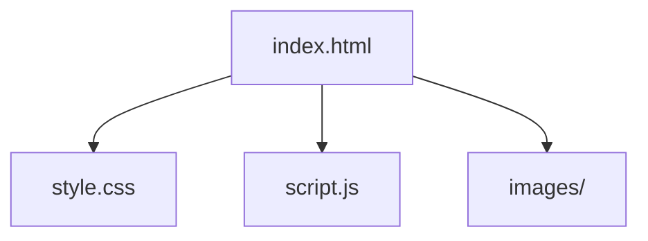
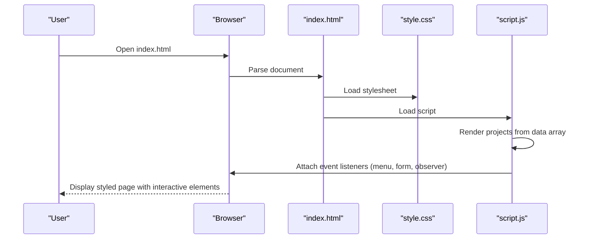
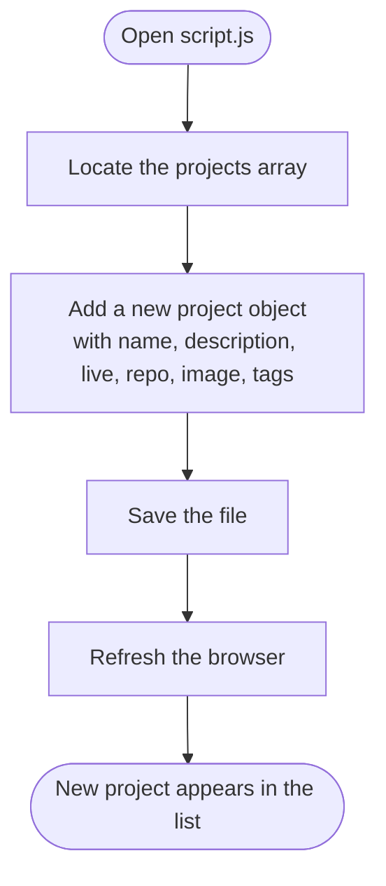

# Getting Started

<cite>
**Referenced Files in This Document**
- [index.html](file://files/arsalan-portfolio-vanilla/site/index.html)
- [style.css](file://files/arsalan-portfolio-vanilla/site/style.css)
- [script.js](file://files/arsalan-portfolio-vanilla/site/script.js)
</cite>

## Table of Contents
1. [Introduction](#introduction)
2. [Project Structure](#project-structure)
3. [Prerequisites](#prerequisites)
4. [Local Setup](#local-setup)
5. [How It Works](#how-it-works)
6. [Customization Guide](#customization-guide)
7. [Adding New Projects](#adding-new-projects)
8. [Troubleshooting](#troubleshooting)
9. [Conclusion](#conclusion)

## Introduction
This portfolio is a lightweight, single-page website built with vanilla HTML, CSS, and JavaScript. You can run it locally by opening the main HTML file in any modern web browser. No server or build tools are required. The site uses modern CSS features such as CSS custom properties (variables), backdrop-filter for glass effects, clamp() for fluid typography, grid and flexbox layouts, and IntersectionObserver for scroll animations.

## Project Structure
The portfolio consists of three core files plus an images folder:

- index.html — Main page structure and content
- style.css — Visual design, layout, and animations
- script.js — Interactivity, project rendering, and UI behavior
- images/ — Folder for profile and project preview images

**Diagram sources**
- [index.html:8-8](file://files/arsalan-portfolio-vanilla/site/index.html#L8-L8)
- [index.html:132-132](file://files/arsalan-portfolio-vanilla/site/index.html#L132-L132)
- [index.html:46-46](file://files/arsalan-portfolio-vanilla/site/index.html#L46-L46)

**Section sources**
- [index.html:1-135](file://files/arsalan-portfolio-vanilla/site/index.html#L1-L135)
- [style.css:1-182](file://files/arsalan-portfolio-vanilla/site/style.css#L1-L182)
- [script.js:1-75](file://files/arsalan-portfolio-vanilla/site/script.js#L1-L75)

## Prerequisites
- Basic knowledge of HTML and CSS
- Familiarity with modern CSS features such as:
  - CSS custom properties (variables)
  - Flexbox and Grid
  - backdrop-filter and blur effects
  - clamp() for responsive sizing
  - CSS animations and transitions
- Basic understanding of JavaScript concepts like arrays, functions, DOM manipulation, and event listeners

## Local Setup
Follow these steps to run the portfolio on your computer:

1. Download the repository files to your machine.
2. Navigate to the site folder that contains index.html, style.css, script.js, and the images folder.
3. Double-click index.html to open it in your default web browser.
4. If nothing appears or assets are missing, ensure the files are in the same folder as described above.

Notes:
- The site loads styles from style.css and scripts from script.js via relative paths.
- Images are referenced using relative paths under the images folder.

**Section sources**
- [index.html:8-8](file://files/arsalan-portfolio-vanilla/site/index.html#L8-L8)
- [index.html:132-132](file://files/arsalan-portfolio-vanilla/site/index.html#L132-L132)
- [index.html:46-46](file://files/arsalan-portfolio-vanilla/site/index.html#L46-L46)

## How It Works
- The HTML defines sections for Home, About, Skills, Journey, Projects, and Contact.
- The CSS provides the visual theme, including dark background, glass-style cards, gradients, and responsive layouts.
- The JavaScript:
  - Renders projects dynamically from a data array
  - Handles mobile menu toggle
  - Adds scroll-based reveal animations
  - Highlights the active section in navigation
  - Provides a fallback when the profile image is missing
  - Updates the footer year automatically

**Diagram sources**
- [index.html:8-8](file://files/arsalan-portfolio-vanilla/site/index.html#L8-L8)
- [index.html:132-132](file://files/arsalan-portfolio-vanilla/site/index.html#L132-L132)
- [script.js:15-34](file://files/arsalan-portfolio-vanilla/site/script.js#L15-L34)
- [script.js:36-44](file://files/arsalan-portfolio-vanilla/site/script.js#L36-L44)
- [script.js:46-50](file://files/arsalan-portfolio-vanilla/site/script.js#L46-L50)
- [script.js:52-59](file://files/arsalan-portfolio-vanilla/site/script.js#L52-L59)
- [script.js:61-66](file://files/arsalan-portfolio-vanilla/site/script.js#L61-L66)
- [script.js:68-74](file://files/arsalan-portfolio-vanilla/site/script.js#L68-L74)

## Customization Guide
You can personalize the portfolio without needing advanced tools.

### Change Colors and Theme
- Open style.css and locate the CSS variables at the top of the file.
- Modify values such as background color, text color, accent colors, border colors, and glass effect opacity.
- Save the file and refresh the browser to see changes.

Key areas to adjust:
- Design tokens (colors, spacing, radius, shadows, fonts)
- Button styles
- Glass card appearance
- Background glow colors

**Section sources**
- [style.css:1-12](file://files/arsalan-portfolio-vanilla/site/style.css#L1-L12)
- [style.css:21-24](file://files/arsalan-portfolio-vanilla/site/style.css#L21-L24)
- [style.css:42-49](file://files/arsalan-portfolio-vanilla/site/style.css#L42-L49)
- [style.css:26-30](file://files/arsalan-portfolio-vanilla/site/style.css#L26-L30)

### Edit Text Content
- Open index.html and update headings, paragraphs, links, and labels.
- Common places to edit:
  - Page title and meta description
  - Navigation links
  - Hero headline and description
  - About section text
  - Skills and Journey items
  - Contact email and GitHub link

**Section sources**
- [index.html:6-7](file://files/arsalan-portfolio-vanilla/site/index.html#L6-L7)
- [index.html:14-28](file://files/arsalan-portfolio-vanilla/site/index.html#L14-L28)
- [index.html:33-53](file://files/arsalan-portfolio-vanilla/site/index.html#L33-L53)
- [index.html:56-62](file://files/arsalan-portfolio-vanilla/site/index.html#L56-L62)
- [index.html:65-86](file://files/arsalan-portfolio-vanilla/site/index.html#L65-L86)
- [index.html:89-97](file://files/arsalan-portfolio-vanilla/site/index.html#L89-L97)
- [index.html:106-123](file://files/arsalan-portfolio-vanilla/site/index.html#L106-L123)

### Update Profile Image
- Place your portrait image inside the images folder.
- Ensure the filename matches the one referenced in the HTML.
- If the image is missing, the script shows a fallback initial letter.

**Section sources**
- [index.html:46-46](file://files/arsalan-portfolio-vanilla/site/index.html#L46-L46)
- [script.js:61-66](file://files/arsalan-portfolio-vanilla/site/script.js#L61-L66)

### Adjust Animations and Responsiveness
- In style.css, you can tweak animation timings, easing curves, and transition durations.
- Responsive breakpoints are defined near the bottom of the stylesheet; adjust them if needed.

**Section sources**
- [style.css:152-159](file://files/arsalan-portfolio-vanilla/site/style.css#L152-L159)
- [style.css:161-181](file://files/arsalan-portfolio-vanilla/site/style.css#L161-L181)

## Adding New Projects
Projects are rendered from a JavaScript array. To add a new project:

1. Open script.js.
2. Find the projects array at the top of the file.
3. Add a new object with the following fields:
   - name: Project title
   - description: Short description
   - live: URL to the live project (optional)
   - repo: GitHub repository URL (optional; button hidden if empty)
   - image: Path to a preview image (optional)
   - tags: Array of technology tags (optional)
4. Save the file and refresh the browser.

**Diagram sources**
- [script.js:1-12](file://files/arsalan-portfolio-vanilla/site/script.js#L1-L12)
- [script.js:15-34](file://files/arsalan-portfolio-vanilla/site/script.js#L15-L34)

**Section sources**
- [script.js:1-12](file://files/arsalan-portfolio-vanilla/site/script.js#L1-L12)
- [script.js:15-34](file://files/arsalan-portfolio-vanilla/site/script.js#L15-L34)

## Troubleshooting
Common issues and how to resolve them:

- Blank page or missing styles
  - Ensure index.html, style.css, and script.js are in the same folder.
  - Verify the stylesheet link path in the HTML header.

- Missing images
  - Confirm that images are placed in the images folder.
  - Check that filenames match those referenced in the HTML and JavaScript.
  - If the profile image is missing, a fallback initial will appear automatically.

- Mobile menu not working
  - Make sure script.js is loaded after the DOM elements exist.
  - Verify there are no console errors preventing event listeners from attaching.

- Scroll animations not appearing
  - Ensure the script runs and observes elements with the correct attributes.
  - Check for console errors that might stop the observer setup.

- Form submission does nothing
  - The contact form is UI-only and intentionally does not send messages.
  - Use the provided email link to contact directly.

- Year in footer not updating
  - The script sets the current year automatically; verify that script.js is loaded.

**Section sources**
- [index.html:8-8](file://files/arsalan-portfolio-vanilla/site/index.html#L8-L8)
- [index.html:46-46](file://files/arsalan-portfolio-vanilla/site/index.html#L46-L46)
- [index.html:115-121](file://files/arsalan-portfolio-vanilla/site/index.html#L115-L121)
- [script.js:36-44](file://files/arsalan-portfolio-vanilla/site/script.js#L36-L44)
- [script.js:46-50](file://files/arsalan-portfolio-vanilla/site/script.js#L46-L50)
- [script.js:61-66](file://files/arsalan-portfolio-vanilla/site/script.js#L61-L66)
- [script.js:68-74](file://files/arsalan-portfolio-vanilla/site/script.js#L68-L74)

## Conclusion
You now have everything you need to run, customize, and extend this portfolio locally. Start by opening index.html in your browser, then tweak the CSS variables to match your brand, edit the HTML content to reflect your story, and add your projects through the JavaScript array. As you learn more about modern CSS and JavaScript, you can further enhance the design and interactivity.