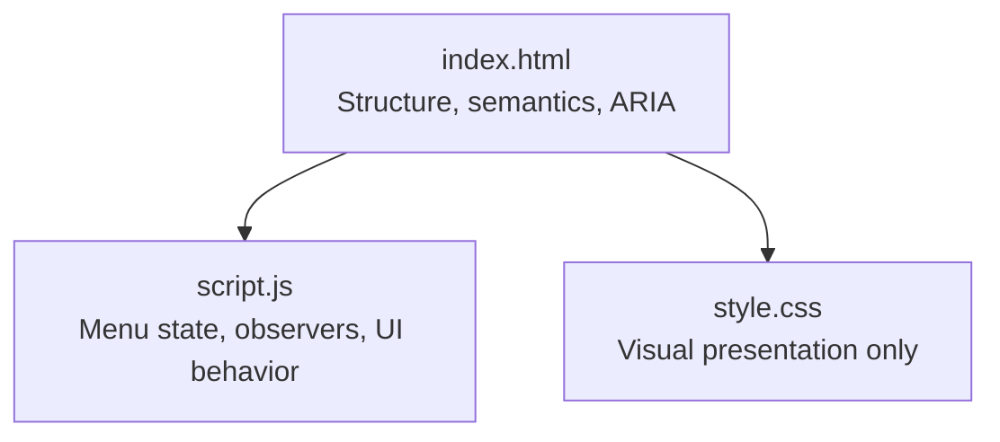
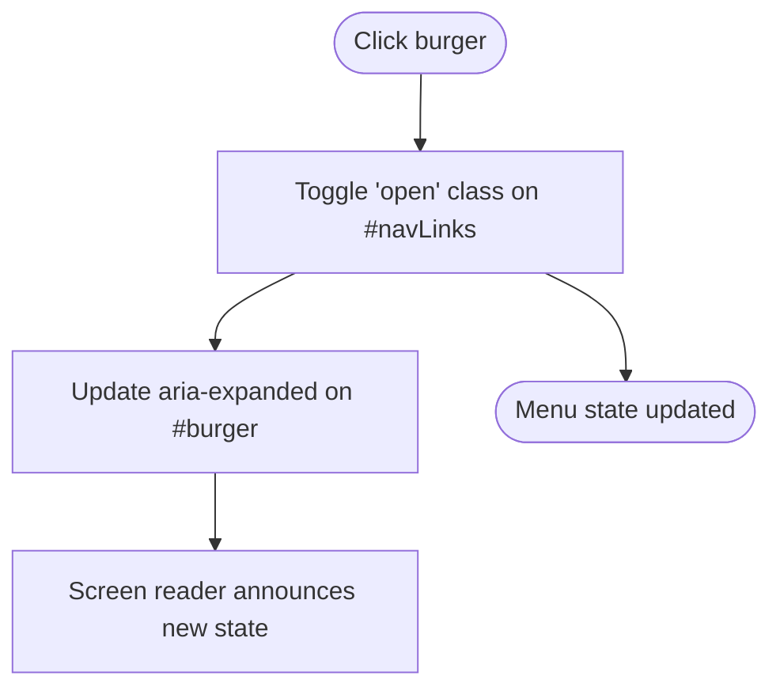
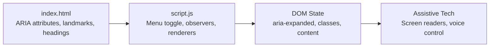

# Accessibility Markup

<cite>
**Referenced Files in This Document**
- [index.html](file://files/arsalan-portfolio-vanilla/site/index.html)
- [script.js](file://files/arsalan-portfolio-vanilla/site/script.js)
</cite>

## Table of Contents
1. [Introduction](#introduction)
2. [Project Structure](#project-structure)
3. [Core Components](#core-components)
4. [Architecture Overview](#architecture-overview)
5. [Detailed Component Analysis](#detailed-component-analysis)
6. [Dependency Analysis](#dependency-analysis)
7. [Performance Considerations](#performance-considerations)
8. [Troubleshooting Guide](#troubleshooting-guide)
9. [Conclusion](#conclusion)

## Introduction
This document explains the accessibility features implemented in the HTML structure and their integration with interactive behavior. It focuses on:
- ARIA attributes such as aria-label, aria-expanded, and aria-hidden
- Semantic HTML5 usage including proper heading hierarchy, landmark regions (header, main, footer), and meaningful link text
- Screen reader support for forms, buttons, and navigation
- How accessibility integrates with interactive elements like the mobile menu toggle and dynamic content updates

The analysis is based on the portfolio’s HTML markup and JavaScript that drives interactivity.

## Project Structure
The project contains a single-page site with semantic sections and a small amount of JavaScript to manage interactivity. The key files are:
- index.html: Defines the page structure, landmarks, headings, links, form controls, and ARIA attributes
- script.js: Manages the mobile menu state, active section highlighting, scroll reveal, and UI-only form behavior



**Diagram sources**
- [index.html:1-135](file://files/arsalan-portfolio-vanilla/site/index.html#L1-L135)
- [script.js:1-75](file://files/arsalan-portfolio-vanilla/site/script.js#L1-L75)

**Section sources**
- [index.html:1-135](file://files/arsalan-portfolio-vanilla/site/index.html#L1-L135)
- [script.js:1-75](file://files/arsalan-portfolio-vanilla/site/script.js#L1-L75)

## Core Components
This section summarizes the accessibility-relevant components and how they work together.

- Landmark regions and language
  - html lang="en" sets the page language for screen readers
  - header, main, and footer provide clear landmarks for navigation and orientation

- Navigation
  - nav element with aria-label="Main" identifies the primary navigation region
  - burger button uses aria-label="Toggle menu" and aria-expanded to communicate state to assistive technologies
  - Links use descriptive text (e.g., “Home”, “About”, “Projects”) and external links include rel="noopener" for security

- Headings and content structure
  - h1 appears once in the hero section
  - h2 titles introduce major sections
  - h3 labels skill cards and timeline items
  - Sections are grouped under main using section elements with ids for anchor navigation

- Images and decorative content
  - Profile image includes alt text describing the person
  - Decorative background glow container uses aria-hidden="true" to hide it from screen readers
  - Mock preview placeholders inside dynamically generated project cards also use aria-hidden="true"

- Forms and inputs
  - Inputs and textarea use aria-label for accessible names since there are no visible labels
  - Submit button has visible text (“Send”) which serves as its accessible name
  - A note below the form clarifies that submission is UI-only

- Dynamic content
  - Projects are rendered by JavaScript; images include alt text derived from project names
  - External links in project cards include rel="noopener"

**Section sources**
- [index.html:1-135](file://files/arsalan-portfolio-vanilla/site/index.html#L1-L135)
- [script.js:1-75](file://files/arsalan-portfolio-vanilla/site/script.js#L1-L75)

## Architecture Overview
The accessibility architecture combines semantic HTML with minimal JavaScript to keep assistive technology interactions predictable and robust.

```mermaid
sequenceDiagram
participant User as "User"
participant Nav as "nav[aria-label='Main']"
participant Burger as "button#burger"
participant Menu as "ul#navLinks"
participant Link as "a[href^='#']"
User->>Burger : Click
Burger->>Nav : Toggle menu class
Burger->>Burger : Update aria-expanded
Note over Burger : Screen readers announce expanded/collapsed state
User->>Link : Click a navigation link
Link->>Menu : Close menu
Link->>Link : Focus target section
```

**Diagram sources**
- [index.html:14-28](file://files/arsalan-portfolio-vanilla/site/index.html#L14-L28)
- [script.js:36-44](file://files/arsalan-portfolio-vanilla/site/script.js#L36-L44)

## Detailed Component Analysis

### Navigation and Mobile Menu Toggle
- Semantic structure
  - header wraps the navigation
  - nav carries aria-label="Main" to identify the landmark
  - ul#navLinks holds the navigation links
  - button#burger toggles the mobile menu and exposes aria-expanded

- ARIA and keyboard behavior
  - aria-expanded reflects whether the menu is open or closed
  - aria-label="Toggle menu" provides a clear action description
  - Closing the menu when a link is clicked improves focus management and reduces cognitive load

- Integration with JavaScript
  - setMenu toggles the .open class and updates aria-expanded
  - Click handlers close the menu after selecting a link



**Diagram sources**
- [index.html:14-28](file://files/arsalan-portfolio-vanilla/site/index.html#L14-L28)
- [script.js:36-44](file://files/arsalan-portfolio-vanilla/site/script.js#L36-L44)

**Section sources**
- [index.html:14-28](file://files/arsalan-portfolio-vanilla/site/index.html#L14-L28)
- [script.js:36-44](file://files/arsalan-portfolio-vanilla/site/script.js#L36-L44)

### Heading Hierarchy and Sectioning
- Single h1 in the hero establishes the page topic
- h2 headings mark each major section (About, Skills, Journey, Projects, Contact)
- h3 headings label smaller units within sections (skill cards, timeline entries)
- Each section uses a section element with an id for anchor-based navigation

Benefits:
- Clear outline for screen readers
- Predictable reading order
- Improved keyboard navigation via anchors

**Section sources**
- [index.html:31-123](file://files/arsalan-portfolio-vanilla/site/index.html#L31-L123)

### Landmark Regions
- header: Contains logo, navigation, and GitHub link
- main: Encloses all primary content sections
- footer: Contains branding, links, and copyright

These landmarks help users quickly jump to relevant parts of the page.

**Section sources**
- [index.html:14-29](file://files/arsalan-portfolio-vanilla/site/index.html#L14-L29)
- [index.html:31-123](file://files/arsalan-portfolio-vanilla/site/index.html#L31-L123)
- [index.html:126-130](file://files/arsalan-portfolio-vanilla/site/index.html#L126-L130)

### ARIA Labels and Hidden Content
- aria-label="Main" on nav identifies the primary navigation
- aria-label="Toggle menu" on the burger button describes its action
- aria-hidden="true" on decorative background glow hides non-essential visuals from assistive technologies
- aria-hidden="true" on mock placeholders inside project previews prevents noise for screen readers

Best practice:
- Use aria-label only when visible text cannot serve as the accessible name
- Reserve aria-hidden for purely decorative or redundant content

**Section sources**
- [index.html:11-11](file://files/arsalan-portfolio-vanilla/site/index.html#L11-L11)
- [index.html:15-15](file://files/arsalan-portfolio-vanilla/site/index.html#L15-L15)
- [index.html:27-27](file://files/arsalan-portfolio-vanilla/site/index.html#L27-L27)
- [script.js:17-32](file://files/arsalan-portfolio-vanilla/site/script.js#L17-L32)

### Live Regions and Dynamic Updates
- There is no aria-live region used for a welcome overlay in this codebase
- Dynamic content is primarily added via JavaScript rendering of project cards
- For future enhancements (e.g., status messages or overlays), consider adding an aria-live="polite" region to announce changes without interrupting the user

Recommendation:
- If you add a welcome overlay later, place it in a dedicated container with role="dialog" and aria-modal="true", and use aria-live="assertive" only for urgent notifications

**Section sources**
- [script.js:14-34](file://files/arsalan-portfolio-vanilla/site/script.js#L14-L34)

### Form Labeling and Button Accessibility
- Inputs and textarea use aria-label to provide accessible names
- The submit button has visible text, which acts as its accessible name
- A note below the form informs users that submission is UI-only

Accessibility notes:
- aria-label is acceptable here because there are no visible labels
- Ensure focus management remains logical when the form is submitted
- Consider adding aria-describedby to associate the note with the form for better context

**Section sources**
- [index.html:116-121](file://files/arsalan-portfolio-vanilla/site/index.html#L116-L121)
- [script.js:68-72](file://files/arsalan-portfolio-vanilla/site/script.js#L68-L72)

### Meaningful Link Text and External Links
- All navigation links use descriptive text
- External links include rel="noopener" to improve security and performance
- Contact links (email and GitHub) use meaningful text and icons where appropriate

**Section sources**
- [index.html:17-26](file://files/arsalan-portfolio-vanilla/site/index.html#L17-L26)
- [index.html:111-114](file://files/arsalan-portfolio-vanilla/site/index.html#L111-L114)
- [script.js:27-30](file://files/arsalan-portfolio-vanilla/site/script.js#L27-L30)

### Image Alt Text and Fallbacks
- Profile image includes alt text describing the portrait
- Dynamically generated project images include alt text derived from project names
- A fallback letter is shown if the image fails to load

**Section sources**
- [index.html:45-47](file://files/arsalan-portfolio-vanilla/site/index.html#L45-L47)
- [script.js:17-32](file://files/arsalan-portfolio-vanilla/site/script.js#L17-L32)

### Scroll Progress Indicator
- The current codebase does not implement a scroll progress indicator
- If you add one, ensure it is decorative (aria-hidden="true") or, if informative, expose its state with aria-valuenow and role="progressbar"

[No sources needed since this section provides general guidance]

## Dependency Analysis
The accessibility behavior depends on the interaction between HTML semantics and JavaScript-driven state updates.



**Diagram sources**
- [index.html:14-28](file://files/arsalan-portfolio-vanilla/site/index.html#L14-L28)
- [script.js:36-44](file://files/arsalan-portfolio-vanilla/site/script.js#L36-L44)

**Section sources**
- [index.html:14-28](file://files/arsalan-portfolio-vanilla/site/index.html#L14-L28)
- [script.js:36-44](file://files/arsalan-portfolio-vanilla/site/script.js#L36-L44)

## Performance Considerations
- Keep ARIA attributes minimal and accurate to reduce overhead for assistive technologies
- Avoid unnecessary live regions; use them only when necessary to announce important changes
- Prefer semantic HTML over ARIA whenever possible to reduce complexity

[No sources needed since this section provides general guidance]

## Troubleshooting Guide
Common issues and resolutions:
- Missing or incorrect aria-expanded
  - Symptom: Screen readers do not announce menu state
  - Resolution: Ensure aria-expanded is updated whenever the menu opens or closes
  - Reference: [script.js:39-43](file://files/arsalan-portfolio-vanilla/site/script.js#L39-L43)

- Invisible or missing accessible names
  - Symptom: Inputs announced as “edit” without context
  - Resolution: Provide aria-label or associate visible labels
  - Reference: [index.html:117-118](file://files/arsalan-portfolio-vanilla/site/index.html#L117-L118)

- Decorative content exposed to screen readers
  - Symptom: Extra announcements for visual-only elements
  - Resolution: Add aria-hidden="true" to decorative containers
  - Reference: [index.html:11](file://files/arsalan-portfolio-vanilla/site/index.html#L11-L11), [script.js:20](file://files/arsalan-portfolio-vanilla/site/script.js#L20-L20)

- External links lacking security attributes
  - Symptom: Potential security risks or performance penalties
  - Resolution: Include rel="noopener" on external links
  - Reference: [index.html:24-26](file://files/arsalan-portfolio-vanilla/site/index.html#L24-L26), [script.js:28-29](file://files/arsalan-portfolio-vanilla/site/script.js#L28-L29)

**Section sources**
- [script.js:39-43](file://files/arsalan-portfolio-vanilla/site/script.js#L39-L43)
- [index.html:117-118](file://files/arsalan-portfolio-vanilla/site/index.html#L117-L118)
- [index.html:11](file://files/arsalan-portfolio-vanilla/site/index.html#L11-L11)
- [script.js:20](file://files/arsalan-portfolio-vanilla/site/script.js#L20-L20)
- [index.html:24-26](file://files/arsalan-portfolio-vanilla/site/index.html#L24-L26)
- [script.js:28-29](file://files/arsalan-portfolio-vanilla/site/script.js#L28-L29)

## Conclusion
The page implements solid accessibility foundations through semantic HTML, landmark regions, meaningful link text, and targeted ARIA attributes. The mobile menu toggle correctly communicates state via aria-expanded, and decorative elements are hidden from assistive technologies. While there is no aria-live region for a welcome overlay in the current implementation, the structure is ready for safe expansion. Future improvements can include explicit form labels, aria-describedby for contextual notes, and careful use of live regions for dynamic updates.

[No sources needed since this section summarizes without analyzing specific files]