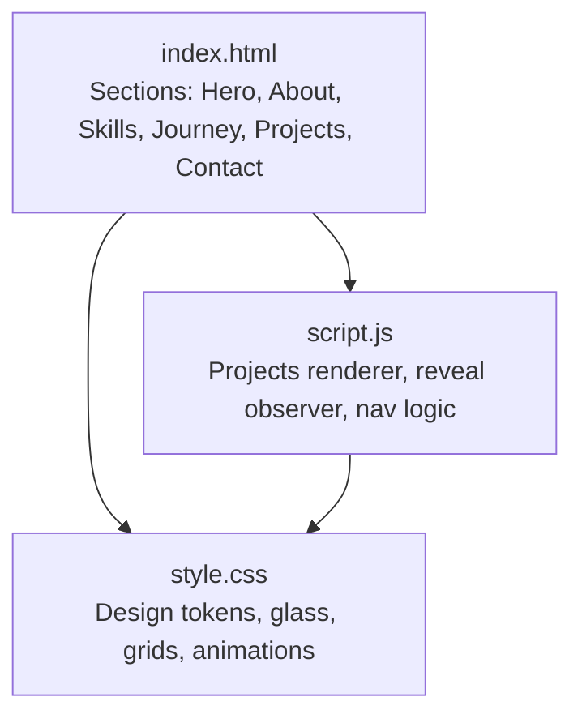
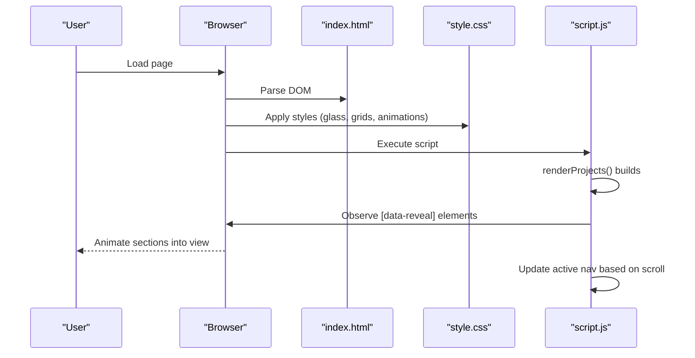
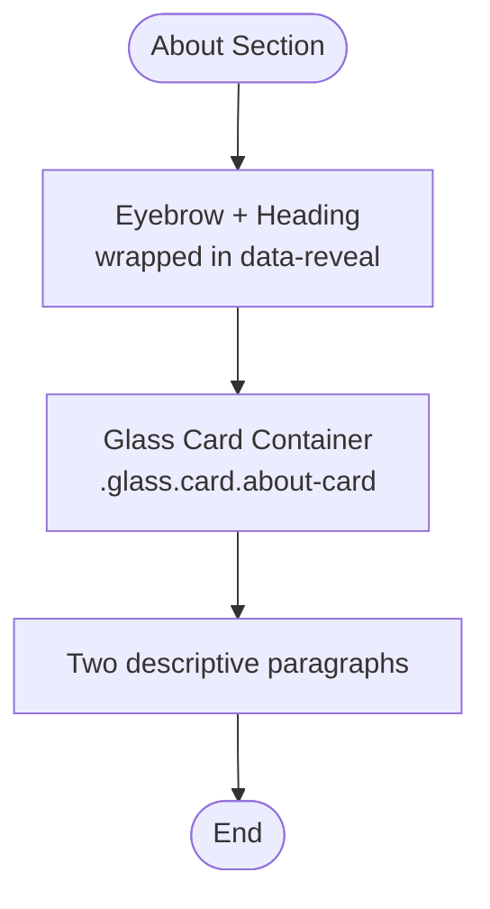
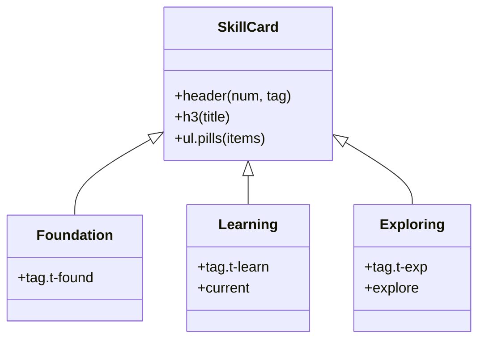
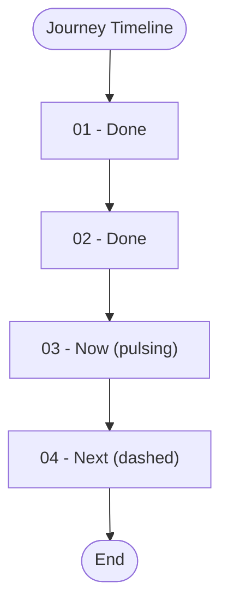
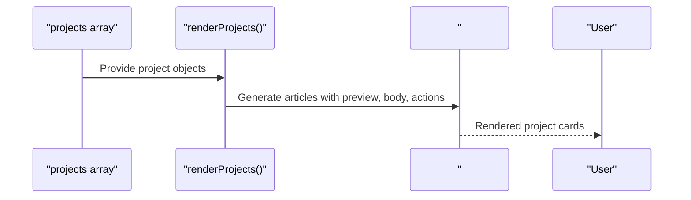
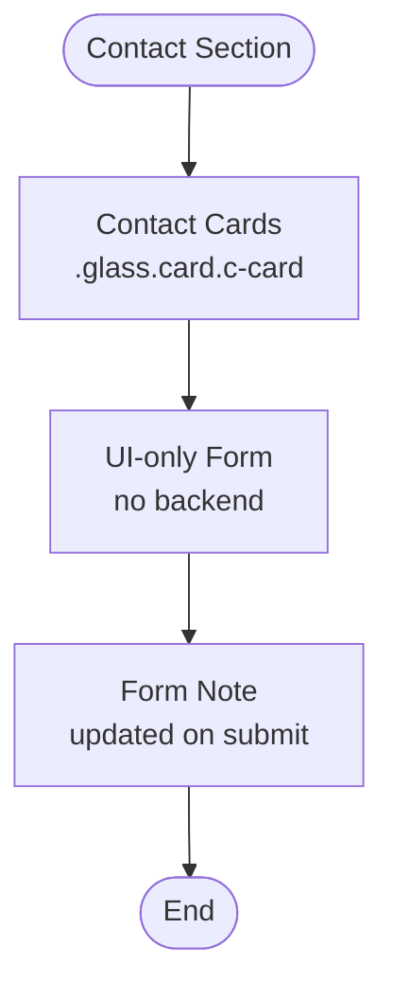
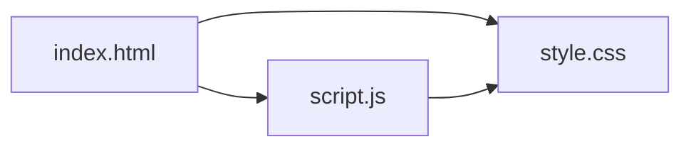

# Content Sections

<cite>
**Referenced Files in This Document**
- [index.html](file://files/arsalan-portfolio-vanilla\site\index.html)
- [style.css](file://files/arsalan-portfolio-vanilla\site\style.css)
- [script.js](file://files/arsalan-portfolio-vanilla\site\script.js)
</cite>

## Table of Contents
1. [Introduction](#introduction)
2. [Project Structure](#project-structure)
3. [Core Components](#core-components)
4. [Architecture Overview](#architecture-overview)
5. [Detailed Component Analysis](#detailed-component-analysis)
6. [Dependency Analysis](#dependency-analysis)
7. [Performance Considerations](#performance-considerations)
8. [Troubleshooting Guide](#troubleshooting-guide)
9. [Conclusion](#conclusion)

## Introduction
This document explains the main content sections of the portfolio: About, Skills, Journey, Projects, and Contact. It focuses on how each section is structured in HTML, styled with glass morphism classes, animated via reveal attributes, and rendered or enhanced by JavaScript. The goal is to make these sections easy to understand, extend, and maintain for both technical and non-technical readers.

## Project Structure
The site uses a simple three-file structure:
- index.html defines the semantic sections and reusable UI patterns (glass cards, pills, timeline).
- style.css provides design tokens, glass morphism styles, layout grids, animations, and responsive rules.
- script.js handles data-driven project rendering, scroll reveal, active navigation highlighting, mobile menu toggling, profile image fallback, and UI-only form behavior.

**Diagram sources**
- [index.html:1-135](file://files/arsalan-portfolio-vanilla\site\index.html#L1-L135)
- [style.css:1-182](file://files/arsalan-portfolio-vanilla\site\style.css#L1-L182)
- [script.js:1-75](file://files/arsalan-portfolio-vanilla\site\script.js#L1-L75)

**Section sources**
- [index.html:1-135](file://files/arsalan-portfolio-vanilla\site\index.html#L1-L135)
- [style.css:1-182](file://files/arsalan-portfolio-vanilla\site\style.css#L1-L182)
- [script.js:1-75](file://files/arsalan-portfolio-vanilla\site\script.js#L1-L75)

## Core Components
- Glass morphism system: A shared .glass class applies translucent backgrounds, backdrop blur, borders, and shadows. Cards use .card for rounded corners, padding, hover lift, and border color transitions.
- Reveal animation: Elements with data-reveal start hidden and animate into view when scrolled into the viewport. Staggered delays are supported via inline --d custom properties.
- Grid systems: Skills use a three-column grid; Journey uses a four-column timeline grid; Projects container is a responsive grid populated by JavaScript.
- Pill-style lists: Skills use pill items to display technologies with optional code-like icons.

Key usage examples across sections:
- data-reveal elements for scroll-triggered animations.
- Inline style="--d:..." for staggered reveal timing.
- .glass.card for consistent card styling.
- .pills ul/li for technology tags.

**Section sources**
- [style.css:21-24](file://files/arsalan-portfolio-vanilla\site\style.css#L21-L24)
- [style.css:152-159](file://files/arsalan-portfolio-vanilla\site\style.css#L152-L159)
- [index.html:56-62](file://files/arsalan-portfolio-vanilla\site\index.html#L56-L62)
- [index.html:67-85](file://files/arsalan-portfolio-vanilla\site\index.html#L67-L85)
- [index.html:91-96](file://files/arsalan-portfolio-vanilla\site\index.html#L91-L96)
- [index.html:100-103](file://files/arsalan-portfolio-vanilla\site\index.html#L100-L103)

## Architecture Overview
The content sections follow a consistent pattern:
- Semantic HTML sections with IDs for navigation.
- Glass morphism containers for visual depth.
- Reveal animations triggered by an IntersectionObserver.
- Data-driven rendering for Projects using a JavaScript array.

**Diagram sources**
- [index.html:1-135](file://files/arsalan-portfolio-vanilla\site\index.html#L1-L135)
- [style.css:152-159](file://files/arsalan-portfolio-vanilla\site\style.css#L152-L159)
- [script.js:15-34](file://files/arsalan-portfolio-vanilla\site\script.js#L15-L34)
- [script.js:46-50](file://files/arsalan-portfolio-vanilla\site\script.js#L46-L50)
- [script.js:52-59](file://files/arsalan-portfolio-vanilla\site\script.js#L52-L59)

## Detailed Component Analysis

### About Section
Structure and behavior:
- Eyebrow and heading are wrapped in a data-reveal element to trigger the reveal animation.
- The content is inside a .glass.card.about-card container for glass morphism and consistent spacing.
- Two paragraphs describe learning goals and direction toward full-stack development.

Reveal animation details:
- Elements with data-reveal start invisible and translate down.
- When intersecting, the visible class is added, transitioning opacity and transform.
- Staggered delays can be applied via inline --d custom properties.

Glass card layout:
- .glass applies background translucency, backdrop blur, border, and shadow.
- .card adds rounded corners, padding, hover lift, and border color transition.

Accessibility:
- The decorative glow behind the hero uses aria-hidden="true".
- Navigation links include proper roles and labels.

**Diagram sources**
- [index.html:56-62](file://files/arsalan-portfolio-vanilla\site\index.html#L56-L62)
- [style.css:21-24](file://files/arsalan-portfolio-vanilla\site\style.css#L21-L24)
- [style.css:152-159](file://files/arsalan-portfolio-vanilla\site\style.css#L152-L159)

**Section sources**
- [index.html:56-62](file://files/arsalan-portfolio-vanilla\site\index.html#L56-L62)
- [style.css:21-24](file://files/arsalan-portfolio-vanilla\site\style.css#L21-L24)
- [style.css:152-159](file://files/arsalan-portfolio-vanilla\site\style.css#L152-L159)

### Skills Section
Grid system:
- Three-category grid using .skills-grid with three columns on desktop.
- Each category is an article with .glass.card.skill.
- Categories: Foundation, Learning, Exploring.

Skill cards:
- Each card has a header with a number and a tag indicating category.
- H3 titles clarify the category purpose.
- Pill-style technology lists use .pills ul/li.

Category-specific styling:
- Foundation: solid border and background tint.
- Learning: highlighted current state with a subtle outline and shadow.
- Exploring: dashed border and muted pills to indicate future exploration.

Pill-style technology lists:
- Flex-wrap list with small icon-like prefixes for some technologies.
- Consistent spacing and typography.

**Diagram sources**
- [index.html:67-85](file://files/arsalan-portfolio-vanilla\site\index.html#L67-L85)
- [style.css:88-101](file://files/arsalan-portfolio-vanilla\site\style.css#L88-L101)

**Section sources**
- [index.html:67-85](file://files/arsalan-portfolio-vanilla\site\index.html#L67-L85)
- [style.css:88-101](file://files/arsalan-portfolio-vanilla\site\style.css#L88-L101)

### Journey Section
Timeline structure:
- Ordered list .timeline with four items representing milestones.
- Each item is a .glass.card with status classes: done, now, next.
- Visual timeline line connects items on desktop.

Timeline items:
- Numbered steps with headings and short descriptions.
- Status indicators: completed dots, pulsing current dot, dashed next step.

Glass card components:
- Uses .glass.card for consistent visual treatment.
- Next step uses dashed border and transparent indicator.

**Diagram sources**
- [index.html:91-96](file://files/arsalan-portfolio-vanilla\site\index.html#L91-L96)
- [style.css:103-112](file://files/arsalan-portfolio-vanilla\site\style.css#L103-L112)

**Section sources**
- [index.html:91-96](file://files/arsalan-portfolio-vanilla\site\index.html#L91-L96)
- [style.css:103-112](file://files/arsalan-portfolio-vanilla\site\style.css#L103-L112)

### Projects Section
Data-driven rendering approach:
- A projects array in script.js contains objects with name, description, live link, repo link, optional image, and optional tags.
- renderProjects() maps over the array to generate HTML for each project and injects it into the #projectList container defined in index.html.
- Each generated project card includes a preview area with optional image and mock skeleton, body text, tags, and action buttons.

Container and structure:
- #projectList is a grid container that adapts to screen size.
- Each project article uses .project.glass for consistent styling and includes data-reveal for animation.

Image handling:
- If an image fails to load, it is removed to avoid broken visuals.
- Mock skeleton remains as a placeholder.

**Diagram sources**
- [script.js:1-34](file://files/arsalan-portfolio-vanilla\site\script.js#L1-L34)
- [index.html:100-103](file://files/arsalan-portfolio-vanilla\site\index.html#L100-L103)
- [style.css:114-128](file://files/arsalan-portfolio-vanilla\site\style.css#L114-L128)

**Section sources**
- [script.js:1-34](file://files/arsalan-portfolio-vanilla\site\script.js#L1-L34)
- [index.html:100-103](file://files/arsalan-portfolio-vanilla\site\index.html#L100-L103)
- [style.css:114-128](file://files/arsalan-portfolio-vanilla\site\style.css#L114-L128)

### Contact Section
Contact cards:
- Two anchor-based cards (.c-card) provide quick access to email and GitHub.
- Cards use .glass.card for consistent styling and include small labels above contact info.

UI-only form structure:
- A form with inputs for name, email, and message, plus a submit button.
- The form does not send data; it prevents default submission and updates a note to inform users.
- Inputs have aria-label attributes for accessibility.

Accessibility considerations:
- All interactive elements have appropriate labels or accessible names.
- External links use target="_blank" with rel="noopener" for security.
- Decorative elements use aria-hidden="true".

**Diagram sources**
- [index.html:106-123](file://files/arsalan-portfolio-vanilla\site\index.html#L106-L123)
- [style.css:130-144](file://files/arsalan-portfolio-vanilla\site\style.css#L130-L144)
- [script.js:68-72](file://files/arsalan-portfolio-vanilla\site\script.js#L68-L72)

**Section sources**
- [index.html:106-123](file://files/arsalan-portfolio-vanilla\site\index.html#L106-L123)
- [style.css:130-144](file://files/arsalan-portfolio-vanilla\site\style.css#L130-L144)
- [script.js:68-72](file://files/arsalan-portfolio-vanilla\site\script.js#L68-L72)

## Dependency Analysis
Interactions between files and modules:
- index.html depends on style.css for all visual presentation and on script.js for interactivity and data rendering.
- script.js reads DOM nodes from index.html (#projectList, #burger, #navLinks, #demoForm) and manipulates classes and attributes.
- style.css defines reusable classes (.glass, .card, .pills, .timeline, .contact-cards) used across multiple sections.

**Diagram sources**
- [index.html:1-135](file://files/arsalan-portfolio-vanilla\site\index.html#L1-L135)
- [style.css:1-182](file://files/arsalan-portfolio-vanilla\site\style.css#L1-L182)
- [script.js:1-75](file://files/arsalan-portfolio-vanilla\site\script.js#L1-L75)

**Section sources**
- [index.html:1-135](file://files/arsalan-portfolio-vanilla\site\index.html#L1-L135)
- [style.css:1-182](file://files/arsalan-portfolio-vanilla\site\style.css#L1-L182)
- [script.js:1-75](file://files/arsalan-portfolio-vanilla\site\script.js#L1-L75)

## Performance Considerations
- Use IntersectionObserver for reveal animations to avoid heavy scroll listeners.
- Keep images optimized; the project renderer removes failed images to prevent layout shifts.
- Prefer CSS transforms and opacity for animations to leverage GPU acceleration.
- Minimize reflows by batching DOM updates during project rendering.

[No sources needed since this section provides general guidance]

## Troubleshooting Guide
Common issues and resolutions:
- Images missing: The profile image fallback shows an initial if the image fails to load. Ensure image paths are correct or handle errors gracefully.
- Broken project images: The project renderer removes images that fail to load; verify image URLs and paths.
- Form not sending: The contact form is UI-only; instruct users to use the email button instead.
- Animations disabled: Users with reduced motion preferences will see no animations; ensure critical information is still conveyed without motion.

Operational notes:
- Mobile menu toggling relies on burger button and navLinks class toggling.
- Active navigation highlighting uses IntersectionObserver with rootMargin to detect the current section.

**Section sources**
- [script.js:61-66](file://files/arsalan-portfolio-vanilla\site\script.js#L61-L66)
- [script.js:68-72](file://files/arsalan-portfolio-vanilla\site\script.js#L68-L72)
- [style.css:152-159](file://files/arsalan-portfolio-vanilla\site\style.css#L152-L159)

## Conclusion
The portfolio’s content sections share a cohesive design language built on glass morphism, reveal animations, and responsive grids. The About and Skills sections emphasize clarity and categorization; the Journey section visualizes progress; the Projects section leverages data-driven rendering for scalability; and the Contact section provides accessible, user-friendly interaction points. By following the documented patterns—data-reveal attributes, glass morphism classes, and structured grids—you can extend and maintain these sections effectively.

[No sources needed since this section summarizes without analyzing specific files]