# HTML Structure Guide

<cite>
**Referenced Files in This Document**
- [index.html](file://files/arsalan-portfolio-vanilla/site/index.html)
- [style.css](file://files/style.css)
- [script.js](file://files/script.js)
</cite>

## Table of Contents
1. [Introduction](#introduction)
2. [Project Structure](#project-structure)
3. [Core Components](#core-components)
4. [Architecture Overview](#architecture-overview)
5. [Detailed Component Analysis](#detailed-component-analysis)
6. [Dependency Analysis](#dependency-analysis)
7. [Performance Considerations](#performance-considerations)
8. [Troubleshooting Guide](#troubleshooting-guide)
9. [Conclusion](#conclusion)

## Introduction
This guide explains the HTML structure of the portfolio website, focusing on semantic markup organization, section layout, accessibility considerations, and how CSS classes and JavaScript work together to render content and interactions. It covers the welcome overlay system, navigation structure, hero section with portrait and badges, about section, skills grid with three categories (Foundation/Learning/Exploring), journey timeline, projects gallery container, and contact section. It also documents the data-driven project rendering approach and compares this vanilla implementation with an alternative structure.

## Project Structure
The portfolio is organized as a single-page site with:
- A static HTML document defining sections and containers.
- A stylesheet providing design tokens, glass morphism effects, animations, and responsive rules.
- A script that injects a welcome overlay, renders projects from a data array, manages scroll behaviors, and enhances interactivity.

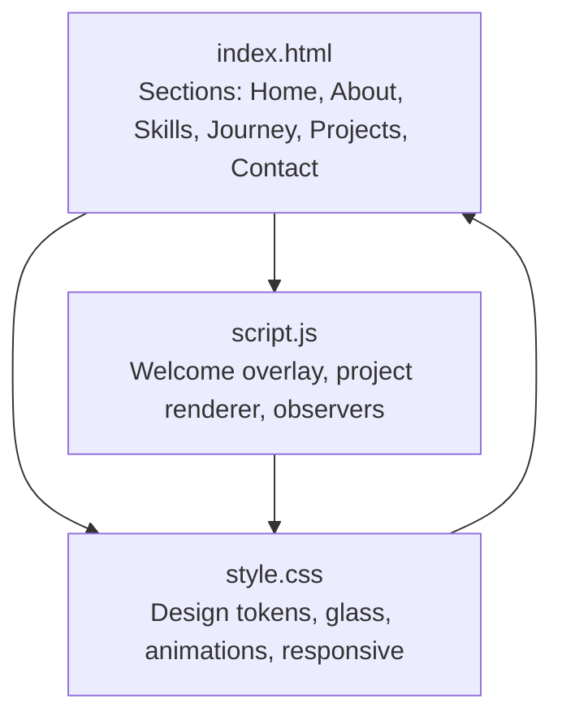

**Diagram sources**
- [index.html:1-135](file://files/arsalan-portfolio-vanilla/site/index.html#L1-L135)
- [style.css:1-268](file://files/style.css#L1-L268)
- [script.js:1-249](file://files/script.js#L1-L249)

**Section sources**
- [index.html:1-135](file://files/arsalan-portfolio-vanilla/site/index.html#L1-L135)
- [style.css:1-268](file://files/style.css#L1-L268)
- [script.js:1-249](file://files/script.js#L1-L249)

## Core Components
- Welcome overlay: injected by JavaScript for a cinematic entrance; hidden after animation or immediately when reduced motion is preferred.
- Navigation: fixed header with links to each section, mobile burger menu, and GitHub link.
- Hero: headline, badge, call-to-action buttons, and a portrait area with floating chips.
- About: two-column card layout describing goals and learning path.
- Skills: three cards representing Foundation, Learning, and Exploring with pill lists.
- Journey: ordered timeline with animated nodes and cards.
- Projects: container rendered from a JavaScript array into interactive cards.
- Contact: contact cards and a UI-only form with accessible labels.

**Section sources**
- [index.html:13-130](file://files/arsalan-portfolio-vanilla/site/index.html#L13-L130)
- [script.js:6-38](file://files/script.js#L6-L38)
- [script.js:216-248](file://files/script.js#L216-L248)

## Architecture Overview
The site follows a clear separation of concerns:
- HTML defines semantic sections and containers.
- CSS provides visual styling, glass morphism, animations, and responsive behavior.
- JavaScript handles dynamic features: welcome overlay, project rendering, scroll-based effects, and accessibility toggles.

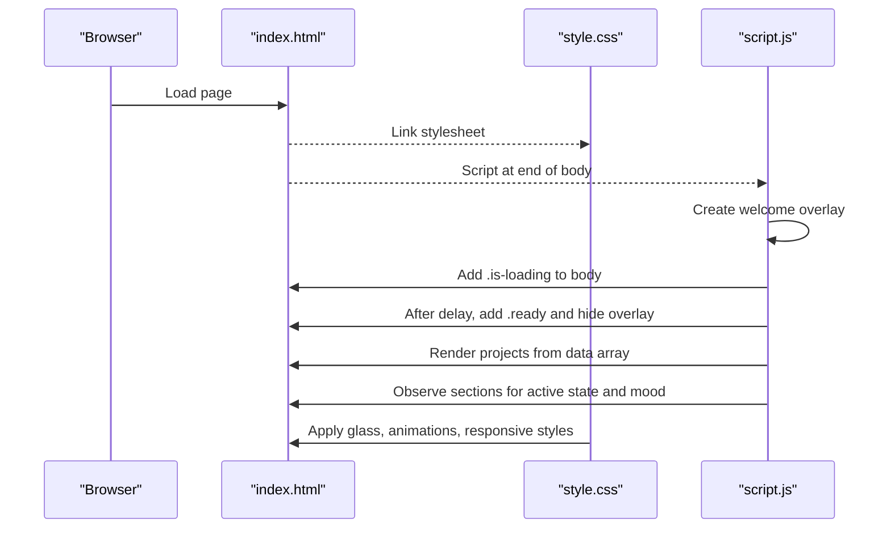

**Diagram sources**
- [index.html:1-135](file://files/arsalan-portfolio-vanilla/site/index.html#L1-L135)
- [style.css:24-41](file://files/style.css#L24-L41)
- [script.js:1-38](file://files/script.js#L1-L38)
- [script.js:40-49](file://files/script.js#L40-L49)
- [script.js:109-139](file://files/script.js#L109-L139)

## Detailed Component Analysis

### Welcome Overlay System
- The overlay is created dynamically if not present in HTML, ensuring a cinematic entrance without cluttering the static markup.
- It includes decorative orbs and a welcome word, with ARIA attributes for screen readers.
- When reduced motion is detected, the overlay is skipped and the portfolio reveals immediately.
- On completion, it adds a class to reveal the main content and removes itself after transition.

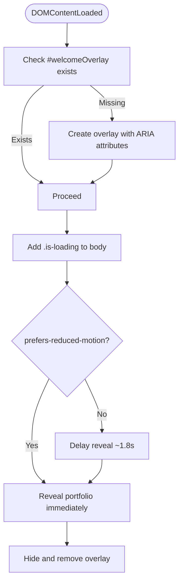

**Diagram sources**
- [script.js:1-38](file://files/script.js#L1-L38)

**Section sources**
- [script.js:1-38](file://files/script.js#L1-L38)
- [style.css:24-41](file://files/style.css#L24-L41)

### Navigation Structure
- Semantic `<header>` and `<nav>` elements define the primary navigation.
- Links use anchor targets to sections (`#home`, `#about`, etc.).
- Mobile menu uses a burger button with `aria-label` and `aria-expanded` toggled by JavaScript.
- Active link highlighting and sliding indicator are managed via IntersectionObserver and DOM manipulation.
- Background mood changes per section using `body[data-mood]`.

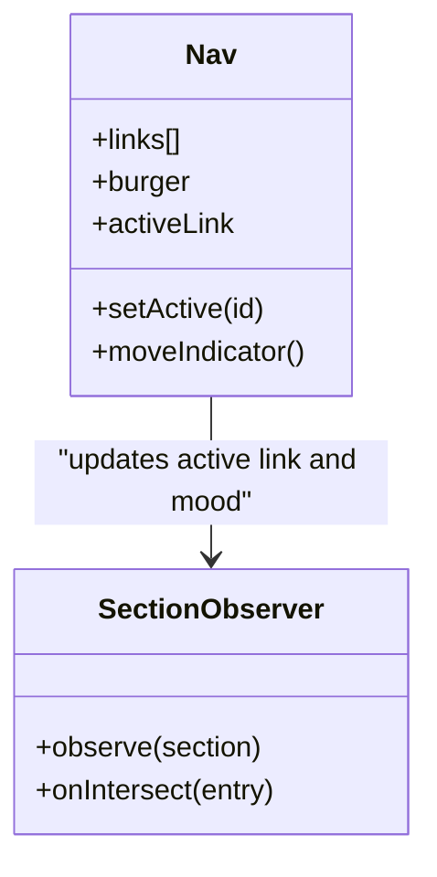

**Diagram sources**
- [index.html:13-29](file://files/arsalan-portfolio-vanilla/site/index.html#L13-L29)
- [script.js:82-90](file://files/script.js#L82-L90)
- [script.js:109-139](file://files/script.js#L109-L139)
- [style.css:86-105](file://files/style.css#L86-L105)

**Section sources**
- [index.html:13-29](file://files/arsalan-portfolio-vanilla/site/index.html#L13-L29)
- [script.js:82-90](file://files/script.js#L82-L90)
- [script.js:109-139](file://files/script.js#L109-L139)
- [style.css:86-105](file://files/style.css#L86-L105)

### Hero Section: Portrait and Badges
- Contains a badge indicating current status, a headline, lead paragraph, and action buttons.
- Portrait area includes an image with fallback logic handled by JavaScript.
- Floating chips display “Now Learning” and “Foundation” information.
- Glass morphism and tilt effects enhance visual depth.

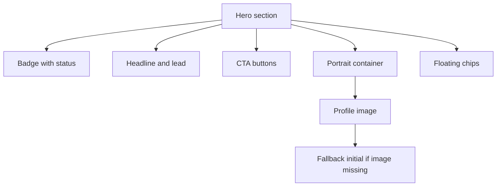

**Diagram sources**
- [index.html:33-53](file://files/arsalan-portfolio-vanilla/site/index.html#L33-L53)
- [script.js:200-205](file://files/script.js#L200-L205)
- [style.css:107-131](file://files/style.css#L107-L131)

**Section sources**
- [index.html:33-53](file://files/arsalan-portfolio-vanilla/site/index.html#L33-L53)
- [script.js:200-205](file://files/script.js#L200-L205)
- [style.css:107-131](file://files/style.css#L107-L131)

### About Section
- Two-column layout with eyebrow label and descriptive paragraphs inside a glass card.
- Uses `data-reveal` for scroll-triggered entrance animations.

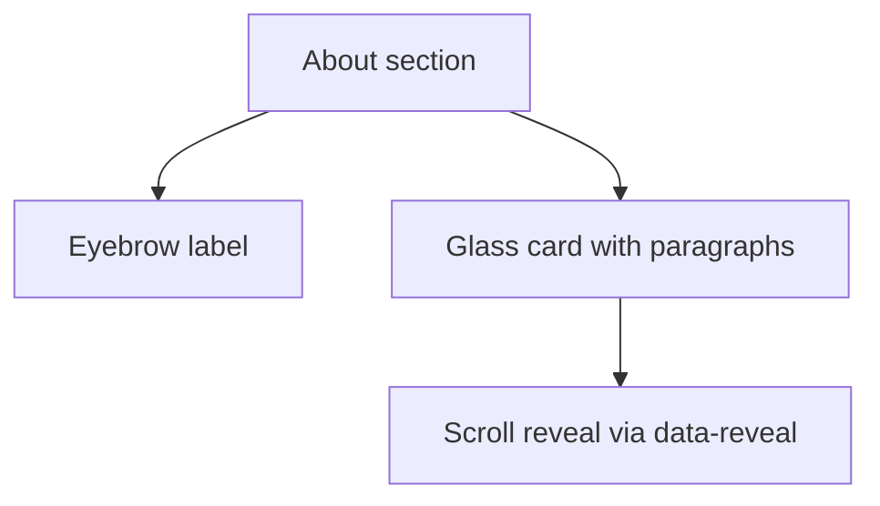

**Diagram sources**
- [index.html:55-62](file://files/arsalan-portfolio-vanilla/site/index.html#L55-L62)
- [style.css:133-135](file://files/style.css#L133-L135)

**Section sources**
- [index.html:55-62](file://files/arsalan-portfolio-vanilla/site/index.html#L55-L62)
- [style.css:133-135](file://files/style.css#L133-L135)

### Skills Grid: Foundation / Learning / Exploring
- Three skill cards with numbered headers, tags, and pill lists.
- Categories:
  - Foundation: HTML and CSS.
  - Learning: Currently learning JavaScript.
  - Exploring: React, Next.js, TypeScript, Tailwind CSS, Node.js, APIs, AI-assisted development.
- Cards use glass morphism; the “Exploring” card has dashed borders and muted pills.

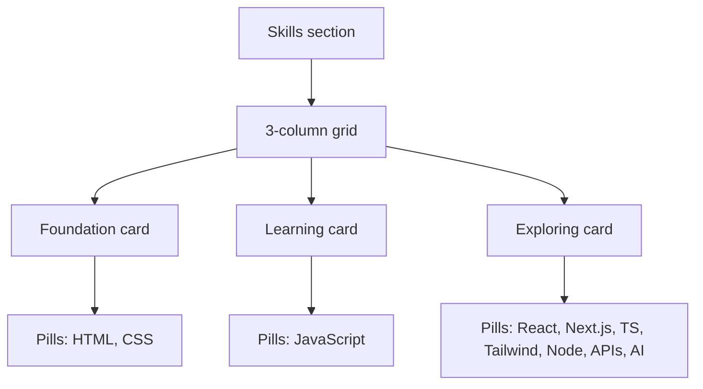

**Diagram sources**
- [index.html:64-86](file://files/arsalan-portfolio-vanilla/site/index.html#L64-L86)
- [style.css:137-155](file://files/style.css#L137-L155)

**Section sources**
- [index.html:64-86](file://files/arsalan-portfolio-vanilla/site/index.html#L64-L86)
- [style.css:137-155](file://files/style.css#L137-L155)

### Journey Timeline
- Ordered list representing milestones: Foundations, Real Projects, JavaScript, Full-Stack Direction.
- Animated timeline line draws as the user scrolls; nodes and cards animate in sequence.
- Uses `data-reveal` and additional classes like `done`, `now`, `next` to indicate state.

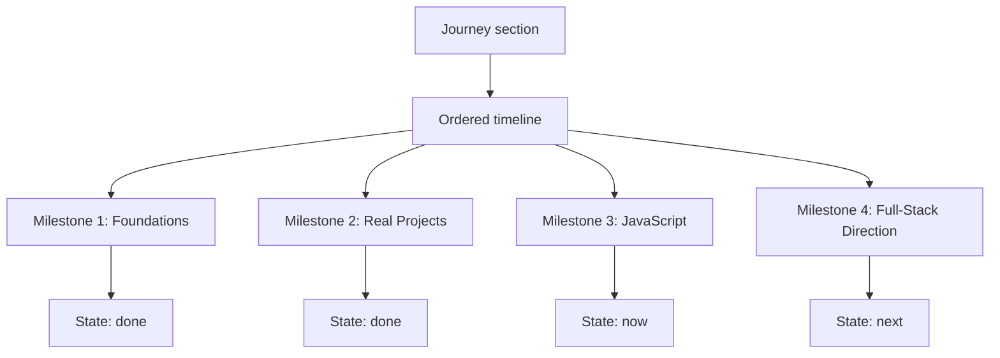

**Diagram sources**
- [index.html:88-97](file://files/arsalan-portfolio-vanilla/site/index.html#L88-L97)
- [style.css:157-179](file://files/style.css#L157-L179)
- [script.js:98-107](file://files/script.js#L98-L107)

**Section sources**
- [index.html:88-97](file://files/arsalan-portfolio-vanilla/site/index.html#L88-L97)
- [style.css:157-179](file://files/style.css#L157-L179)
- [script.js:98-107](file://files/script.js#L98-L107)

### Projects Gallery Container
- Container element `#projectList` is populated by JavaScript from a `projects` array.
- Each project object defines name, description, live URL, repo URL, optional image, and optional tags.
- Cards include preview images or mock placeholders, tags, and action buttons.
- Staggered entrance animations are applied based on index.

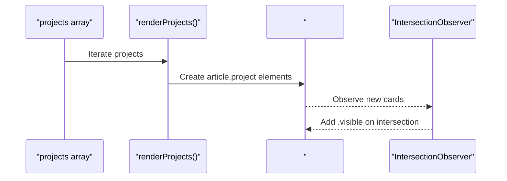

**Diagram sources**
- [script.js:216-248](file://files/script.js#L216-L248)
- [index.html:99-103](file://files/arsalan-portfolio-vanilla/site/index.html#L99-L103)
- [style.css:181-199](file://files/style.css#L181-L199)

**Section sources**
- [index.html:99-103](file://files/arsalan-portfolio-vanilla/site/index.html#L99-L103)
- [script.js:216-248](file://files/script.js#L216-L248)
- [style.css:181-199](file://files/style.css#L181-L199)

### Contact Section
- Includes contact cards for email and GitHub.
- UI-only form with accessible labels and a note explaining no backend submission.
- Form submission event prevents default and updates feedback text color.

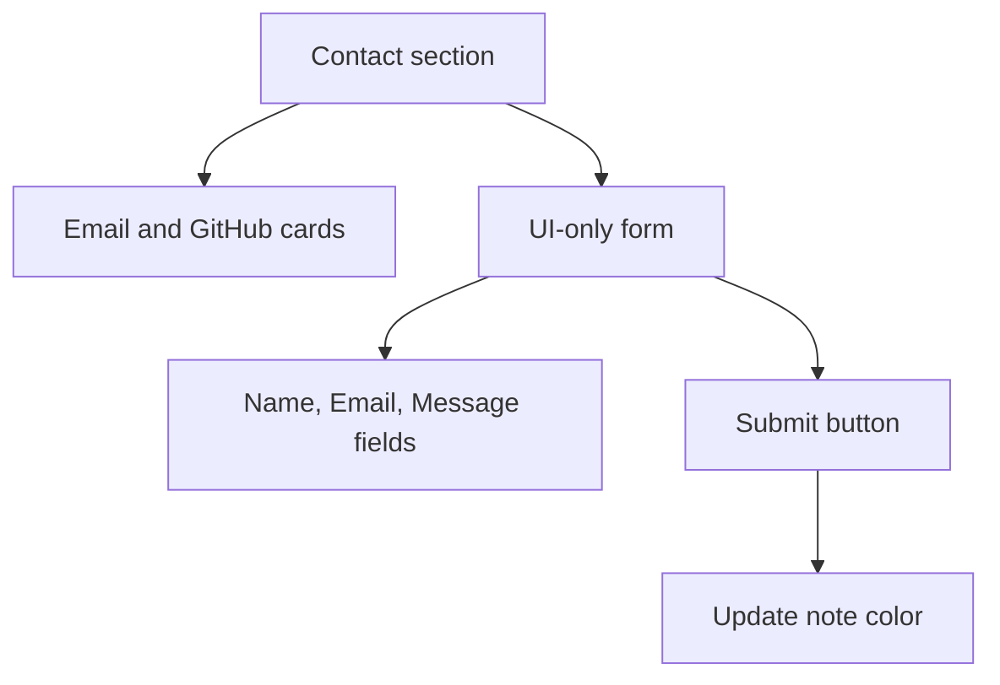

**Diagram sources**
- [index.html:105-123](file://files/arsalan-portfolio-vanilla/site/index.html#L105-L123)
- [script.js:207-211](file://files/script.js#L207-L211)
- [style.css:201-215](file://files/style.css#L201-L215)

**Section sources**
- [index.html:105-123](file://files/arsalan-portfolio-vanilla/site/index.html#L105-L123)
- [script.js:207-211](file://files/script.js#L207-L211)
- [style.css:201-215](file://files/style.css#L201-L215)

## Dependency Analysis
- HTML depends on CSS classes for visual presentation and animations.
- JavaScript depends on specific IDs and classes to manipulate DOM and apply behaviors.
- CSS uses custom properties and pseudo-elements to create glass morphism and ambient glow effects.
- Scroll-based behaviors update CSS variables and classes to reflect progress and active states.

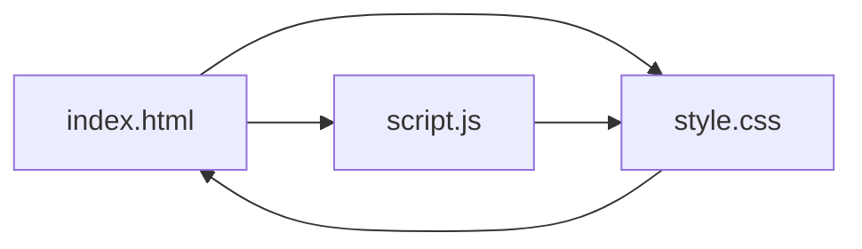

**Diagram sources**
- [index.html:1-135](file://files/arsalan-portfolio-vanilla/site/index.html#L1-L135)
- [style.css:1-268](file://files/style.css#L1-L268)
- [script.js:1-249](file://files/script.js#L1-L249)

**Section sources**
- [index.html:1-135](file://files/arsalan-portfolio-vanilla/site/index.html#L1-L135)
- [style.css:1-268](file://files/style.css#L1-L268)
- [script.js:1-249](file://files/script.js#L1-L249)

## Performance Considerations
- Use `requestAnimationFrame` for scroll and pointer events to avoid jank.
- Respect `prefers-reduced-motion` to disable animations and transitions for users who prefer reduced motion.
- Avoid heavy DOM operations during scroll; batch updates and throttle where possible.
- Keep images optimized and provide fallbacks to prevent layout shifts.

[No sources needed since this section provides general guidance]

## Troubleshooting Guide
- If the welcome overlay does not appear, check whether `prefers-reduced-motion` is enabled or if the overlay creation logic ran.
- If profile image fallback is not working, ensure the image ID matches and error handling is attached.
- If projects do not render, verify the `projects` array and that `#projectList` exists.
- If navigation active states are incorrect, confirm section IDs match anchor links and observers are initialized.

**Section sources**
- [script.js:1-38](file://files/script.js#L1-L38)
- [script.js:200-211](file://files/script.js#L200-L211)
- [script.js:216-248](file://files/script.js#L216-L248)

## Conclusion
The portfolio’s HTML structure emphasizes semantic markup, clear sectioning, and accessibility. CSS provides consistent glass morphism and animation classes, while JavaScript injects dynamic features such as the welcome overlay and data-driven project rendering. This vanilla approach offers simplicity and direct control over markup and behavior, making it suitable for lightweight portfolios and learning-focused sites. For more complex applications, consider component-based frameworks, but retain the same semantic and accessibility principles demonstrated here.

[No sources needed since this section summarizes without analyzing specific files]

## Appendices

### Accessibility Considerations
- ARIA labels:
  - Burger button uses `aria-label="Toggle menu"` and toggles `aria-expanded`.
  - Welcome overlay sets `aria-live="polite"` and `aria-label="Welcome"`.
  - Profile image and project previews include meaningful alt text.
- Semantic elements:
  - Header, nav, main, section, article, footer, h1-h3, ul/ol, form, input, textarea.
- Screen reader support:
  - Skip animations when reduced motion is preferred.
  - Ensure focus-visible outlines and logical tab order.

**Section sources**
- [index.html:13-29](file://files/arsalan-portfolio-vanilla/site/index.html#L13-L29)
- [index.html:33-53](file://files/arsalan-portfolio-vanilla/site/index.html#L33-L53)
- [index.html:105-123](file://files/arsalan-portfolio-vanilla/site/index.html#L105-L123)
- [script.js:6-19](file://files/script.js#L6-L19)
- [script.js:82-90](file://files/script.js#L82-L90)
- [style.css:234-240](file://files/style.css#L234-L240)

### Relationship Between HTML Structure and CSS Classes
- Glass morphism: `.glass` applies backdrop blur, border, and shadow; used across cards, portraits, and contact container.
- Animation classes:
  - `.anim` triggers entrance animations after body gains `.ready`.
  - `[data-reveal]` enables scroll-triggered fade/slide-in.
  - `.tilt-card` enables pointer-reactive 3D tilt.
- Responsive utilities:
  - `.container` constrains width.
  - `.section` provides spacing and top divider.
  - Media queries adjust grids and navigation for smaller screens.

**Section sources**
- [style.css:43-49](file://files/style.css#L43-L49)
- [style.css:107-131](file://files/style.css#L107-L131)
- [style.css:223-225](file://files/style.css#L223-L225)
- [style.css:242-267](file://files/style.css#L242-L267)

### Alternative Vanilla Version Structure
- Current implementation is a vanilla HTML/CSS/JS site with minimal dependencies.
- Use this approach when:
  - You want full control over markup and performance.
  - The site is small and straightforward.
  - You are learning core web technologies.
- Consider alternatives (e.g., component frameworks) when:
  - The application grows in complexity.
  - You need state management, routing, or build tooling.
  - Team collaboration requires standardized components.

[No sources needed since this section provides general guidance]