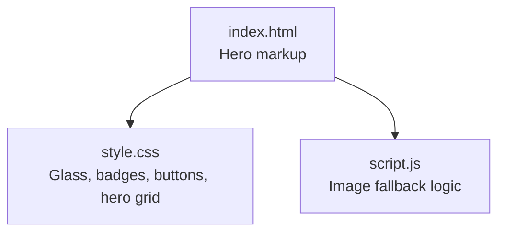
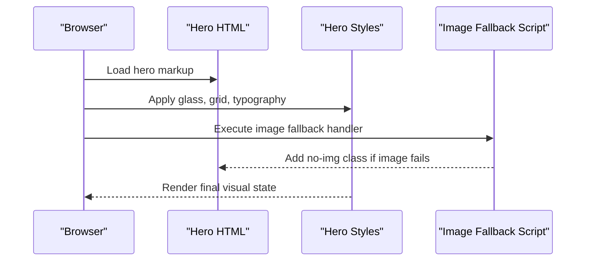
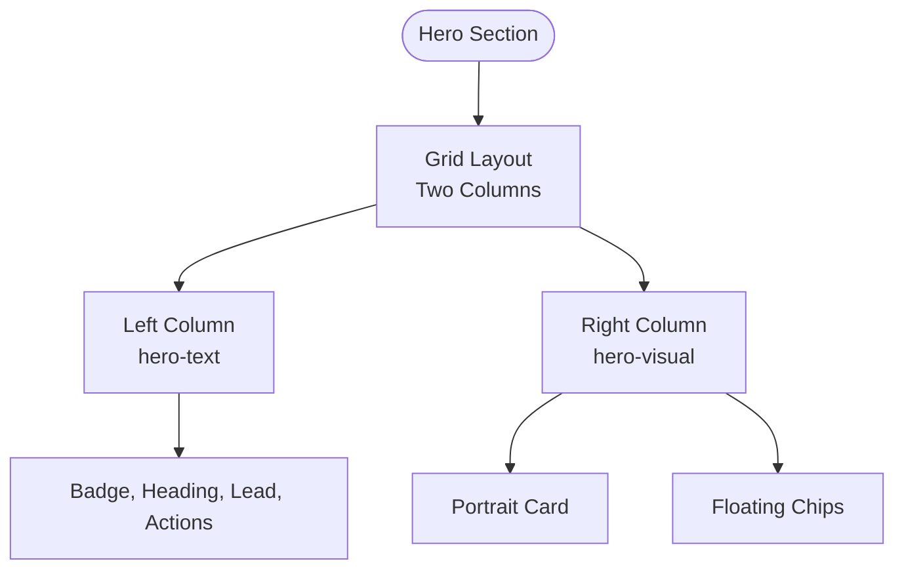
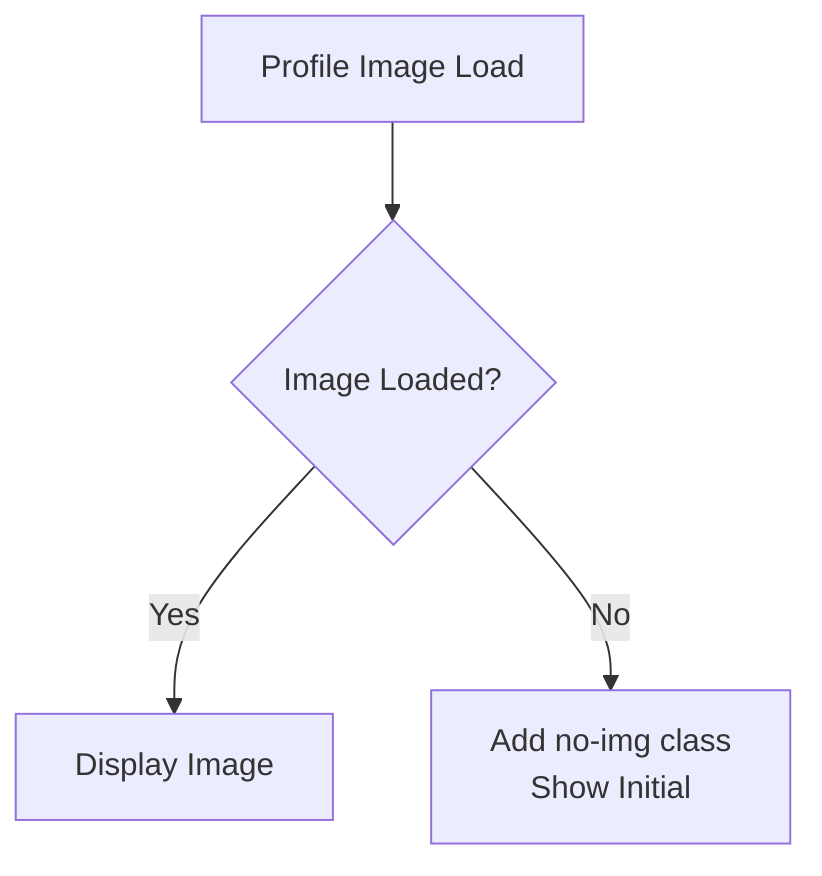
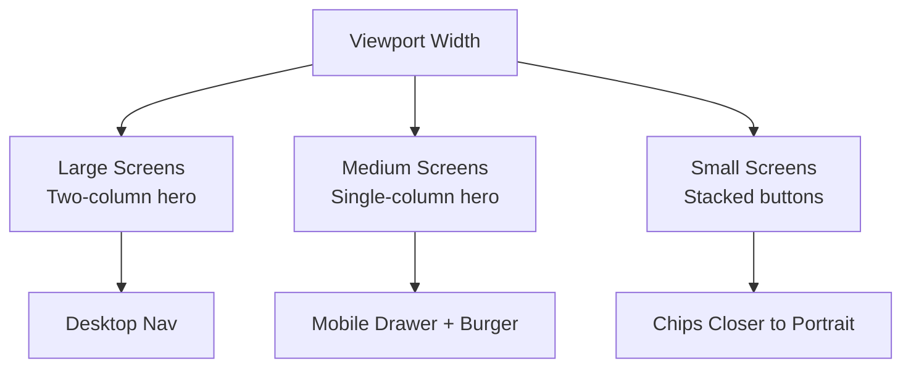
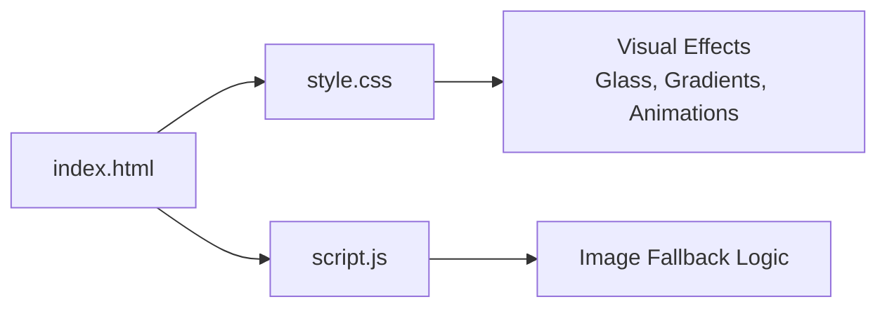

# Hero Section

<cite>
**Referenced Files in This Document**
- [index.html](file://files/arsalan-portfolio-vanilla/site/index.html)
- [style.css](file://files/arsalan-portfolio-vanilla/site/style.css)
- [script.js](file://files/arsalan-portfolio-vanilla/site/script.js)
</cite>

## Table of Contents
1. [Introduction](#introduction)
2. [Project Structure](#project-structure)
3. [Core Components](#core-components)
4. [Architecture Overview](#architecture-overview)
5. [Detailed Component Analysis](#detailed-component-analysis)
6. [Dependency Analysis](#dependency-analysis)
7. [Performance Considerations](#performance-considerations)
8. [Troubleshooting Guide](#troubleshooting-guide)
9. [Conclusion](#conclusion)

## Introduction
This document explains the hero section HTML structure and its supporting styles and scripts. It focuses on:
- The two-column layout with hero-text and hero-visual containers
- The badge element with glass morphism styling
- The main heading with emphasis tags
- The lead paragraph structure
- The action buttons container with primary and ghost variants
- The portrait container with glass card styling, image fallback, and floating chips for current learning status and foundation skills
- Accessibility features and responsive design patterns used throughout

## Project Structure
The hero section lives inside the page’s main content area and is styled by a dedicated CSS file. A small script handles profile image fallback behavior.

**Diagram sources**
- [index.html:33-53](file://files/arsalan-portfolio-vanilla/site/index.html#L33-L53)
- [style.css:67-82](file://files/arsalan-portfolio-vanilla/site/style.css#L67-L82)
- [script.js:61-66](file://files/arsalan-portfolio-vanilla/site/script.js#L61-L66)

**Section sources**
- [index.html:33-53](file://files/arsalan-portfolio-vanilla/site/index.html#L33-L53)
- [style.css:67-82](file://files/arsalan-portfolio-vanilla/site/style.css#L67-L82)
- [script.js:61-66](file://files/arsalan-portfolio-vanilla/site/script.js#L61-L66)

## Core Components
- Two-column hero layout:
  - Left column: hero-text containing badge, heading, lead, and actions
  - Right column: hero-visual containing portrait and floating chips
- Badge: glass-styled inline label with an animated indicator dot
- Heading: large title using emphasis to highlight key words
- Lead paragraph: concise introductory text
- Actions: button group with primary and ghost variants
- Portrait: glass card wrapper around an image with a fallback initial
- Floating chips: glass cards indicating “Now Learning” and “Foundation” skills

**Section sources**
- [index.html:33-53](file://files/arsalan-portfolio-vanilla/site/index.html#L33-L53)
- [style.css:67-82](file://files/arsalan-portfolio-vanilla/site/style.css#L67-L82)

## Architecture Overview
The hero section composes semantic HTML with utility classes and glass morphism styling. Interactions are minimal:
- Image error triggers a fallback initial
- Scroll-based reveal animations are applied via IntersectionObserver (not specific to hero but affect hero elements)

**Diagram sources**
- [index.html:33-53](file://files/arsalan-portfolio-vanilla/site/index.html#L33-L53)
- [style.css:67-82](file://files/arsalan-portfolio-vanilla/site/style.css#L67-L82)
- [script.js:61-66](file://files/arsalan-portfolio-vanilla/site/script.js#L61-L66)

## Detailed Component Analysis

### Hero Container and Two-Column Layout
- The hero section uses a CSS Grid with two columns:
  - First column (hero-text) takes more space
  - Second column (hero-visual) holds the portrait and chips
- On smaller screens, it collapses to a single column.

**Diagram sources**
- [index.html:33-53](file://files/arsalan-portfolio-vanilla/site/index.html#L33-L53)
- [style.css:67-82](file://files/arsalan-portfolio-vanilla/site/style.css#L67-L82)

**Section sources**
- [index.html:33-53](file://files/arsalan-portfolio-vanilla/site/index.html#L33-L53)
- [style.css:67-82](file://files/arsalan-portfolio-vanilla/site/style.css#L67-L82)

### Badge Element with Glass Morphism
- The badge is an inline-flex element with rounded corners, monospace font, and subtle glow indicator.
- It uses the shared glass style for background blur and border.

Key behaviors:
- Glass background and border
- Animated dot indicator
- Positioned above the heading

**Section sources**
- [index.html:35](file://files/arsalan-portfolio-vanilla/site/index.html#L35)
- [style.css:21-24](file://files/arsalan-portfolio-vanilla/site/style.css#L21-L24)
- [style.css:69-70](file://files/arsalan-portfolio-vanilla/site/style.css#L69-L70)

### Main Heading with Emphasis Tags
- The h1 contains normal text and emphasized words that receive a gradient color effect.
- Font size scales responsively; line height is tight for impact.

Accessibility note:
- Emphasizes meaning without changing semantics; screen readers will read the full sentence.

**Section sources**
- [index.html:36](file://files/arsalan-portfolio-vanilla/site/index.html#L36)
- [style.css:33-36](file://files/arsalan-portfolio-vanilla/site/style.css#L33-L36)

### Lead Paragraph Structure
- The lead paragraph provides a concise summary under the heading.
- Max width ensures readability on wide screens.

**Section sources**
- [index.html:37](file://files/arsalan-portfolio-vanilla/site/index.html#L37)
- [style.css:40](file://files/arsalan-portfolio-vanilla/site/style.css#L40)

### Action Buttons Container
- The actions container holds two buttons:
  - Primary button: solid light background with hover glow
  - Ghost button: glass-style with backdrop blur
- Buttons wrap on narrow screens and stretch to full width at very small sizes.

Interaction notes:
- Hover lifts slightly
- Active state scales down briefly

**Section sources**
- [index.html:38-41](file://files/arsalan-portfolio-vanilla/site/index.html#L38-L41)
- [style.css:42-49](file://files/arsalan-portfolio-vanilla/site/style.css#L42-L49)
- [style.css:177-180](file://files/arsalan-portfolio-vanilla/site/style.css#L177-L180)

### Portrait Container with Glass Card Styling
- The portrait is wrapped in a glass card with rounded corners and padding.
- The inner image container sets aspect ratio, overflow clipping, and a subtle gradient background.
- When the image fails to load, a fallback initial letter is shown.

Behavioral details:
- If the image fails or loads with zero dimensions, a no-img class is added to hide the img and show the fallback.

**Diagram sources**
- [script.js:61-66](file://files/arsalan-portfolio-vanilla/site/script.js#L61-L66)
- [style.css:74-78](file://files/arsalan-portfolio-vanilla/site/style.css#L74-L78)

**Section sources**
- [index.html:43-49](file://files/arsalan-portfolio-vanilla/site/index.html#L43-L49)
- [style.css:74-78](file://files/arsalan-portfolio-vanilla/site/style.css#L74-L78)
- [script.js:61-66](file://files/arsalan-portfolio-vanilla/site/script.js#L61-L66)

### Floating Chip Elements
- Two floating chips display:
  - Current learning status (“NOW LEARNING JavaScript”)
  - Foundation skills (“FOUNDATION HTML · CSS”)
- They use glass styling and float animation with staggered delays.

Positioning:
- Positioned absolutely relative to the hero-visual container
- Responsive adjustments move them closer to the portrait on smaller screens

**Section sources**
- [index.html:50-52](file://files/arsalan-portfolio-vanilla/site/index.html#L50-L52)
- [style.css:79-82](file://files/arsalan-portfolio-vanilla/site/style.css#L79-L82)
- [style.css:168-176](file://files/arsalan-portfolio-vanilla/site/style.css#L168-L176)

### Accessibility Features
- Semantic landmarks:
  - nav with aria-label for main navigation
  - section with id for anchor targets
- Interactive controls:
  - Burger menu button with aria-label and aria-expanded toggled by script
- Media and images:
  - Profile image has descriptive alt text
  - Decorative background glows use aria-hidden
- Reduced motion:
  - Animations and transitions are disabled when prefers-reduced-motion is set

**Section sources**
- [index.html:14-28](file://files/arsalan-portfolio-vanilla/site/index.html#L14-L28)
- [index.html:11](file://files/arsalan-portfolio-vanilla/site/index.html#L11)
- [index.html:46](file://files/arsalan-portfolio-vanilla/site/index.html#L46)
- [script.js:36-44](file://files/arsalan-portfolio-vanilla/site/script.js#L36-L44)
- [style.css:152-159](file://files/arsalan-portfolio-vanilla/site/style.css#L152-L159)

### Responsive Design Patterns
- Hero grid switches from two columns to one below a breakpoint.
- Navigation collapses into a mobile drawer with a burger toggle.
- Button stacks stack vertically on very small screens.
- Floating chips adjust their positions on smaller viewports.

**Diagram sources**
- [style.css:161-181](file://files/arsalan-portfolio-vanilla/site/style.css#L161-L181)
- [style.css:51-65](file://files/arsalan-portfolio-vanilla/site/style.css#L51-L65)

**Section sources**
- [style.css:161-181](file://files/arsalan-portfolio-vanilla/site/style.css#L161-L181)
- [style.css:51-65](file://files/arsalan-portfolio-vanilla/site/style.css#L51-L65)

## Dependency Analysis
- HTML defines the structure and accessibility attributes.
- CSS provides glass morphism, layout grids, typography, and responsive rules.
- JS adds runtime behavior for image fallback and UI interactions.

**Diagram sources**
- [index.html:33-53](file://files/arsalan-portfolio-vanilla/site/index.html#L33-L53)
- [style.css:67-82](file://files/arsalan-portfolio-vanilla/site/style.css#L67-L82)
- [script.js:61-66](file://files/arsalan-portfolio-vanilla/site/script.js#L61-L66)

**Section sources**
- [index.html:33-53](file://files/arsalan-portfolio-vanilla/site/index.html#L33-L53)
- [style.css:67-82](file://files/arsalan-portfolio-vanilla/site/style.css#L67-L82)
- [script.js:61-66](file://files/arsalan-portfolio-vanilla/site/script.js#L61-L66)

## Performance Considerations
- Use of backdrop-filter and gradients can be GPU-intensive; consider limiting heavy effects on low-power devices.
- Image loading strategy includes a lightweight fallback initial to avoid blank states.
- Animations respect reduced motion preferences to improve performance and comfort for sensitive users.

[No sources needed since this section provides general guidance]

## Troubleshooting Guide
- Profile image not showing:
  - Ensure the image path exists and is accessible.
  - If missing, the script automatically shows the fallback initial.
- Mobile menu not opening:
  - Verify the burger button has correct aria-expanded attribute toggling.
  - Check that the nav-links container receives the open class.

**Section sources**
- [script.js:61-66](file://files/arsalan-portfolio-vanilla/site/script.js#L61-L66)
- [script.js:36-44](file://files/arsalan-portfolio-vanilla/site/script.js#L36-L44)

## Conclusion
The hero section combines semantic HTML, glass morphism styling, and minimal scripting to deliver a clear, accessible, and responsive introduction. Its two-column layout adapts gracefully across devices, while the badge, heading, lead, and action buttons communicate purpose and next steps. The portrait with fallback and floating chips add personality and context about the developer’s current learning journey.

[No sources needed since this section summarizes without analyzing specific files]