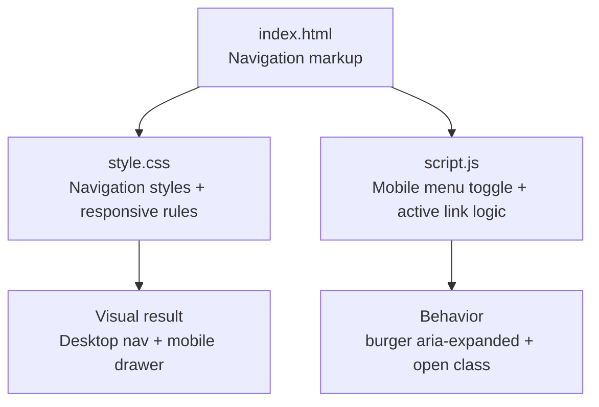
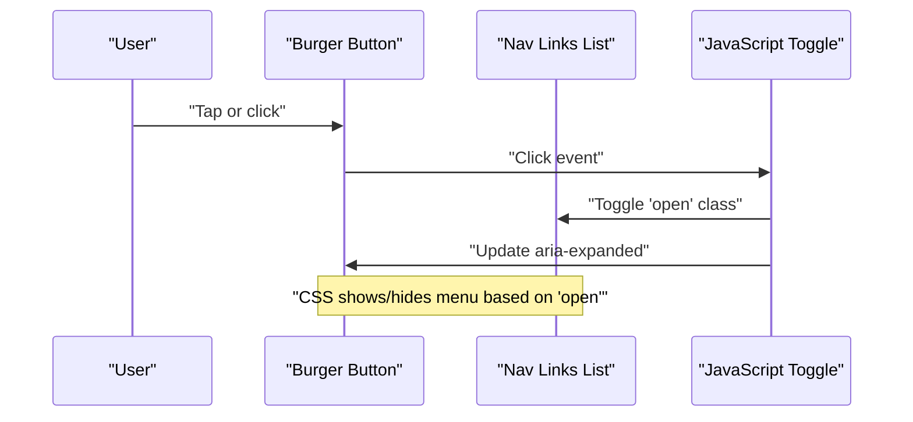
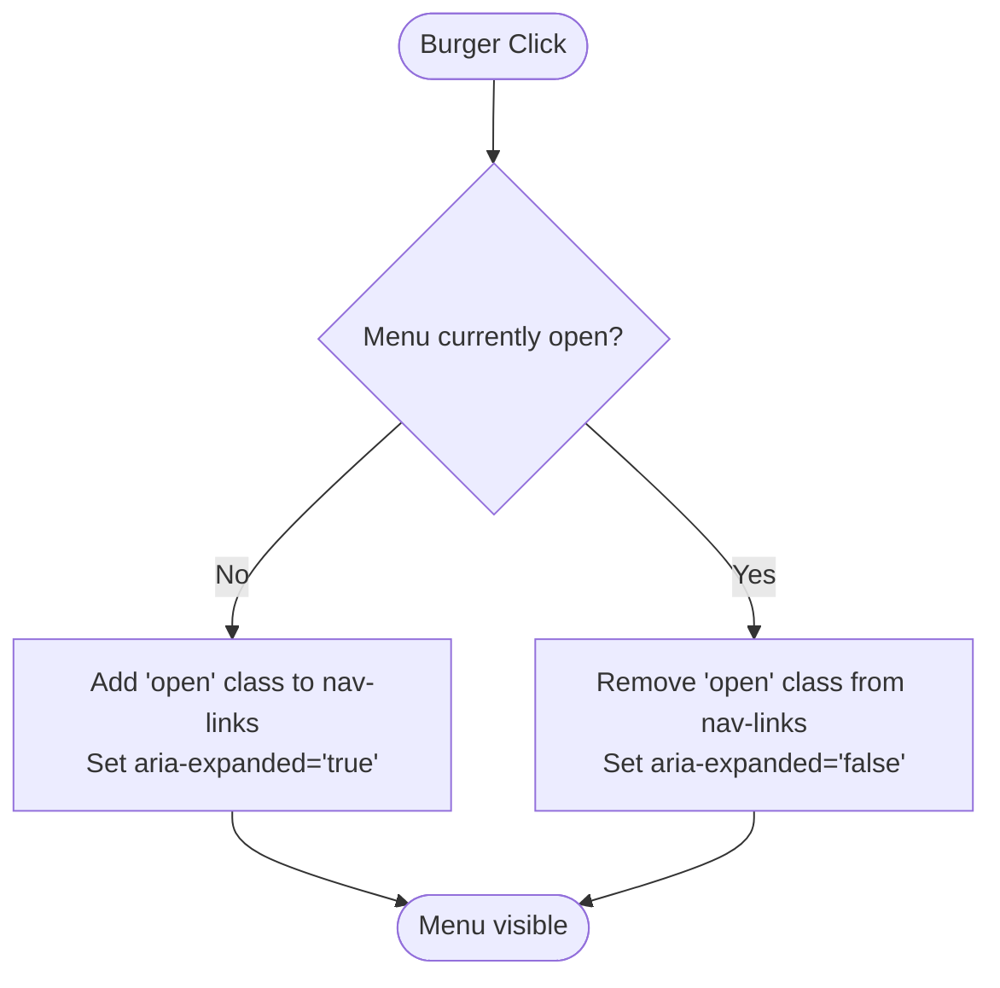
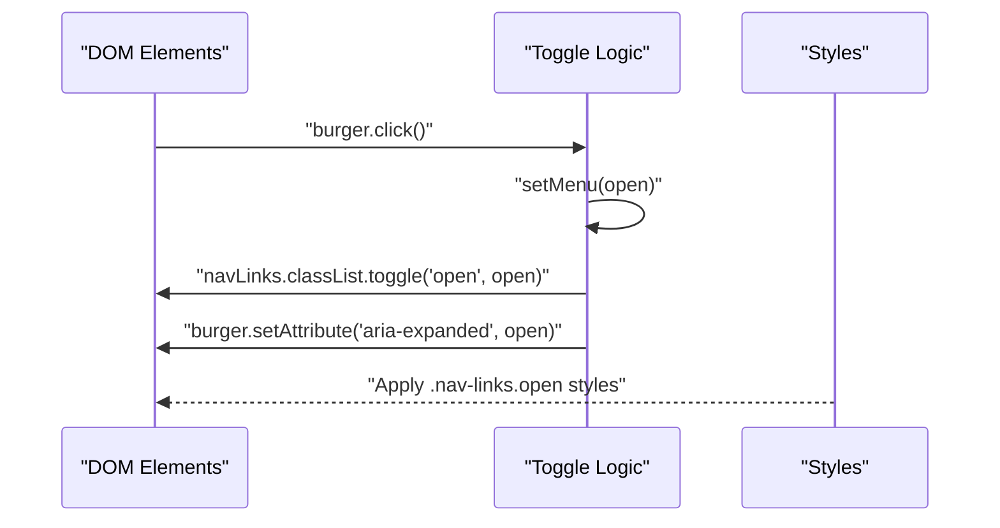
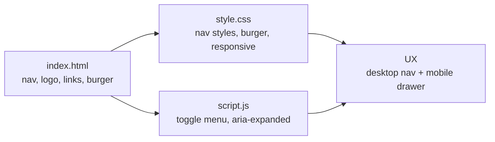

# Navigation Structure

<cite>
**Referenced Files in This Document**
- [index.html](file://files/index.html)
- [script.js](file://files/script.js)
- [style.css](file://files/style.css)
</cite>

## Table of Contents
1. [Introduction](#introduction)
2. [Project Structure](#project-structure)
3. [Core Components](#core-components)
4. [Architecture Overview](#architecture-overview)
5. [Detailed Component Analysis](#detailed-component-analysis)
6. [Dependency Analysis](#dependency-analysis)
7. [Performance Considerations](#performance-considerations)
8. [Troubleshooting Guide](#troubleshooting-guide)
9. [Conclusion](#conclusion)

## Introduction
This document explains the navigation HTML structure, its accessibility attributes, mobile hamburger menu behavior, GitHub external link integration, and responsive design considerations. It focuses on how the semantic `<nav>` element, logo link, main links list, and burger button work together with JavaScript for mobile menu toggling and with CSS for responsive presentation.

## Project Structure
The navigation is defined in the page markup, styled by the stylesheet, and enhanced by the script that handles mobile menu toggling and active link tracking.

**Diagram sources**
- [index.html:22-38](file://files/index.html#L22-L38)
- [style.css:86-105](file://files/style.css#L86-L105)
- [style.css:248-254](file://files/style.css#L248-L254)
- [script.js:82-90](file://files/script.js#L82-L90)

**Section sources**
- [index.html:22-38](file://files/index.html#L22-L38)
- [style.css:86-105](file://files/style.css#L86-L105)
- [style.css:248-254](file://files/style.css#L248-L254)
- [script.js:82-90](file://files/script.js#L82-L90)

## Core Components
- Semantic navigation container with ARIA labeling.
- Logo link as a branding anchor.
- Main navigation links list with internal section anchors.
- Mobile-only GitHub link inside the navigation list.
- Desktop GitHub call-to-action outside the list.
- Hamburger button with two span elements forming the visual bars.
- JavaScript-managed mobile menu state using an `open` class and `aria-expanded`.

Key responsibilities:
- HTML provides structure and accessibility labels.
- CSS controls layout, transitions, and responsive behavior.
- JavaScript toggles visibility and updates accessibility state.

**Section sources**
- [index.html:22-38](file://files/index.html#L22-L38)
- [style.css:86-105](file://files/style.css#L86-L105)
- [style.css:248-254](file://files/style.css#L248-L254)
- [script.js:82-90](file://files/script.js#L82-L90)

## Architecture Overview
The navigation integrates three layers:
- Markup defines the accessible structure.
- Styles define desktop and mobile layouts.
- Script manages interactivity and accessibility state.

**Diagram sources**
- [script.js:82-90](file://files/script.js#L82-L90)
- [style.css:248-254](file://files/style.css#L248-L254)

## Detailed Component Analysis

### Semantic Navigation Container
- Uses a semantic `<nav>` element to identify the primary navigation region.
- Includes an `aria-label="Main"` to describe the purpose of the navigation to assistive technologies.
- Wrapped in a fixed header container for consistent positioning across scroll.

Accessibility highlights:
- The label clarifies the role of the navigation group.
- The structure supports keyboard users through standard link focus order.

**Section sources**
- [index.html:22-38](file://files/index.html#L22-L38)

### Logo Link Structure
- The logo is an anchor linking to the home section.
- Contains text and a decorative span used for styling emphasis.
- Acts as a quick return to the top of the page.

Best practices:
- Keep the logo link meaningful and short.
- Ensure it navigates to a logical destination (home or top).

**Section sources**
- [index.html:22-38](file://files/index.html#L22-L38)

### Main Navigation Links List
- The main links are contained in an unordered list with an ID used by JavaScript.
- Each item is a link to a section via hash anchors.
- An additional mobile-only GitHub link is included within the list for small screens.

Responsiveness:
- On larger screens, the list displays horizontally.
- On smaller screens, the list becomes a vertical drawer controlled by the burger button.

**Section sources**
- [index.html:22-38](file://files/index.html#L22-L38)
- [style.css:86-105](file://files/style.css#L86-L105)
- [style.css:248-254](file://files/style.css#L248-L254)

### Mobile Hamburger Menu Button
- The burger button has:
  - `aria-label="Toggle menu"` for screen reader context.
  - `aria-expanded="false"` initially indicating the menu is closed.
  - Two child spans representing the visual bars.
- When opened:
  - JavaScript sets `aria-expanded="true"`.
  - CSS rotates the spans to form an “X” shape.

Interaction flow:
- Clicking the button toggles the `open` class on the navigation list.
- Closing occurs when any navigation link is clicked.

**Diagram sources**
- [script.js:82-90](file://files/script.js#L82-L90)
- [style.css:101-105](file://files/style.css#L101-L105)

**Section sources**
- [index.html:22-38](file://files/index.html#L22-L38)
- [script.js:82-90](file://files/script.js#L82-L90)
- [style.css:101-105](file://files/style.css#L101-L105)

### GitHub External Link Integration
There are two GitHub entry points:
- A mobile-only link inside the navigation list.
- A desktop call-to-action button outside the list.

Both use:
- `target="_blank"` to open in a new tab.
- `rel="noopener"` for security when opening external links.

Considerations:
- External links should be clearly indicated visually (for example, with an arrow icon).
- Provide alternative paths for users who prefer not to open new tabs.

**Section sources**
- [index.html:22-38](file://files/index.html#L22-L38)

### Responsive Design Considerations
Breakpoints and behaviors:
- At 820px and below:
  - The desktop GitHub button is hidden.
  - The burger button appears.
  - The mobile-only GitHub link appears inside the list.
  - The navigation list becomes an absolute-positioned dropdown with fade/slide transitions.
- At 560px and below:
  - Additional layout adjustments apply to contact cards, forms, footer, and navigation padding.

Visual states:
- The burger transforms into an “X” when `aria-expanded="true"`.
- The navigation list uses opacity, visibility, and transform transitions for smooth open/close.

**Section sources**
- [style.css:101-105](file://files/style.css#L101-L105)
- [style.css:248-254](file://files/style.css#L248-L254)
- [style.css:262-267](file://files/style.css#L262-L267)

### Accessibility Features
- `aria-label="Main"` on the `<nav>` describes the navigation region.
- `aria-label="Toggle menu"` on the burger button describes its action.
- `aria-expanded` reflects the current state of the mobile menu.
- Decorative elements use `aria-hidden="true"` where appropriate elsewhere in the page.

Recommendations:
- Ensure all interactive elements have visible focus indicators.
- Maintain consistent keyboard navigation order.
- Test with screen readers to confirm announcements for menu state changes.

**Section sources**
- [index.html:22-38](file://files/index.html#L22-L38)
- [script.js:82-90](file://files/script.js#L82-L90)

### JavaScript Integration for Mobile Menu Toggling
The script:
- Selects the burger button and the navigation list by ID.
- Defines a helper function to set the menu state.
- Adds a click listener to the burger to toggle the menu.
- Closes the menu when any navigation link is clicked.

**Diagram sources**
- [script.js:82-90](file://files/script.js#L82-L90)
- [style.css:248-254](file://files/style.css#L248-L254)

**Section sources**
- [script.js:82-90](file://files/script.js#L82-L90)

## Dependency Analysis
The navigation depends on:
- HTML for structure and ARIA attributes.
- CSS for layout, transitions, and responsive breakpoints.
- JavaScript for interactivity and accessibility state management.

**Diagram sources**
- [index.html:22-38](file://files/index.html#L22-L38)
- [style.css:86-105](file://files/style.css#L86-L105)
- [style.css:248-254](file://files/style.css#L248-L254)
- [script.js:82-90](file://files/script.js#L82-L90)

**Section sources**
- [index.html:22-38](file://files/index.html#L22-L38)
- [style.css:86-105](file://files/style.css#L86-L105)
- [style.css:248-254](file://files/style.css#L248-L254)
- [script.js:82-90](file://files/script.js#L82-L90)

## Performance Considerations
- Use passive event listeners for scroll and pointer events to improve responsiveness.
- Avoid heavy computations during resize; debounce or throttle if needed.
- Prefer CSS transitions for animations to leverage GPU acceleration.
- Keep the navigation markup minimal to reduce reflows and repaints.

[No sources needed since this section provides general guidance]

## Troubleshooting Guide
Common issues and resolutions:
- Menu does not open:
  - Verify the burger button exists and has the expected ID.
  - Confirm the navigation list has the expected ID.
  - Ensure the click listener is attached after the DOM is ready.
- Screen readers do not announce menu state:
  - Check that `aria-expanded` is updated correctly.
  - Ensure `aria-label="Toggle menu"` is present on the burger.
- Mobile menu overlaps content:
  - Inspect the `.nav-links.open` styles and ensure transitions are applied.
  - Confirm the breakpoint at 820px is not overridden.
- External GitHub links open without security best practices:
  - Ensure `target="_blank"` is paired with `rel="noopener"`.

**Section sources**
- [script.js:82-90](file://files/script.js#L82-L90)
- [style.css:248-254](file://files/style.css#L248-L254)

## Conclusion
The navigation combines semantic HTML, accessible ARIA attributes, responsive CSS, and lightweight JavaScript to deliver a clear, usable experience across devices. The burger button’s `aria-expanded` state and the `open` class on the navigation list coordinate to provide both visual and assistive technology feedback. External GitHub links follow security recommendations, and responsive breakpoints ensure a consistent experience from desktop to mobile.

[No sources needed since this section summarizes without analyzing specific files]