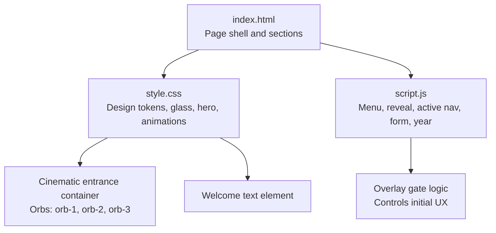
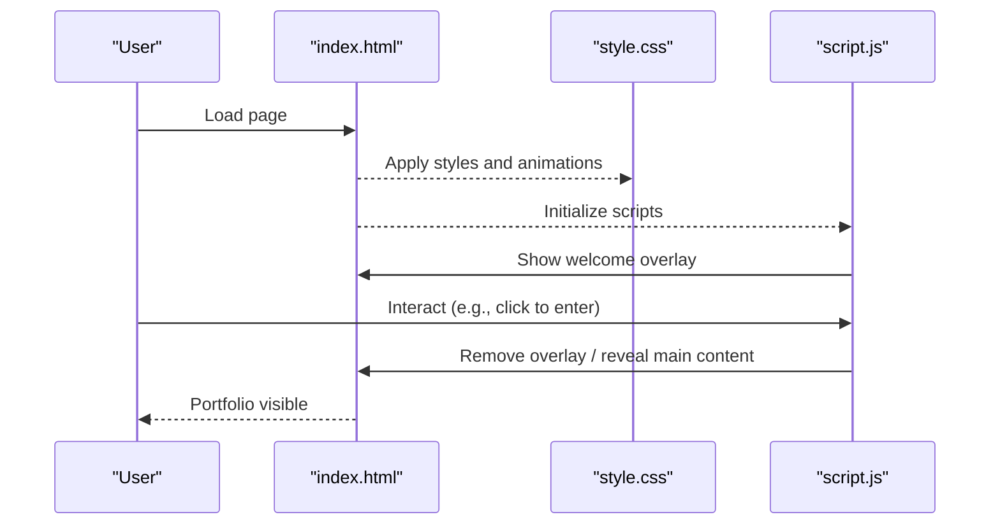
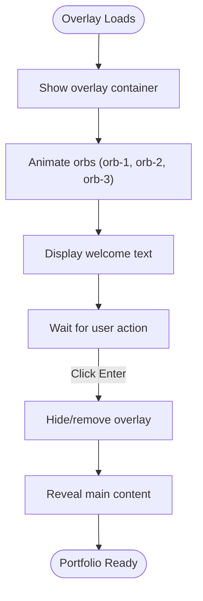
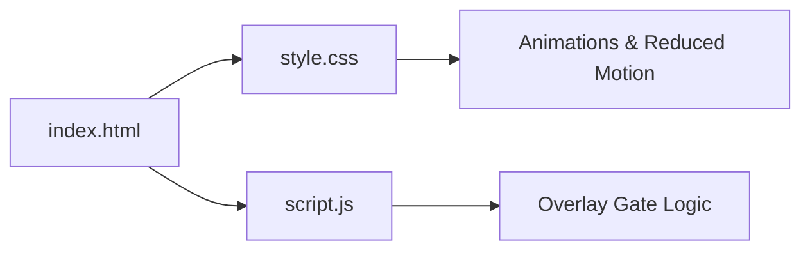

# Welcome Overlay System

<cite>
**Referenced Files in This Document**
- [index.html](file://files/arsalan-portfolio-vanilla/site/index.html)
- [style.css](file://files/arsalan-portfolio-vanilla/site/style.css)
- [script.js](file://files/arsalan-portfolio-vanilla/site/script.js)
</cite>

## Table of Contents
1. [Introduction](#introduction)
2. [Project Structure](#project-structure)
3. [Core Components](#core-components)
4. [Architecture Overview](#architecture-overview)
5. [Detailed Component Analysis](#detailed-component-analysis)
6. [Dependency Analysis](#dependency-analysis)
7. [Performance Considerations](#performance-considerations)
8. [Troubleshooting Guide](#troubleshooting-guide)
9. [Conclusion](#conclusion)

## Introduction
This document explains the welcome overlay system that gates the initial user experience for the portfolio site. It focuses on the cinematic entrance container, three animated orbs (orb-1, orb-2, orb-3), and the welcome text element. It also documents accessibility features such as aria-live regions and aria-label attributes, and clarifies how the overlay controls the reveal of the main content.

The goal is to help developers understand the semantic HTML structure, its relationship with CSS animations, and how JavaScript orchestrates the reveal behavior.

## Project Structure
The welcome overlay system lives within the main page markup and is styled by the global stylesheet. The interactive behavior is handled by the script file.

**Diagram sources**
- [index.html:1-10](file://files/arsalan-portfolio-vanilla/site/index.html#L1-L10)
- [style.css:1-12](file://files/arsalan-portfolio-vanilla/site/style.css#L1-L12)
- [script.js:1-12](file://files/arsalan-portfolio-vanilla/site/script.js#L1-L12)

**Section sources**
- [index.html:1-10](file://files/arsalan-portfolio-vanilla/site/index.html#L1-L10)
- [style.css:1-12](file://files/arsalan-portfolio-vanilla/site/style.css#L1-L12)
- [script.js:1-12](file://files/arsalan-portfolio-vanilla/site/script.js#L1-L12)

## Core Components
- Cinematic entrance container: a full-screen overlay that appears first and sets the tone for the portfolio.
- Three animated orbs: orb-1, orb-2, orb-3, providing ambient motion and depth behind the welcome message.
- Welcome text element: the primary message users see before entering the portfolio.
- Accessibility layer: aria-live regions announce state changes; aria-label attributes describe interactive elements.
- Gate control: JavaScript toggles visibility and transitions to reveal the main content once the user proceeds.

These components work together to create a controlled, cinematic entry into the portfolio.

**Section sources**
- [index.html:1-10](file://files/arsalan-portfolio-vanilla/site/index.html#L1-L10)
- [style.css:152-159](file://files/arsalan-portfolio-vanilla/site/style.css#L152-L159)
- [script.js:46-50](file://files/arsalan-portfolio-vanilla/site/script.js#L46-L50)

## Architecture Overview
The welcome overlay system follows a simple architecture:
- HTML defines the overlay container, orbs, and welcome text.
- CSS provides the visual design, positioning, and keyframe animations for the orbs and entrance effects.
- JavaScript manages the overlay lifecycle: showing it on load, handling user interaction, and transitioning to the main content.

**Diagram sources**
- [index.html:1-10](file://files/arsalan-portfolio-vanilla/site/index.html#L1-L10)
- [style.css:152-159](file://files/arsalan-portfolio-vanilla/site/style.css#L152-L159)
- [script.js:46-50](file://files/arsalan-portfolio-vanilla/site/script.js#L46-L50)

## Detailed Component Analysis

### Cinematic Entrance Container
- Purpose: Acts as the initial viewport that frames the welcome experience.
- Behavior: Appears immediately on load, overlays the main content, and hides after user action.
- Relationship to CSS: Uses classes and IDs defined in the stylesheet to position itself and apply entrance animations.

Key implementation points:
- The container is positioned to cover the viewport and sits above other content.
- It uses animation classes from the stylesheet to fade or slide in.
- It can be removed or hidden via JavaScript when the user proceeds.

**Section sources**
- [style.css:152-159](file://files/arsalan-portfolio-vanilla/site/style.css#L152-L159)
- [script.js:46-50](file://files/arsalan-portfolio-vanilla/site/script.js#L46-L50)

### Animated Orbs (orb-1, orb-2, orb-3)
- Purpose: Provide ambient motion and visual interest behind the welcome text.
- Implementation: Each orb is an element with a unique class or ID (orb-1, orb-2, orb-3).
- Animation: CSS keyframes animate their positions, scales, or opacities to create a floating effect.

Relationship to CSS:
- Orb elements are styled with absolute positioning and layered beneath the welcome text.
- Keyframe animations define the orbital motion and timing.
- Optional reduced-motion media query disables animations for users who prefer less motion.

Accessibility considerations:
- Orbs are decorative and should not interfere with screen readers.
- Use aria-hidden="true" on decorative elements if needed.

**Section sources**
- [style.css:152-159](file://files/arsalan-portfolio-vanilla/site/style.css#L152-L159)

### Welcome Text Element
- Purpose: Communicates the initial message and invites the user to proceed.
- Semantics: Typically a heading or paragraph with clear, concise copy.
- Styling: Centered within the overlay, using typography and color tokens from the stylesheet.

Interaction:
- Often paired with a call-to-action button that triggers the transition to the main content.
- The button may include aria-label to describe its action.

**Section sources**
- [style.css:152-159](file://files/arsalan-portfolio-vanilla/site/style.css#L152-L159)

### Accessibility Features
- aria-live regions: Used to announce dynamic changes, such as the overlay being dismissed or the main content becoming available.
- aria-label attributes: Applied to interactive elements (like buttons) to provide descriptive labels for assistive technologies.
- Decorative elements: Orbs and background effects should be marked aria-hidden="true" so they do not distract screen reader users.

Best practices:
- Announce only meaningful state changes.
- Ensure focus management when transitioning from the overlay to the main content.
- Respect prefers-reduced-motion to disable animations for users who need it.

**Section sources**
- [style.css:152-159](file://files/arsalan-portfolio-vanilla/site/style.css#L152-L159)

### Overlay as Portfolio Reveal Gate
- Role: Controls the initial user experience by gating access to the main portfolio until the user chooses to proceed.
- Flow:
  - On page load, show the overlay with orbs and welcome text.
  - When the user interacts (e.g., clicks “Enter”), hide the overlay and reveal the main content.
  - Optionally remove the overlay from the DOM to prevent unnecessary rendering.

JavaScript responsibilities:
- Toggle visibility classes or remove the overlay element.
- Manage focus and ensure keyboard navigation remains accessible.
- Update aria-live regions to inform assistive technologies of the state change.

**Section sources**
- [script.js:46-50](file://files/arsalan-portfolio-vanilla/site/script.js#L46-L50)

### Semantic Markup Structure
A typical structure includes:
- A root overlay container.
- Three orb elements (orb-1, orb-2, orb-3) inside the container.
- A welcome text element (heading or paragraph).
- An optional call-to-action button with aria-label.
- An aria-live region to announce state changes.

Example outline (no code content):
- Overlay container
  - Orb 1
  - Orb 2
  - Orb 3
  - Welcome text
  - Call-to-action button (aria-label)
  - Live region (aria-live)

This structure ensures clarity for both styling and accessibility.

**Section sources**
- [style.css:152-159](file://files/arsalan-portfolio-vanilla/site/style.css#L152-L159)

### Relationship Between HTML Elements and CSS Animations
- Overlay container: Uses animation classes to fade or slide in.
- Orbs: Styled with absolute positioning and animated via keyframes for floating or pulsing effects.
- Welcome text: Positioned centrally and may use staggered delays for entrance.
- Reduced motion: The stylesheet includes a media query to disable animations for users who prefer reduced motion.

**Diagram sources**
- [style.css:152-159](file://files/arsalan-portfolio-vanilla/site/style.css#L152-L159)
- [script.js:46-50](file://files/arsalan-portfolio-vanilla/site/script.js#L46-L50)

## Dependency Analysis
- HTML depends on CSS for layout, visuals, and animations.
- JavaScript depends on HTML elements to toggle states and manage interactions.
- CSS animations respect user preferences via media queries.

**Diagram sources**
- [index.html:1-10](file://files/arsalan-portfolio-vanilla/site/index.html#L1-L10)
- [style.css:152-159](file://files/arsalan-portfolio-vanilla/site/style.css#L152-L159)
- [script.js:46-50](file://files/arsalan-portfolio-vanilla/site/script.js#L46-L50)

**Section sources**
- [index.html:1-10](file://files/arsalan-portfolio-vanilla/site/index.html#L1-L10)
- [style.css:152-159](file://files/arsalan-portfolio-vanilla/site/style.css#L152-L159)
- [script.js:46-50](file://files/arsalan-portfolio-vanilla/site/script.js#L46-L50)

## Performance Considerations
- Keep the overlay lightweight: avoid heavy images or complex DOM structures.
- Prefer CSS animations over JavaScript-driven animations for smoother performance.
- Respect prefers-reduced-motion to minimize resource usage for sensitive users.
- Debounce or throttle any scroll-based observers if used alongside the overlay.

[No sources needed since this section provides general guidance]

## Troubleshooting Guide
Common issues and resolutions:
- Overlay does not appear:
  - Verify the overlay container exists in the HTML and has the correct classes.
  - Check CSS for display and z-index rules.
- Orbs not animating:
  - Confirm keyframe definitions exist in CSS.
  - Ensure the elements have the expected classes or IDs.
- Screen readers announce unexpected content:
  - Review aria-live regions and ensure they only announce meaningful updates.
  - Mark decorative orbs with aria-hidden="true".
- Animations cause discomfort:
  - Ensure the reduced-motion media query is applied to disable animations.

**Section sources**
- [style.css:152-159](file://files/arsalan-portfolio-vanilla/site/style.css#L152-L159)

## Conclusion
The welcome overlay system creates a cinematic, accessible entry point for the portfolio. By combining a well-structured HTML overlay, thoughtful CSS animations, and careful JavaScript orchestration, it controls the initial user experience while maintaining accessibility and performance. Proper use of aria-live regions and aria-label attributes ensures inclusive interactions, and respecting reduced motion preferences enhances usability for all users.

[No sources needed since this section summarizes without analyzing specific files]