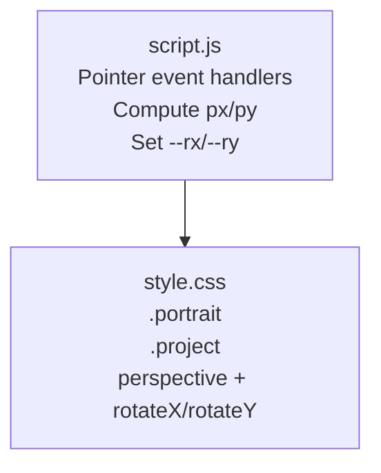
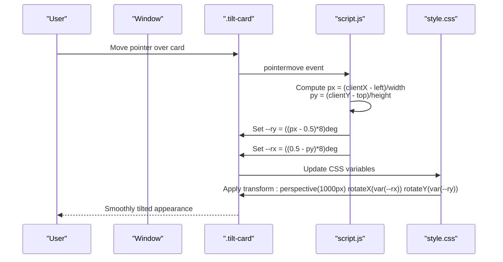
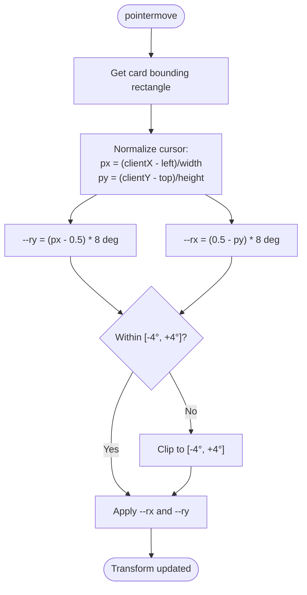
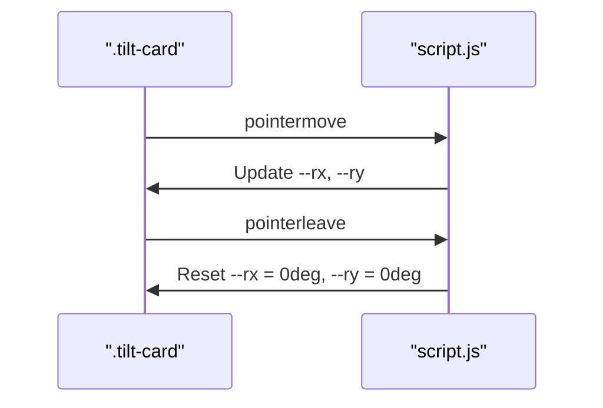
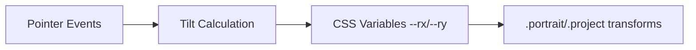

# 3D Tilt Transforms

<cite>
**Referenced Files in This Document**
- [script.js](file://files/script.js)
- [style.css](file://files/style.css)
</cite>

## Table of Contents
1. [Introduction](#introduction)
2. [Project Structure](#project-structure)
3. [Core Components](#core-components)
4. [Architecture Overview](#architecture-overview)
5. [Detailed Component Analysis](#detailed-component-analysis)
6. [Dependency Analysis](#dependency-analysis)
7. [Performance Considerations](#performance-considerations)
8. [Troubleshooting Guide](#troubleshooting-guide)
9. [Conclusion](#conclusion)

## Introduction
This document explains the 3D tilt effect applied to portrait and project cards. It covers how mouse position is converted into perspective-aware rotation values, the mathematical formulas used for rotateX and rotateY, boundary conditions that limit maximum tilt angles, transition and perspective settings, performance optimizations, and guidance for touch devices and reduced motion preferences.

The implementation uses:
- JavaScript to compute normalized cursor positions relative to each card and update CSS custom properties for rotation.
- CSS to apply a perspective transform and animate transitions when those custom properties change.

## Project Structure
The tilt behavior spans two files:
- JavaScript calculates pointer coordinates and sets CSS variables on target elements.
- CSS applies perspective and rotation transforms using those variables.

**Diagram sources**
- [script.js:141-198](file://files/script.js#L141-L198)
- [style.css:118-118](file://files/style.css#L118-L118)
- [style.css:183-184](file://files/style.css#L183-L184)

**Section sources**
- [script.js:141-198](file://files/script.js#L141-L198)
- [style.css:118-118](file://files/style.css#L118-L118)
- [style.css:183-184](file://files/style.css#L183-L184)

## Core Components
- Tilt calculation logic runs only on non-coarse pointers (desktop-like devices) and when reduced motion is not preferred.
- For each element with class `tilt-card`, pointermove updates two CSS custom properties:
  - `--ry` controls horizontal rotation (rotateY).
  - `--rx` controls vertical rotation (rotateX).
- The CSS classes `.portrait` and `.project` apply a perspective transform and use these variables to rotate the element.

Key behaviors:
- On pointerleave, both `--rx` and `--ry` are reset to zero degrees.
- The maximum tilt magnitude is approximately ±4 degrees due to the multiplier used in calculations.

**Section sources**
- [script.js:141-198](file://files/script.js#L141-L198)
- [style.css:118-118](file://files/style.css#L118-L118)
- [style.css:183-184](file://files/style.css#L183-L184)

## Architecture Overview
The tilt system follows a simple event-to-CSS pipeline:

**Diagram sources**
- [script.js:184-197](file://files/script.js#L184-L197)
- [style.css:118-118](file://files/style.css#L118-L118)
- [style.css:183-184](file://files/style.css#L183-L184)

## Detailed Component Analysis

### Mathematical Formulas and Boundary Conditions
- Normalized position within the card:
  - px = (event.clientX - rect.left) / rect.width
  - py = (event.clientY - rect.top) / rect.height
- Rotation variables:
  - --ry = (px - 0.5) * 8 degrees
  - --rx = (0.5 - py) * 8 degrees
- Resulting transforms:
  - rotateY(--ry) rotates around the vertical axis based on horizontal cursor position.
  - rotateX(--rx) rotates around the horizontal axis based on vertical cursor position.
- Boundary conditions:
  - When px ranges from 0 to 1, --ry ranges from -4 to +4 degrees.
  - When py ranges from 0 to 1, --rx ranges from +4 to -4 degrees.
  - These limits prevent excessive rotation and keep the effect subtle.

**Diagram sources**
- [script.js:184-197](file://files/script.js#L184-L197)

**Section sources**
- [script.js:184-197](file://files/script.js#L184-L197)

### Perspective Settings and Transition Configuration
- Portrait card:
  - Uses a perspective value of 1000px.
  - Applies rotateX and rotateY via CSS variables.
  - Has a smooth transition for transform changes.
- Project card:
  - Also uses a perspective value of 1000px.
  - Combines tilt variables with hover-based translate and scale variables.
  - Includes transitions for transform and related properties.

These settings ensure consistent depth perception across both card types and smooth visual feedback during interaction.

**Section sources**
- [style.css:118-118](file://files/style.css#L118-L118)
- [style.css:183-184](file://files/style.css#L183-L184)

### Example Transform Calculations
- Center of card:
  - px ≈ 0.5, py ≈ 0.5 → --ry ≈ 0°, --rx ≈ 0°
  - No visible tilt; card remains flat.
- Left edge:
  - px ≈ 0 → --ry ≈ -4°
  - Card tilts slightly to the left.
- Right edge:
  - px ≈ 1 → --ry ≈ +4°
  - Card tilts slightly to the right.
- Top edge:
  - py ≈ 0 → --rx ≈ +4°
  - Card tilts upward.
- Bottom edge:
  - py ≈ 1 → --rx ≈ -4°
  - Card tilts downward.

These examples illustrate how cursor position maps to rotation angles within the defined boundaries.

[No sources needed since this section provides conceptual examples derived from the formulas above]

### Event Handling and Reset Behavior
- pointermove updates the CSS variables continuously while the pointer is over the card.
- pointerleave resets both variables to zero degrees, returning the card to its default orientation.

**Diagram sources**
- [script.js:184-197](file://files/script.js#L184-L197)

**Section sources**
- [script.js:184-197](file://files/script.js#L184-L197)

## Dependency Analysis
The tilt feature depends on:
- Pointer events being available and not suppressed by device capability checks.
- Elements having the `tilt-card` class so they can be selected and bound to events.
- CSS variables `--rx` and `--ry` being consumed by the transform rules in `.portrait` and `.project`.

**Diagram sources**
- [script.js:141-198](file://files/script.js#L141-L198)
- [style.css:118-118](file://files/style.css#L118-L118)
- [style.css:183-184](file://files/style.css#L183-L184)

**Section sources**
- [script.js:141-198](file://files/script.js#L141-L198)
- [style.css:118-118](file://files/style.css#L118-L118)
- [style.css:183-184](file://files/style.css#L183-L184)

## Performance Considerations
- GPU acceleration:
  - The transforms use perspective and rotation, which are typically composited by the GPU.
  - Using CSS variables avoids expensive layout recalculations and keeps updates on the compositor thread where possible.
- will-change property:
  - While not explicitly present in the current styles, adding `will-change: transform` to `.portrait` and `.project` can further hint the browser to promote layers and optimize rendering for frequent transform updates.
- Reduced motion:
  - The script disables pointer effects when `prefers-reduced-motion: reduce` is detected, avoiding unnecessary work and ensuring accessibility.
- Passive listeners:
  - Pointer move listeners are registered with passive options to improve scroll performance and responsiveness.

Recommendations:
- Add `will-change: transform` to `.portrait` and `.project` if you observe jank on low-end devices.
- Keep the tilt multiplier modest (as implemented) to minimize heavy compositing.
- Avoid animating properties that trigger layout or paint beyond transform and opacity.

**Section sources**
- [script.js:141-198](file://files/script.js#L141-L198)
- [style.css:118-118](file://files/style.css#L118-L118)
- [style.css:183-184](file://files/style.css#L183-L184)

## Troubleshooting Guide
- Touch devices do not tilt:
  - The tilt code is gated behind a coarse-pointer check, so touch devices skip the effect. This is intentional to avoid conflicts with touch interactions.
  - If you want to enable tilt on touch devices, remove or adjust the coarse-pointer guard and handle touchmove events carefully.
- Reduced motion preference:
  - When `prefers-reduced-motion: reduce` is set, all pointer-based effects are disabled. This ensures accessibility and reduces motion sensitivity.
  - To test, open developer tools and toggle the reduced motion preference.
- Cards not responding to hover:
  - Ensure the card elements have the `tilt-card` class. Only elements with this class are bound to pointer events.
  - Verify that the CSS classes `.portrait` and `.project` include the perspective and rotation transforms consuming `--rx` and `--ry`.
- Excessive or jittery tilt:
  - The multiplier determines maximum tilt angle. A smaller multiplier yields subtler movement.
  - Ensure transitions are smooth and not conflicting with other transform animations.

**Section sources**
- [script.js:141-198](file://files/script.js#L141-L198)
- [style.css:118-118](file://files/style.css#L118-L118)
- [style.css:183-184](file://files/style.css#L183-L184)

## Conclusion
The 3D tilt effect combines lightweight JavaScript calculations with CSS perspective transforms to create a subtle, accessible interactive experience. By normalizing cursor position and mapping it to bounded rotation angles, the system maintains visual consistency and performance. The implementation respects user preferences and device capabilities, providing a smooth tilt on desktop-like devices while gracefully degrading on touch devices and for users who prefer reduced motion.