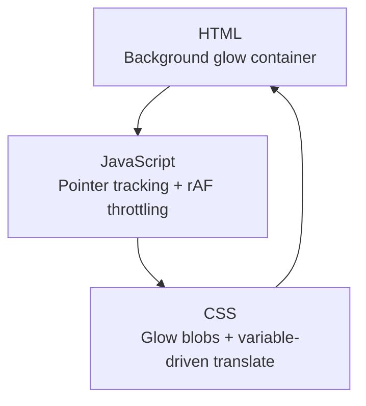
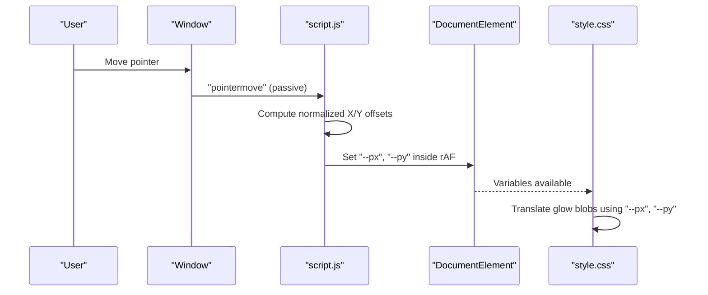
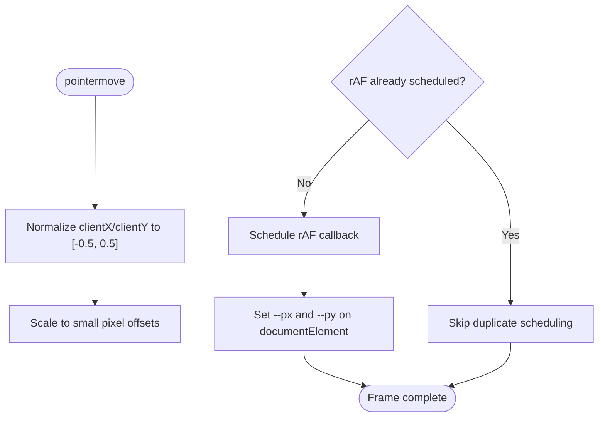
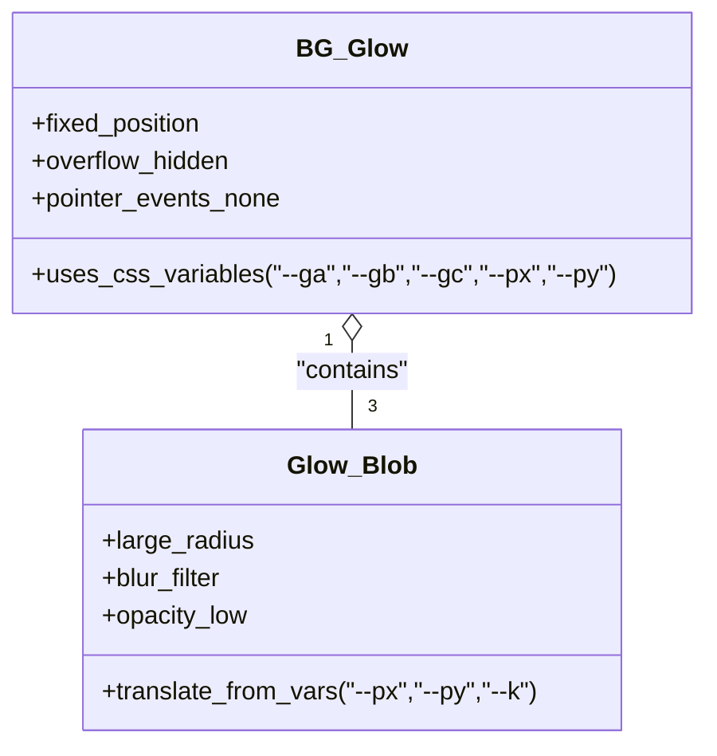
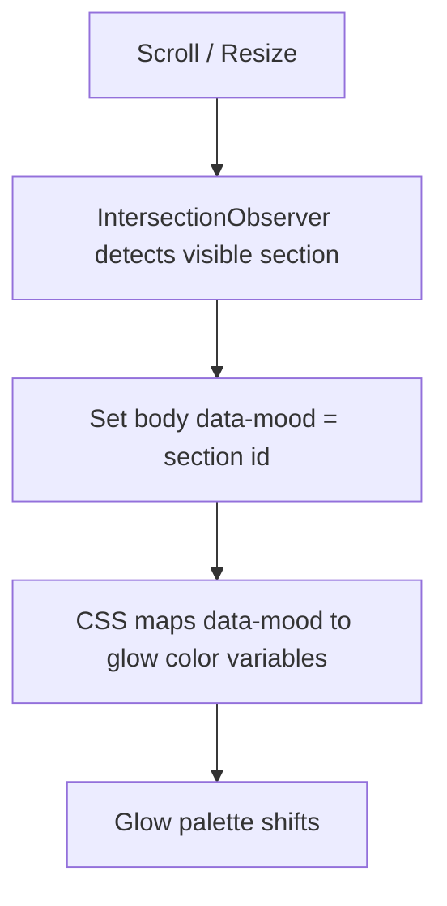
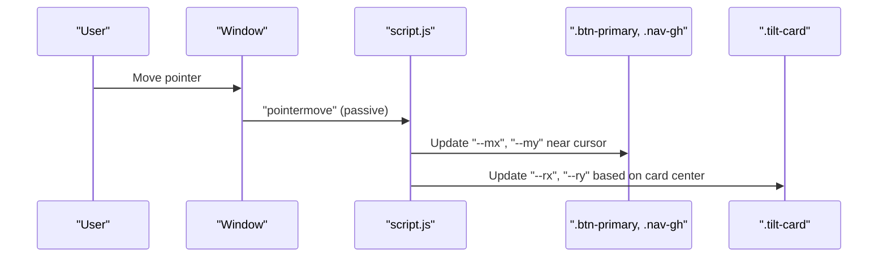
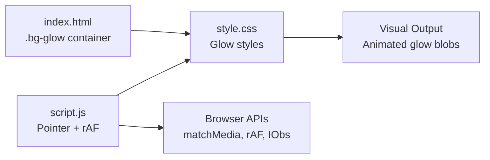

# Ambient Glow System

<cite>
**Referenced Files in This Document**
- [index.html](file://files/index.html)
- [script.js](file://files/script.js)
- [style.css](file://files/style.css)
</cite>

## Table of Contents
1. [Introduction](#introduction)
2. [Project Structure](#project-structure)
3. [Core Components](#core-components)
4. [Architecture Overview](#architecture-overview)
5. [Detailed Component Analysis](#detailed-component-analysis)
6. [Dependency Analysis](#dependency-analysis)
7. [Performance Considerations](#performance-considerations)
8. [Troubleshooting Guide](#troubleshooting-guide)
9. [Conclusion](#conclusion)

## Introduction
This document explains the ambient glow tracking system that follows pointer movement to create dynamic background effects. The system:
- Detects coarse pointers (typical for mobile devices) and disables heavy pointer-driven effects on touch-first devices.
- Tracks mouse/pointer position and updates CSS custom properties used by the background glow layer.
- Uses `requestAnimationFrame` throttling and passive event listeners for smooth, performant updates.
- Integrates with section-aware mood colors so the glow palette shifts as the user scrolls through sections.

The implementation is part of a portfolio site where the glow is a decorative background layer behind all content.

## Project Structure
The ambient glow feature spans three files:
- HTML defines the glow container and the page structure.
- JavaScript handles pointer events, calculates normalized offsets, and writes CSS variables.
- CSS renders the glow blobs and animates them using the CSS variables set by JavaScript.

**Diagram sources**
- [index.html:20-20](file://files/index.html#L20-L20)
- [script.js:141-156](file://files/script.js#L141-L156)
- [style.css:51-63](file://files/style.css#L51-L63)

**Section sources**
- [index.html:1-158](file://files/index.html#L1-L158)
- [script.js:1-249](file://files/script.js#L1-L249)
- [style.css:1-268](file://files/style.css#L1-L268)

## Core Components
- Background glow container: A fixed, full-screen container holding three blurred gradient blobs. It uses CSS custom properties for color and translation.
- Pointer tracker: A lightweight handler that computes normalized X/Y offsets from the viewport and schedules CSS variable updates via `requestAnimationFrame`.
- Coarse pointer guard: Disables pointer-driven effects when the device has a coarse pointer or prefers reduced motion.
- Section mood integration: Updates a body data attribute per section; CSS maps this to different glow color palettes.

Key responsibilities:
- Event handling: pointermove with passive listeners.
- Position calculation: Normalized coordinates mapped to small pixel offsets.
- Variable updates: Writing `--px` and `--py` on the root element.
- Visual rendering: CSS translates glow blobs based on those variables.

**Section sources**
- [index.html:20-20](file://files/index.html#L20-L20)
- [script.js:141-156](file://files/script.js#L141-L156)
- [style.css:51-63](file://files/style.css#L51-L63)

## Architecture Overview
The ambient glow system is a simple pipeline:
1. User moves the pointer.
2. Passive `pointermove` listener captures coordinates.
3. Normalized offsets are computed.
4. A single `requestAnimationFrame` callback writes `--px` and `--py` to the document root.
5. CSS reads these variables to translate the glow blobs.
6. Section changes update the glow palette via `body[data-mood]`.

**Diagram sources**
- [script.js:141-156](file://files/script.js#L141-L156)
- [style.css:51-63](file://files/style.css#L51-L63)

## Detailed Component Analysis

### Pointer Event Handling and Coarse Pointer Detection
- The script checks for coarse pointers and reduced motion preferences before enabling pointer-driven effects.
- When both conditions allow it, two pointer-related behaviors are enabled:
  - Ambient glow tracking.
  - Magnetic pull on primary buttons and navigation link.
- All pointer listeners are passive to avoid blocking scrolling.

Implementation highlights:
- Coarse pointer detection prevents unnecessary work on touch devices.
- Reduced motion preference disables animations and pointer effects for accessibility.

**Section sources**
- [script.js:1-3](file://files/script.js#L1-L3)
- [script.js:141-156](file://files/script.js#L141-L156)
- [script.js:158-182](file://files/script.js#L158-L182)

### Mouse Position Tracking and CSS Variable Updates
- On each pointer move, the code computes:
  - Horizontal offset: `(clientX / innerWidth - 0.5) * 10`
  - Vertical offset: `(clientY / innerHeight - 0.5) * 8`
- These values are written to `--px` and `--py` on the document root inside a single `requestAnimationFrame` callback.
- Using rAF ensures only one DOM write per frame, even if multiple pointer events arrive within the same frame.

**Diagram sources**
- [script.js:141-156](file://files/script.js#L141-L156)

**Section sources**
- [script.js:141-156](file://files/script.js#L141-L156)

### CSS Variable Usage for Real-Time Glow Positioning
- The glow container holds three `.glow` elements with large blur and low opacity.
- Each blob’s `translate` is driven by `var(--px)` and `var(--py)` multiplied by a per-blob scale factor (`--k`).
- CSS transitions ease the movement, making the glow feel fluid rather than jittery.

**Diagram sources**
- [style.css:51-63](file://files/style.css#L51-L63)

**Section sources**
- [style.css:51-63](file://files/style.css#L51-L63)

### Section-Aware Mood Colors
- As the user scrolls, an IntersectionObserver sets `body.dataset.mood` to the current section ID.
- CSS rules map each mood value to a different combination of glow colors.
- This creates a subtle “mood shift” in the ambient glow as users navigate between sections.

**Diagram sources**
- [script.js:109-139](file://files/script.js#L109-L139)
- [style.css:51-57](file://files/style.css#L51-L57)

**Section sources**
- [script.js:109-139](file://files/script.js#L109-L139)
- [style.css:51-57](file://files/style.css#L51-L57)

### Magnetic Pull and Tilt Effects (Related Pointer Behaviors)
- Magnetic pull applies small translations to primary buttons and the GitHub nav link based on pointer proximity.
- Tilt effects apply subtle 3D rotation to portrait and project cards.
- Both use the same performance pattern: passive listeners and rAF-throttled updates.

**Diagram sources**
- [script.js:158-197](file://files/script.js#L158-L197)

**Section sources**
- [script.js:158-197](file://files/script.js#L158-L197)

## Dependency Analysis
The ambient glow system depends on:
- DOM structure: The `.bg-glow` container must exist.
- CSS variables: `--px`, `--py`, and mood-driven color variables.
- Browser APIs: `window.matchMedia`, `requestAnimationFrame`, `IntersectionObserver`, and pointer events.

**Diagram sources**
- [index.html:20-20](file://files/index.html#L20-L20)
- [script.js:141-156](file://files/script.js#L141-L156)
- [style.css:51-63](file://files/style.css#L51-L63)

**Section sources**
- [index.html:20-20](file://files/index.html#L20-L20)
- [script.js:141-156](file://files/script.js#L141-L156)
- [style.css:51-63](file://files/style.css#L51-L63)

## Performance Considerations
- Passive event listeners: All pointer listeners are registered with `{ passive: true }` to prevent layout thrashing and improve scroll performance.
- rAF throttling: Only one DOM write per frame occurs for glow and magnetic effects, avoiding redundant style recalculations.
- Small offsets: Glow offsets are intentionally small to minimize visual jitter while keeping the effect subtle.
- Conditional activation: Effects are disabled for coarse pointers and reduced motion preferences, reducing work on constrained devices.

[No sources needed since this section provides general guidance]

## Troubleshooting Guide
Common issues and resolutions:
- Glow does not move:
  - Verify that the `.bg-glow` container exists in the markup.
  - Ensure `--px` and `--py` are being set on the document root during pointer movement.
  - Confirm that CSS references `var(--px)` and `var(--py)` in the glow transform.
- Effects do not appear on mobile:
  - Coarse pointer detection intentionally disables pointer-driven effects on touch devices.
  - Check `prefers-reduced-motion`; if enabled, animations and pointer effects are disabled.
- Jittery or laggy glow:
  - Ensure listeners remain passive and rAF throttling is active.
  - Avoid adding heavy synchronous work inside pointer handlers.

**Section sources**
- [index.html:20-20](file://files/index.html#L20-L20)
- [script.js:141-156](file://files/script.js#L141-L156)
- [style.css:51-63](file://files/style.css#L51-L63)

## Conclusion
The ambient glow system is a lightweight, performance-conscious feature that enhances the visual experience without compromising usability. It leverages modern browser APIs, passive listeners, and rAF throttling to deliver smooth interactions. The design also respects accessibility by disabling effects under reduced motion and adapting behavior for coarse pointers.

[No sources needed since this section summarizes without analyzing specific files]