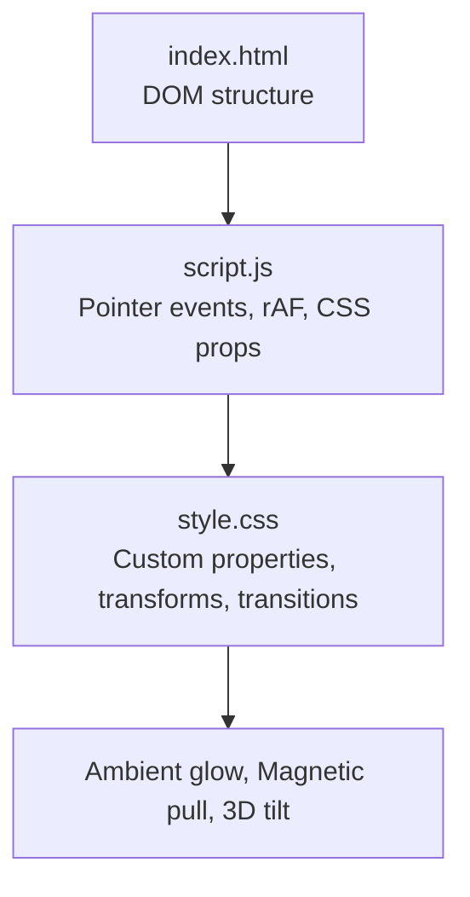
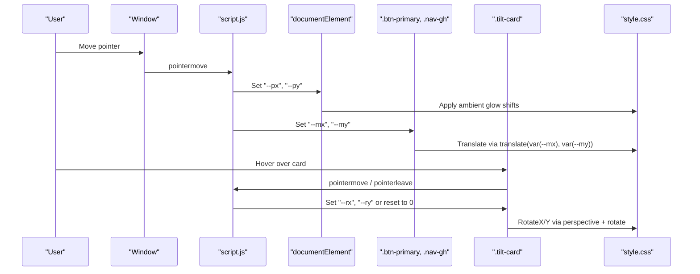
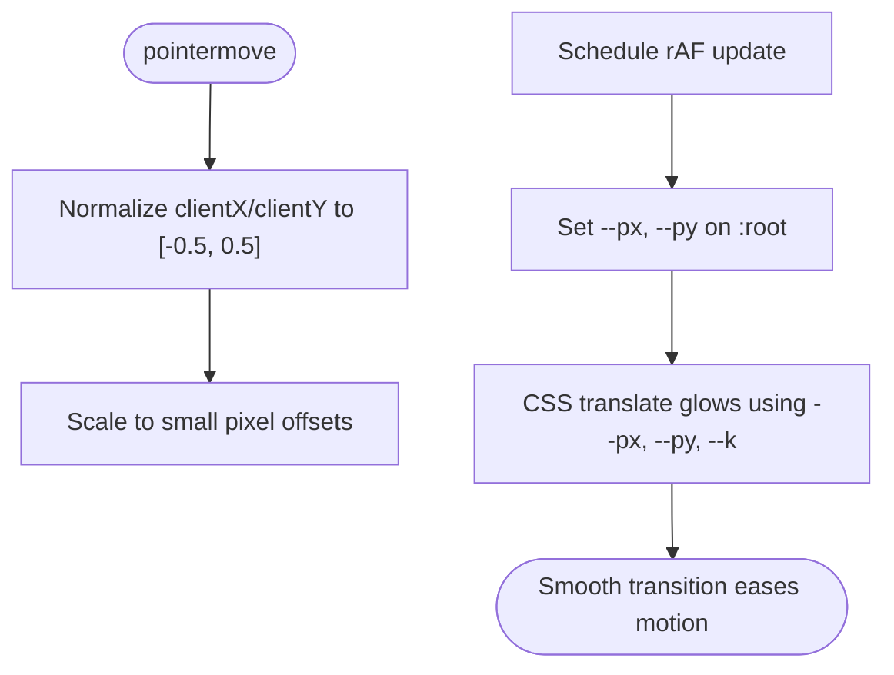
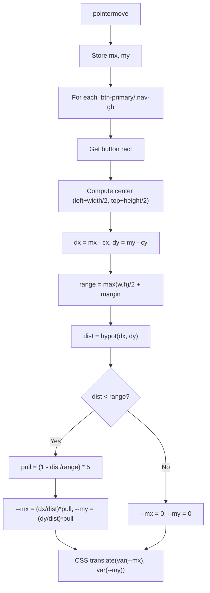
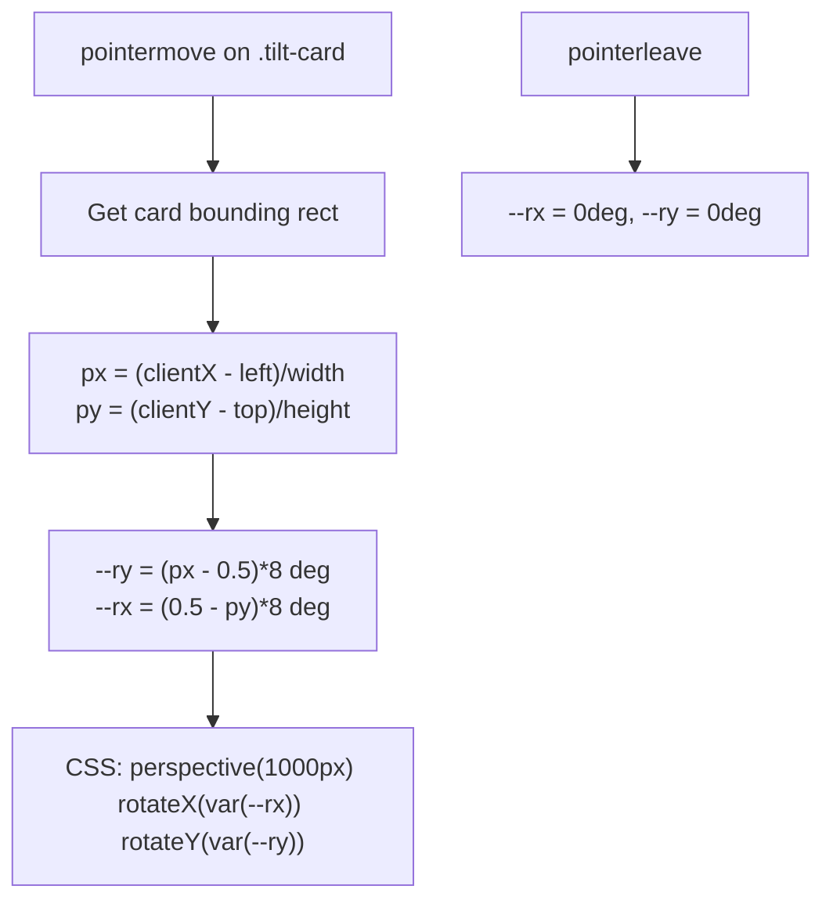
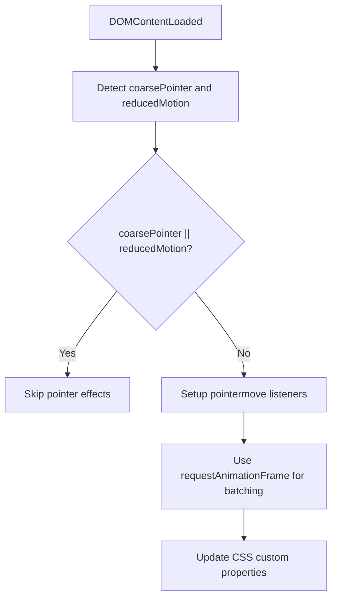
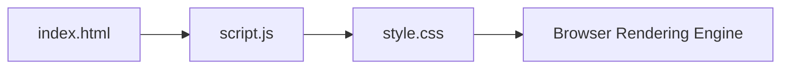

# Interactive Mouse Effects

<cite>
**Referenced Files in This Document**
- [script.js](file://files/script.js)
- [style.css](file://files/style.css)
- [index.html](file://files/index.html)
</cite>

## Table of Contents
1. [Introduction](#introduction)
2. [Project Structure](#project-structure)
3. [Core Components](#core-components)
4. [Architecture Overview](#architecture-overview)
5. [Detailed Component Analysis](#detailed-component-analysis)
6. [Dependency Analysis](#dependency-analysis)
7. [Performance Considerations](#performance-considerations)
8. [Troubleshooting Guide](#troubleshooting-guide)
9. [Conclusion](#conclusion)

## Introduction
This document explains the mouse-reactive interactive effects implemented in the portfolio: ambient glow tracking, magnetic pull on primary buttons and GitHub links, and 3D tilt on portrait and project cards. It covers pointer event handling with coarse pointer detection for mobile devices, how CSS custom properties are updated to drive visual changes, distance calculations and pull strength algorithms, transform math and boundary conditions, and performance optimizations such as requestAnimationFrame and passive event listeners. It also includes troubleshooting guidance for touch device compatibility and reduced motion preferences.

## Project Structure
The interactive behavior is implemented across three files:
- HTML provides the DOM structure and elements that participate in interactions (e.g., background glow container, buttons, portrait card, project cards).
- CSS defines design tokens, animations, transitions, and uses CSS custom properties to visualize effects (e.g., --px, --py for ambient glow; --mx, --my for magnetic pull; --rx, --ry for 3D tilt).
- JavaScript listens to pointer events, computes values, updates CSS custom properties, and gates features based on device capabilities and user preferences.

**Diagram sources**
- [index.html:10-20](file://files/index.html#L10-L20)
- [script.js:1-214](file://files/script.js#L1-L214)
- [style.css:51-84](file://files/style.css#L51-L84)

**Section sources**
- [index.html:10-20](file://files/index.html#L10-L20)
- [script.js:1-214](file://files/script.js#L1-L214)
- [style.css:51-84](file://files/style.css#L51-L84)

## Core Components
- Ambient Glow Tracking: Updates CSS custom properties --px and --py on the root element based on normalized pointer position, causing background glows to shift subtly.
- Magnetic Pull Effect: Computes distance between pointer and button centers, applies a directional offset via --mx and --my up to a maximum pull, then smoothly returns using CSS transitions.
- 3D Tilt Effect: Calculates normalized pointer position within a card’s bounding box and maps it to rotation angles --rx and --ry applied through CSS perspective and rotate transforms.

Key behaviors are gated by:
- Coarse pointer detection (pointer: coarse) to disable these effects on touch devices.
- Reduced motion preference (prefers-reduced-motion: reduce) to disable animations and interactive effects.

**Section sources**
- [script.js:1-4](file://files/script.js#L1-L4)
- [script.js:141-198](file://files/script.js#L141-L198)
- [style.css:51-84](file://files/style.css#L51-L84)
- [style.css:118-120](file://files/style.css#L118-L120)
- [style.css:183-184](file://files/style.css#L183-L184)

## Architecture Overview
The system follows a simple event-driven architecture:
- Pointer events are captured at the window level for ambient glow and magnetic pull.
- Per-card pointer events update tilt properties.
- All computed values are written as CSS custom properties on appropriate elements.
- CSS handles the visual transformation using transitions and transforms.

**Diagram sources**
- [script.js:141-198](file://files/script.js#L141-L198)
- [style.css:51-84](file://files/style.css#L51-L84)
- [style.css:118-120](file://files/style.css#L118-L120)
- [style.css:183-184](file://files/style.css#L183-L184)

## Detailed Component Analysis

### Ambient Glow Tracking
Behavior:
- Normalizes pointer coordinates relative to viewport width/height.
- Scales offsets to small pixel ranges for subtle movement.
- Uses requestAnimationFrame to batch updates and avoid layout thrash.
- Writes --px and --py to the root element.
- CSS translates the glow elements using calc(var(--px)*var(--k), var(--py)*var(--k)), where each glow has its own multiplier (--k) for varied movement.

**Diagram sources**
- [script.js:141-156](file://files/script.js#L141-L156)
- [style.css:51-63](file://files/style.css#L51-L63)

**Section sources**
- [script.js:141-156](file://files/script.js#L141-L156)
- [style.css:51-63](file://files/style.css#L51-L63)

### Magnetic Pull Effect
Targets:
- Primary call-to-action buttons (.btn-primary).
- Navigation GitHub link (.nav-gh).

Algorithm:
- On pointermove, record pointer coordinates.
- For each target button:
  - Compute center of the button rectangle.
  - Calculate dx, dy from pointer to center.
  - Determine range as half of max(width, height) plus an extra margin.
  - Compute distance using hypotenuse.
  - If within range, compute pull magnitude as (1 - dist/range) * maxPull (max ~5px).
  - Convert direction to unit vector and multiply by pull magnitude to get --mx, --my.
  - If outside range, reset --mx, --my to zero.
- CSS applies translate(var(--mx), var(--my)) with smooth transitions.

**Diagram sources**
- [script.js:158-182](file://files/script.js#L158-L182)
- [style.css:75-84](file://files/style.css#L75-L84)

**Section sources**
- [script.js:158-182](file://files/script.js#L158-L182)
- [style.css:75-84](file://files/style.css#L75-L84)

### 3D Tilt Effect
Targets:
- Portrait card (.portrait.tilt-card).
- Project cards (.project.tilt-card).

Algorithm:
- On pointermove over a tilt card:
  - Get the card’s bounding rectangle.
  - Compute normalized x and y positions within the card (0..1).
  - Map to rotation angles:
    - --ry = (x - 0.5) * 8 degrees (horizontal tilt).
    - --rx = (0.5 - y) * 8 degrees (vertical tilt).
  - On pointerleave, reset --rx and --ry to 0.
- CSS applies perspective(1000px) and rotates using rotateX(var(--rx)) and rotateY(var(--ry)).

Boundary Conditions:
- The mapping ensures rotations stay within approximately ±4 degrees due to the factor of 8 and normalized input range.
- Transitions ensure smooth return to flat orientation when the pointer leaves.

**Diagram sources**
- [script.js:184-197](file://files/script.js#L184-L197)
- [style.css:118-120](file://files/style.css#L118-L120)
- [style.css:183-184](file://files/style.css#L183-L184)

**Section sources**
- [script.js:184-197](file://files/script.js#L184-L197)
- [style.css:118-120](file://files/style.css#L118-L120)
- [style.css:183-184](file://files/style.css#L183-L184)

### Pointer Event Handling and Device Detection
- Coarse Pointer Detection:
  - Uses matchMedia("(pointer: coarse)") to detect touch-capable devices.
  - When coarse pointer is true, all mouse-reactive effects are disabled.
- Reduced Motion Preference:
  - Uses matchMedia("(prefers-reduced-motion: reduce)").
  - Disables welcome overlay animation and other motion-heavy features.
- Passive Event Listeners:
  - Scroll and pointermove listeners use { passive: true } to improve scrolling performance and avoid main-thread blocking.

**Diagram sources**
- [script.js:1-4](file://files/script.js#L1-L4)
- [script.js:141-198](file://files/script.js#L141-L198)

**Section sources**
- [script.js:1-4](file://files/script.js#L1-L4)
- [script.js:141-198](file://files/script.js#L141-L198)

## Dependency Analysis
- script.js depends on:
  - DOM elements defined in index.html (e.g., .bg-glow, .btn-primary, .nav-gh, .portrait.tilt-card, .project.tilt-card).
  - CSS custom properties and transforms defined in style.css.
- style.css depends on:
  - Custom properties set by script.js (--px, --py, --mx, --my, --rx, --ry).
  - Structural classes and elements present in index.html.

**Diagram sources**
- [index.html:10-20](file://files/index.html#L10-L20)
- [script.js:141-198](file://files/script.js#L141-L198)
- [style.css:51-84](file://files/style.css#L51-L84)

**Section sources**
- [index.html:10-20](file://files/index.html#L10-L20)
- [script.js:141-198](file://files/script.js#L141-L198)
- [style.css:51-84](file://files/style.css#L51-L84)

## Performance Considerations
- requestAnimationFrame Batching:
  - Ambient glow and magnetic pull update CSS properties inside rAF callbacks to minimize layout recalculations and jank.
- Passive Event Listeners:
  - pointermove and scroll listeners are registered with { passive: true }, improving scrolling responsiveness and avoiding potential main-thread contention.
- Minimal DOM Writes:
  - Only CSS custom properties are updated; heavy DOM mutations are avoided during high-frequency events.
- Transition-Based Easing:
  - CSS transitions handle smoothing of property changes, offloading work to the compositor where possible.

[No sources needed since this section provides general guidance]

## Troubleshooting Guide
Touch Device Compatibility:
- Symptom: No ambient glow, magnetic pull, or 3D tilt on mobile/tablet.
- Cause: Coarse pointer detection disables these effects intentionally.
- Resolution:
  - Accept the default behavior for better UX on touch devices.
  - If you must enable effects, remove the coarsePointer check in the script, but test thoroughly for performance and usability.

Reduced Motion Preferences:
- Symptom: Welcome overlay and other animations do not play; some effects may be disabled.
- Cause: prefers-reduced-motion: reduce is detected and used to skip animations and interactive effects.
- Resolution:
  - Respect user preference for accessibility.
  - If testing without reduced motion, ensure your OS/browser setting is not forcing reduced motion.

Magnetic Pull Not Triggering:
- Symptom: Buttons do not move toward the cursor.
- Causes:
  - Element class mismatch (must be .btn-primary or .nav-gh).
  - Coarse pointer or reduced motion enabled.
- Resolution:
  - Verify the element has the correct class.
  - Check device capability flags in the console or inspect the code path gating effects.

3D Tilt Not Working:
- Symptom: Portrait or project cards do not tilt.
- Causes:
  - Missing .tilt-card class on the element.
  - Coarse pointer or reduced motion enabled.
- Resolution:
  - Ensure the element has the .tilt-card class.
  - Confirm that pointer events are firing and CSS custom properties --rx and --ry are being set.

Passive Listener Conflicts:
- Symptom: Scrolling feels less responsive or warnings about passive listeners.
- Cause: Non-passive listeners on scroll or pointermove can block rendering.
- Resolution:
  - Ensure listeners are registered with { passive: true }.
  - Avoid calling preventDefault() in passive handlers.

**Section sources**
- [script.js:1-4](file://files/script.js#L1-L4)
- [script.js:141-198](file://files/script.js#L141-L198)
- [style.css:234-240](file://files/style.css#L234-L240)

## Conclusion
The portfolio implements a cohesive set of mouse-reactive effects driven by lightweight JavaScript and expressive CSS. Ambient glow tracks pointer position via CSS custom properties, magnetic pull adds tactile feedback to key actions, and 3D tilt enhances depth perception on cards. The implementation prioritizes performance with requestAnimationFrame and passive event listeners, while respecting device capabilities and user preferences for reduced motion. These patterns provide a strong foundation for accessible, performant interactive experiences.