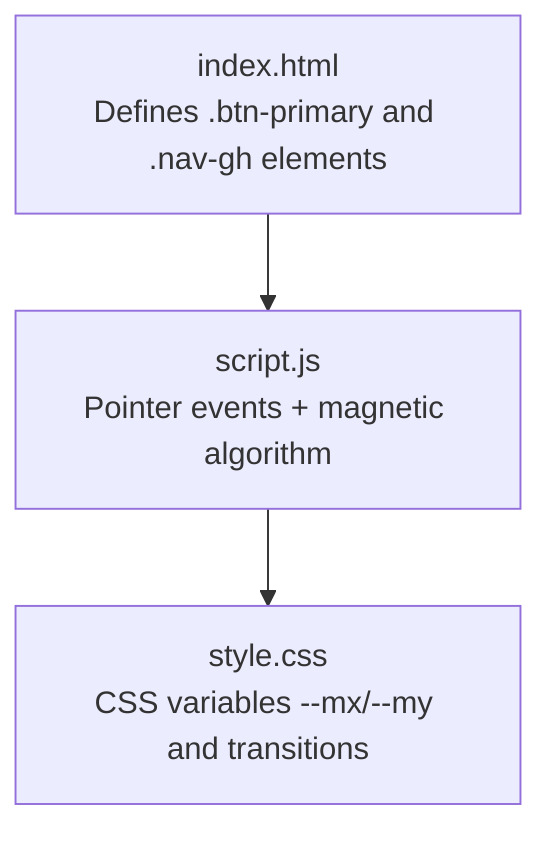
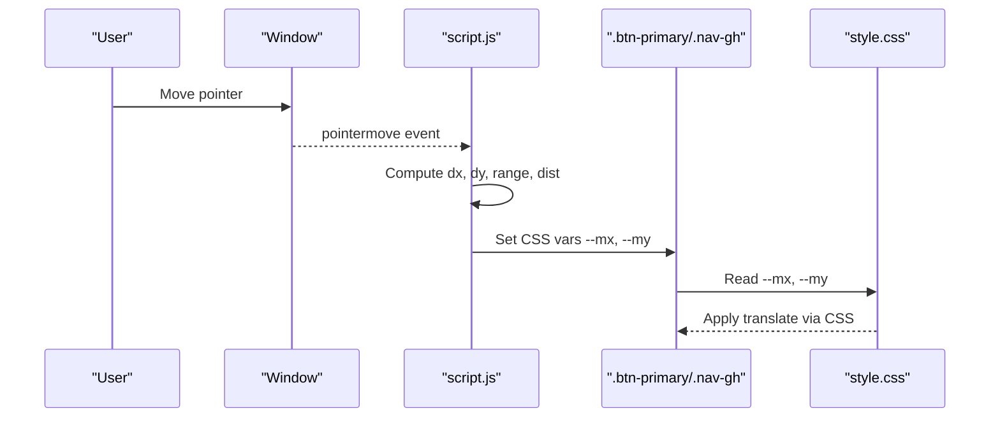
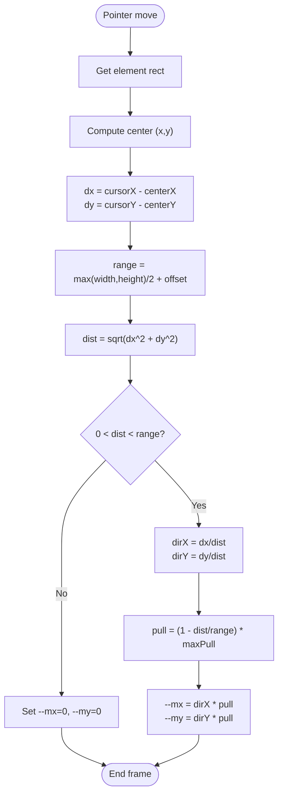
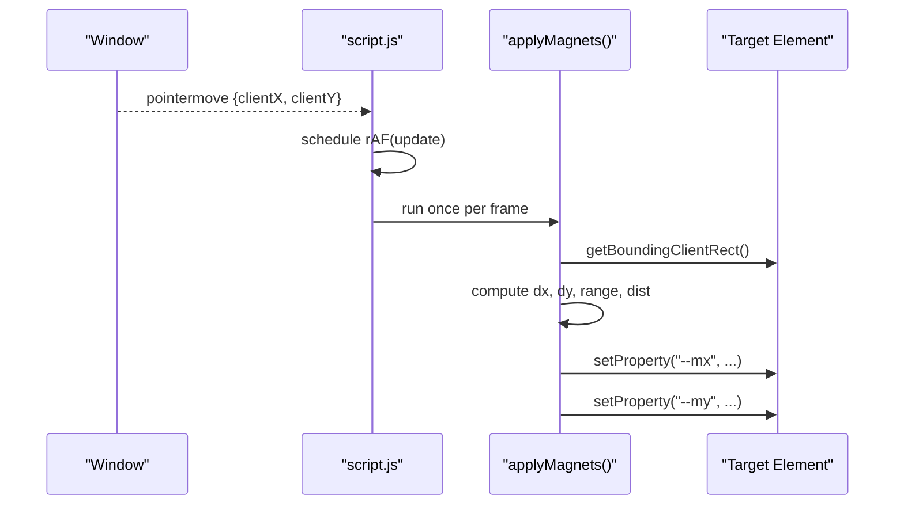
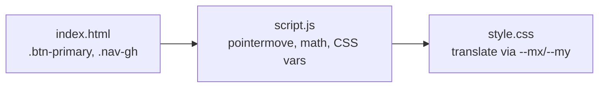

# Magnetic Button Effects

<cite>
**Referenced Files in This Document**
- [script.js](file://files/script.js)
- [style.css](file://files/style.css)
- [index.html](file://files/index.html)
</cite>

## Table of Contents
1. [Introduction](#introduction)
2. [Project Structure](#project-structure)
3. [Core Components](#core-components)
4. [Architecture Overview](#architecture-overview)
5. [Detailed Component Analysis](#detailed-component-analysis)
6. [Dependency Analysis](#dependency-analysis)
7. [Performance Considerations](#performance-considerations)
8. [Troubleshooting Guide](#troubleshooting-guide)
9. [Conclusion](#conclusion)

## Introduction
This document explains the magnetic pull effect applied to primary buttons and GitHub links in the portfolio. It covers how proximity between the cursor and target elements is calculated, how pull strength is derived from distance thresholds and maximum pull limits, and how transform calculations are applied for smooth GPU-accelerated animations. It also includes event handling setup, boundary conditions that prevent excessive pulling, performance considerations such as animation frame optimization, and cleanup procedures when elements are removed from the DOM.

## Project Structure
The magnetic effect is implemented using:
- JavaScript logic for pointer tracking, distance calculation, and CSS variable updates
- CSS variables for transform offsets and transitions
- HTML elements with specific classes that act as magnetic targets

**Diagram sources**
- [index.html:33-35](file://files/index.html#L33-L35)
- [index.html:47-50](file://files/index.html#L47-L50)
- [script.js:141-182](file://files/script.js#L141-L182)
- [style.css:75-84](file://files/style.css#L75-L84)

**Section sources**
- [index.html:33-35](file://files/index.html#L33-L35)
- [index.html:47-50](file://files/index.html#L47-L50)
- [script.js:141-182](file://files/script.js#L141-L182)
- [style.css:75-84](file://files/style.css#L75-L84)

## Core Components
- Magnetic targets: Primary buttons (.btn-primary) and GitHub link (.nav-gh)
- Pointer tracking: Global mouse/pointer position stored in variables
- Distance calculation: Euclidean distance between cursor and element center
- Pull strength: Linear falloff based on distance within a defined range
- Transform application: CSS variables --mx and --my control translate via CSS translate property
- Animation frame throttling: requestAnimationFrame used to batch updates

Key responsibilities:
- script.js: Event listeners, math, and CSS variable updates
- style.css: Visual styling, transitions, and GPU-friendly transforms
- index.html: Markup defining magnetic targets

**Section sources**
- [script.js:141-182](file://files/script.js#L141-L182)
- [style.css:75-84](file://files/style.css#L75-L84)
- [index.html:33-35](file://files/index.html#L33-L35)
- [index.html:47-50](file://files/index.html#L47-L50)

## Architecture Overview
The magnetic effect follows a simple pipeline:
1. Track pointer movement globally
2. For each magnetic target, compute distance to cursor
3. If within range, calculate pull vector and magnitude
4. Update CSS variables --mx and --my
5. CSS applies translate using those variables with smooth transitions

**Diagram sources**
- [script.js:141-182](file://files/script.js#L141-L182)
- [style.css:75-84](file://files/style.css#L75-L84)

## Detailed Component Analysis

### Magnetic Target Selection
- Targets include primary buttons and the navigation GitHub link
- The selector gathers all matching elements once per interaction cycle

Implementation highlights:
- Selector: ".btn-primary, .nav-gh"
- Elements are queried at runtime to ensure current DOM state

**Section sources**
- [script.js:158-160](file://files/script.js#L158-L160)
- [index.html:33-35](file://files/index.html#L33-L35)
- [index.html:47-50](file://files/index.html#L47-L50)

### Event Handling Setup
- A single global pointermove listener captures cursor coordinates
- Updates are throttled using requestAnimationFrame to avoid layout thrashing
- Passive listeners improve scroll performance

Key behaviors:
- Cursor position stored in mx, my
- applyMagnets scheduled once per frame
- Reduced motion and coarse pointer checks disable effects where appropriate

**Section sources**
- [script.js:141-182](file://files/script.js#L141-L182)

### Distance-Based Attraction Algorithm
The algorithm computes proximity and determines whether to apply a magnetic pull:

- Center of element: (left + width/2, top + height/2)
- Delta: dx = cursorX - centerX; dy = cursorY - centerY
- Range: max(width, height)/2 + constant offset
- Distance: hypot(dx, dy)
- Condition: if 0 < distance < range, apply pull; else reset offsets

Mathematical details:
- Direction vector: normalized by dividing dx/dy by distance
- Pull magnitude: linear falloff from maximum pull at center to zero at range edge
- Maximum pull limit: fixed value (e.g., ~5px)

Boundary conditions:
- No pull when distance equals zero or exceeds range
- Offsets reset to zero outside range to ensure smooth return

**Diagram sources**
- [script.js:161-177](file://files/script.js#L161-L177)

**Section sources**
- [script.js:161-177](file://files/script.js#L161-L177)

### Transform Calculations and GPU Acceleration
- CSS variables --mx and --my are read by the button styles
- The translate property uses these variables to shift elements
- Transitions provide smooth easing back to origin when not under influence
- Using translate avoids triggering layout and leverages GPU compositing

Styling notes:
- Buttons use translate: var(--mx,0) var(--my,0)
- Transition properties ensure smooth motion and hover states remain intact

**Section sources**
- [style.css:75-84](file://files/style.css#L75-L84)

### Example Event Handling and Calculation Flow
- Global pointermove updates mx, my
- applyMagnets iterates over magnetic targets
- For each target:
  - Reads bounding rectangle
  - Computes dx, dy, range, dist
  - Sets --mx, --my accordingly
- requestAnimationFrame ensures one update per frame

**Diagram sources**
- [script.js:141-182](file://files/script.js#L141-L182)

**Section sources**
- [script.js:141-182](file://files/script.js#L141-L182)

### Boundary Conditions and Max Pull Limits
- Range threshold prevents pulling beyond a safe distance
- Zero-distance case handled by resetting offsets
- Max pull limit caps displacement to maintain usability

Practical implications:
- Prevents excessive movement near edges
- Ensures consistent behavior across different element sizes

**Section sources**
- [script.js:161-177](file://files/script.js#L161-L177)

## Dependency Analysis
- script.js depends on DOM elements with specific classes
- style.css defines visual behavior and transitions
- index.html provides markup for magnetic targets

**Diagram sources**
- [index.html:33-35](file://files/index.html#L33-L35)
- [index.html:47-50](file://files/index.html#L47-L50)
- [script.js:141-182](file://files/script.js#L141-L182)
- [style.css:75-84](file://files/style.css#L75-L84)

**Section sources**
- [index.html:33-35](file://files/index.html#L33-L35)
- [index.html:47-50](file://files/index.html#L47-L50)
- [script.js:141-182](file://files/script.js#L141-L182)
- [style.css:75-84](file://files/style.css#L75-L84)

## Performance Considerations
- Animation frame throttling:
  - Uses requestAnimationFrame to batch updates and minimize reflows
  - Prevents multiple updates per frame during rapid pointer movement
- Passive event listeners:
  - Improves scrolling performance by not blocking main thread
- GPU acceleration:
  - Uses translate and CSS transitions to leverage compositor
- Reduced motion support:
  - Disables pointer effects when user prefers reduced motion
- Coarse pointer detection:
  - Skips effects on touch devices to avoid unnecessary overhead

Cleanup procedures:
- When elements are removed from DOM, their CSS variables are no longer referenced
- No explicit removal of event listeners is required since they are bound to window
- Ensure dynamic elements added later are included in the selector query at runtime

Optimization tips:
- Avoid querying heavy selectors repeatedly; current approach queries only magnetic targets
- Keep transform operations minimal and rely on CSS variables for updates
- Use passive listeners for high-frequency events like pointermove

**Section sources**
- [script.js:141-182](file://files/script.js#L141-L182)
- [style.css:75-84](file://files/style.css#L75-L84)

## Troubleshooting Guide
Common issues and resolutions:
- Magnetic effect not appearing:
  - Verify elements have correct classes (.btn-primary, .nav-gh)
  - Check that pointer events are enabled (not blocked by reduced motion or coarse pointer)
- Excessive or jittery movement:
  - Confirm CSS transitions are present and not overridden
  - Ensure requestAnimationFrame is active and not blocked by heavy tasks
- Offsets not resetting:
  - Validate that distance check resets --mx and --my when outside range
  - Inspect computed styles for unexpected overrides

Debugging steps:
- Log mx, my and computed distances in applyMagnets
- Temporarily increase max pull to visualize direction vectors
- Use browser dev tools to inspect CSS variables on targets

**Section sources**
- [script.js:141-182](file://files/script.js#L141-L182)
- [style.css:75-84](file://files/style.css#L75-L84)

## Conclusion
The magnetic pull effect enhances interactivity by applying subtle, distance-based attraction to primary buttons and GitHub links. The implementation relies on efficient pointer tracking, precise mathematical calculations, and GPU-friendly CSS transforms. With animation frame throttling, passive listeners, and reduced motion support, it delivers smooth performance while maintaining accessibility. Proper boundary conditions ensure predictable behavior, and the modular design allows easy extension to additional interactive elements.