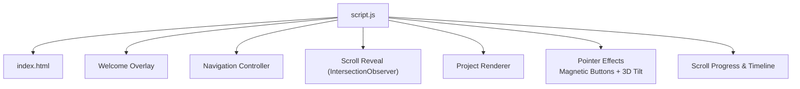
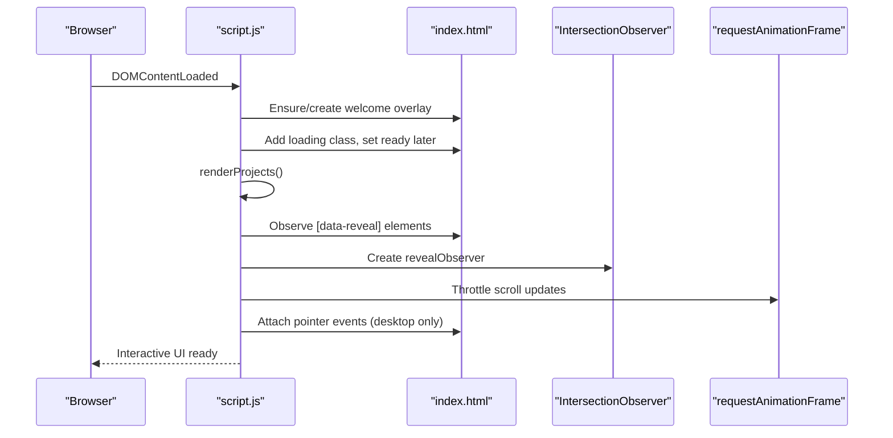
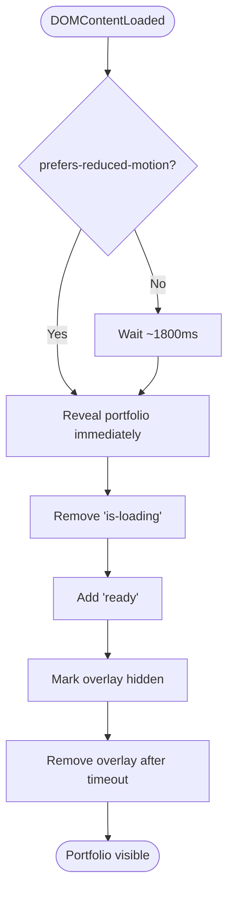
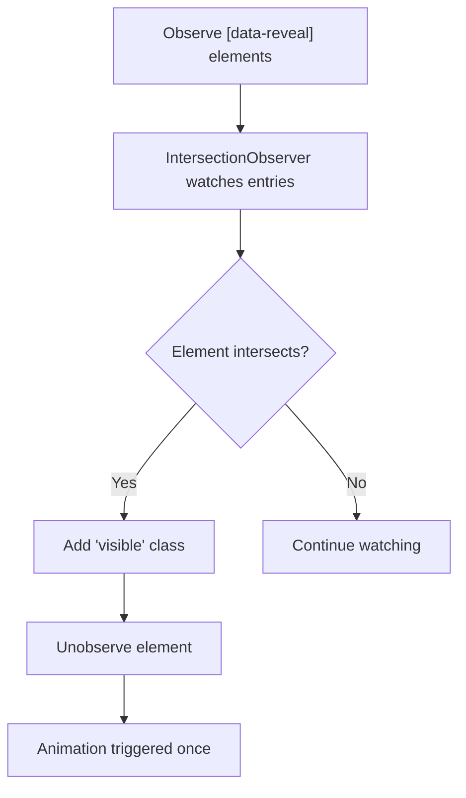
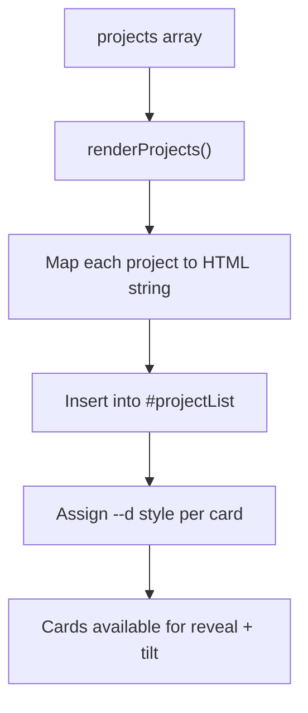
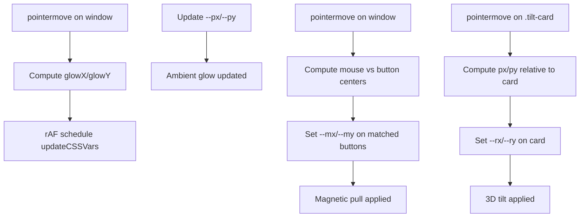
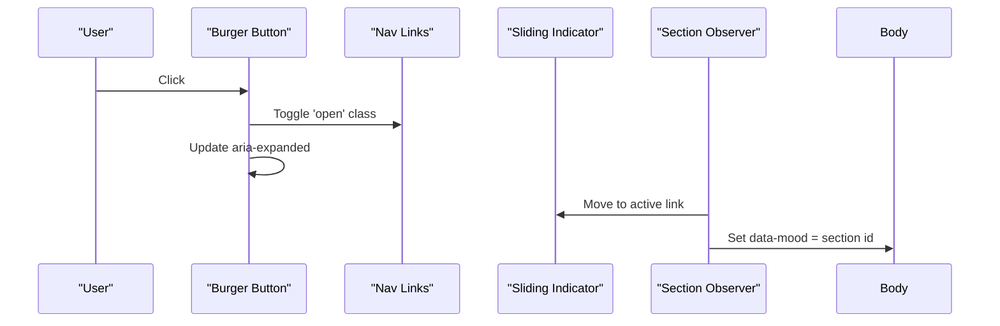
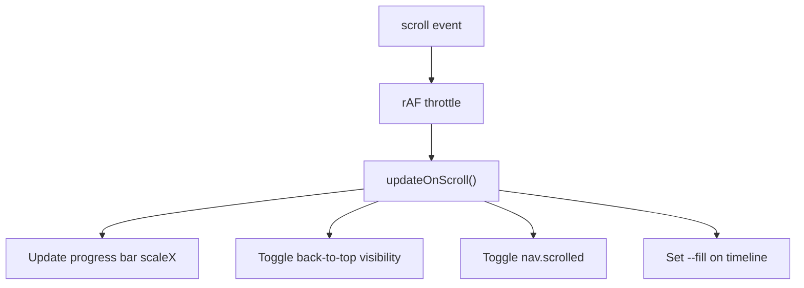
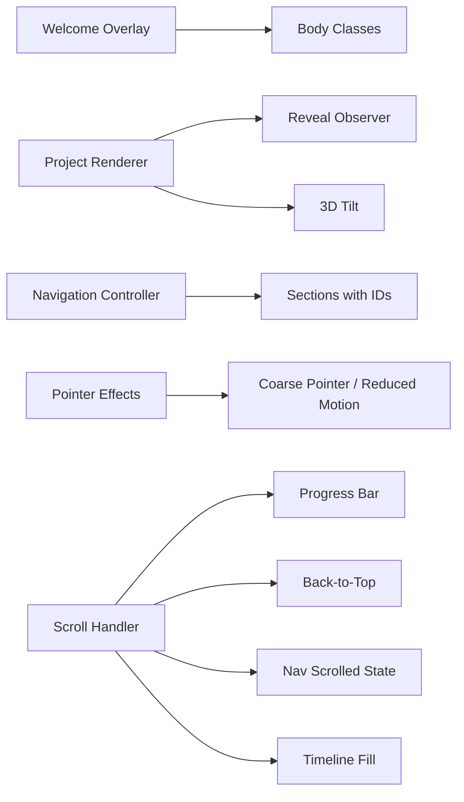

# JavaScript Functionality

<cite>
**Referenced Files in This Document**
- [script.js](file://files/script.js)
- [index.html](file://files/index.html)
</cite>

## Table of Contents
1. [Introduction](#introduction)
2. [Project Structure](#project-structure)
3. [Core Components](#core-components)
4. [Architecture Overview](#architecture-overview)
5. [Detailed Component Analysis](#detailed-component-analysis)
6. [Dependency Analysis](#dependency-analysis)
7. [Performance Considerations](#performance-considerations)
8. [Troubleshooting Guide](#troubleshooting-guide)
9. [Conclusion](#conclusion)

## Introduction
This document explains the JavaScript that powers the interactive features of the portfolio site. It covers:
- The cinematic welcome overlay and how it reveals the main content
- Scroll-based reveal animations using Intersection Observer
- Dynamic project card rendering from a data array
- Mouse-reactive effects including magnetic buttons and 3D tilt on cards
- Navigation controller for mobile menu toggling and active link states
- Performance optimizations such as requestAnimationFrame throttling and memory management
- Practical guidance for extending functionality and debugging common issues

The implementation is vanilla JavaScript with no framework dependencies, making it straightforward to understand and extend.

## Project Structure
The interactive behavior lives in a single script file and works with the HTML structure that includes:
- A welcome overlay element
- A navigation bar with links and a burger button
- Sections marked with IDs for scroll-aware navigation
- Elements marked with data attributes for reveal animations
- A container for dynamically rendered project cards
- A back-to-top button and progress indicator

**Diagram sources**
- [script.js:1-214](file://files/script.js#L1-L214)
- [index.html:10-155](file://files/index.html#L10-L155)

**Section sources**
- [script.js:1-214](file://files/script.js#L1-L214)
- [index.html:10-155](file://files/index.html#L10-L155)

## Core Components
- Cinematic welcome overlay system
- Project renderer
- Scroll reveal observer
- Navigation controller (mobile menu + active link state)
- Pointer effects (magnetic buttons and 3D tilt)
- Scroll progress and timeline animation
- Accessibility and fallback utilities

**Section sources**
- [script.js:1-214](file://files/script.js#L1-L214)
- [index.html:10-155](file://files/index.html#L10-L155)

## Architecture Overview
At runtime, the script initializes after DOMContentLoaded and coordinates several subsystems:
- It ensures or uses the welcome overlay, then reveals the portfolio after a short delay unless reduced motion is preferred.
- It renders project cards from a data array before setting up observers so cards participate in reveal animations.
- It sets up a single rAF-throttled scroll handler for performance-critical updates like progress bar, nav state, and timeline fill.
- It configures Intersection Observers for reveal animations, timeline items, and active section detection.
- It attaches pointer event listeners for ambient glow, magnetic pull, and 3D tilt, guarded by device capability checks.

**Diagram sources**
- [script.js:1-214](file://files/script.js#L1-L214)
- [index.html:10-155](file://files/index.html#L10-L155)

## Detailed Component Analysis

### Cinematic Welcome Overlay System
Purpose:
- Provide a brief cinematic entrance experience.
- Lock scrolling during the intro.
- Respect user preferences for reduced motion.

Behavior:
- On load, the script ensures a welcome overlay exists (either prebuilt in HTML or created programmatically).
- It adds a loading class to the body to lock scrolling while the intro plays.
- If the user prefers reduced motion, the portfolio is revealed immediately; otherwise, it waits briefly before revealing.
- When revealing, it removes the loading class, adds a ready class, marks the overlay as hidden, and removes it from the DOM after a short timeout.

Key interactions:
- Body classes control visual state and accessibility.
- The overlay is accessible via aria-live and aria-label.

**Diagram sources**
- [script.js:1-38](file://files/script.js#L1-L38)
- [index.html:10-18](file://files/index.html#L10-L18)

**Section sources**
- [script.js:1-38](file://files/script.js#L1-L38)
- [index.html:10-18](file://files/index.html#L10-L18)

### Scroll Reveal Implementation (Intersection Observer)
Purpose:
- Animate elements into view when they enter the viewport.
- Use CSS variables for staggered delays.

Behavior:
- Elements with data-reveal are observed.
- When an element becomes intersecting, a visible class is added and the element is unobserved to avoid repeated work.
- Staggered delays are applied via CSS custom properties set in code or inline styles.

**Diagram sources**
- [script.js:92-96](file://files/script.js#L92-L96)
- [index.html:65-123](file://files/index.html#L65-L123)

**Section sources**
- [script.js:92-96](file://files/script.js#L92-L96)
- [index.html:65-123](file://files/index.html#L65-L123)

### Project Renderer
Purpose:
- Dynamically generate project cards from a data array.
- Support optional image, live link, repository link, and tags.

Behavior:
- The projects array defines one or more project objects.
- The renderer creates article elements with glass styling, preview area, description, tags, and action buttons.
- Cards are given tilt-card and data-reveal attributes so they participate in pointer effects and reveal animations.
- After rendering, staggered entrance delays are assigned based on index.

**Diagram sources**
- [script.js:216-249](file://files/script.js#L216-L249)
- [index.html:120-124](file://files/index.html#L120-L124)

**Section sources**
- [script.js:216-249](file://files/script.js#L216-L249)
- [index.html:120-124](file://files/index.html#L120-L124)

### Mouse-Reactive Effects
Purpose:
- Enhance interactivity on desktop devices with subtle pointer-driven effects.
- Improve perceived responsiveness through magnetic pull and 3D tilt.

Capabilities:
- Ambient glow follows the pointer with small offsets.
- Magnetic pull affects primary call-to-action buttons and the GitHub nav button.
- 3D tilt applies to portrait and project cards.

Behavior:
- All pointer effects are disabled on coarse-pointer devices or when reduced motion is preferred.
- Each effect uses requestAnimationFrame throttling to minimize layout thrashing.
- Magnetic pull computes distance and direction to apply small CSS variable transforms.
- 3D tilt calculates normalized pointer position within the card to compute rotation angles.

**Diagram sources**
- [script.js:141-198](file://files/script.js#L141-L198)

**Section sources**
- [script.js:141-198](file://files/script.js#L141-L198)

### Navigation Controller
Responsibilities:
- Toggle mobile menu open/closed state.
- Update accessibility attribute for the burger button.
- Close the menu when a link is clicked.
- Track the active section and visually indicate the current link.
- Move a sliding indicator under the active link.
- Adjust background mood based on the active section.

Behavior:
- Mobile menu toggling uses a shared function to toggle a class and aria-expanded.
- Active link tracking uses an IntersectionObserver over sections with IDs.
- A dynamic indicator element is positioned under the active link using offset dimensions and positions.
- The body’s data-mood attribute changes based on the active section to influence ambient colors.

**Diagram sources**
- [script.js:82-90](file://files/script.js#L82-L90)
- [script.js:109-139](file://files/script.js#L109-L139)
- [index.html:22-37](file://files/index.html#L22-L37)

**Section sources**
- [script.js:82-90](file://files/script.js#L82-L90)
- [script.js:109-139](file://files/script.js#L109-L139)
- [index.html:22-37](file://files/index.html#L22-L37)

### Scroll Progress, Back-to-Top, and Timeline Animation
Purpose:
- Show a scroll progress bar at the top of the page.
- Show/hide a back-to-top button based on scroll position.
- Update navigation state on scroll.
- Animate a timeline line as the user scrolls through the journey section.

Behavior:
- A single rAF-throttled scroll handler updates:
  - Progress bar width via transform scale.
  - Back-to-top visibility.
  - Navigation scrolled state.
  - Timeline fill percentage based on viewport intersection.
- The back-to-top button scrolls smoothly to the top when clicked.

**Diagram sources**
- [script.js:51-80](file://files/script.js#L51-L80)
- [index.html:11-11](file://files/index.html#L11-L11)
- [index.html:100-117](file://files/index.html#L100-L117)

**Section sources**
- [script.js:51-80](file://files/script.js#L51-L80)
- [index.html:11-11](file://files/index.html#L11-L11)
- [index.html:100-117](file://files/index.html#L100-L117)

### Accessibility and Fallback Utilities
- Profile image fallback: if the profile image fails to load or has zero natural width, a fallback initial is shown by adding a class to the portrait container.
- UI-only contact form: prevents default submission and provides visual feedback without sending data.
- Year footer: dynamically sets the copyright year.

**Section sources**
- [script.js:200-213](file://files/script.js#L200-L213)
- [index.html:52-57](file://files/index.html#L52-L57)
- [index.html:137-142](file://files/index.html#L137-L142)
- [index.html:147-151](file://files/index.html#L147-L151)

## Dependency Analysis
High-level relationships between components:
- The welcome overlay depends on body classes and optional HTML presence.
- The project renderer injects nodes that are consumed by reveal and tilt systems.
- The navigation controller relies on section IDs and link hrefs.
- Pointer effects depend on device capabilities and reduced motion settings.
- Scroll handlers coordinate multiple UI aspects through a single throttled callback.

**Diagram sources**
- [script.js:1-214](file://files/script.js#L1-L214)
- [index.html:10-155](file://files/index.html#L10-L155)

**Section sources**
- [script.js:1-214](file://files/script.js#L1-L214)
- [index.html:10-155](file://files/index.html#L10-L155)

## Performance Considerations
- Single rAF-throttled scroll handler:
  - Prevents layout thrashing by batching scroll-related updates.
  - Uses passive event listeners for scroll and resize.
- Intersection Observer usage:
  - Efficiently detects visibility without manual scroll calculations.
  - Unobserves elements after first reveal to reduce overhead.
- Device capability guards:
  - Disables pointer effects on coarse-pointer devices and when reduced motion is preferred.
- Minimal DOM writes:
  - Updates use CSS custom properties and transforms rather than heavy layout-triggering properties.
- Memory management:
  - Observers are disposed by unobserving individual elements.
  - Welcome overlay is removed from DOM after transition completes.

[No sources needed since this section provides general guidance]

## Troubleshooting Guide
Common issues and resolutions:
- Welcome overlay does not appear:
  - Verify the overlay element exists in HTML or is created by the script.
  - Check that body classes are being toggled correctly.
- Project cards not showing:
  - Ensure the project list container exists and the renderer runs before observers.
  - Confirm the projects array contains valid entries.
- Reveal animations not triggering:
  - Verify elements have data-reveal and are inside the viewport.
  - Check that IntersectionObserver thresholds are appropriate.
- Magnetic or tilt effects not working:
  - Confirm device is not coarse-pointer and reduced motion is not enabled.
  - Ensure target elements have the correct classes (e.g., tilt-card).
- Active link not updating:
  - Check that sections have IDs matching link hrefs.
  - Verify the observer rootMargin allows detection near the top of the viewport.
- Timeline animation not animating:
  - Ensure the timeline element exists and is not suppressed by reduced motion.
  - Validate that scroll updates are running and setting the CSS variable.

**Section sources**
- [script.js:1-214](file://files/script.js#L1-L214)
- [index.html:10-155](file://files/index.html#L10-L155)

## Conclusion
The portfolio’s JavaScript delivers a polished, accessible, and performant user experience through:
- A cinematic welcome overlay that respects user preferences
- Efficient scroll-based reveal animations
- Dynamic project card generation
- Subtle pointer-driven interactions
- Robust navigation state management
- Careful attention to performance and memory usage

To extend the site:
- Add new projects by appending objects to the projects array.
- Introduce new interactive behaviors by following existing patterns: use IntersectionObserver for scroll effects, rAF throttling for frequent updates, and CSS custom properties for smooth animations.
- Always guard expensive effects behind capability checks and respect reduced motion preferences.

[No sources needed since this section summarizes without analyzing specific files]