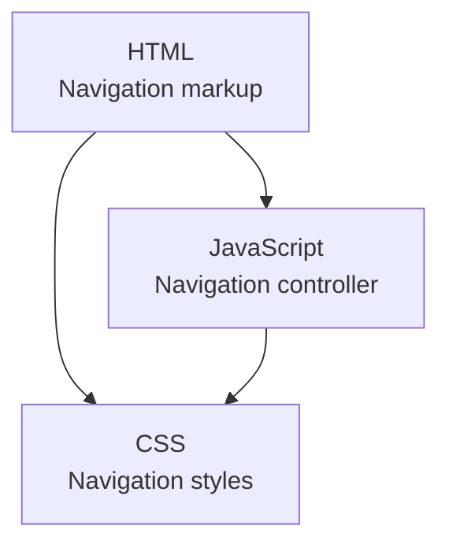
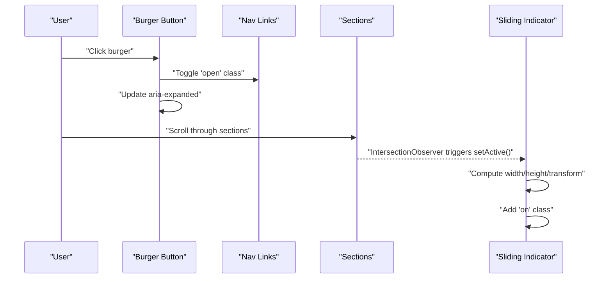
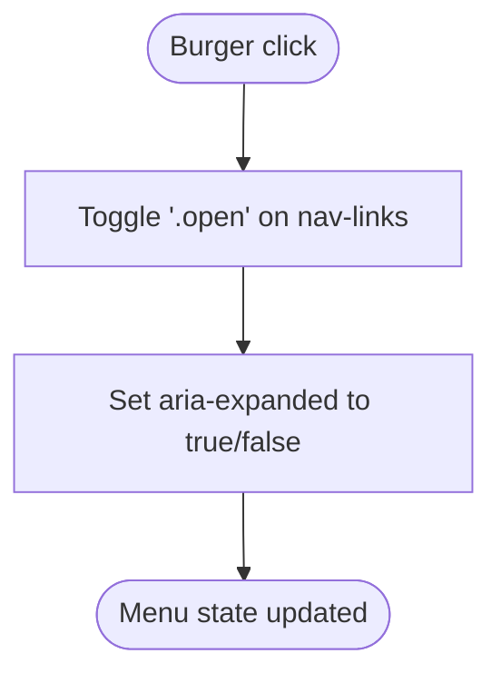
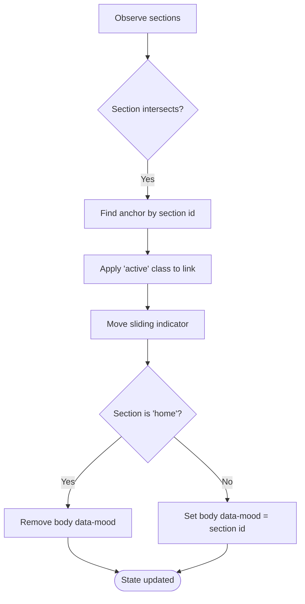
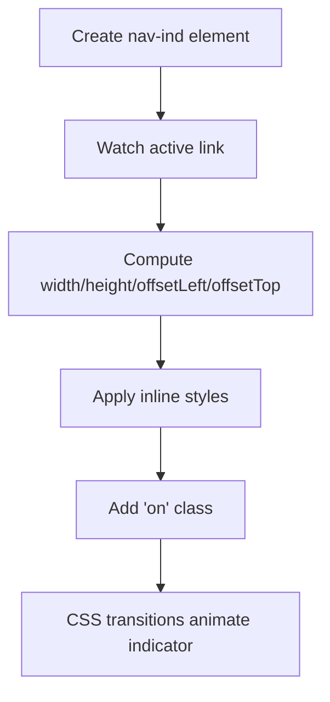
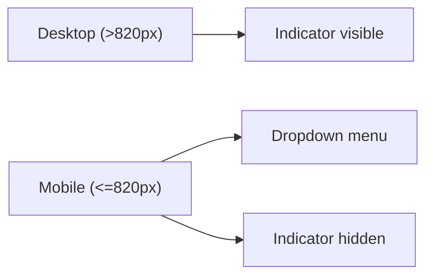
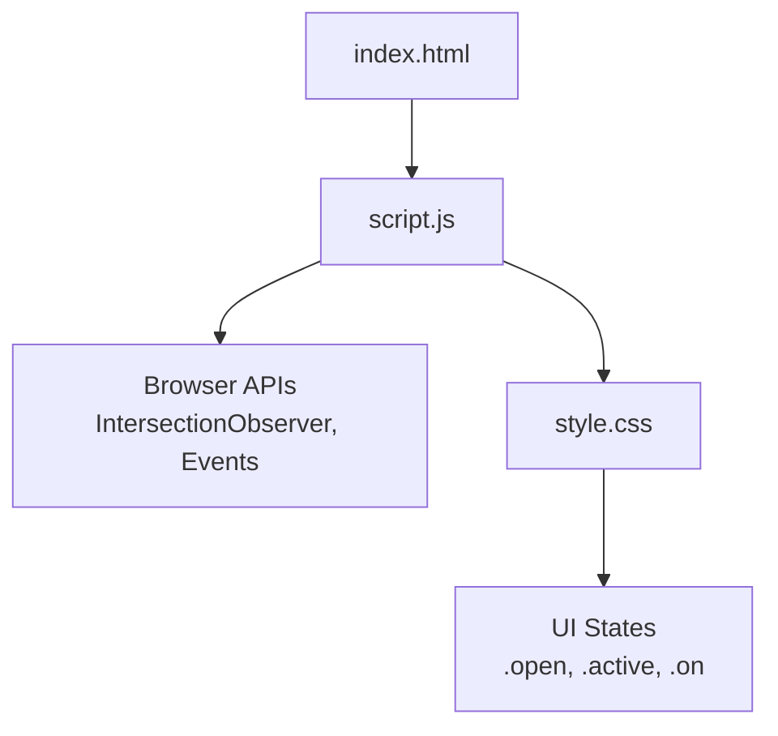

# Navigation Controller

<cite>
**Referenced Files in This Document**
- [index.html](file://files/index.html)
- [script.js](file://files/script.js)
- [style.css](file://files/style.css)
</cite>

## Table of Contents
1. [Introduction](#introduction)
2. [Project Structure](#project-structure)
3. [Core Components](#core-components)
4. [Architecture Overview](#architecture-overview)
5. [Detailed Component Analysis](#detailed-component-analysis)
6. [Dependency Analysis](#dependency-analysis)
7. [Performance Considerations](#performance-considerations)
8. [Troubleshooting Guide](#troubleshooting-guide)
9. [Conclusion](#conclusion)
10. [Appendices](#appendices)

## Introduction
This document explains the navigation controller that manages the mobile menu and active link states for the portfolio site. It covers:
- Burger menu toggle behavior, including `aria-expanded` management and CSS class toggling.
- Section-based active link highlighting using Intersection Observer.
- Sliding indicator animation and mood-based background color changes.
- Navigation indicator positioning calculations and responsive behavior.
- How to add new navigation sections, customize indicator animations, and handle edge cases.
- Accessibility considerations for keyboard navigation and screen readers.
- Troubleshooting guidance for common issues with indicator positioning and mobile menu behavior.

## Project Structure
The navigation system spans three files:
- HTML defines the navigation markup, burger button, and section anchors.
- JavaScript implements the interactive behaviors: mobile menu toggle, active link detection, sliding indicator movement, and mood-driven background colors.
- CSS styles the navigation, mobile menu, sliding indicator, and responsive layout.

**Diagram sources**
- [index.html:22-38](file://files/index.html#L22-L38)
- [script.js:82-139](file://files/script.js#L82-L139)
- [style.css:86-105](file://files/style.css#L86-L105)

**Section sources**
- [index.html:22-38](file://files/index.html#L22-L38)
- [script.js:82-139](file://files/script.js#L82-L139)
- [style.css:86-105](file://files/style.css#L86-L105)

## Core Components
- Mobile menu toggle: A burger button controls a `.nav-links` list via an `open` class and updates `aria-expanded`.
- Active link state: An IntersectionObserver watches each main section and sets the active anchor based on visibility.
- Sliding indicator: A dynamically created `<li>` element is positioned under the active link using width, height, and transform.
- Mood-based background: The body’s `data-mood` attribute changes per section, shifting ambient glow colors.

Key responsibilities:
- Toggle menu open/closed and close it when a link is clicked.
- Keep the active link synchronized with the visible section.
- Move the indicator smoothly to the active link.
- Update ambient background colors based on the current section.

**Section sources**
- [script.js:82-139](file://files/script.js#L82-L139)
- [style.css:86-105](file://files/style.css#L86-L105)
- [style.css:51-63](file://files/style.css#L51-L63)

## Architecture Overview
The navigation controller follows a simple event-driven architecture:
- DOMContentLoaded initializes observers and event listeners.
- Scroll events update scroll progress and nav state.
- Click events toggle the mobile menu and close it on link clicks.
- IntersectionObserver detects which section is currently in view and updates the active link and mood.
- CSS transitions animate the indicator and background glows.

**Diagram sources**
- [script.js:82-139](file://files/script.js#L82-L139)
- [style.css:92-98](file://files/style.css#L92-L98)

## Detailed Component Analysis

### Burger Menu Toggle
Behavior:
- Clicking the burger toggles the `.open` class on the navigation links container.
- The burger’s `aria-expanded` attribute is updated to reflect the menu state.
- Clicking any navigation link closes the mobile menu.

Accessibility:
- The burger has an accessible label for screen readers.
- `aria-expanded` provides assistive technology with the current state.

Responsive behavior:
- On smaller screens, the burger appears and the navigation links become an absolute-positioned dropdown.
- The sliding indicator is hidden on small screens; active state is indicated by a background highlight on the active link.

**Diagram sources**
- [script.js:82-90](file://files/script.js#L82-L90)
- [style.css:248-254](file://files/style.css#L248-L254)

**Section sources**
- [script.js:82-90](file://files/script.js#L82-L90)
- [style.css:101-105](file://files/style.css#L101-L105)
- [style.css:248-254](file://files/style.css#L248-L254)

### Active Link Highlighting with Intersection Observer
Behavior:
- Each main section with an `id` is observed.
- When a section becomes intersecting (based on rootMargin), its id is used to find the corresponding anchor link.
- The active class is applied to the matching link and removed from others.
- The sliding indicator is moved to the active link.

Mood-based background:
- When the active section is not the home section, the body gets a `data-mood` attribute set to the section id.
- CSS uses this attribute to change the ambient glow colors.

**Diagram sources**
- [script.js:109-139](file://files/script.js#L109-L139)
- [style.css:51-57](file://files/style.css#L51-L57)

**Section sources**
- [script.js:109-139](file://files/script.js#L109-L139)
- [style.css:51-57](file://files/style.css#L51-L57)

### Sliding Indicator Animation and Positioning
Behavior:
- A dynamic `<li class="nav-ind">` is prepended to the navigation links.
- The indicator’s width and height are set to match the active link’s dimensions.
- Its position is calculated using the active link’s offsetLeft and offsetTop.
- The indicator gains an `on` class to trigger opacity and transition effects.

Position calculation details:
- Width and height come from the active link’s rendered size.
- Transform translate positions the indicator relative to the parent container.
- Resize events recompute the indicator position to keep it aligned.

**Diagram sources**
- [script.js:110-122](file://files/script.js#L110-L122)
- [style.css:92-93](file://files/style.css#L92-L93)

**Section sources**
- [script.js:110-122](file://files/script.js#L110-L122)
- [style.css:92-93](file://files/style.css#L92-L93)

### Responsive Behavior
- Desktop:
  - The sliding indicator is visible and animates under the active link.
  - Navigation links are displayed horizontally.
- Tablet/Mobile:
  - The burger appears; the sliding indicator is hidden.
  - Navigation links become a vertical dropdown with backdrop blur.
  - Active link is highlighted with a background color instead of the sliding indicator.

**Diagram sources**
- [style.css:248-254](file://files/style.css#L248-L254)

**Section sources**
- [style.css:248-254](file://files/style.css#L248-L254)

## Dependency Analysis
The navigation controller depends on:
- HTML structure:
  - A header/nav container with a logo, navigation links, and a burger button.
  - Sections with unique ids that correspond to anchor hrefs.
- CSS classes:
  - `.nav-links`, `.nav-ind`, `.open`, `.active`, `.on`.
- Browser APIs:
  - IntersectionObserver for section visibility.
  - Event listeners for click, scroll, resize.

**Diagram sources**
- [index.html:22-38](file://files/index.html#L22-L38)
- [script.js:82-139](file://files/script.js#L82-L139)
- [style.css:92-98](file://files/style.css#L92-L98)

**Section sources**
- [index.html:22-38](file://files/index.html#L22-L38)
- [script.js:82-139](file://files/script.js#L82-L139)
- [style.css:92-98](file://files/style.css#L92-L98)

## Performance Considerations
- Scroll handler throttling:
  - A single requestAnimationFrame is scheduled per scroll event to avoid excessive recalculations.
- Passive event listeners:
  - Scroll and pointermove listeners use passive options to improve scrolling performance.
- Reduced motion:
  - Animations and complex pointer effects are disabled when the user prefers reduced motion.
- IntersectionObserver thresholds:
  - Thresholds are tuned to balance responsiveness and performance.

Recommendations:
- Keep observer thresholds conservative to avoid frequent updates.
- Avoid heavy computations inside scroll or pointer handlers; rely on rAF batching.
- Respect `prefers-reduced-motion` to provide a smoother experience for sensitive users.

[No sources needed since this section provides general guidance]

## Troubleshooting Guide

Common issues and resolutions:
- Indicator not appearing:
  - Ensure the active link exists and is visible before moving the indicator.
  - Verify that the `.nav-ind` element is present and the `on` class is added.
  - Check that the active link’s dimensions are non-zero.
- Indicator misaligned after resize:
  - Confirm that the resize listener recomputes the indicator position.
  - Ensure the indicator’s transform values are updated on window resize.
- Mobile menu not closing on link click:
  - Verify that each navigation link has a click listener that closes the menu.
  - Ensure the `setMenu(false)` call is executed on link clicks.
- Active link not updating:
  - Confirm that all sections have unique ids and corresponding anchor hrefs.
  - Check that the IntersectionObserver is observing all relevant sections.
  - Validate that the rootMargin is appropriate for your layout.
- Mood colors not changing:
  - Ensure the body’s `data-mood` attribute is set correctly for non-home sections.
  - Verify CSS rules for `body[data-mood=...]` exist for the desired sections.

Accessibility checklist:
- Burger button:
  - Has an accessible label (`aria-label`).
  - Updates `aria-expanded` to reflect menu state.
- Keyboard navigation:
  - Ensure focus order within the mobile menu is logical.
  - Provide visible focus indicators for links and buttons.
- Screen reader support:
  - Use semantic elements (`<nav>`, `<ul>`, `<li>`, `<a>`).
  - Avoid hiding critical information with `aria-hidden`; only decorative elements should be hidden.

**Section sources**
- [script.js:82-139](file://files/script.js#L82-L139)
- [style.css:92-98](file://files/style.css#L92-L98)
- [style.css:248-254](file://files/style.css#L248-L254)

## Conclusion
The navigation controller combines a simple mobile menu toggle with robust active link detection and smooth visual feedback. By leveraging IntersectionObserver, inline style calculations, and CSS transitions, it delivers a responsive and accessible navigation experience. Following the guidelines in this document will help you extend the navigation with new sections, customize animations, and troubleshoot common issues effectively.

[No sources needed since this section summarizes without analyzing specific files]

## Appendices

### Adding a New Navigation Section
Steps:
- Add a new section with a unique `id` in the HTML.
- Add a corresponding anchor link in the navigation list.
- Optionally define a mood color rule in CSS for the new section id.

Example references:
- Section markup pattern: [index.html:64-71](file://files/index.html#L64-L71)
- Navigation link pattern: [index.html:26-34](file://files/index.html#L26-L34)
- Mood color rule pattern: [style.css:51-57](file://files/style.css#L51-L57)

**Section sources**
- [index.html:64-71](file://files/index.html#L64-L71)
- [index.html:26-34](file://files/index.html#L26-L34)
- [style.css:51-57](file://files/style.css#L51-L57)

### Customizing Indicator Animations
To adjust the sliding indicator:
- Modify transition timing and easing in CSS for `.nav-ind.on`.
- Adjust the indicator’s background, border, and shadow styles.
- Change the threshold or rootMargin in the IntersectionObserver if needed.

Example references:
- Indicator styles: [style.css:92-93](file://files/style.css#L92-L93)
- Active link styles: [style.css:94-98](file://files/style.css#L94-L98)
- Observer configuration: [script.js:130-138](file://files/script.js#L130-L138)

**Section sources**
- [style.css:92-98](file://files/style.css#L92-L98)
- [script.js:130-138](file://files/script.js#L130-L138)

### Handling Edge Cases
- Empty or missing sections:
  - Ensure every anchor href corresponds to an existing section id.
- Dynamic content:
  - If sections are added dynamically, observe them after insertion.
- Very long links:
  - Ensure the indicator adapts to varying link widths.
- Narrow viewports:
  - Rely on mobile menu highlighting rather than the sliding indicator.

Example references:
- Mobile menu behavior: [script.js:82-90](file://files/script.js#L82-L90)
- Responsive styles: [style.css:248-254](file://files/style.css#L248-L254)

**Section sources**
- [script.js:82-90](file://files/script.js#L82-L90)
- [style.css:248-254](file://files/style.css#L248-L254)