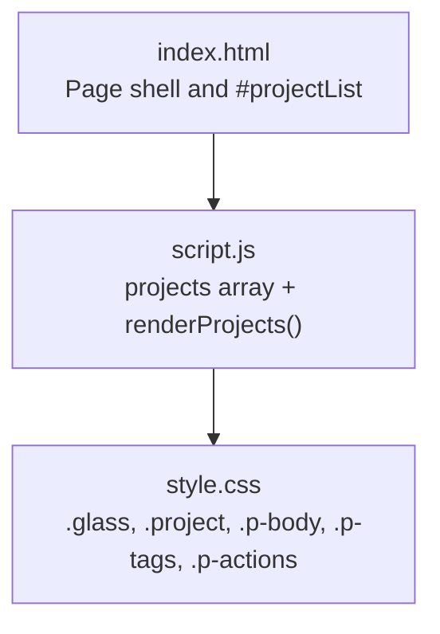
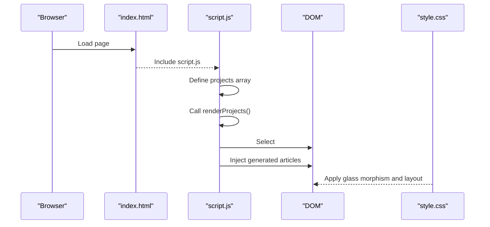
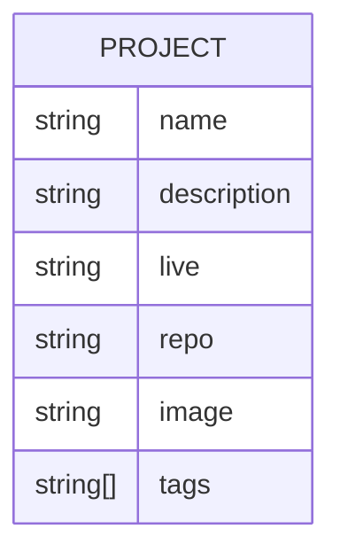
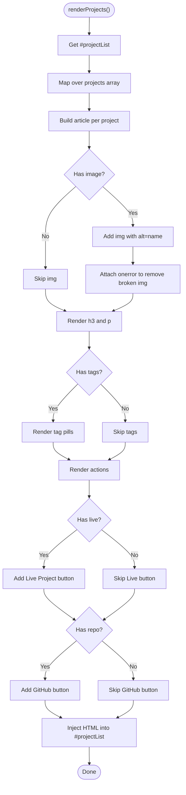
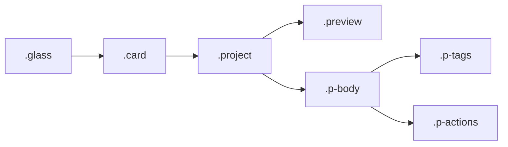
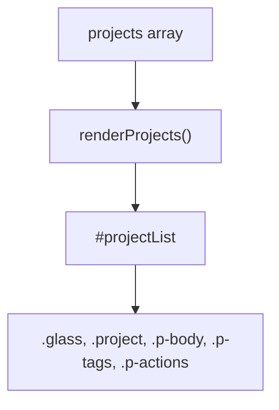

# Project Data Renderer

<cite>
**Referenced Files in This Document**   
- [index.html](file://files/arsalan-portfolio-vanilla/site/index.html)
- [script.js](file://files/arsalan-portfolio-vanilla/site/script.js)
- [style.css](file://files/arsalan-portfolio-vanilla/site/style.css)
</cite>

## Table of Contents
1. [Introduction](#introduction)
2. [Project Structure](#project-structure)
3. [Core Components](#core-components)
4. [Architecture Overview](#architecture-overview)
5. [Detailed Component Analysis](#detailed-component-analysis)
6. [Dependency Analysis](#dependency-analysis)
7. [Performance Considerations](#performance-considerations)
8. [Troubleshooting Guide](#troubleshooting-guide)
9. [Conclusion](#conclusion)
10. [Appendices](#appendices)

## Introduction
This document explains the project rendering system that dynamically generates project cards from a JavaScript data array. It focuses on the renderProjects function, the project data structure, conditional rendering for images, tags, and action buttons, integration with glass morphism styling, accessibility considerations, and guidance for extending the renderer. The implementation is vanilla HTML/CSS/JS and does not use tilt-card libraries; however, it provides hover-based card interactions and scroll reveal animations.

## Project Structure
The portfolio site consists of three core files:
- index.html defines the page skeleton and the container where projects are rendered.
- script.js contains the project data array and the renderProjects function that builds the markup.
- style.css provides glass morphism styles, responsive layout, and animation utilities.

**Diagram sources**
- [index.html:99-103](file://files/arsalan-portfolio-vanilla/site/index.html#L99-L103)
- [script.js:1-34](file://files/arsalan-portfolio-vanilla/site/script.js#L1-L34)
- [style.css:21-24](file://files/arsalan-portfolio-vanilla/site/style.css#L21-L24)
- [style.css:114-128](file://files/arsalan-portfolio-vanilla/site/style.css#L114-L128)

**Section sources**
- [index.html:99-103](file://files/arsalan-portfolio-vanilla/site/index.html#L99-L103)
- [script.js:1-34](file://files/arsalan-portfolio-vanilla/site/script.js#L1-L34)
- [style.css:21-24](file://files/arsalan-portfolio-vanilla/site/style.css#L21-L24)
- [style.css:114-128](file://files/arsalan-portfolio-vanilla/site/style.css#L114-L128)

## Core Components
- Project data array: A single source of truth containing objects with properties name, description, live, repo, image, and tags.
- renderProjects function: Maps each project object to an article element with preview, body, tags, and actions.
- Container: An empty div with id projectList in the HTML is populated by renderProjects.

Key responsibilities:
- Conditional rendering of optional fields (image, tags, live link, repo link).
- Safe handling of missing or broken images.
- Semantic markup using article elements for each project.

**Section sources**
- [script.js:1-34](file://files/arsalan-portfolio-vanilla/site/script.js#L1-L34)
- [index.html:99-103](file://files/arsalan-portfolio-vanilla/site/index.html#L99-L103)

## Architecture Overview
The rendering pipeline is straightforward:
1. The page loads index.html and includes script.js.
2. script.js defines the projects array and calls renderProjects immediately.
3. renderProjects selects the #projectList container and injects generated HTML.
4. style.css applies glass morphism and layout to the generated elements.

**Diagram sources**
- [index.html:132-133](file://files/arsalan-portfolio-vanilla/site/index.html#L132-L133)
- [script.js:1-34](file://files/arsalan-portfolio-vanilla/site/script.js#L1-L34)
- [style.css:21-24](file://files/arsalan-portfolio-vanilla/site/style.css#L21-L24)
- [style.css:114-128](file://files/arsalan-portfolio-vanilla/site/style.css#L114-L128)

## Detailed Component Analysis

### Project Data Model
The project data model is defined as an array of objects. Each object supports the following properties:
- name: string — displayed as the card title.
- description: string — displayed as the card description.
- live: string (optional) — URL to the live project; if present, a “Live Project” button is shown.
- repo: string (optional) — URL to the repository; if present, a “GitHub” button is shown.
- image: string (optional) — path to a preview image; if present, an img element is rendered.
- tags: array of strings (optional) — when non-empty, tag pills are rendered.

Usage patterns:
- If image is missing or fails to load, the preview area shows a decorative mock placeholder.
- If tags is undefined or empty, no tag row is rendered.
- If live or repo is empty, the corresponding button is omitted.

**Diagram sources**
- [script.js:1-12](file://files/arsalan-portfolio-vanilla/site/script.js#L1-L12)

**Section sources**
- [script.js:1-12](file://files/arsalan-portfolio-vanilla/site/script.js#L1-L12)

### renderProjects Function
Responsibilities:
- Reads the projects array.
- For each project, creates an article with:
  - A preview section that conditionally renders an img element with alt text derived from the project name.
  - A body section with h3 title and p description.
  - A tags section that only appears when tags exist and have items.
  - An actions section that conditionally renders Live Project and GitHub buttons based on live and repo values.
- Injects the resulting HTML into the #projectList container.

Conditional logic highlights:
- Image: Only rendered when p.image exists; includes an error handler to remove the image on failure.
- Tags: Rendered only when p.tags is present and has length greater than zero.
- Buttons: Rendered only when p.live or p.repo are truthy.

Accessibility notes:
- Each project is wrapped in an article element for semantic meaning.
- Images include alt text built from the project name.
- External links use target="_blank" with rel="noopener" for security.

**Diagram sources**
- [script.js:14-34](file://files/arsalan-portfolio-vanilla/site/script.js#L14-L34)

**Section sources**
- [script.js:14-34](file://files/arsalan-portfolio-vanilla/site/script.js#L14-L34)

### Glass Morphism Integration
Glass morphism is applied via the .glass class, which sets a translucent background, backdrop blur, border, and shadow. Project cards inherit this effect through the classes project and glass. Additional hover effects lift the card slightly and highlight the border color.

Key styles:
- .glass: translucent background, blur, border, shadow.
- .card: rounded corners, padding, hover transform.
- .project: grid layout with preview and body, hover transform.
- .preview: gradient background, image overlay, and mock placeholder.
- .p-body: flexible column layout for title, description, tags, and actions.
- .p-tags: flex wrap for tag pills.
- .p-actions: flex wrap for buttons.

**Diagram sources**
- [style.css:21-24](file://files/arsalan-portfolio-vanilla/site/style.css#L21-L24)
- [style.css:114-128](file://files/arsalan-portfolio-vanilla/site/style.css#L114-L128)

**Section sources**
- [style.css:21-24](file://files/arsalan-portfolio-vanilla/site/style.css#L21-L24)
- [style.css:114-128](file://files/arsalan-portfolio-vanilla/site/style.css#L114-L128)

### Tilt-Card Functionality
There is no tilt-card library integrated in this codebase. The current interaction model uses:
- Hover transforms on .card and .project to create subtle movement.
- Scroll reveal animations via IntersectionObserver and the [data-reveal] attribute.

If you want to add tilt behavior later, consider integrating a lightweight tilt library or implementing pointermove-based transforms on the .project element.

[No sources needed since this section describes conceptual behavior without analyzing specific files]

### Accessibility Considerations
- Semantic structure: Each project is an article element, improving screen reader navigation.
- Alt text: Images use alt text derived from the project name.
- External links: Links open in new tabs with rel="noopener" for security.
- Reduced motion: Animations respect prefers-reduced-motion.

Recommendations:
- Ensure all external links have descriptive link text.
- Consider adding aria-labels to buttons if needed for clarity.
- Validate color contrast for tags and buttons against the dark theme.

**Section sources**
- [script.js:14-34](file://files/arsalan-portfolio-vanilla/site/script.js#L14-L34)
- [style.css:152-159](file://files/arsalan-portfolio-vanilla/site/style.css#L152-L159)

### Extending the Renderer
To extend the renderer with additional fields:
- Update the project data objects with new properties (e.g., category, date, featured).
- Modify the template inside renderProjects to conditionally render the new field(s).
- Add corresponding CSS classes for layout and appearance.
- Ensure accessibility attributes (alt, aria-label) are included where applicable.

Example extension points:
- Add a category pill alongside tags.
- Show a date badge near the title.
- Introduce a “Featured” ribbon for highlighted projects.

[No sources needed since this section provides general guidance]

## Dependency Analysis
The rendering system depends on:
- HTML container (#projectList) for mounting generated content.
- CSS classes (.glass, .project, .p-body, .p-tags, .p-actions) for visual presentation.
- JavaScript projects array and renderProjects function for data-driven generation.

**Diagram sources**
- [script.js:1-34](file://files/arsalan-portfolio-vanilla/site/script.js#L1-L34)
- [index.html:99-103](file://files/arsalan-portfolio-vanilla/site/index.html#L99-L103)
- [style.css:21-24](file://files/arsalan-portfolio-vanilla/site/style.css#L21-L24)
- [style.css:114-128](file://files/arsalan-portfolio-vanilla/site/style.css#L114-L128)

**Section sources**
- [script.js:1-34](file://files/arsalan-portfolio-vanilla/site/script.js#L1-L34)
- [index.html:99-103](file://files/arsalan-portfolio-vanilla/site/index.html#L99-L103)
- [style.css:21-24](file://files/arsalan-portfolio-vanilla/site/style.css#L21-L24)
- [style.css:114-128](file://files/arsalan-portfolio-vanilla/site/style.css#L114-L128)

## Performance Considerations
- Rendering is O(n) with respect to the number of projects due to mapping over the array.
- Avoid heavy computations inside the template; keep conditions simple.
- Use lazy loading for images if the number of projects grows significantly.
- Debounce or throttle any future interactive features like tilt effects.

[No sources needed since this section provides general guidance]

## Troubleshooting Guide
Common issues and resolutions:
- Missing or broken images:
  - The renderer attaches an error handler to remove the img element on failure, revealing the mock placeholder.
  - Verify image paths and ensure files exist at the specified locations.
- Empty or undefined tags:
  - Tags are only rendered when the array exists and has items.
  - Provide a valid tags array even if empty to avoid unexpected behavior.
- Buttons not appearing:
  - Ensure live and repo properties are set to valid URLs when you want buttons to show.
- Styling not applied:
  - Confirm that generated elements include the expected classes (.glass, .project, etc.).
  - Check CSS file inclusion and specificity.

**Section sources**
- [script.js:14-34](file://files/arsalan-portfolio-vanilla/site/script.js#L14-L34)
- [style.css:114-128](file://files/arsalan-portfolio-vanilla/site/style.css#L114-L128)

## Conclusion
The project rendering system is a concise, data-driven approach that maps a simple array of project objects into accessible, styled cards. It leverages glass morphism for visual appeal and provides clear extension points for additional fields and customization. By maintaining semantic HTML, safe image handling, and conditional rendering, the system remains robust and easy to evolve.

[No sources needed since this section summarizes without analyzing specific files]

## Appendices

### How to Add a New Project
- Open script.js and add a new object to the projects array with the required properties.
- Optionally include image, tags, live, and repo as needed.
- Save the file and refresh the page to see the new card.

**Section sources**
- [script.js:1-12](file://files/arsalan-portfolio-vanilla/site/script.js#L1-L12)

### Customizing Card Appearance
- Adjust colors, spacing, and radii in the CSS design tokens.
- Modify .project, .preview, .p-body, .p-tags, and .p-actions for layout changes.
- Extend .glass for different blur or transparency levels.

**Section sources**
- [style.css:1-12](file://files/arsalan-portfolio-vanilla/site/style.css#L1-L12)
- [style.css:114-128](file://files/arsalan-portfolio-vanilla/site/style.css#L114-L128)