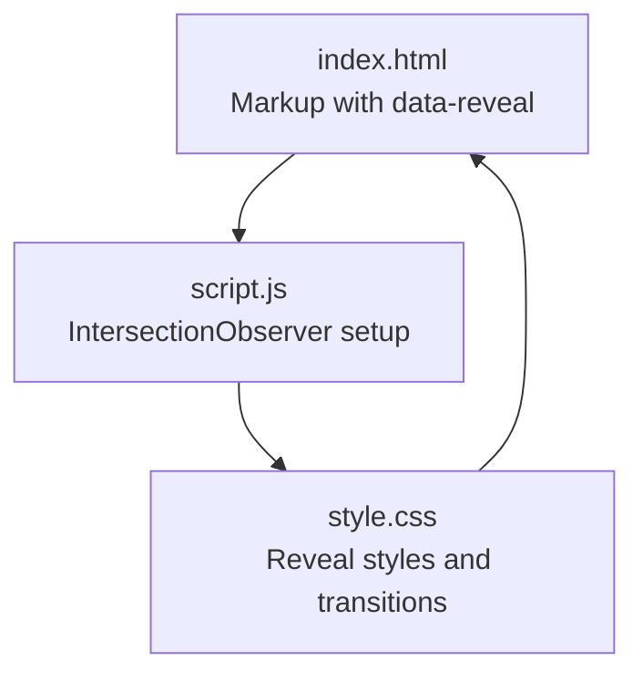
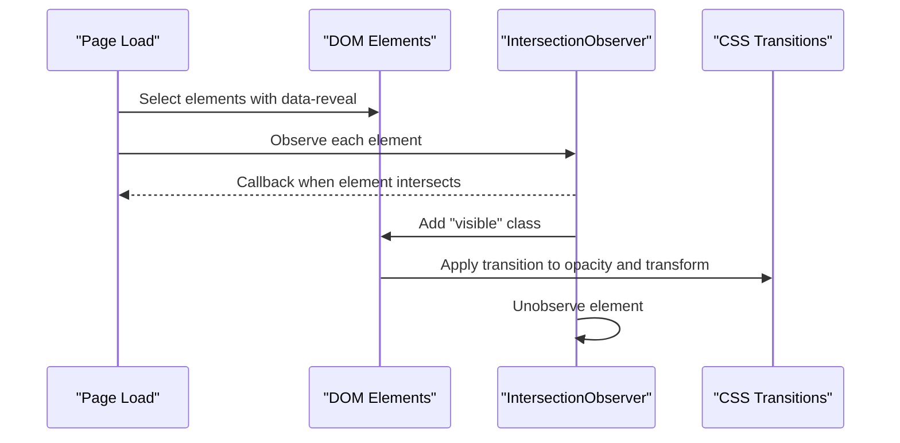
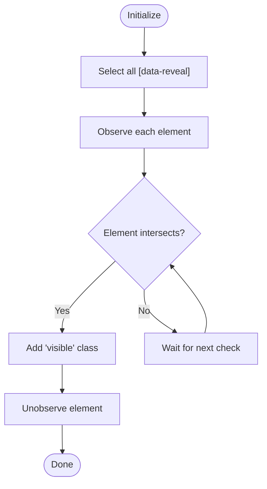
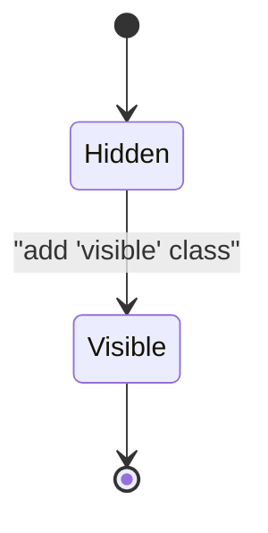
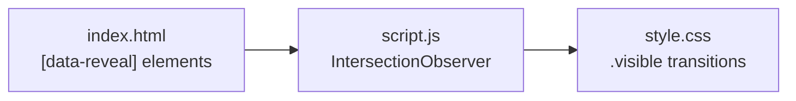

# Reveal Animations

<cite>
**Referenced Files in This Document**   
- [script.js](file://files/arsalan-portfolio-vanilla/site/script.js)
- [style.css](file://files/arsalan-portfolio-vanilla/site/style.css)
- [index.html](file://files/arsalan-portfolio-vanilla/site/index.html)
</cite>

## Table of Contents
1. [Introduction](#introduction)
2. [Project Structure](#project-structure)
3. [Core Components](#core-components)
4. [Architecture Overview](#architecture-overview)
5. [Detailed Component Analysis](#detailed-component-analysis)
6. [Dependency Analysis](#dependency-analysis)
7. [Performance Considerations](#performance-considerations)
8. [Troubleshooting Guide](#troubleshooting-guide)
9. [Conclusion](#conclusion)

## Introduction
This document explains the scroll-triggered reveal animation system built with the Intersection Observer API. It focuses on how elements marked with a data-reveal attribute are animated when they enter the viewport, including threshold configuration, class toggling, and performance optimization by unobserving elements after their first reveal. It also covers CSS transitions for smooth reveals and best practices for staggered animations using a custom property for delay timing.

## Project Structure
The implementation spans three files:
- HTML provides the markup structure and marks elements for reveal behavior.
- JavaScript initializes the Intersection Observer and observes all target elements.
- CSS defines the initial hidden state, the visible state, and transition timing.

**Diagram sources**
- [index.html:57-107](file://files/arsalan-portfolio-vanilla/site/index.html#L57-L107)
- [script.js:46-50](file://files/arsalan-portfolio-vanilla/site/script.js#L46-L50)
- [style.css:152-159](file://files/arsalan-portfolio-vanilla/site/style.css#L152-L159)

**Section sources**
- [index.html:57-107](file://files/arsalan-portfolio-vanilla/site/index.html#L57-L107)
- [script.js:46-50](file://files/arsalan-portfolio-vanilla/site/script.js#L46-L50)
- [style.css:152-159](file://files/arsalan-portfolio-vanilla/site/style.css#L152-L159)

## Core Components
- Intersection Observer initialization targeting elements with data-reveal.
- Threshold set to 0.15 so elements trigger when at least 15% is visible.
- Class toggling: adding a visible class when intersecting.
- Performance optimization: unobserving elements after the first intersection.
- CSS transitions that animate opacity and transform from a hidden state to visible.
- Staggered animations via a custom property used as a delay value.

Key behaviors:
- Elements start hidden (opacity 0, translated down).
- When entering the viewport, the visible class is added.
- The visible class removes the translation and sets opacity to 1.
- After revealing, the element is unobserved to avoid unnecessary checks.

**Section sources**
- [script.js:46-50](file://files/arsalan-portfolio-vanilla/site/script.js#L46-L50)
- [style.css:152-159](file://files/arsalan-portfolio-vanilla/site/style.css#L152-L159)

## Architecture Overview
The reveal system follows a simple observer-driven flow:
- On page load, all elements with data-reveal are observed.
- When an element intersects the viewport (threshold 0.15), it receives the visible class.
- CSS transitions handle the visual change.
- The element is then unobserved to optimize performance.

**Diagram sources**
- [script.js:46-50](file://files/arsalan-portfolio-vanilla/site/script.js#L46-L50)
- [style.css:152-159](file://files/arsalan-portfolio-vanilla/site/style.css#L152-L159)

## Detailed Component Analysis

### Intersection Observer Implementation
- The observer is created with a callback that adds the visible class to any intersecting element and immediately unobserves it.
- The threshold is configured to 0.15, meaning the animation triggers when 15% of the element is visible within the viewport.
- All elements matching the selector [data-reveal] are observed at initialization.

**Diagram sources**
- [script.js:46-50](file://files/arsalan-portfolio-vanilla/site/script.js#L46-L50)

**Section sources**
- [script.js:46-50](file://files/arsalan-portfolio-vanilla/site/script.js#L46-L50)

### CSS Transition System
- Initial state: elements with data-reveal have opacity 0 and a downward transform.
- Visible state: when the visible class is present, opacity becomes 1 and transform resets.
- Transition properties include duration, easing, and a custom delay variable for staggering.
- A prefers-reduced-motion media query disables animations for users who prefer reduced motion.

**Diagram sources**
- [style.css:152-159](file://files/arsalan-portfolio-vanilla/site/style.css#L152-L159)

**Section sources**
- [style.css:152-159](file://files/arsalan-portfolio-vanilla/site/style.css#L152-L159)

### HTML Markup Patterns
- Elements intended to be revealed carry the data-reveal attribute.
- Examples include section headings and cards across About, Skills, Journey, Projects, and Contact sections.
- For dynamically rendered project cards, the data-reveal attribute is included in the generated markup.

Best practices:
- Place data-reveal on containers you want to animate as a unit.
- Combine with other classes (e.g., glass, card) for consistent styling.
- Use inline style variables to control stagger delays per element.

**Section sources**
- [index.html:57-107](file://files/arsalan-portfolio-vanilla/site/index.html#L57-L107)
- [script.js:17-32](file://files/arsalan-portfolio-vanilla/site/script.js#L17-L32)

### Staggered Animations Using Custom Properties
- The CSS uses a custom property --d to define stagger delays for transitions.
- Elements can override this variable inline to create cascading effects.
- Example usage includes incrementally increasing delay values across related items.

Recommended approach:
- Assign --d inline on sibling elements to sequence their entrance.
- Keep delays small (e.g., 0.08s–0.24s) for natural pacing.
- Ensure the CSS transition references the same custom property for both opacity and transform.

**Section sources**
- [style.css:152-159](file://files/arsalan-portfolio-vanilla/site/style.css#L152-L159)
- [index.html:73-95](file://files/arsalan-portfolio-vanilla/site/index.html#L73-L95)

## Dependency Analysis
The reveal system has clear dependencies:
- script.js depends on DOM elements with data-reveal.
- style.css defines the visual states and transitions that respond to the visible class.
- index.html provides the markup and optional inline custom properties for staggered timing.

**Diagram sources**
- [index.html:57-107](file://files/arsalan-portfolio-vanilla/site/index.html#L57-L107)
- [script.js:46-50](file://files/arsalan-portfolio-vanilla/site/script.js#L46-L50)
- [style.css:152-159](file://files/arsalan-portfolio-vanilla/site/style.css#L152-L159)

**Section sources**
- [index.html:57-107](file://files/arsalan-portfolio-vanilla/site/index.html#L57-L107)
- [script.js:46-50](file://files/arsalan-portfolio-vanilla/site/script.js#L46-L50)
- [style.css:152-159](file://files/arsalan-portfolio-vanilla/site/style.css#L152-L159)

## Performance Considerations
- Threshold 0.15 balances early triggering with avoiding premature animations.
- Unobserving elements after the first intersection reduces ongoing observer overhead.
- Using CSS transitions instead of JavaScript animations leverages GPU acceleration where possible.
- Respecting prefers-reduced-motion improves accessibility and reduces unnecessary work.

Recommendations:
- Keep thresholds modest to avoid jittery or overly sensitive triggers.
- Avoid re-observing elements unless necessary; rely on the one-time reveal pattern.
- Prefer CSS variables for stagger delays to keep logic declarative and maintainable.

**Section sources**
- [script.js:46-50](file://files/arsalan-portfolio-vanilla/site/script.js#L46-L50)
- [style.css:152-159](file://files/arsalan-portfolio-vanilla/site/style.css#L152-L159)

## Troubleshooting Guide
Common issues and resolutions:
- Elements not animating: ensure they have the data-reveal attribute and are present in the DOM before observer initialization.
- Animations firing too early or late: adjust the threshold value to better match your layout and content density.
- No visible effect: verify that the visible class is being applied and that CSS transitions are defined for opacity and transform.
- Accessibility concerns: confirm that prefers-reduced-motion is respected to disable animations for users who need it.

Checklist:
- Confirm selectors match actual elements.
- Verify CSS rules for .visible and transitions exist.
- Test on different screen sizes and devices.
- Validate that dynamic content (e.g., project cards) includes data-reveal.

**Section sources**
- [script.js:46-50](file://files/arsalan-portfolio-vanilla/site/script.js#L46-L50)
- [style.css:152-159](file://files/arsalan-portfolio-vanilla/site/style.css#L152-L159)
- [index.html:57-107](file://files/arsalan-portfolio-vanilla/site/index.html#L57-L107)

## Conclusion
The scroll-triggered reveal system combines a lightweight Intersection Observer with CSS transitions to deliver smooth, performant animations. By marking elements with data-reveal, configuring a sensible threshold, toggling a visible class, and unobserving after the first reveal, the implementation remains efficient and accessible. Staggered animations via a custom delay property provide flexible sequencing without additional JavaScript complexity.