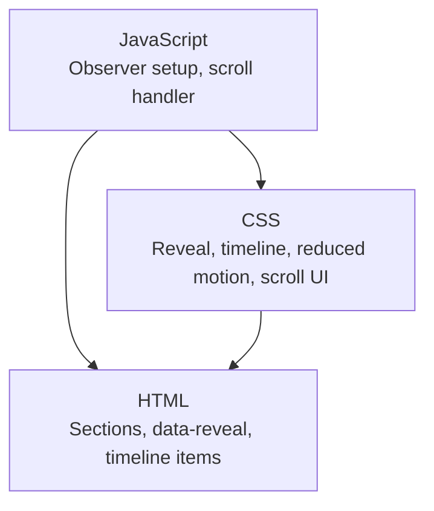
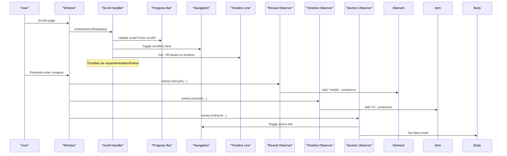
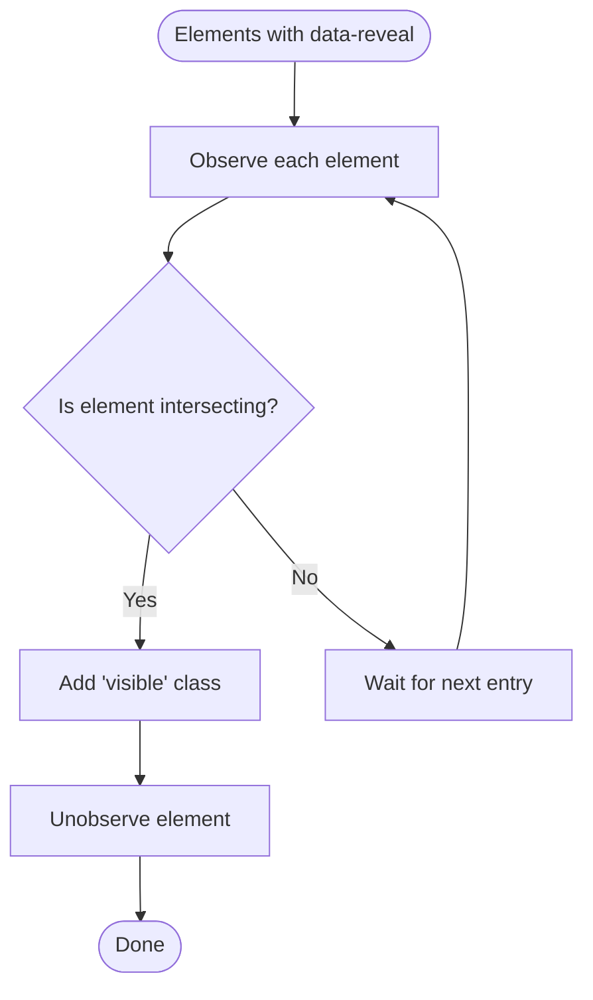
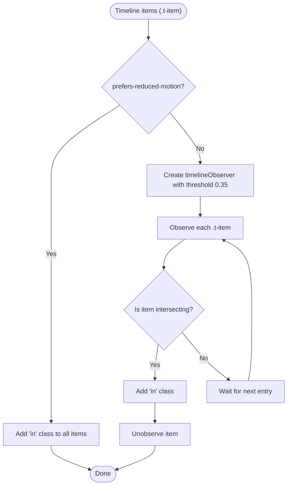
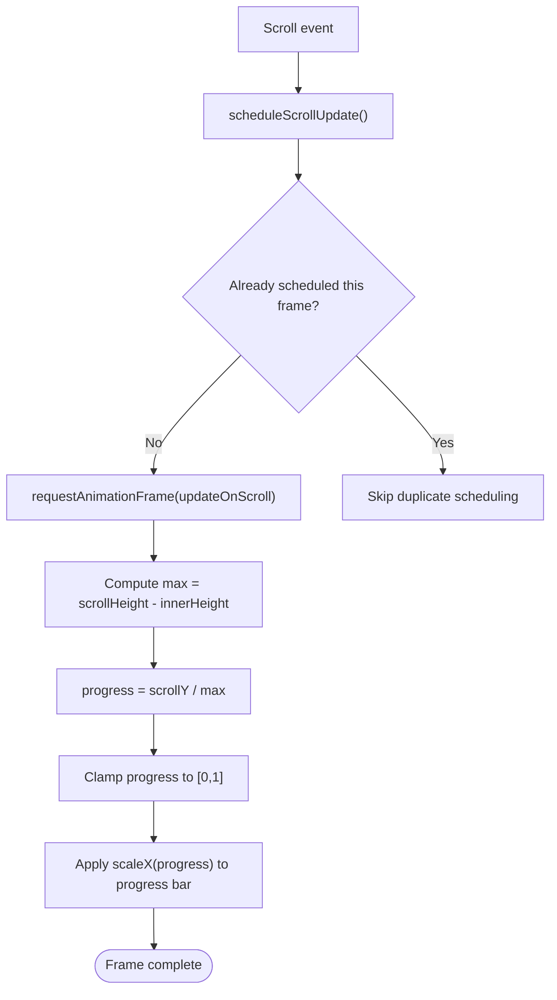
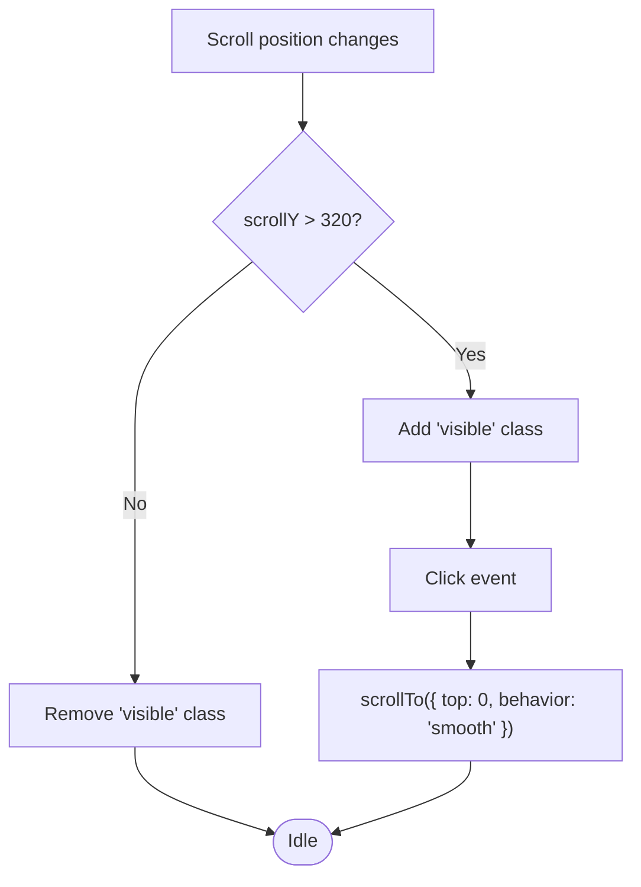
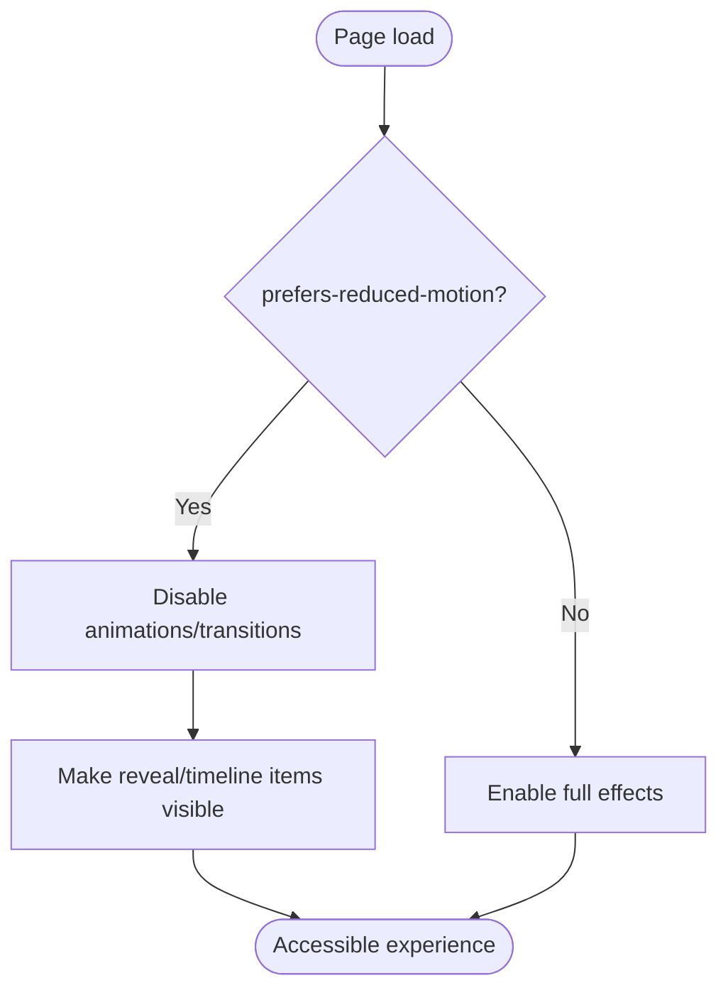
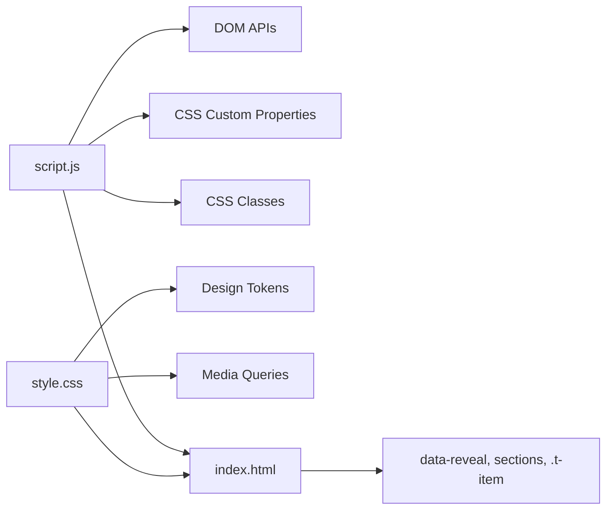

# Scroll Animations & Observers

<cite>
**Referenced Files in This Document**
- [script.js](file://files/script.js)
- [style.css](file://files/style.css)
- [index.html](file://files/arsalan-portfolio-vanilla\site\index.html)
- [script.js (vanilla site)](file://files/arsalan-portfolio-vanilla\site\script.js)
- [style.css (vanilla site)](file://files/arsalan-portfolio-vanilla\site\style.css)
</cite>

## Table of Contents
1. [Introduction](#introduction)
2. [Project Structure](#project-structure)
3. [Core Components](#core-components)
4. [Architecture Overview](#architecture-overview)
5. [Detailed Component Analysis](#detailed-component-analysis)
6. [Dependency Analysis](#dependency-analysis)
7. [Performance Considerations](#performance-considerations)
8. [Troubleshooting Guide](#troubleshooting-guide)
9. [Conclusion](#conclusion)

## Introduction
This document explains the scroll-triggered animation system built with the Intersection Observer API and a single requestAnimationFrame-throttled scroll handler. It covers:
- The reveal observer for elements marked with `data-reveal`.
- The timeline observer that activates items as they enter the viewport.
- Reduced motion fallback behavior.
- Scroll progress indicator calculation.
- Navigation state management, including active link highlighting and a sliding indicator.
- Back-to-top button visibility logic.
- Performance optimizations such as throttling via requestAnimationFrame and passive event listeners.
- Memory management through proper observer cleanup and event listener considerations.

## Project Structure
The scroll animation system spans three main files:
- JavaScript orchestrates observers, scroll updates, and UI state.
- CSS defines the visual states for reveal animations, timeline activation, reduced motion, and scroll-related UI.
- HTML provides the structure and data attributes used by the observers.



**Diagram sources**
- [script.js:1-214](file://files/script.js#L1-L214)
- [style.css:223-240](file://files/style.css#L223-L240)
- [index.html:56-123](file://files/arsalan-portfolio-vanilla\site\index.html#L56-L123)

**Section sources**
- [script.js:1-214](file://files/script.js#L1-L214)
- [style.css:223-240](file://files/style.css#L223-L240)
- [index.html:56-123](file://files/arsalan-portfolio-vanilla\site\index.html#L56-L123)

## Core Components
- Reveal observer: Adds a visible class to elements with `data-reveal` when they intersect the viewport, then stops observing them.
- Timeline observer: Activates timeline nodes and cards one by one based on intersection, with a higher threshold to stagger activation.
- Scroll handler: Updates the scroll progress bar, toggles back-to-top visibility, applies a scrolled state to navigation, and animates the timeline line using a CSS custom property.
- Active section observer: Highlights the current nav link and sets a mood variable on the body to shift ambient glow colors.
- Reduced motion support: Disables heavy animations and ensures content is immediately visible.

**Section sources**
- [script.js:92-107](file://files/script.js#L92-L107)
- [script.js:51-76](file://files/script.js#L51-L76)
- [script.js:109-139](file://files/script.js#L109-L139)
- [style.css:223-240](file://files/style.css#L223-L240)

## Architecture Overview
The system uses two primary observers and one shared scroll handler:
- `revealObserver` handles generic reveal animations.
- `timelineObserver` handles timeline item activation.
- A single rAF-throttled scroll handler updates progress, navigation, and timeline visuals.
- A separate `sectionObserver` manages active navigation state and background mood.



**Diagram sources**
- [script.js:51-76](file://files/script.js#L51-L76)
- [script.js:92-107](file://files/script.js#L92-L107)
- [script.js:109-139](file://files/script.js#L109-L139)

## Detailed Component Analysis

### Reveal Observer for `data-reveal` Elements
- Purpose: Trigger a smooth entrance animation when elements become visible.
- Configuration: Uses an Intersection Observer with a threshold of 0.15 so elements animate once about 15% visible.
- Callback pattern: When an element intersects, it adds a `visible` class and immediately calls `unobserve` to stop further callbacks and reduce memory pressure.
- Styling: Elements start hidden and blurred; adding `visible` transitions them to fully opaque and sharp.



**Diagram sources**
- [script.js:92-96](file://files/script.js#L92-L96)
- [style.css:223-225](file://files/style.css#L223-L225)

**Section sources**
- [script.js:92-96](file://files/script.js#L92-L96)
- [style.css:223-225](file://files/style.css#L223-L225)

### Timeline Observer and Reduced Motion Fallback
- Purpose: Activate timeline nodes and cards progressively as they enter the viewport.
- Threshold: Uses a higher threshold (0.35) to ensure more of the item is visible before activation.
- Callback pattern: Adds an `in` class to activate the node and card, then unobserves the item.
- Reduced motion fallback: If reduced motion is preferred, the code skips creating the observer and directly adds the `in` class to all timeline items, ensuring immediate visibility without animations.



**Diagram sources**
- [script.js:98-107](file://files/script.js#L98-L107)
- [style.css:157-179](file://files/style.css#L157-L179)

**Section sources**
- [script.js:98-107](file://files/script.js#L98-L107)
- [style.css:157-179](file://files/style.css#L157-L179)

### Scroll Progress Indicator Calculation
- Element: A thin progress bar at the top of the viewport.
- Calculation: Computes maximum scrollable distance (`document.documentElement.scrollHeight - window.innerHeight`) and divides current `window.scrollY` by that value to get a normalized progress between 0 and 1.
- Visual update: Applies a `scaleX` transform to the progress fill to reflect current scroll position.
- Throttling: All scroll-driven updates are scheduled via `requestAnimationFrame` to avoid layout thrashing and excessive repaints.



**Diagram sources**
- [script.js:51-76](file://files/script.js#L51-L76)
- [style.css:227-229](file://files/style.css#L227-L229)

**Section sources**
- [script.js:51-76](file://files/script.js#L51-L76)
- [style.css:227-229](file://files/style.css#L227-L229)

### Navigation State Management
- Active link detection: Uses an Intersection Observer with a root margin that favors the middle of the viewport, ensuring the currently centered section becomes active.
- Sliding indicator: Creates a small indicator element under the active link and updates its width, height, and transform to match the active link’s position.
- Background mood: Sets a `data-mood` attribute on the body based on the active section ID, which shifts ambient glow colors via CSS.

```mermaid
sequenceDiagram
participant SectionObs as "Section Observer"
participant Links as "Nav Links"
participant Indicator as "Nav Indicator"
participant Body as "Body"
SectionObs->>Links : Toggle "active" class per href/id match
SectionObs->>Indicator : Update width/height/transform
SectionObs->>Body : Set data-mood to section id
```

**Diagram sources**
- [script.js:109-139](file://files/script.js#L109-L139)
- [style.css:86-98](file://files/style.css#L86-L98)
- [style.css:51-57](file://files/style.css#L51-L57)

**Section sources**
- [script.js:109-139](file://files/script.js#L109-L139)
- [style.css:86-98](file://files/style.css#L86-L98)
- [style.css:51-57](file://files/style.css#L51-L57)

### Back-to-Top Button Visibility Logic
- Visibility rule: Toggles a `visible` class when the user scrolls past a threshold (320 pixels).
- Interaction: Clicking the button scrolls smoothly to the top of the page.
- Styling: The button is hidden off-screen and fades in with a subtle lift when visible.



**Diagram sources**
- [script.js:51-80](file://files/script.js#L51-L80)
- [style.css:227-232](file://files/style.css#L227-L232)

**Section sources**
- [script.js:51-80](file://files/script.js#L51-L80)
- [style.css:227-232](file://files/style.css#L227-L232)

### Reduced Motion Behavior
- Global effect: Disables animations and transitions globally when `prefers-reduced-motion: reduce` is set.
- Reveal elements: Immediately become fully visible without transitions.
- Timeline: Nodes and connecting lines appear instantly without animated drawing.
- Welcome overlay: Hidden entirely to avoid blocking users who prefer reduced motion.



**Diagram sources**
- [script.js:1-38](file://files/script.js#L1-L38)
- [style.css:234-240](file://files/style.css#L234-L240)

**Section sources**
- [script.js:1-38](file://files/script.js#L1-L38)
- [style.css:234-240](file://files/style.css#L234-L240)

## Dependency Analysis
- JavaScript dependencies:
  - DOM APIs: `IntersectionObserver`, `matchMedia`, `requestAnimationFrame`, `addEventListener`.
  - Style hooks: CSS custom properties like `--d`, `--i`, `--fill`, `--px`, `--py`, `--mx`, `--my`, and classes like `visible`, `in`, `scrolled`, `active`, `visible` (back-to-top), and `on` (nav indicator).
- CSS dependencies:
  - Design tokens for colors, spacing, easing, and typography.
  - Media queries for responsive layouts and reduced motion.
- HTML dependencies:
  - Sections with IDs for active navigation.
  - Elements with `data-reveal` for reveal animations.
  - Timeline items with `.t-item` for progressive activation.



**Diagram sources**
- [script.js:1-214](file://files/script.js#L1-L214)
- [style.css:1-268](file://files/style.css#L1-L268)
- [index.html:56-123](file://files/arsalan-portfolio-vanilla\site\index.html#L56-L123)

**Section sources**
- [script.js:1-214](file://files/script.js#L1-L214)
- [style.css:1-268](file://files/style.css#L1-L268)
- [index.html:56-123](file://files/arsalan-portfolio-vanilla\site\index.html#L56-L123)

## Performance Considerations
- requestAnimationFrame throttling:
  - A single scroll handler is scheduled per frame to avoid multiple recalculations during rapid scrolling.
  - Passive event listeners are used for scroll and pointer events to improve scrolling performance.
- Intersection Observer efficiency:
  - Each observed element is unobserved after activation to prevent unnecessary callbacks.
  - Thresholds are tuned to balance responsiveness and callback frequency.
- Minimal DOM writes:
  - Updates use CSS transforms and custom properties rather than triggering layout thrashing.
- Reduced motion optimization:
  - Skips expensive animations and observers when reduced motion is preferred.

[No sources needed since this section provides general guidance]

## Troubleshooting Guide
- Elements not revealing:
  - Ensure elements have the `data-reveal` attribute and that the reveal observer is initialized after those elements exist.
  - Verify CSS includes the `[data-reveal]` base styles and the `.visible` transition rules.
- Timeline items not activating:
  - Confirm timeline items have the `.t-item` class.
  - Check that reduced motion is not forcing immediate activation or skipping observer creation.
- Progress bar not updating:
  - Ensure the progress bar element exists and has the expected structure.
  - Verify the scroll handler is attached and not blocked by other scripts.
- Back-to-top button not appearing:
  - Confirm the button element exists and the scroll threshold logic is correct.
  - Check CSS for the `.visible` class and transitions.
- Active nav link not updating:
  - Ensure sections have unique IDs matching nav links’ href values.
  - Verify the section observer is observing all relevant sections.

**Section sources**
- [script.js:92-107](file://files/script.js#L92-L107)
- [script.js:51-80](file://files/script.js#L51-L80)
- [script.js:109-139](file://files/script.js#L109-L139)
- [style.css:223-240](file://files/style.css#L223-L240)

## Conclusion
The scroll animation system combines Intersection Observer-based reveals and timeline activations with a single requestAnimationFrame-throttled scroll handler. It delivers smooth, accessible interactions while maintaining performance through careful observer lifecycle management, passive event listeners, and minimal DOM writes. Reduced motion support ensures an inclusive experience, and the modular design makes it straightforward to extend or adapt for additional scroll-driven features.

[No sources needed since this section summarizes without analyzing specific files]