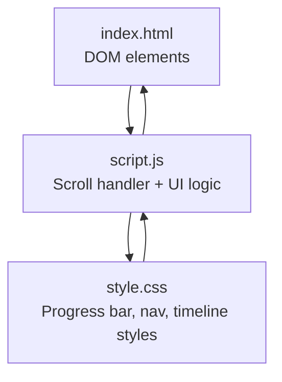
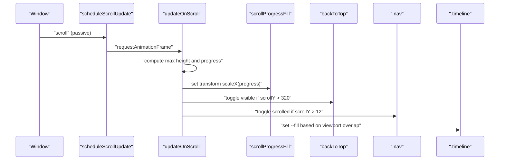
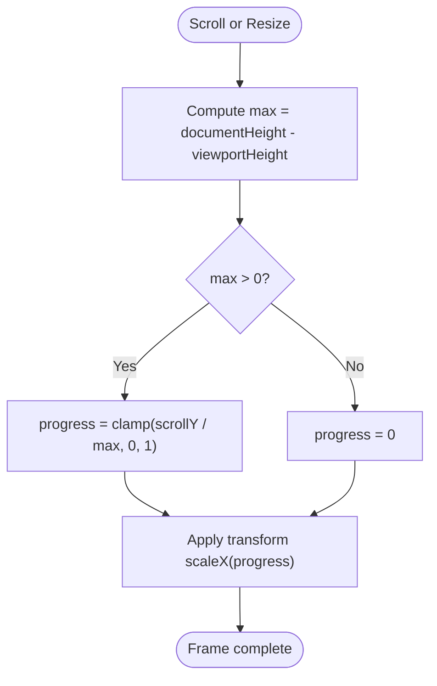
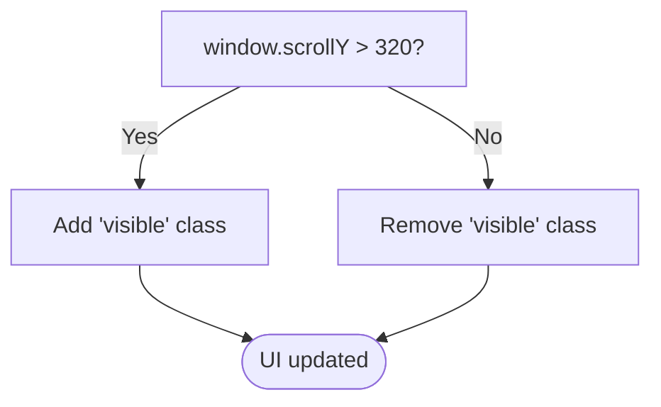
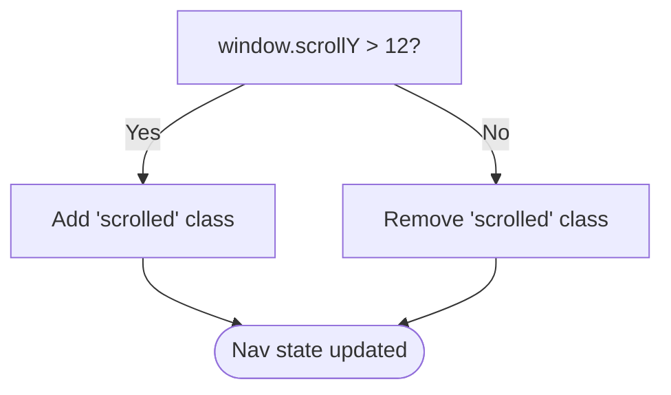
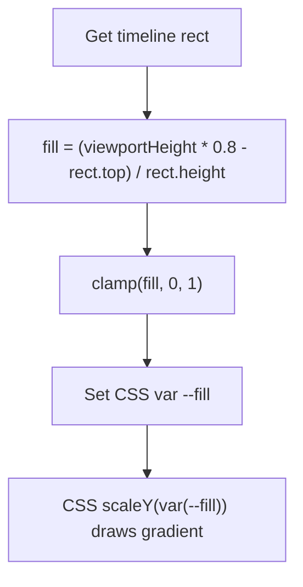
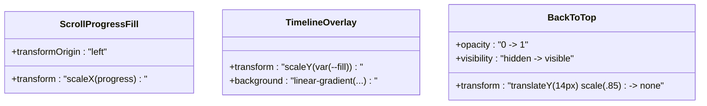
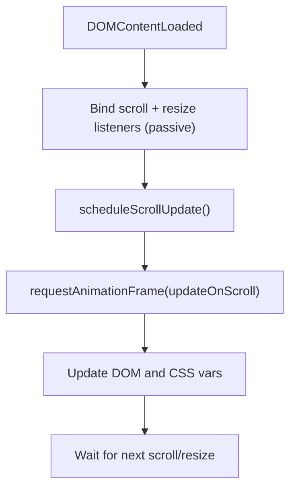
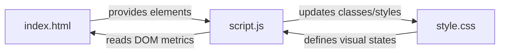

# Scroll Progress & Navigation State

<cite>
**Referenced Files in This Document**
- [script.js](file://files/script.js)
- [style.css](file://files/style.css)
- [index.html](file://files/index.html)
</cite>

## Table of Contents
1. [Introduction](#introduction)
2. [Project Structure](#project-structure)
3. [Core Components](#core-components)
4. [Architecture Overview](#architecture-overview)
5. [Detailed Component Analysis](#detailed-component-analysis)
6. [Dependency Analysis](#dependency-analysis)
7. [Performance Considerations](#performance-considerations)
8. [Troubleshooting Guide](#troubleshooting-guide)
9. [Conclusion](#conclusion)

## Introduction
This document explains the scroll progress tracking and navigation state management system used by the portfolio site. It focuses on:
- The requestAnimationFrame-throttled scroll handler that updates the top progress bar, back-to-top button visibility, navigation scrolled state, and timeline line drawing.
- The scroll progress calculation formula.
- Threshold values for UI state changes (320px for back-to-top, 12px for navigation).
- Performance optimizations using requestAnimationFrame and passive event listeners.
- CSS transforms used to visualize progress and timeline drawing.
- Event listener management and memory cleanup strategies.

## Project Structure
The relevant files for this feature are:
- HTML provides the DOM elements: a fixed progress bar container with an inner fill element, a back-to-top button, a navigation element, and a timeline list.
- CSS styles the progress bar, back-to-top button, navigation states, and timeline drawing via CSS custom properties and transforms.
- JavaScript sets up the rAF-throttled scroll handler, calculates scroll progress, toggles UI classes, and updates CSS variables for visual effects.

**Diagram sources**
- [index.html:11-11](file://files/index.html#L11-L11)
- [index.html:24-37](file://files/index.html#L24-L37)
- [index.html:100-117](file://files/index.html#L100-L117)
- [index.html:153-153](file://files/index.html#L153-L153)
- [script.js:51-76](file://files/script.js#L51-L76)
- [style.css:227-231](file://files/style.css#L227-L231)
- [style.css:86-99](file://files/style.css#L86-L99)
- [style.css:157-161](file://files/style.css#L157-L161)

**Section sources**
- [index.html:11-11](file://files/index.html#L11-L11)
- [index.html:24-37](file://files/index.html#L24-L37)
- [index.html:100-117](file://files/index.html#L100-L117)
- [index.html:153-153](file://files/index.html#L153-L153)
- [script.js:51-76](file://files/script.js#L51-L76)
- [style.css:227-231](file://files/style.css#L227-L231)
- [style.css:86-99](file://files/style.css#L86-L99)
- [style.css:157-161](file://files/style.css#L157-L161)

## Core Components
- Scroll progress fill: A thin horizontal bar at the top of the viewport whose width is animated via CSS transform scaleX based on computed scroll progress.
- Back-to-top button: Appears when the user scrolls beyond a threshold; clicking it smoothly scrolls to the top.
- Navigation scrolled state: The navigation receives a class when scrolled past a small threshold, changing its background and shadow.
- Timeline line drawing: A gradient overlay on the timeline draws itself as the section passes through the viewport, controlled by a CSS variable updated from scroll position.

Key behaviors implemented in the script:
- One rAF-throttled scroll handler updates all these UI aspects in a single frame.
- Passive event listeners avoid layout thrashing during frequent scroll events.
- CSS uses transforms and transitions for smooth visual updates.

**Section sources**
- [script.js:51-76](file://files/script.js#L51-L76)
- [style.css:227-231](file://files/style.css#L227-L231)
- [style.css:86-99](file://files/style.css#L86-L99)
- [style.css:157-161](file://files/style.css#L157-L161)

## Architecture Overview
The system follows a simple event-driven architecture:
- Window scroll and resize events schedule a single update per animation frame.
- The update function computes scroll metrics and mutates DOM styles and classes.
- CSS handles the visual transitions and animations.

**Diagram sources**
- [script.js:51-76](file://files/script.js#L51-L76)
- [style.css:227-231](file://files/style.css#L227-L231)
- [style.css:86-99](file://files/style.css#L86-L99)
- [style.css:157-161](file://files/style.css#L157-L161)

## Detailed Component Analysis

### Scroll Progress Calculation and Fill Update
- The maximum scrollable distance is calculated as the difference between the full document height and the viewport height.
- Scroll progress is normalized to a value between 0 and 1 using the current vertical scroll position divided by the maximum scrollable distance.
- The progress fill element’s width is animated via CSS transform scaleX(progress), which is efficient because it avoids layout recalculation.

**Diagram sources**
- [script.js:57-63](file://files/script.js#L57-L63)
- [style.css:227-229](file://files/style.css#L227-L229)

**Section sources**
- [script.js:57-63](file://files/script.js#L57-L63)
- [style.css:227-229](file://files/style.css#L227-L229)

### Back-to-Top Button Visibility
- The back-to-top button is shown when the user scrolls more than 320 pixels from the top.
- Its visibility is toggled by adding or removing a CSS class that controls opacity, visibility, and transform.

**Diagram sources**
- [script.js:62-62](file://files/script.js#L62-L62)
- [style.css:230-231](file://files/style.css#L230-L231)

**Section sources**
- [script.js:62-62](file://files/script.js#L62-L62)
- [style.css:230-231](file://files/style.css#L230-L231)

### Navigation Scrolled State
- The navigation receives a “scrolled” class when the user scrolls more than 12 pixels.
- This class changes the navigation’s background, border, and shadow to indicate a scrolled state.

**Diagram sources**
- [script.js:63-63](file://files/script.js#L63-L63)
- [style.css:88-89](file://files/style.css#L88-L89)

**Section sources**
- [script.js:63-63](file://files/script.js#L63-L63)
- [style.css:88-89](file://files/style.css#L88-L89)

### Timeline Line Drawing
- The timeline has two pseudo-elements: a base track and a gradient overlay.
- The gradient overlay’s scaleY is driven by a CSS custom property --fill, which is updated based on how much of the timeline is within the viewport.
- If reduced motion is preferred, the timeline does not animate.

**Diagram sources**
- [script.js:64-69](file://files/script.js#L64-L69)
- [style.css:157-161](file://files/style.css#L157-L161)

**Section sources**
- [script.js:64-69](file://files/script.js#L64-L69)
- [style.css:157-161](file://files/style.css#L157-L161)

### CSS Transforms for Progress Visualization
- Progress bar: Uses transform-origin set to the left edge and animates scaleX to reflect progress.
- Timeline: Uses scaleY on a pseudo-element overlay to draw the gradient line as the section enters the viewport.
- Back-to-top: Uses transform and opacity/visibility transitions to fade and slide into view.

**Diagram sources**
- [style.css:227-229](file://files/style.css#L227-L229)
- [style.css:157-161](file://files/style.css#L157-L161)
- [style.css:230-231](file://files/style.css#L230-L231)

**Section sources**
- [style.css:227-229](file://files/style.css#L227-L229)
- [style.css:157-161](file://files/style.css#L157-L161)
- [style.css:230-231](file://files/style.css#L230-L231)

### Event Listener Management and Memory Cleanup
- The scroll handler is scheduled once per animation frame using a flag to prevent multiple updates in the same frame.
- Passive event listeners are used for scroll and pointermove to improve scrolling performance.
- There is no explicit removal of window scroll/resize listeners in the provided code. For long-lived single-page applications, consider storing references to the handlers and removing them when components unmount to avoid memory leaks.

**Diagram sources**
- [script.js:51-76](file://files/script.js#L51-L76)

**Section sources**
- [script.js:51-76](file://files/script.js#L51-L76)

## Dependency Analysis
The following diagram shows how the core files interact to implement scroll progress and navigation state:

**Diagram sources**
- [index.html:11-11](file://files/index.html#L11-L11)
- [index.html:24-37](file://files/index.html#L24-L37)
- [index.html:100-117](file://files/index.html#L100-L117)
- [index.html:153-153](file://files/index.html#L153-L153)
- [script.js:51-76](file://files/script.js#L51-L76)
- [style.css:227-231](file://files/style.css#L227-L231)
- [style.css:86-99](file://files/style.css#L86-L99)
- [style.css:157-161](file://files/style.css#L157-L161)

**Section sources**
- [script.js:51-76](file://files/script.js#L51-L76)
- [style.css:227-231](file://files/style.css#L227-L231)
- [style.css:86-99](file://files/style.css#L86-L99)
- [style.css:157-161](file://files/style.css#L157-L161)

## Performance Considerations
- requestAnimationFrame throttling ensures only one update per frame, preventing excessive DOM writes during rapid scrolling.
- Passive event listeners reduce main-thread blocking on scroll and pointer events.
- Using transform and CSS variables minimizes layout recalculations and leverages GPU acceleration where possible.
- Avoiding heavy computations inside the scroll handler keeps the UI responsive.

[No sources needed since this section provides general guidance]

## Troubleshooting Guide
- Progress bar not updating:
  - Verify the progress fill element exists and is targeted correctly.
  - Ensure the scroll handler runs after DOMContentLoaded.
- Back-to-top button not appearing:
  - Confirm the threshold check uses the correct pixel value.
  - Check that the CSS class toggling is applied and the corresponding styles exist.
- Navigation not showing scrolled state:
  - Ensure the threshold check matches the intended behavior.
  - Validate that the CSS class for scrolled state is defined and applied.
- Timeline line not drawing:
  - Confirm the timeline element exists and the CSS variable --fill is being set.
  - Check reduced motion preferences; animations may be disabled.

**Section sources**
- [script.js:51-76](file://files/script.js#L51-L76)
- [style.css:227-231](file://files/style.css#L227-L231)
- [style.css:86-99](file://files/style.css#L86-L99)
- [style.css:157-161](file://files/style.css#L157-L161)

## Conclusion
The scroll progress and navigation state system is implemented with a minimal, performant approach:
- A single rAF-throttled handler updates all related UI elements efficiently.
- CSS transforms and variables drive smooth visual feedback without heavy layout work.
- Thresholds provide clear UI states for the back-to-top button and navigation.
- For production single-page apps, consider adding explicit event listener cleanup to prevent memory leaks.

[No sources needed since this section summarizes without analyzing specific files]