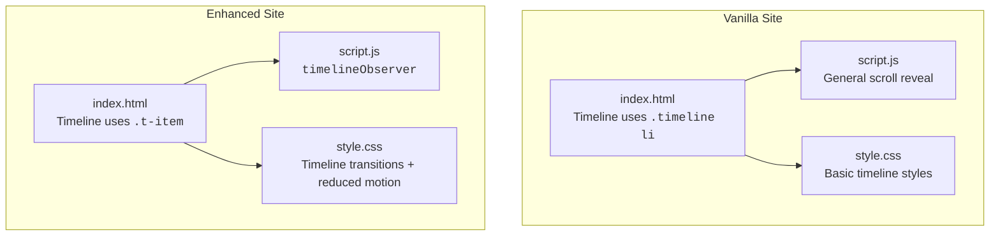
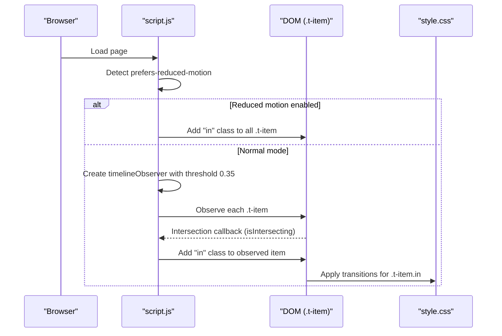
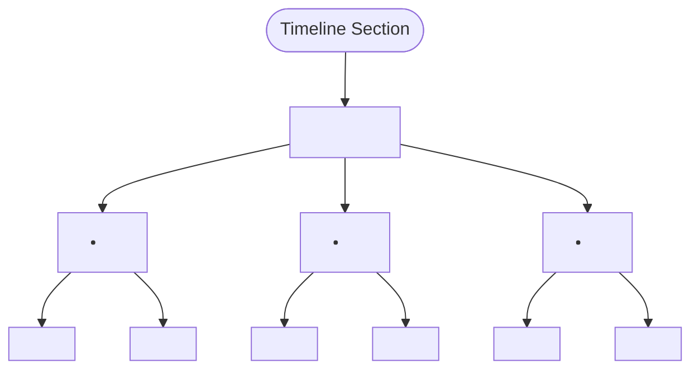
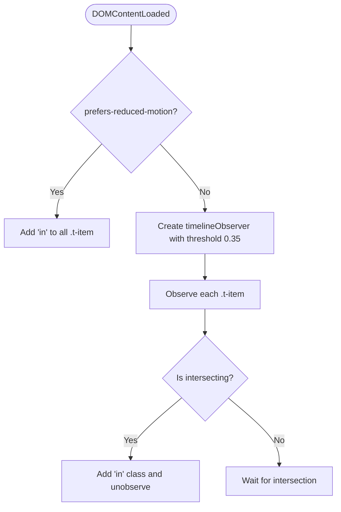
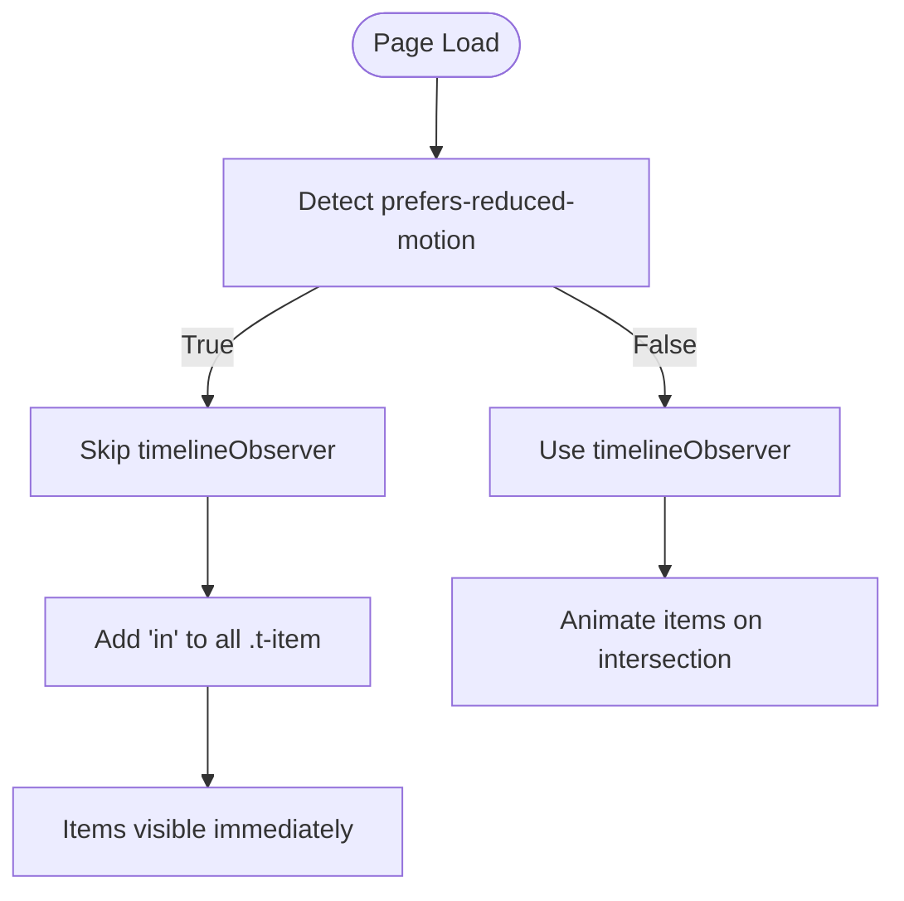
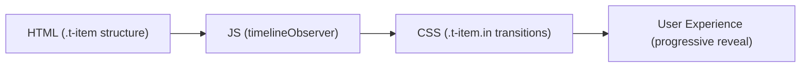

# Timeline Animations

<cite>
**Referenced Files in This Document**
- [index.html](file://files/arsalan-portfolio-vanilla\site\index.html)
- [script.js](file://files/arsalan-portfolio-vanilla\site\script.js)
- [style.css](file://files/arsalan-portfolio-vanilla\site\style.css)
- [index.html (enhanced)](file://files/index.html)
- [script.js (enhanced)](file://files/script.js)
- [style.css (enhanced)](file://files/style.css)
</cite>

## Table of Contents
1. [Introduction](#introduction)
2. [Project Structure](#project-structure)
3. [Core Components](#core-components)
4. [Architecture Overview](#architecture-overview)
5. [Detailed Component Analysis](#detailed-component-analysis)
6. [Dependency Analysis](#dependency-analysis)
7. [Performance Considerations](#performance-considerations)
8. [Troubleshooting Guide](#troubleshooting-guide)
9. [Conclusion](#conclusion)

## Introduction
This document explains the timeline-specific animation system that progressively reveals items as they enter the viewport. It focuses on:
- The `timelineObserver` implementation targeting `.t-item` elements with a threshold of `0.35`.
- The activation pattern using the `in` class.
- The reduced motion fallback that automatically adds the `in` class to all timeline items when `prefers-reduced-motion` is detected.
- Example HTML structure for timeline entries.
- CSS transitions used for item activation.
- Performance considerations when multiple timeline entries are present.

The portfolio contains two versions of the timeline:
- A simpler vanilla version where timeline items use generic classes and reveal via a general scroll observer.
- An enhanced version where timeline items use `.t-item`, an Intersection Observer, and CSS transitions driven by the `in` class.

## Project Structure
The relevant files for this documentation are located under the portfolio project:
- Vanilla site: `files/arsalan-portfolio-vanilla/site/index.html`, `script.js`, `style.css`
- Enhanced site: `files/index.html`, `script.js`, `style.css`

**Diagram sources**
- [index.html:88-97](file://files/arsalan-portfolio-vanilla\site\index.html#L88-L97)
- [script.js:46-50](file://files/arsalan-portfolio-vanilla\site\script.js#L46-L50)
- [style.css:103-113](file://files/arsalan-portfolio-vanilla\site\style.css#L103-L113)
- [index.html (enhanced):97-118](file://files/index.html#L97-L118)
- [script.js (enhanced):98-107](file://files/script.js#L98-L107)
- [style.css (enhanced):157-180](file://files/style.css#L157-L180)

**Section sources**
- [index.html:88-97](file://files/arsalan-portfolio-vanilla\site\index.html#L88-L97)
- [script.js:46-50](file://files/arsalan-portfolio-vanilla\site\script.js#L46-L50)
- [style.css:103-113](file://files/arsalan-portfolio-vanilla\site\style.css#L103-L113)
- [index.html (enhanced):97-118](file://files/index.html#L97-L118)
- [script.js (enhanced):98-107](file://files/script.js#L98-L107)
- [style.css (enhanced):157-180](file://files/style.css#L157-L180)

## Core Components
- Timeline HTML structure:
  - Vanilla: `<ol class="timeline">` with `<li>` children.
  - Enhanced: `<ol class="timeline">` with `<li class="t-item ...">` containing a node marker and a card container.
- JavaScript behavior:
  - Vanilla: General scroll reveal via `[data-reveal]` observer.
  - Enhanced: Dedicated `timelineObserver` for `.t-item` with threshold `0.35`, adding the `in` class once visible.
- CSS behavior:
  - Vanilla: Basic timeline layout and styling.
  - Enhanced: Transitions for nodes, connector lines, and cards triggered by the `in` class; reduced motion rules ensure immediate visibility.

**Section sources**
- [index.html:88-97](file://files/arsalan-portfolio-vanilla\site\index.html#L88-L97)
- [script.js:46-50](file://files/arsalan-portfolio-vanilla\site\script.js#L46-L50)
- [style.css:103-113](file://files/arsalan-portfolio-vanilla\site\style.css#L103-L113)
- [index.html (enhanced):97-118](file://files/index.html#L97-L118)
- [script.js (enhanced):98-107](file://files/script.js#L98-L107)
- [style.css (enhanced):157-180](file://files/style.css#L157-L180)

## Architecture Overview
The enhanced timeline animation follows a clear separation of concerns:
- HTML defines semantic timeline items with `.t-item`.
- JS observes these items and toggles the `in` class upon intersection.
- CSS animates visual states based on the presence of the `in` class.
- Reduced motion media query ensures accessibility by bypassing animations and immediately showing content.

**Diagram sources**
- [script.js (enhanced):98-107](file://files/script.js#L98-L107)
- [style.css (enhanced):157-180](file://files/style.css#L157-L180)

## Detailed Component Analysis

### Timeline HTML Structure
- Vanilla timeline:
  - Uses `<ol class="timeline">` with `<li>` elements carrying state classes like `done`, `now`, `next`.
  - No dedicated `.t-item` class; animation relies on general reveal patterns.
- Enhanced timeline:
  - Uses `<ol class="timeline">` with `<li class="t-item done|now|next">`.
  - Each item includes a node marker (``) and a card container (`
`).

**Diagram sources**
- [index.html (enhanced):97-118](file://files/index.html#L97-L118)

**Section sources**
- [index.html:88-97](file://files/arsalan-portfolio-vanilla\site\index.html#L88-L97)
- [index.html (enhanced):97-118](file://files/index.html#L97-L118)

### JavaScript: timelineObserver Implementation
- The enhanced script creates an IntersectionObserver specifically for `.t-item` elements.
- Threshold is set to `0.35`, meaning an item triggers when at least 35% of its area is visible.
- When an item intersects, the script adds the `in` class and stops observing that item to avoid redundant work.
- If reduced motion is detected, it skips the observer and directly adds the `in` class to all `.t-item` elements.

**Diagram sources**
- [script.js (enhanced):98-107](file://files/script.js#L98-L107)

**Section sources**
- [script.js (enhanced):98-107](file://files/script.js#L98-L107)

### CSS: Item Activation Transitions
- The enhanced CSS defines transitions for:
  - Connector line segments extending from nodes.
  - Node scaling and glow effects.
  - Card opacity, translation, and blur removal.
- These transitions are triggered when the parent `.t-item` receives the `in` class.
- Reduced motion rules force immediate visibility and disable animations/transitions for timeline components.

Key behaviors:
- Connector lines scale from zero to full width when `.t-item.in` is applied.
- Nodes scale up and gain a colored glow.
- Cards transition from hidden and blurred to fully visible and sharp.

**Section sources**
- [style.css (enhanced):157-180](file://files/style.css#L157-L180)
- [style.css (enhanced):234-240](file://files/style.css#L234-L240)

### Reduced Motion Fallback Behavior
- When `prefers-reduced-motion: reduce` is active:
  - The script detects this preference early and bypasses the IntersectionObserver.
  - All `.t-item` elements receive the `in` class immediately, ensuring content is visible without animation.
- CSS also enforces no animations or transitions for timeline-related elements, guaranteeing consistent behavior across browsers.

**Diagram sources**
- [script.js (enhanced):98-107](file://files/script.js#L98-L107)
- [style.css (enhanced):234-240](file://files/style.css#L234-L240)

**Section sources**
- [script.js (enhanced):98-107](file://files/script.js#L98-L107)
- [style.css (enhanced):234-240](file://files/style.css#L234-L240)

### Example Usage Patterns
- Vanilla timeline:
  - Use `<ol class="timeline">` with `<li>` elements.
  - Rely on general `[data-reveal]` observers for entrance animations.
- Enhanced timeline:
  - Use `<ol class="timeline">` with `<li class="t-item done|now|next">`.
  - Include a node marker and a card container inside each item.
  - Let the `timelineObserver` add the `in` class when items enter the viewport.

**Section sources**
- [index.html:88-97](file://files/arsalan-portfolio-vanilla\site\index.html#L88-L97)
- [index.html (enhanced):97-118](file://files/index.html#L97-L118)

## Dependency Analysis
- HTML provides the structural foundation for timeline items.
- JavaScript controls dynamic behavior:
  - Detects user preferences for reduced motion.
  - Creates and manages the IntersectionObserver for `.t-item`.
  - Adds/removes classes to trigger CSS transitions.
- CSS defines visual states and transitions:
  - Initial hidden/blurred states for timeline cards.
  - Activated states when `.t-item.in` is present.
  - Reduced motion overrides to ensure accessibility.

**Diagram sources**
- [index.html (enhanced):97-118](file://files/index.html#L97-L118)
- [script.js (enhanced):98-107](file://files/script.js#L98-L107)
- [style.css (enhanced):157-180](file://files/style.css#L157-L180)

**Section sources**
- [index.html (enhanced):97-118](file://files/index.html#L97-L118)
- [script.js (enhanced):98-107](file://files/script.js#L98-L107)
- [style.css (enhanced):157-180](file://files/style.css#L157-L180)

## Performance Considerations
- IntersectionObserver efficiency:
  - Using a dedicated observer for `.t-item` avoids unnecessary checks on unrelated elements.
  - Unobserving items after activation prevents redundant callbacks.
- Threshold tuning:
  - A threshold of `0.35` balances timely activation with avoiding premature triggers.
- Reduced motion optimization:
  - Bypassing observers when reduced motion is enabled reduces runtime overhead.
- CSS performance:
  - Prefer transform and opacity changes for smooth animations.
  - Avoid heavy filters or expensive properties during frequent updates.
- Multiple timeline entries:
  - Ensure each `.t-item` is independent so observers do not interfere with one another.
  - Staggered delays can be handled via CSS variables or initial classes rather than complex JS logic.

[No sources needed since this section provides general guidance]

## Troubleshooting Guide
- Items not animating:
  - Verify that `.t-item` elements exist and are correctly structured.
  - Confirm that the `timelineObserver` is created and observing items.
  - Check if reduced motion is enabled, which would skip animations.
- Animations firing too early or late:
  - Adjust the threshold value in the observer configuration.
  - Inspect CSS transitions to ensure they respond to the `in` class.
- Accessibility issues:
  - Ensure reduced motion rules are present and effective.
  - Validate that content remains readable without animations.

**Section sources**
- [script.js (enhanced):98-107](file://files/script.js#L98-L107)
- [style.css (enhanced):234-240](file://files/style.css#L234-L240)

## Conclusion
The enhanced timeline animation system provides a robust, accessible, and performant way to reveal timeline items progressively. By combining semantic HTML, targeted JavaScript observers, and well-structured CSS transitions, the system ensures a smooth user experience while respecting user preferences for reduced motion. The vanilla timeline offers a simpler alternative suitable for basic needs, while the enhanced version delivers richer interactions and better accessibility support.

[No sources needed since this section summarizes without analyzing specific files]