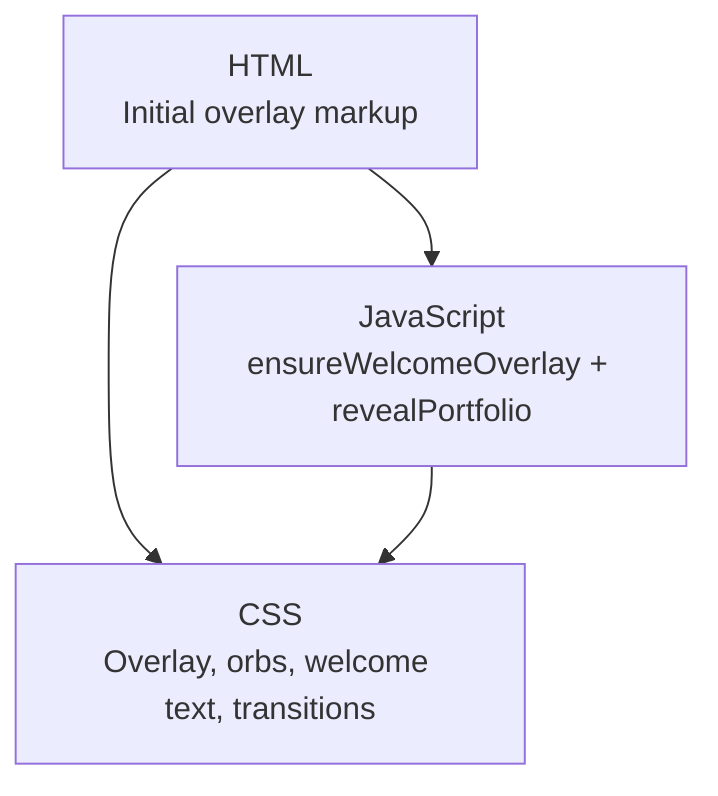
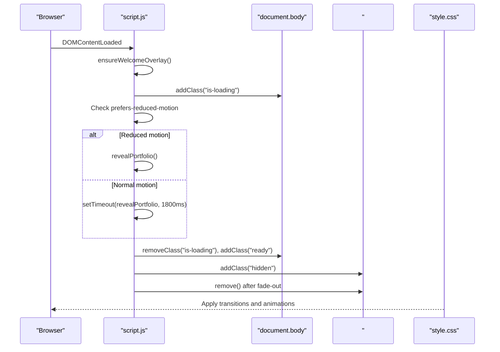
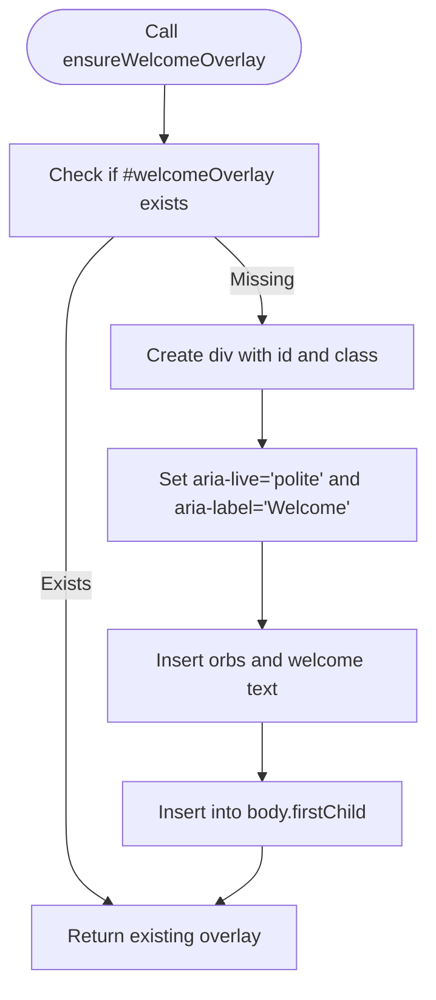
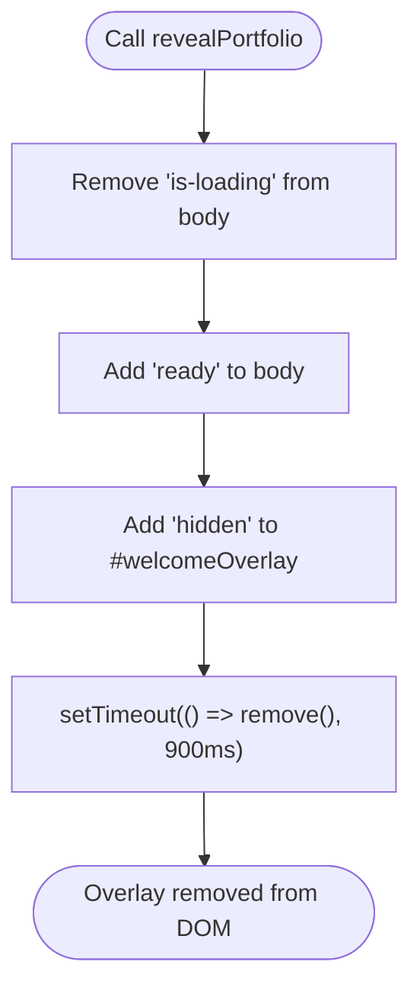
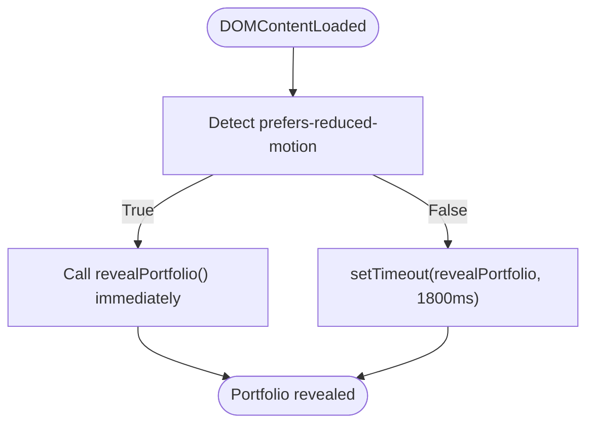
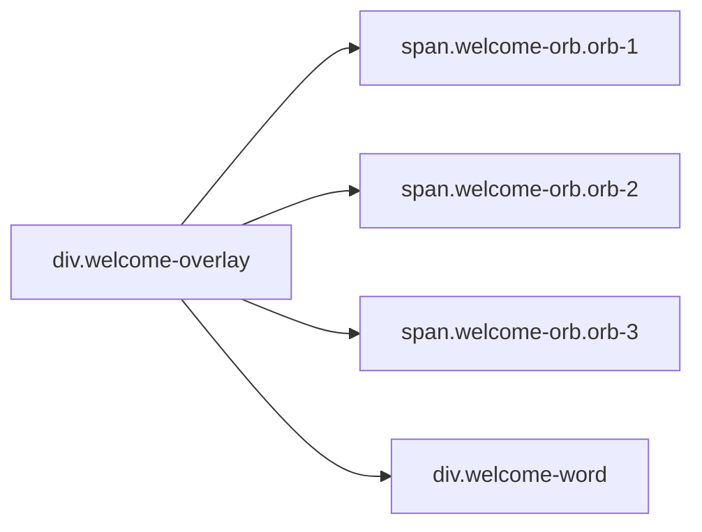
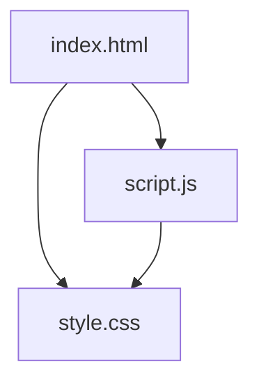

# Welcome Overlay System

<cite>
**Referenced Files in This Document**
- [index.html](file://files/index.html)
- [script.js](file://files/script.js)
- [style.css](file://files/style.css)
</cite>

## Table of Contents
1. [Introduction](#introduction)
2. [Project Structure](#project-structure)
3. [Core Components](#core-components)
4. [Architecture Overview](#architecture-overview)
5. [Detailed Component Analysis](#detailed-component-analysis)
6. [Dependency Analysis](#dependency-analysis)
7. [Performance Considerations](#performance-considerations)
8. [Troubleshooting Guide](#troubleshooting-guide)
9. [Conclusion](#conclusion)

## Introduction
This document explains the welcome overlay system that provides a cinematic entrance animation before revealing the portfolio. It covers how the overlay is created and managed, how accessibility attributes are applied, how the transition from loading to ready state works, how reduced motion preferences affect behavior, and what performance considerations apply when creating and removing the overlay.

## Project Structure
The welcome overlay system spans three files:
- HTML defines the initial overlay structure and body class.
- JavaScript dynamically ensures the overlay exists, manages its lifecycle, and controls the reveal timing.
- CSS styles the overlay, orbs, welcome text, and the loading-to-ready transition.

**Diagram sources**
- [index.html:10-18](file://files/index.html#L10-L18)
- [script.js:6-38](file://files/script.js#L6-L38)
- [style.css:24-41](file://files/style.css#L24-L41)

**Section sources**
- [index.html:10-18](file://files/index.html#L10-L18)
- [script.js:1-38](file://files/script.js#L1-L38)
- [style.css:24-41](file://files/style.css#L24-L41)

## Core Components
- ensureWelcomeOverlay: Ensures the welcome overlay element exists, creates it if missing, applies ARIA attributes, inserts orb elements and welcome text, and returns the overlay node.
- revealPortfolio: Removes the loading lock, adds the ready state, hides the overlay, and removes it from the DOM after the fade-out completes.
- Reduced motion handling: Skips the cinematic intro and immediately reveals the portfolio when the user prefers reduced motion.

Key responsibilities:
- Dynamic DOM creation and insertion.
- Accessibility via aria-live and aria-label.
- State management through CSS classes on the body and overlay.
- Timing control based on user preference for reduced motion.

**Section sources**
- [script.js:6-38](file://files/script.js#L6-L38)
- [style.css:24-41](file://files/style.css#L24-L41)

## Architecture Overview
The welcome overlay system follows a simple flow:
1. On page load, ensure the overlay exists and add the is-loading class to the body.
2. If reduced motion is preferred, reveal the portfolio immediately; otherwise, wait for the cinematic intro duration.
3. Reveal the portfolio by removing is-loading, adding ready, hiding the overlay, and removing it after the fade-out.

**Diagram sources**
- [script.js:1-38](file://files/script.js#L1-L38)
- [style.css:24-41](file://files/style.css#L24-L41)

## Detailed Component Analysis

### ensureWelcomeOverlay Function
Purpose:
- Safely create the welcome overlay if it does not already exist.
- Set id, class, and ARIA attributes for accessibility.
- Insert orbital elements and welcome text.
- Insert the overlay at the beginning of the body so it appears above other content.

Behavior details:
- Checks for an existing element with id welcomeOverlay.
- Creates a new div with class welcome-overlay and id welcomeOverlay.
- Sets aria-live="polite" and aria-label="Welcome" for screen readers.
- Inserts three orb spans and a welcome text div.
- Uses insertBefore to place the overlay at the top of the body.

Accessibility notes:
- aria-live="polite" announces changes without interrupting the user.
- aria-label="Welcome" provides context for assistive technologies.
- Orb elements use aria-hidden="true" because they are decorative.

**Diagram sources**
- [script.js:6-23](file://files/script.js#L6-L23)

**Section sources**
- [script.js:6-23](file://files/script.js#L6-L23)

### revealPortfolio Function
Purpose:
- Transition from the loading state to the ready state.
- Hide and remove the welcome overlay after its fade-out animation.

Behavior details:
- Removes is-loading from the body to unlock scrolling and show main content.
- Adds ready to the body to trigger hero and ambient glow transitions.
- Adds hidden to the overlay to start the fade-out.
- Schedules removal of the overlay after the CSS transition completes.

State classes:
- is-loading: Locks scrolling and hides navigation/main/footer during the intro.
- ready: Enables entrance animations for hero content and increases ambient glow opacity.

**Diagram sources**
- [script.js:28-35](file://files/script.js#L28-L35)
- [style.css:16-41](file://files/style.css#L16-L41)

**Section sources**
- [script.js:28-35](file://files/script.js#L28-L35)
- [style.css:16-41](file://files/style.css#L16-L41)

### Reduced Motion Detection
Purpose:
- Respect user preferences for reduced motion by skipping the cinematic intro.

Behavior details:
- Detects prefers-reduced-motion: reduce using matchMedia.
- If true, calls revealPortfolio immediately.
- Otherwise, waits 1800ms before revealing the portfolio.
- CSS also hides the entire welcome overlay and disables animations/transitions when reduced motion is preferred.

Impact:
- Users who prefer reduced motion see the portfolio immediately without the welcome animation.
- All animations and transitions are disabled globally under this media query.

**Diagram sources**
- [script.js:1-3](file://files/script.js#L1-L3)
- [script.js:37-38](file://files/script.js#L37-L38)
- [style.css:234-240](file://files/style.css#L234-L240)

**Section sources**
- [script.js:1-3](file://files/script.js#L1-L3)
- [script.js:37-38](file://files/script.js#L37-L38)
- [style.css:234-240](file://files/style.css#L234-L240)

### Overlay HTML Structure and Styling
Overlay structure:
- Container: div.welcome-overlay with id welcomeOverlay.
- Orbs: Three span elements with classes welcome-orb and orb-1/2/3.
- Welcome text: div.welcome-word containing the welcome message.

Accessibility attributes:
- Container has aria-live="polite" and aria-label="Welcome".
- Orbs have aria-hidden="true" since they are purely decorative.
- Welcome text has aria-label="Welcome" for additional context.

Styling highlights:
- Overlay uses fixed positioning, grid centering, and a radial gradient background.
- Orbs animate in with blur and opacity transitions.
- Welcome text animates from blurred and scaled down to clear and fully visible.
- When hidden, the overlay fades out and becomes non-interactive.

**Diagram sources**
- [index.html:13-18](file://files/index.html#L13-L18)
- [style.css:24-35](file://files/style.css#L24-L35)

**Section sources**
- [index.html:13-18](file://files/index.html#L13-L18)
- [style.css:24-35](file://files/style.css#L24-L35)

## Dependency Analysis
The welcome overlay system depends on:
- HTML providing the initial overlay markup and body class.
- JavaScript ensuring dynamic creation and managing lifecycle.
- CSS defining visual states and transitions.

**Diagram sources**
- [index.html:10-18](file://files/index.html#L10-L18)
- [script.js:6-38](file://files/script.js#L6-L38)
- [style.css:24-41](file://files/style.css#L24-L41)

**Section sources**
- [index.html:10-18](file://files/index.html#L10-L18)
- [script.js:6-38](file://files/script.js#L6-L38)
- [style.css:24-41](file://files/style.css#L24-L41)

## Performance Considerations
- DOM manipulation timing: The overlay is created once and inserted at the beginning of the body. This avoids repeated lookups and keeps the intro layer above other content.
- Memory cleanup: After the fade-out completes, the overlay is removed from the DOM, preventing memory leaks and keeping the document lightweight.
- Animation costs: Orbs and welcome text use CSS animations and transitions. Under reduced motion, these are disabled, improving performance for users who prefer it.
- Class-based state: Using is-loading and ready on the body centralizes state management and reduces JavaScript overhead during transitions.
- Event handling: Scroll and pointer effects are throttled with requestAnimationFrame elsewhere in the script, but the welcome overlay itself relies on CSS transitions for smoothness and low CPU usage.

Recommendations:
- Keep the overlay minimal and avoid heavy child nodes.
- Prefer CSS transitions/animations over JavaScript-driven animations where possible.
- Ensure overlays are removed promptly after their transitions complete.
- Respect prefers-reduced-motion to minimize unnecessary work.

[No sources needed since this section provides general guidance]

## Troubleshooting Guide
Common issues and resolutions:
- Overlay not appearing:
  - Verify that ensureWelcomeOverlay runs and inserts the overlay at the beginning of the body.
  - Confirm that the welcome-overlay class and id are present.
- Screen readers not announcing welcome:
  - Ensure aria-live="polite" and aria-label="Welcome" are set on the overlay container.
- Portfolio not revealing:
  - Check that revealPortfolio is called either immediately (reduced motion) or after the timeout.
  - Verify that is-loading is removed and ready is added to the body.
- Animations not playing:
  - Confirm that CSS transitions and keyframes are loaded.
  - Check that prefers-reduced-motion is not unexpectedly enabled.

**Section sources**
- [script.js:6-38](file://files/script.js#L6-L38)
- [style.css:24-41](file://files/style.css#L24-L41)
- [style.css:234-240](file://files/style.css#L234-L240)

## Conclusion
The welcome overlay system provides a controlled cinematic entrance that respects user preferences and maintains accessibility. It dynamically ensures the overlay exists, applies appropriate ARIA attributes, manages state through CSS classes, and cleans up the DOM after the transition. Reduced motion support ensures a smooth experience for all users while minimizing performance costs.

[No sources needed since this section summarizes without analyzing specific files]