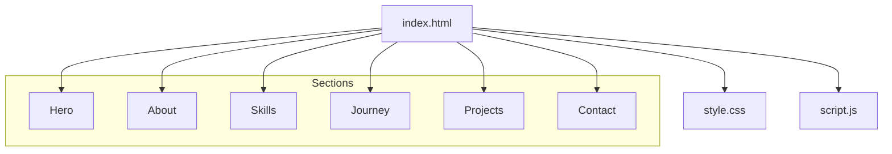
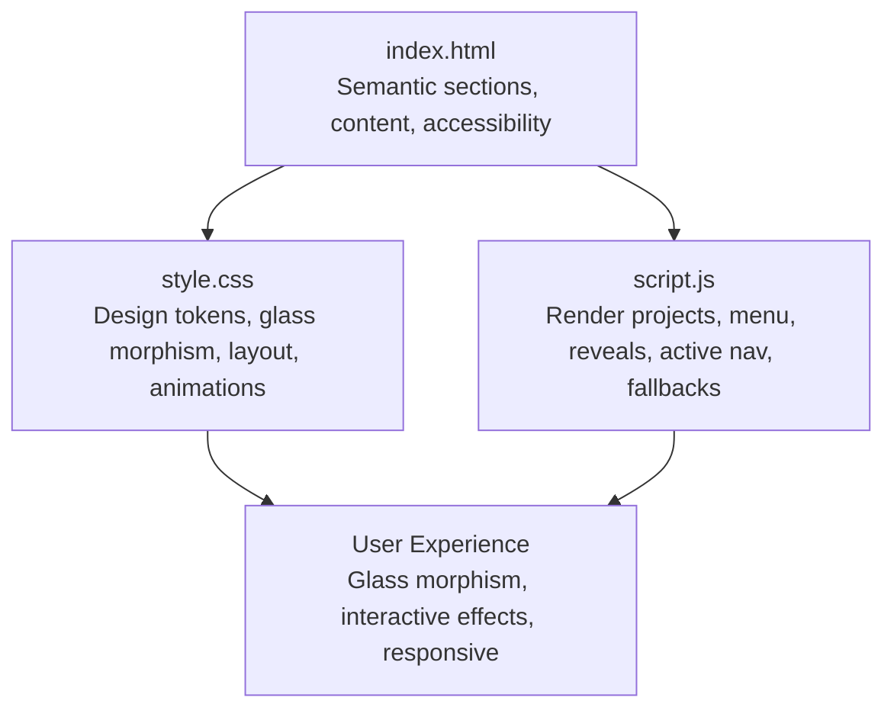
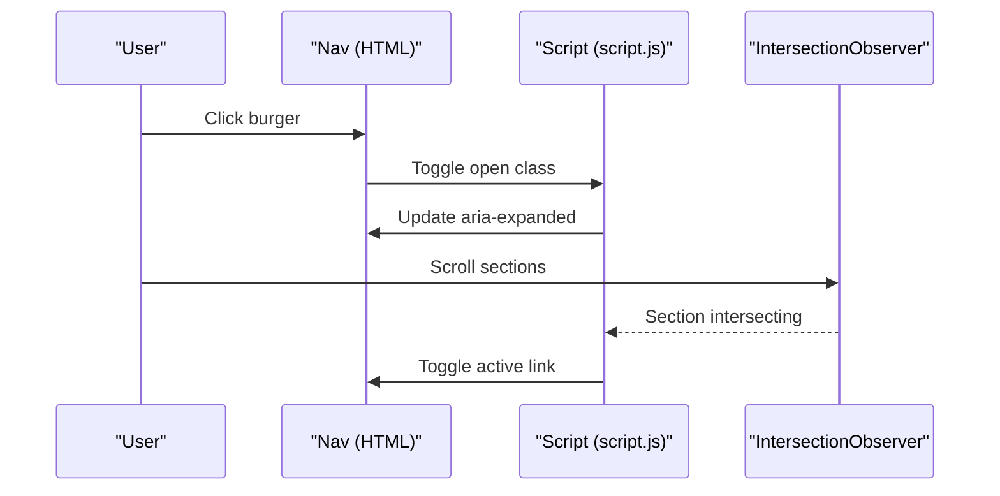
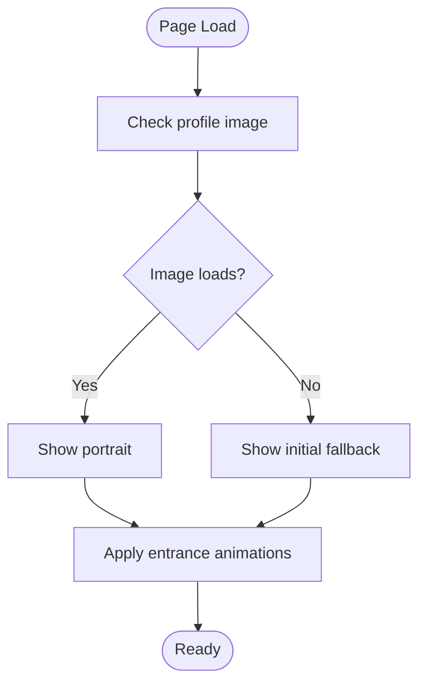
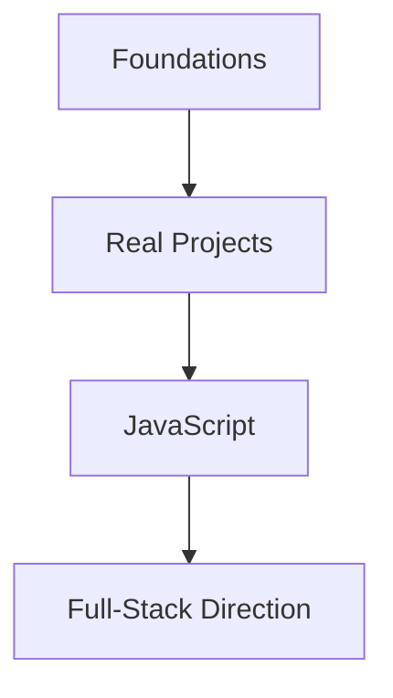
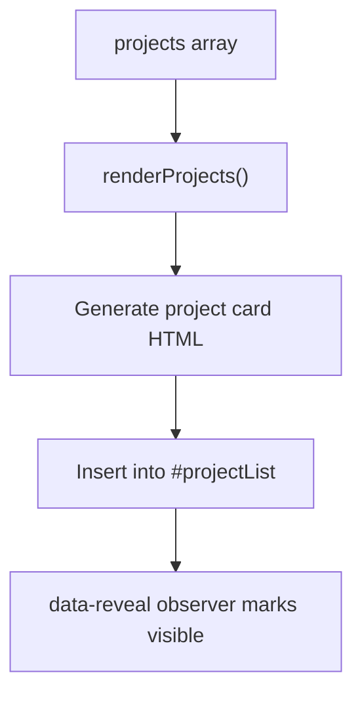
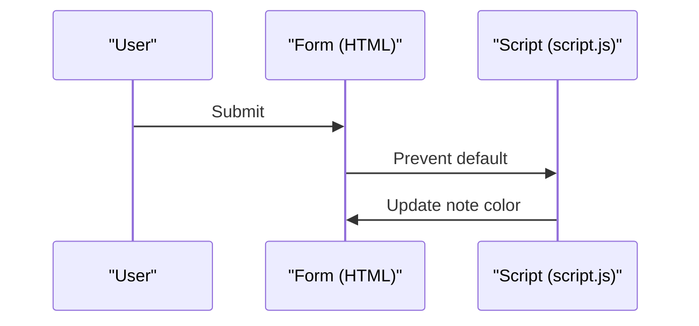
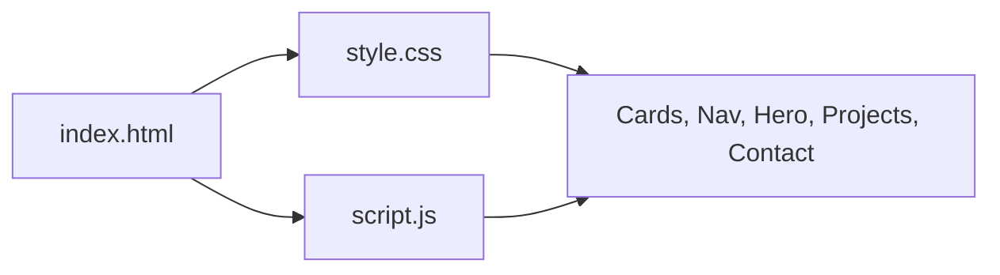

# Project Overview

<cite>
**Referenced Files in This Document**
- [index.html](file://files/arsalan-portfolio-vanilla/site/index.html)
- [style.css](file://files/arsalan-portfolio-vanilla/site/style.css)
- [script.js](file://files/arsalan-portfolio-vanilla/site/script.js)
</cite>

## Table of Contents
1. [Introduction](#introduction)
2. [Project Structure](#project-structure)
3. [Core Components](#core-components)
4. [Architecture Overview](#architecture-overview)
5. [Detailed Component Analysis](#detailed-component-analysis)
6. [Dependency Analysis](#dependency-analysis)
7. [Performance Considerations](#performance-considerations)
8. [Troubleshooting Guide](#troubleshooting-guide)
9. [Conclusion](#conclusion)

## Introduction
This portfolio is a personal learning showcase for Arsalan, demonstrating real-world web development progress while actively learning JavaScript. It targets potential employers and collaborators by presenting a modern, accessible, and responsive site that highlights foundational HTML/CSS skills, current JavaScript learning, and an intentional path toward full-stack development. The project emphasizes progressive enhancement: the site works without JavaScript using semantic HTML and CSS, then progressively adds interactive effects like scroll reveals, active navigation highlighting, and a mobile menu.

Key themes reflected in the codebase include glass morphism styling, interactive effects, and a clear progression from foundations to full-stack goals.

## Project Structure
The portfolio is organized as a vanilla front-end site with three core files:
- index.html: Semantic structure, sections, and content
- style.css: Design tokens, glass morphism styles, layout, animations, and responsive rules
- script.js: Project rendering, mobile menu, scroll reveal, active section tracking, image fallback, and UI-only form behavior

**Diagram sources**
- [index.html:10-133](file://files/arsalan-portfolio-vanilla/site/index.html#L10-L133)

**Section sources**
- [index.html:1-135](file://files/arsalan-portfolio-vanilla/site/index.html#L1-L135)
- [style.css:1-182](file://files/arsalan-portfolio-vanilla/site/style.css#L1-L182)
- [script.js:1-75](file://files/arsalan-portfolio-vanilla/site/script.js#L1-L75)

## Core Components
- Glass morphism design system: Semi-transparent cards and panels with backdrop blur, subtle borders, and layered glows create a modern aesthetic.
- Responsive navigation: Desktop shows inline links; mobile uses a burger toggle with an accessible expanded state.
- Hero section: Introduces Arsalan’s role, learning focus, and calls to action. Includes a portrait area with a graceful fallback if the image fails to load.
- Skills and Journey: Honest presentation of current skills (HTML/CSS foundation, JavaScript learning) and a timeline showing progression toward full-stack development.
- Projects gallery: Dynamically rendered from a data array, supporting live links, optional GitHub links, tags, and preview images with a mock placeholder.
- Contact area: Email and GitHub links plus a UI-only form that demonstrates interaction without a backend.

Practical examples:
- Cinematic welcome overlay: The hero introduces the developer with animated badges and chips, establishing a polished first impression.
- Responsive navigation: On small screens, the burger button toggles a glass-styled dropdown menu.
- Interactive project gallery: Projects are generated from a JavaScript array, enabling easy updates and consistent card layouts.

**Section sources**
- [index.html:13-133](file://files/arsalan-portfolio-vanilla/site/index.html#L13-L133)
- [style.css:21-159](file://files/arsalan-portfolio-vanilla/site/style.css#L21-L159)
- [script.js:15-74](file://files/arsalan-portfolio-vanilla/site/script.js#L15-L74)

## Architecture Overview
The site follows a simple, maintainable architecture:
- HTML provides semantic sections and accessibility attributes.
- CSS defines a token-based design system and applies glass morphism across components.
- JavaScript enhances the experience with interactivity and dynamic content.

**Diagram sources**
- [index.html:1-135](file://files/arsalan-portfolio-vanilla/site/index.html#L1-L135)
- [style.css:1-182](file://files/arsalan-portfolio-vanilla/site/style.css#L1-L182)
- [script.js:1-75](file://files/arsalan-portfolio-vanilla/site/script.js#L1-L75)

## Detailed Component Analysis

### Navigation and Mobile Menu
- Desktop: Inline links with hover states and an active class driven by scroll position.
- Mobile: Burger button toggles a glass-styled dropdown menu; aria-expanded reflects state.
- Active link tracking: IntersectionObserver highlights the current section based on scroll position.

**Diagram sources**
- [index.html:14-29](file://files/arsalan-portfolio-vanilla/site/index.html#L14-L29)
- [script.js:36-59](file://files/arsalan-portfolio-vanilla/site/script.js#L36-L59)

**Section sources**
- [index.html:14-29](file://files/arsalan-portfolio-vanilla/site/index.html#L14-L29)
- [style.css:51-65](file://files/arsalan-portfolio-vanilla/site/style.css#L51-L65)
- [script.js:36-59](file://files/arsalan-portfolio-vanilla/site/script.js#L36-L59)

### Hero and Welcome Overlay
- Purpose: Establish identity, learning focus, and primary actions.
- Visuals: Animated badge, gradient text, portrait with fallback, floating chips indicating “Now Learning” and “Foundation.”
- Accessibility: Descriptive alt text and semantic headings.

**Diagram sources**
- [index.html:33-53](file://files/arsalan-portfolio-vanilla/site/index.html#L33-L53)
- [script.js:61-66](file://files/arsalan-portfolio-vanilla/site/script.js#L61-L66)

**Section sources**
- [index.html:33-53](file://files/arsalan-portfolio-vanilla/site/index.html#L33-L53)
- [style.css:67-83](file://files/arsalan-portfolio-vanilla/site/style.css#L67-L83)
- [script.js:61-66](file://files/arsalan-portfolio-vanilla/site/script.js#L61-L66)

### Skills and Journey Sections
- Skills: Three tiers—foundation (HTML/CSS), currently learning (JavaScript), exploring (React, Next.js, TypeScript, Tailwind, Node.js, APIs, AI-assisted development).
- Journey: Timeline showing completed steps and next goals, reinforcing the path toward full-stack development.

**Diagram sources**
- [index.html:64-97](file://files/arsalan-portfolio-vanilla/site/index.html#L64-L97)

**Section sources**
- [index.html:64-97](file://files/arsalan-portfolio-vanilla/site/index.html#L64-L97)
- [style.css:88-112](file://files/arsalan-portfolio-vanilla/site/style.css#L88-L112)

### Projects Gallery
- Data-driven rendering: A JavaScript array defines projects; each object can include name, description, live URL, repo URL, image, and tags.
- Cards: Each project renders a glass-styled card with a preview area, title, description, tags, and action buttons.
- Extensibility: Adding a new project is straightforward by appending an object to the array.

**Diagram sources**
- [script.js:1-34](file://files/arsalan-portfolio-vanilla/site/script.js#L1-L34)
- [index.html:99-103](file://files/arsalan-portfolio-vanilla/site/index.html#L99-L103)

**Section sources**
- [script.js:1-34](file://files/arsalan-portfolio-vanilla/site/script.js#L1-L34)
- [index.html:99-103](file://files/arsalan-portfolio-vanilla/site/index.html#L99-L103)
- [style.css:114-129](file://files/arsalan-portfolio-vanilla/site/style.css#L114-L129)

### Contact Area and UI-Only Form
- Links: Direct email and GitHub links for outreach.
- Form: Demonstrates user input and feedback without sending data; includes a note clarifying its UI-only nature.

**Diagram sources**
- [index.html:105-123](file://files/arsalan-portfolio-vanilla/site/index.html#L105-L123)
- [script.js:68-74](file://files/arsalan-portfolio-vanilla/site/script.js#L68-L74)

**Section sources**
- [index.html:105-123](file://files/arsalan-portfolio-vanilla/site/index.html#L105-L123)
- [style.css:130-144](file://files/arsalan-portfolio-vanilla/site/style.css#L130-L144)
- [script.js:68-74](file://files/arsalan-portfolio-vanilla/site/script.js#L68-L74)

## Dependency Analysis
- HTML depends on CSS for visual design and on JavaScript for enhanced interactions.
- CSS defines reusable tokens and glass morphism utilities applied across components.
- JavaScript observes DOM elements and updates classes for interactivity and dynamic rendering.

**Diagram sources**
- [index.html:1-135](file://files/arsalan-portfolio-vanilla/site/index.html#L1-L135)
- [style.css:1-182](file://files/arsalan-portfolio-vanilla/site/style.css#L1-L182)
- [script.js:1-75](file://files/arsalan-portfolio-vanilla/site/script.js#L1-L75)

**Section sources**
- [index.html:1-135](file://files/arsalan-portfolio-vanilla/site/index.html#L1-L135)
- [style.css:1-182](file://files/arsalan-portfolio-vanilla/site/style.css#L1-L182)
- [script.js:1-75](file://files/arsalan-portfolio-vanilla/site/script.js#L1-L75)

## Performance Considerations
- Prefer CSS animations and transitions over heavy JavaScript where possible.
- Use IntersectionObserver for scroll reveals to avoid layout thrashing.
- Keep images optimized; provide fallbacks to prevent broken visuals.
- Respect prefers-reduced-motion to improve accessibility and performance for sensitive users.

[No sources needed since this section provides general guidance]

## Troubleshooting Guide
- Missing profile image: The script automatically shows a fallback initial when the image fails to load or has zero width.
- Mobile menu not opening: Ensure the burger button exists and the nav-links container has the correct ID; verify aria-expanded toggling.
- Projects not rendering: Confirm the projects array is defined and the #projectList element exists before renderProjects runs.
- Form submission does nothing: This is expected; the form is UI-only and prevents default submission.

**Section sources**
- [script.js:61-74](file://files/arsalan-portfolio-vanilla/site/script.js#L61-L74)
- [index.html:43-52](file://files/arsalan-portfolio-vanilla/site/index.html#L43-L52)
- [index.html:99-103](file://files/arsalan-portfolio-vanilla/site/index.html#L99-L103)
- [index.html:115-121](file://files/arsalan-portfolio-vanilla/site/index.html#L115-L121)

## Conclusion
Arsalan’s portfolio is a purposeful learning showcase that balances clarity, accessibility, and modern aesthetics. It demonstrates strong HTML/CSS foundations, introduces JavaScript interactivity, and signals a clear trajectory toward full-stack development. Through glass morphism, interactive effects, and progressive enhancement, the site communicates both technical competence and a commitment to continuous growth.

[No sources needed since this section summarizes without analyzing specific files]