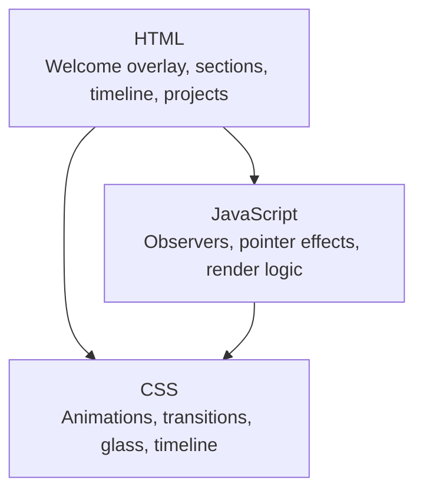
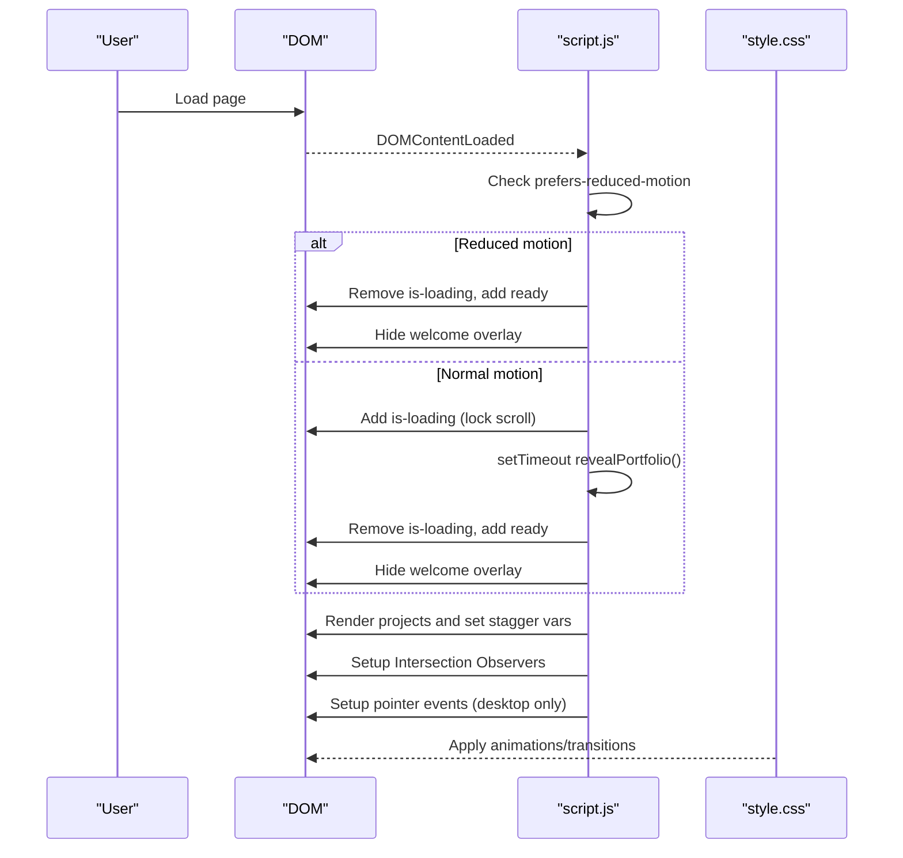
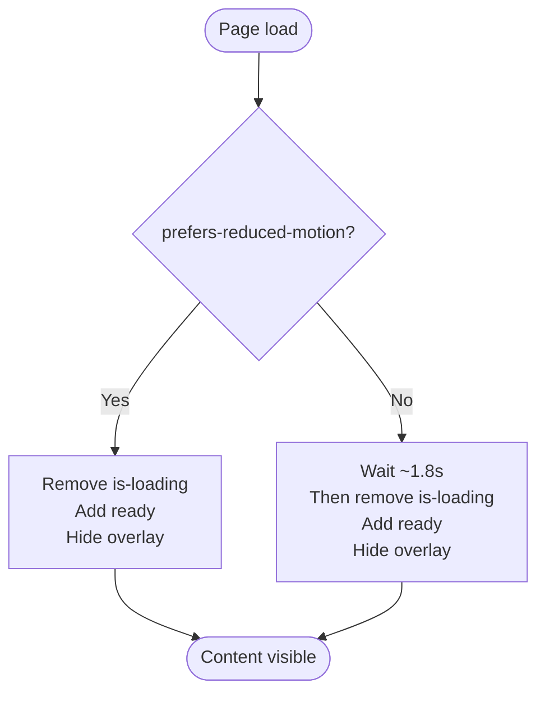
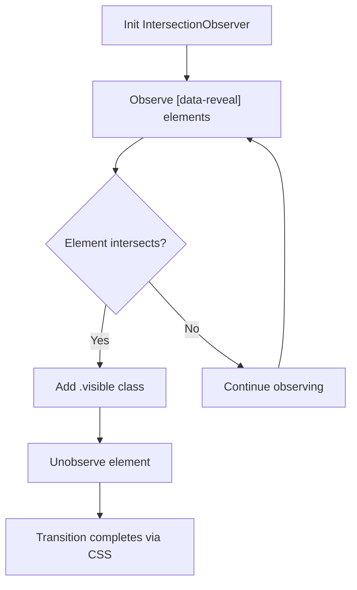
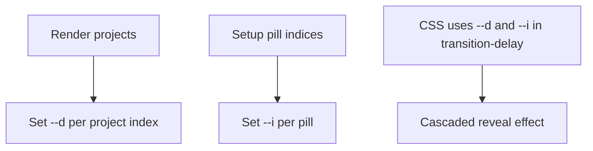
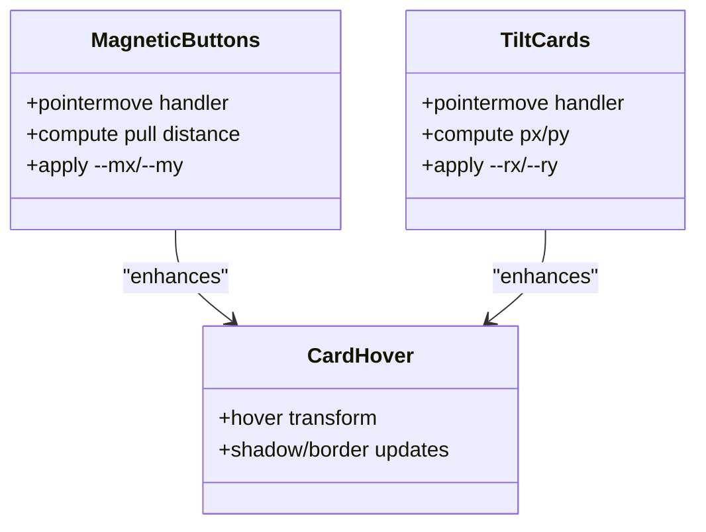
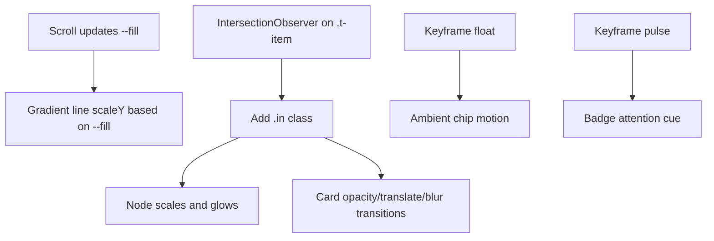
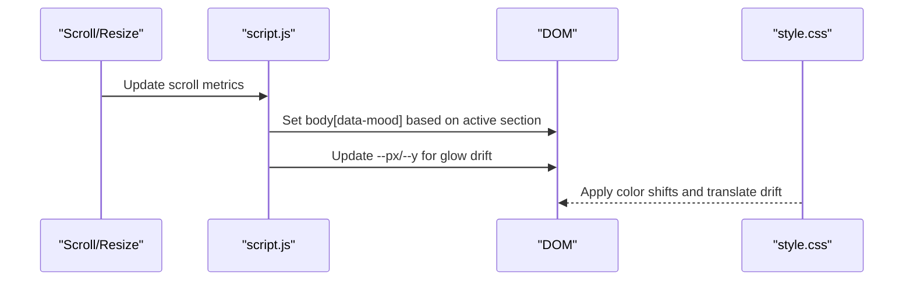
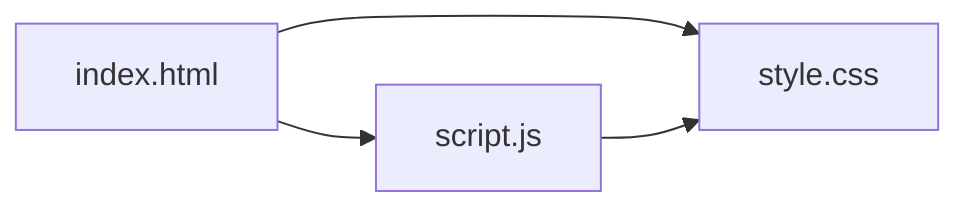

# Animations & Transitions System

<cite>
**Referenced Files in This Document**
- [index.html](file://files/index.html)
- [script.js](file://files/script.js)
- [style.css](file://files/style.css)
</cite>

## Table of Contents
1. [Introduction](#introduction)
2. [Project Structure](#project-structure)
3. [Core Components](#core-components)
4. [Architecture Overview](#architecture-overview)
5. [Detailed Component Analysis](#detailed-component-analysis)
6. [Dependency Analysis](#dependency-analysis)
7. [Performance Considerations](#performance-considerations)
8. [Troubleshooting Guide](#troubleshooting-guide)
9. [Conclusion](#conclusion)

## Introduction
This document explains the animation and transition system used by the portfolio site. It covers:
- Welcome overlay animations with orb entrance effects, text reveal sequences, and portfolio gate transitions
- Scroll-triggered reveals using Intersection Observer and staggered animations via CSS custom properties
- Hover effects including magnetic buttons, 3D tilting transforms, card lift effects, and smooth transitions
- Timeline animations, floating elements, and pulse effects
- Performance optimizations such as GPU-accelerated properties, reduced motion support, and accessibility best practices

## Project Structure
The animation system is implemented across three primary files:
- HTML defines the structure for the welcome overlay, sections, timeline, project cards, and interactive elements
- JavaScript orchestrates the welcome sequence, scroll observers, pointer-driven effects, and dynamic content rendering
- CSS defines keyframes, transitions, glassmorphism, hover states, timeline drawing, and reduced-motion behavior

**Diagram sources**
- [index.html:10-18](file://files/index.html#L10-L18)
- [script.js:1-214](file://files/script.js#L1-L214)
- [style.css:24-240](file://files/style.css#L24-L240)

**Section sources**
- [index.html:10-18](file://files/index.html#L10-L18)
- [script.js:1-214](file://files/script.js#L1-L214)
- [style.css:24-240](file://files/style.css#L24-L240)

## Core Components
- Welcome overlay: cinematic intro with animated orbs and a word reveal; hides after a delay or immediately when reduced motion is preferred
- Portfolio gate: locks scrolling during intro and fades out the overlay to reveal the main content
- Scroll-triggered reveals: elements with data-reveal fade and translate into view using Intersection Observer; staggered via --d
- Staggered pills and hero elements: use --i and --d to create cascading animations
- Magnetic buttons: primary CTAs subtly follow the cursor within a small range
- 3D tilt on cards: portrait and project cards respond to pointer movement with perspective transforms
- Timeline animation: nodes and cards animate in as they enter the viewport; a gradient line draws itself based on scroll position
- Floating chips and pulse badges: ambient motion and pulsing indicators
- Background glow: ambient color shifts per section and subtle mouse-reactive drift

**Section sources**
- [index.html:10-18](file://files/index.html#L10-L18)
- [script.js:1-214](file://files/script.js#L1-L214)
- [style.css:24-240](file://files/style.css#L24-L240)

## Architecture Overview
The animation architecture combines declarative CSS animations/transitions with lightweight JavaScript orchestration:
- CSS handles visual transitions, keyframes, and prefers-reduced-motion overrides
- JavaScript initializes observers, sets stagger variables, and applies pointer-driven transforms
- The welcome overlay controls page loading state and triggers the reveal of the main content

**Diagram sources**
- [script.js:1-39](file://files/script.js#L1-L39)
- [style.css:24-41](file://files/style.css#L24-L41)

## Detailed Component Analysis

### Welcome Overlay Animations
- Orb entrance effects: Three blurred orbs fade in with staggered delays to create a cinematic background
- Text reveal sequence: The welcome word scales up, unblurs, and gains a soft glow before fading out
- Portfolio gate transitions: The body gets an is-loading class that hides navigation/main/footer; once the overlay is hidden, the body switches to ready and content fades/slides in

**Diagram sources**
- [script.js:1-39](file://files/script.js#L1-L39)
- [style.css:24-41](file://files/style.css#L24-L41)

**Section sources**
- [index.html:10-18](file://files/index.html#L10-L18)
- [script.js:1-39](file://files/script.js#L1-L39)
- [style.css:24-41](file://files/style.css#L24-L41)

### Scroll-Triggered Reveal System
- Elements marked with data-reveal start invisible and slightly translated/blurry
- An IntersectionObserver adds a visible class when elements enter the viewport, triggering CSS transitions
- Staggered timing is applied via --d on elements or groups, creating cascading reveals

**Diagram sources**
- [script.js:92-96](file://files/script.js#L92-L96)
- [style.css:223-225](file://files/style.css#L223-L225)

**Section sources**
- [script.js:92-96](file://files/script.js#L92-L96)
- [style.css:223-225](file://files/style.css#L223-L225)

### Staggered Animations with CSS Custom Properties
- Hero elements and skill pills use --d and --i to stagger their transitions
- Projects are rendered dynamically and assigned staggered --d values based on index
- Pills inside skills use --i to compute incremental delays

**Diagram sources**
- [script.js:40-49](file://files/script.js#L40-L49)
- [style.css:107-110](file://files/style.css#L107-L110)
- [style.css:145-150](file://files/style.css#L145-L150)

**Section sources**
- [script.js:40-49](file://files/script.js#L40-L49)
- [style.css:107-110](file://files/style.css#L107-L110)
- [style.css:145-150](file://files/style.css#L145-L150)

### Hover Effects: Magnetic Buttons, 3D Tilt, Card Lifts
- Magnetic buttons: Primary CTA and GitHub nav button track the pointer within a limited range, applying --mx and --my offsets
- 3D tilt: Portrait and project cards apply perspective-based rotateX/Y transforms driven by pointer position
- Card lifts: Cards elevate and scale slightly on hover with enhanced shadows and border highlights

**Diagram sources**
- [script.js:141-198](file://files/script.js#L141-L198)
- [style.css:75-84](file://files/style.css#L75-L84)
- [style.css:118-122](file://files/style.css#L118-L122)
- [style.css:183-189](file://files/style.css#L183-L189)

**Section sources**
- [script.js:141-198](file://files/script.js#L141-L198)
- [style.css:75-84](file://files/style.css#L75-L84)
- [style.css:118-122](file://files/style.css#L118-L122)
- [style.css:183-189](file://files/style.css#L183-L189)

### Timeline Animations, Floating Elements, Pulse Effects
- Timeline nodes and cards animate in when intersecting; a gradient line draws itself based on scroll progress
- Floating chips around the portrait continuously float with keyframes
- Badge indicator pulses to draw attention

**Diagram sources**
- [script.js:51-76](file://files/script.js#L51-L76)
- [script.js:98-107](file://files/script.js#L98-L107)
- [style.css:157-179](file://files/style.css#L157-L179)
- [style.css:125-131](file://files/style.css#L125-L131)

**Section sources**
- [script.js:51-76](file://files/script.js#L51-L76)
- [script.js:98-107](file://files/script.js#L98-L107)
- [style.css:157-179](file://files/style.css#L157-L179)
- [style.css:125-131](file://files/style.css#L125-L131)

### Background Glow and Section Mood Shifts
- Ambient glow blobs drift slowly and react subtly to pointer movement
- Body mood attribute changes based on active section, shifting glow colors

**Diagram sources**
- [script.js:109-139](file://files/script.js#L109-L139)
- [script.js:141-156](file://files/script.js#L141-L156)
- [style.css:51-63](file://files/style.css#L51-L63)

**Section sources**
- [script.js:109-139](file://files/script.js#L109-L139)
- [script.js:141-156](file://files/script.js#L141-L156)
- [style.css:51-63](file://files/style.css#L51-L63)

## Dependency Analysis
- script.js depends on DOM structure defined in index.html (e.g., welcomeOverlay, projectList, timeline)
- style.css provides animation classes and keyframes consumed by both HTML and JS-driven state changes
- Reduced motion and coarse pointer checks gate heavy animations and pointer effects

**Diagram sources**
- [index.html:10-18](file://files/index.html#L10-L18)
- [script.js:1-214](file://files/script.js#L1-L214)
- [style.css:24-240](file://files/style.css#L24-L240)

**Section sources**
- [index.html:10-18](file://files/index.html#L10-L18)
- [script.js:1-214](file://files/script.js#L1-L214)
- [style.css:24-240](file://files/style.css#L24-L240)

## Performance Considerations
- GPU acceleration: Animations primarily use transform and opacity to leverage compositor threads
- Reduced motion support: A media query disables animations/transitions and forces immediate visibility for animated elements; JS also bypasses timed overlays
- Pointer event throttling: requestAnimationFrame is used to limit expensive calculations for glow drift and magnetic effects
- Passive listeners: Scroll and pointer events use passive handlers where appropriate to improve responsiveness
- Accessibility: Focus-visible outlines, aria attributes on interactive elements, and hiding decorative elements with aria-hidden

Best practices observed:
- Prefer transform and opacity over layout-affecting properties
- Use CSS custom properties to drive staggered delays without extra JS loops
- Respect user preferences with prefers-reduced-motion
- Keep animations short and purposeful; avoid unnecessary blur/filter on large areas during frequent updates

**Section sources**
- [style.css:234-240](file://files/style.css#L234-L240)
- [script.js:1-4](file://files/script.js#L1-L4)
- [script.js:51-76](file://files/script.js#L51-L76)
- [script.js:141-198](file://files/script.js#L141-L198)

## Troubleshooting Guide
- Welcome overlay does not disappear:
  - Ensure the body has the ready class and the overlay has the hidden class
  - Verify reduced motion settings do not skip expected steps
- Elements do not reveal on scroll:
  - Confirm elements have data-reveal and the IntersectionObserver is initialized
  - Check that the threshold allows intersection detection
- Magnetic or tilt effects not working:
  - These are disabled on coarse pointer devices and when reduced motion is enabled
- Timeline line not drawing:
  - Ensure the timeline element exists and scroll updates are running
- Fallback avatar shows unexpectedly:
  - Image error handling toggles a no-img class; verify image path and availability

**Section sources**
- [script.js:1-39](file://files/script.js#L1-L39)
- [script.js:92-96](file://files/script.js#L92-L96)
- [script.js:141-198](file://files/script.js#L141-L198)
- [script.js:200-205](file://files/script.js#L200-L205)
- [style.css:234-240](file://files/style.css#L234-L240)

## Conclusion
The portfolio’s animation system blends declarative CSS with minimal, targeted JavaScript to deliver a polished, accessible experience. Key strengths include:
- A cinematic welcome overlay with controlled portfolio reveal
- Robust scroll-triggered reveals with staggered timing
- Interactive hover effects that enhance depth and engagement
- Thoughtful performance and accessibility considerations

These patterns provide a solid foundation for extending animations while maintaining performance and inclusivity.