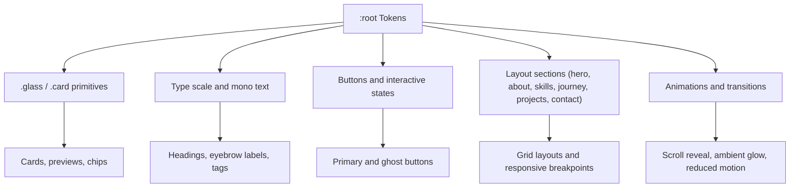
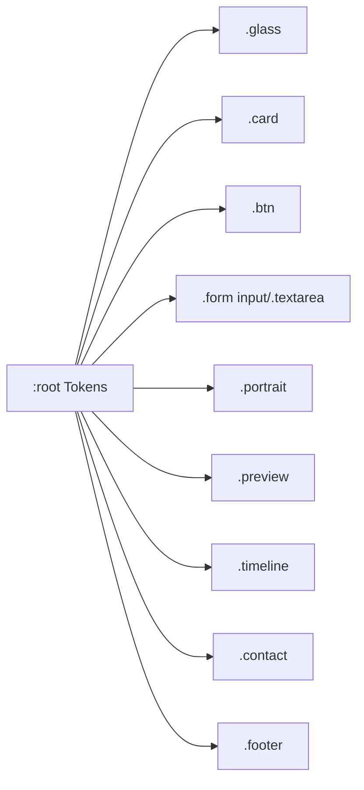

# CSS Custom Properties & Design Tokens

<cite>
**Referenced Files in This Document**
- [style.css](file://files/arsalan-portfolio-vanilla/site/style.css)
- [style.css](file://files/style.css)
</cite>

## Table of Contents
1. [Introduction](#introduction)
2. [Project Structure](#project-structure)
3. [Core Components](#core-components)
4. [Architecture Overview](#architecture-overview)
5. [Detailed Component Analysis](#detailed-component-analysis)
6. [Dependency Analysis](#dependency-analysis)
7. [Performance Considerations](#performance-considerations)
8. [Troubleshooting Guide](#troubleshooting-guide)
9. [Conclusion](#conclusion)
10. [Appendices](#appendices)

## Introduction
This document explains the CSS custom properties and design tokens used to build a cohesive, themeable visual system. It focuses on the `:root` token layer that centralizes colors, glass morphism values, spacing/radius tokens, typography variables, and animation easing. By referencing these tokens consistently across components, the codebase achieves consistent theming, predictable interactions, and easy customization.

The repository includes two CSS files with nearly identical token definitions:
- A minimal portfolio stylesheet
- An enhanced portfolio stylesheet with additional animations, scroll progress, and mood-driven background glows

Both files define the same core token set at the top of the file under `:root`, which is the single source of truth for the design system.

## Project Structure
At a high level, the design tokens live in the first block of each stylesheet under `:root`. All other styles reference these tokens via `var(--name)` instead of hard-coded values. This keeps color, spacing, radius, typography, and motion behavior centralized and easy to update.

```mermaid
graph TB
Root["CSS :root<br/>Design Tokens"] --> Colors["Color Palette<br/>--bg, --text, --white, --muted,<br/>--cyan, --violet, --blue"]
Root --> Glass["Glass Morphism<br/>--glass, --glass-soft,<br/>--border, --border-soft"]
Root --> Radius["Radius Tokens<br/>--r-lg, --r-md, --r-sm"]
Root --> Type["Typography<br/>--font, --mono"]
Root --> Motion["Motion<br/>--ease, --shadow"]
Components["Components & Layouts"] --> |Use var(--...)| Colors
Components --> |Use var(--...)| Glass
Components --> |Use var(--...)| Radius
Components --> |Use var(--...)| Type
Components --> |Use var(--...)| Motion
```

**Diagram sources**
- [style.css:1-12](file://files/arsalan-portfolio-vanilla/site/style.css#L1-L12)
- [style.css:1-12](file://files/style.css#L1-L12)

**Section sources**
- [style.css:1-12](file://files/arsalan-portfolio-vanilla/site/style.css#L1-L12)
- [style.css:1-12](file://files/style.css#L1-L12)

## Core Components
The design token system is organized into five primary groups:

- Color palette
- Glass morphism and borders
- Spacing and radius tokens
- Typography variables
- Animation easing and shadow

These tokens are defined once in `:root` and consumed throughout the stylesheet by UI components such as cards, buttons, navigation, hero visuals, timeline, projects, contact form, and footer.

**Section sources**
- [style.css:1-12](file://files/arsalan-portfolio-vanilla/site/style.css#L1-L12)
- [style.css:1-12](file://files/style.css#L1-L12)

## Architecture Overview
The token architecture follows a simple, layered approach:

- Layer 1 (Tokens): Centralized `:root` variables
- Layer 2 (Primitives): Small utility classes like `.glass`, `.card`, and base type rules
- Layer 3 (Components): Feature-specific sections (hero, skills, journey, projects, contact)
- Layer 4 (Behavior): Animations, transitions, and responsive rules



**Diagram sources**
- [style.css:1-12](file://files/arsalan-portfolio-vanilla/site/style.css#L1-L12)
- [style.css:21-24](file://files/arsalan-portfolio-vanilla/site/style.css#L21-L24)
- [style.css:32-40](file://files/arsalan-portfolio-vanilla/site/style.css#L32-L40)
- [style.css:42-49](file://files/arsalan-portfolio-vanilla/site/style.css#L42-L49)
- [style.css:67-83](file://files/arsalan-portfolio-vanilla/site/style.css#L67-L83)
- [style.css:152-159](file://files/arsalan-portfolio-vanilla/site/style.css#L152-L159)

## Detailed Component Analysis

### Color Palette Tokens
Purpose:
- Provide brand-aligned colors for backgrounds, text, accents, and semantic highlights.

Key tokens:
- `--bg`: Base background color
- `--text`: Default text color
- `--white`: High-contrast text and surfaces
- `--muted`: Secondary or subdued text
- `--cyan`: Primary accent
- `--violet`: Secondary accent
- `--blue`: Tertiary accent

Usage patterns:
- Backgrounds use `--bg`; text uses `--text`; headings and strong elements often use `--white`.
- Accent gradients combine `--cyan`, `--blue`, and `--violet` for emphasis.
- Muted tokens support secondary information and disabled-like states.

Theming guidance:
- To change the overall tone, adjust `--bg` and `--text` together.
- To shift brand identity, update `--cyan`, `--violet`, and `--blue` as a group.
- Keep contrast ratios accessible by ensuring `--text` and `--white` remain legible against `--bg`.

**Section sources**
- [style.css:3-4](file://files/arsalan-portfolio-vanilla/site/style.css#L3-L4)
- [style.css:3-4](file://files/style.css#L3-L4)

### Glass Morphism and Border Tokens
Purpose:
- Create translucent, frosted-glass surfaces with subtle borders and shadows.

Key tokens:
- `--glass`: Glass surface background
- `--glass-soft`: Softer glass surface
- `--border`: Standard border color
- `--border-soft`: Subtle border color

Usage patterns:
- `.glass` applies backdrop blur, a translucent background, and a border using these tokens.
- Cards and previews use `--border-soft` for delicate outlines.
- Buttons and inputs use `--border` for clear interactive edges.

Theming guidance:
- Increase transparency by adjusting alpha values in `--glass` and `--glass-soft`.
- Adjust `--border` and `--border-soft` to match new brand palettes while maintaining visibility.

**Section sources**
- [style.css:5-6](file://files/arsalan-portfolio-vanilla/site/style.css#L5-L6)
- [style.css:22-24](file://files/arsalan-portfolio-vanilla/site/style.css#L22-L24)
- [style.css:5](file://files/style.css#L5)
- [style.css:44-49](file://files/style.css#L44-L49)

### Spacing and Radius Tokens
Purpose:
- Standardize rounded corners and maintain consistent visual rhythm.

Key tokens:
- `--r-lg`: Large corner radius
- `--r-md`: Medium corner radius
- `--r-sm`: Small corner radius

Usage patterns:
- Large containers and portraits use `--r-lg`.
- Cards and navigation menus use `--r-md`.
- Inputs, chips, and small badges use `--r-sm`.

Theming guidance:
- Increase radii for a softer, more modern look; decrease for sharper aesthetics.
- Ensure consistency by reusing tokens rather than hard-coding pixel values.

**Section sources**
- [style.css:7](file://files/arsalan-portfolio-vanilla/site/style.css#L7)
- [style.css:7](file://files/style.css#L7)
- [style.css:23](file://files/arsalan-portfolio-vanilla/site/style.css#L23)
- [style.css:74-80](file://files/arsalan-portfolio-vanilla/site/style.css#L74-L80)
- [style.css:131](file://files/arsalan-portfolio-vanilla/site/style.css#L131)
- [style.css:141](file://files/arsalan-portfolio-vanilla/site/style.css#L141)

### Typography Variables
Purpose:
- Define font families for body and monospace contexts.

Key tokens:
- `--font`: Primary sans-serif stack
- `--mono`: Monospace stack

Usage patterns:
- Body text uses `--font`.
- Eyebrows, tags, and technical labels use `--mono`.

Theming guidance:
- Swap `--font` to adopt a different brand typeface while preserving fallbacks.
- Use `--mono` for code-like labels to visually distinguish from prose.

**Section sources**
- [style.css:10-11](file://files/arsalan-portfolio-vanilla/site/style.css#L10-L11)
- [style.css:15](file://files/arsalan-portfolio-vanilla/site/style.css#L15)
- [style.css:38](file://files/arsalan-portfolio-vanilla/site/style.css#L38)
- [style.css:10](file://files/style.css#L10)
- [style.css:15](file://files/style.css#L15)
- [style.css:71](file://files/style.css#L71)

### Animation Easing and Shadow Tokens
Purpose:
- Provide consistent motion curves and depth effects.

Key tokens:
- `--ease`: Cubic-bezier curve for smooth, natural motion
- `--shadow`: Shared box-shadow definition

Usage patterns:
- Transitions and keyframe timings reference `--ease`.
- Cards, nav, and back-to-top elements apply `--shadow` for depth.

Theming guidance:
- Adjust `--ease` to make motion feel snappier or smoother.
- Modify `--shadow` to align with brand lighting and depth preferences.

**Section sources**
- [style.css:8-9](file://files/arsalan-portfolio-vanilla/site/style.css#L8-L9)
- [style.css:22-24](file://files/arsalan-portfolio-vanilla/site/style.css#L22-L24)
- [style.css:152-159](file://files/arsalan-portfolio-vanilla/site/style.css#L152-L159)
- [style.css:7](file://files/style.css#L7)
- [style.css:44-49](file://files/style.css#L44-L49)
- [style.css:227-232](file://files/style.css#L227-L232)

## Dependency Analysis
Token usage flows from `:root` down to component layers. The following diagram shows how tokens are consumed by common UI elements.



**Diagram sources**
- [style.css:1-12](file://files/arsalan-portfolio-vanilla/site/style.css#L1-L12)
- [style.css:22-24](file://files/arsalan-portfolio-vanilla/site/style.css#L22-L24)
- [style.css:42-49](file://files/arsalan-portfolio-vanilla/site/style.css#L42-L49)
- [style.css:141](file://files/arsalan-portfolio-vanilla/site/style.css#L141)
- [style.css:74-80](file://files/arsalan-portfolio-vanilla/site/style.css#L74-L80)
- [style.css:118-123](file://files/arsalan-portfolio-vanilla/site/style.css#L118-L123)
- [style.css:104-112](file://files/arsalan-portfolio-vanilla/site/style.css#L104-L112)
- [style.css:131](file://files/arsalan-portfolio-vanilla/site/style.css#L131)
- [style.css:147-150](file://files/arsalan-portfolio-vanilla/site/style.css#L147-L150)

**Section sources**
- [style.css:1-12](file://files/arsalan-portfolio-vanilla/site/style.css#L1-L12)
- [style.css:22-24](file://files/arsalan-portfolio-vanilla/site/style.css#L22-L24)
- [style.css:42-49](file://files/arsalan-portfolio-vanilla/site/style.css#L42-L49)
- [style.css:141](file://files/arsalan-portfolio-vanilla/site/style.css#L141)
- [style.css:74-80](file://files/arsalan-portfolio-vanilla/site/style.css#L74-L80)
- [style.css:118-123](file://files/arsalan-portfolio-vanilla/site/style.css#L118-L123)
- [style.css:104-112](file://files/arsalan-portfolio-vanilla/site/style.css#L104-L112)
- [style.css:131](file://files/arsalan-portfolio-vanilla/site/style.css#L131)
- [style.css:147-150](file://files/arsalan-portfolio-vanilla/site/style.css#L147-L150)

## Performance Considerations
- Prefer tokens over repeated values to reduce maintenance and ensure consistent rendering.
- Use `backdrop-filter` sparingly; heavy usage can impact performance on low-end devices.
- Keep transition durations reasonable and leverage `--ease` for smooth motion without jank.
- Respect `prefers-reduced-motion` to avoid unnecessary animations for sensitive users.

[No sources needed since this section provides general guidance]

## Troubleshooting Guide
Common issues and resolutions:

- Colors not updating globally
  - Verify changes are made in `:root` tokens, not inline or component-level overrides.
  - Check for accidental overrides later in the stylesheet.

- Glass effect too faint or too strong
  - Adjust `--glass` and `--glass-soft` alpha values.
  - Confirm `--border` and `--border-soft` provide sufficient contrast.

- Inconsistent corner radii
  - Replace hard-coded radii with `--r-lg`, `--r-md`, or `--r-sm`.
  - Audit components that still use literal values.

- Typography inconsistencies
  - Ensure body text uses `--font` and labels/tags use `--mono`.
  - Avoid mixing font stacks outside tokens.

- Motion feels off
  - Tune `--ease` for desired acceleration curves.
  - Review transition durations and delays; keep them harmonious.

- Accessibility concerns
  - Validate contrast between `--text`/`--white` and `--bg`.
  - Ensure focus indicators remain visible when overriding colors.

**Section sources**
- [style.css:1-12](file://files/arsalan-portfolio-vanilla/site/style.css#L1-L12)
- [style.css:152-159](file://files/arsalan-portfolio-vanilla/site/style.css#L152-L159)

## Conclusion
The `:root` token system establishes a unified design language across the portfolio. By centralizing colors, glass morphism, radius, typography, and motion, it enables consistent theming, predictable interactions, and straightforward customization. Maintain this structure by extending tokens thoughtfully, adhering to naming conventions, and avoiding hard-coded values in components.

[No sources needed since this section summarizes without analyzing specific files]

## Appendices

### Practical Customization Examples

- Customize colors
  - Update `--bg`, `--text`, and `--white` to establish a new base palette.
  - Shift brand accents by editing `--cyan`, `--violet`, and `--blue` together.

- Modify spacing and radius
  - Increase `--r-lg`, `--r-md`, and `--r-sm` for softer shapes.
  - Reduce them for a sharper aesthetic.

- Extend the token system
  - Add semantic tokens such as `--success`, `--warning`, or `--error` in `:root`.
  - Introduce size tokens (e.g., `--space-*`) if spacing needs expansion beyond existing tokens.

- Theming strategy
  - Group related tokens logically in `:root`.
  - Reference tokens everywhere; never duplicate values.
  - Test contrast and readability after any token change.

**Section sources**
- [style.css:1-12](file://files/arsalan-portfolio-vanilla/site/style.css#L1-L12)
- [style.css:1-12](file://files/style.css#L1-L12)