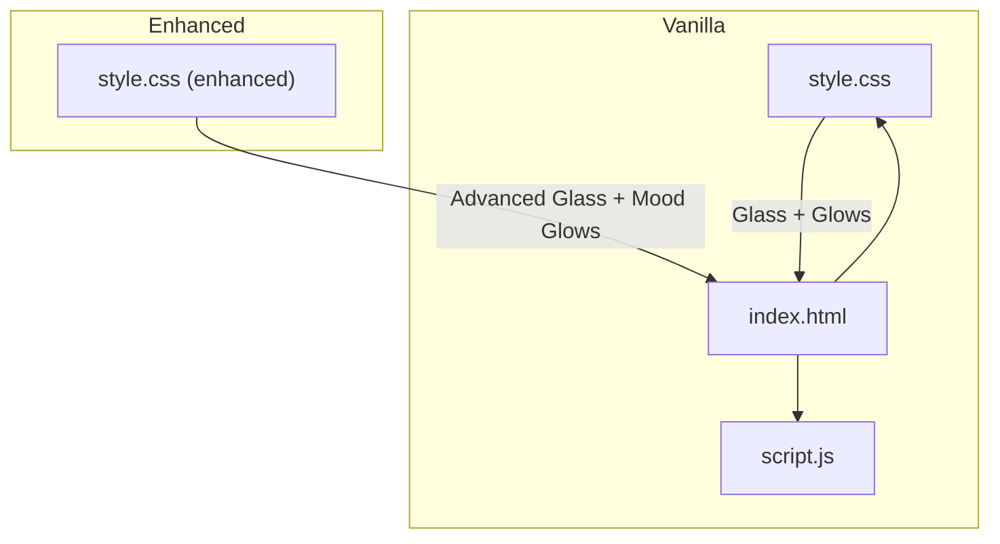
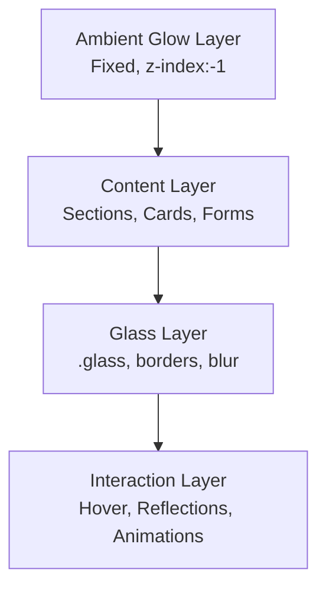
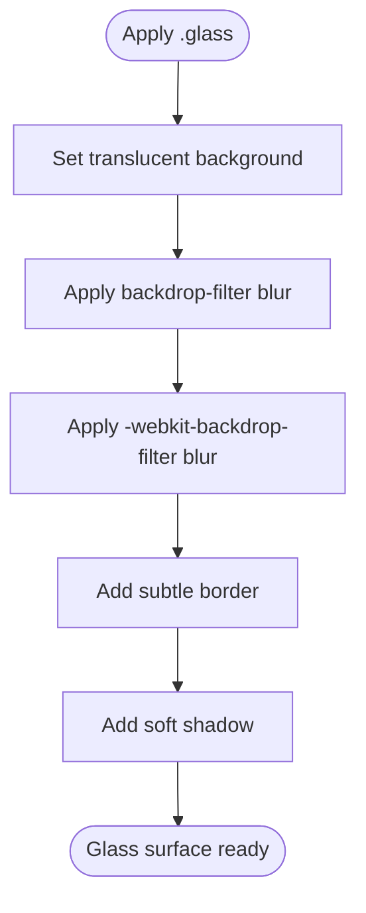
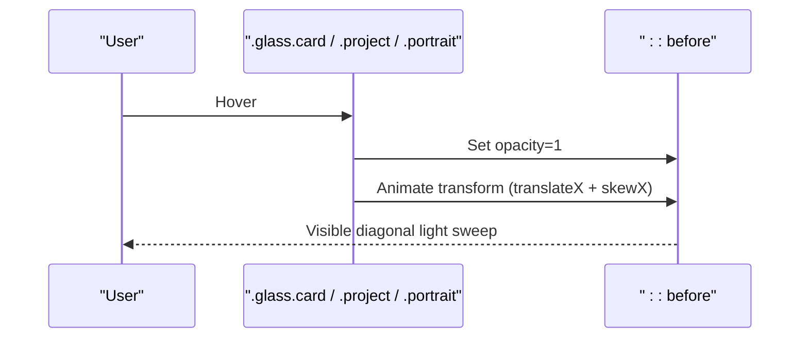
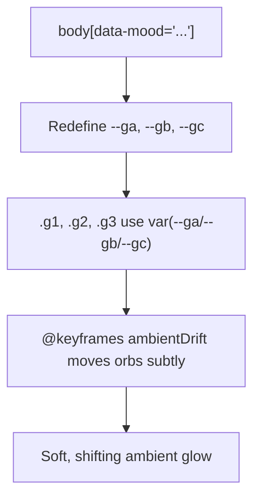
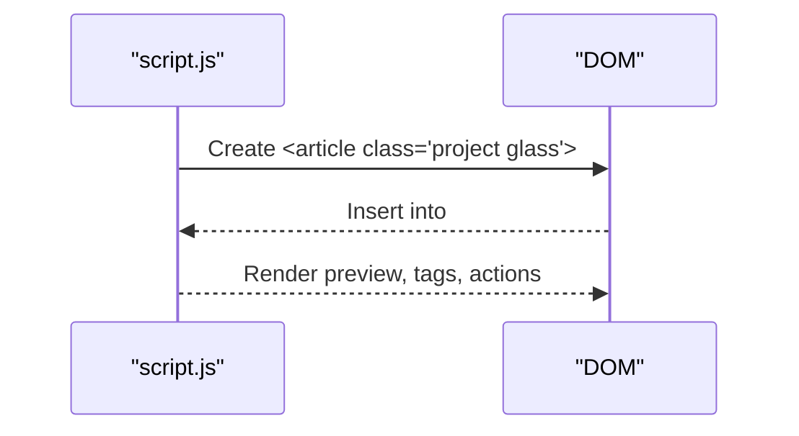
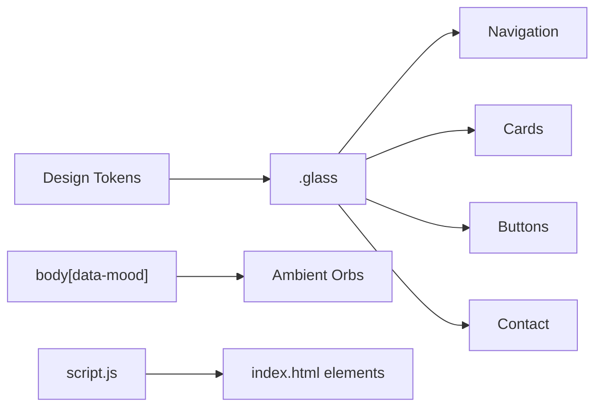

# Glass Morphism & Visual Effects

<cite>
**Referenced Files in This Document**
- [style.css](file://files/arsalan-portfolio-vanilla\site\style.css)
- [index.html](file://files/arsalan-portfolio-vanilla\site\index.html)
- [script.js](file://files/arsalan-portfolio-vanilla\site\script.js)
- [style.css (enhanced)](file://files/style.css)
</cite>

## Table of Contents
1. [Introduction](#introduction)
2. [Project Structure](#project-structure)
3. [Core Components](#core-components)
4. [Architecture Overview](#architecture-overview)
5. [Detailed Component Analysis](#detailed-component-analysis)
6. [Dependency Analysis](#dependency-analysis)
7. [Performance Considerations](#performance-considerations)
8. [Troubleshooting Guide](#troubleshooting-guide)
9. [Conclusion](#conclusion)
10. [Appendices](#appendices)

## Introduction
This document explains the glass morphism implementation and visual effects system used across the portfolio site. It focuses on:
- The .glass class foundation using backdrop-filter blur with a vendor-prefixed fallback, transparency layers, and border treatments
- Diagonal light reflection effects created via pseudo-elements and transform animations
- Ambient background glow system with mood-based color shifts driven by body[data-mood] selectors and animated gradient orbs
- Performance considerations for backdrop-filter usage, browser compatibility notes, and guidelines for creating new glass morphism components while maintaining visual consistency

The analysis draws from both the vanilla CSS version and the enhanced CSS version present in the repository.

## Project Structure
The relevant files for this documentation are:
- Vanilla CSS and HTML/JS:
  - style.css: Core design tokens, glass base, ambient glows, typography, buttons, navigation, hero, sections, timeline, projects, contact, footer, animations, responsive rules
  - index.html: Semantic structure with glass elements and ambient glow container
  - script.js: Project rendering, mobile menu toggle, scroll reveal, active nav highlighting, image fallback, UI-only form behavior
- Enhanced CSS:
  - style.css (enhanced): Adds welcome overlay, advanced glass reflections, mood-driven ambient glows, improved interactions, scroll progress, back-to-top, and refined animations

**Diagram sources**
- [index.html:10-132](file://files/arsalan-portfolio-vanilla\site\index.html#L10-L132)
- [style.css:21-158](file://files/arsalan-portfolio-vanilla\site\style.css#L21-L158)
- [style.css (enhanced):43-63](file://files/style.css#L43-L63)

**Section sources**
- [index.html:10-132](file://files/arsalan-portfolio-vanilla\site\index.html#L10-L132)
- [style.css:21-158](file://files/arsalan-portfolio-vanilla\site\style.css#L21-L158)
- [style.css (enhanced):43-63](file://files/style.css#L43-L63)

## Core Components
- Design tokens define colors, radii, shadows, easing, and fonts to ensure consistent glass styling across components.
- The .glass class provides:
  - A translucent background layer
  - Backdrop blur with a -webkit-backdrop-filter fallback
  - Subtle border and shadow for depth
- Ambient background glows use large blurred circles positioned behind content to create a soft, dynamic atmosphere.
- Interactive elements such as cards, buttons, and navigation leverage glass styling and hover transitions.

Key responsibilities:
- style.css: Defines tokens, .glass, ambient glows, section styles, animations, and responsive rules
- index.html: Provides semantic markup and applies glass classes to interactive surfaces
- script.js: Renders project cards with glass styling, toggles mobile menu, reveals elements on scroll, highlights active sections, handles image fallbacks, and manages UI-only form feedback

**Section sources**
- [style.css:1-12](file://files/arsalan-portfolio-vanilla\site\style.css#L1-L12)
- [style.css:21-24](file://files/arsalan-portfolio-vanilla\site\style.css#L21-L24)
- [style.css:26-31](file://files/arsalan-portfolio-vanilla\site\style.css#L26-L31)
- [index.html:10-132](file://files/arsalan-portfolio-vanilla\site\index.html#L10-L132)
- [script.js:15-34](file://files/arsalan-portfolio-vanilla\site\script.js#L15-L34)

## Architecture Overview
The visual system is layered:
- Background layer: Fixed ambient glows provide a soft, animated backdrop
- Content layer: Sections and components sit above the glows
- Glass layer: Translucent panels with blur and borders create depth and focus
- Interaction layer: Hover states, transforms, and pseudo-element reflections add polish

**Diagram sources**
- [style.css:26-31](file://files/arsalan-portfolio-vanilla\site\style.css#L26-L31)
- [style.css:21-24](file://files/arsalan-portfolio-vanilla\site\style.css#L21-L24)

## Detailed Component Analysis

### .glass Class Foundation
The .glass class establishes the core glass morphism look:
- Transparency: Uses a low-opacity white background variable to keep underlying content visible
- Blur: Applies backdrop-filter blur; includes -webkit-backdrop-filter for broader compatibility
- Border: Thin semi-transparent border to define edges without heavy contrast
- Shadow: Soft shadow to lift the element above the background

In the enhanced stylesheet, .glass also sets positioning and overflow context to support diagonal reflections via pseudo-elements.

**Diagram sources**
- [style.css:21-24](file://files/arsalan-portfolio-vanilla\site\style.css#L21-L24)
- [style.css (enhanced):43-48](file://files/style.css#L43-L48)

**Section sources**
- [style.css:21-24](file://files/arsalan-portfolio-vanilla\site\style.css#L21-L24)
- [style.css (enhanced):43-48](file://files/style.css#L43-L48)

### Diagonal Light Reflection Effect
The enhanced stylesheet introduces a diagonal light reflection using a pseudo-element:
- Pseudo-element ::before attached to .glass.card, .project, and .portrait
- Linear gradient creates a soft, angled highlight that sweeps across the surface
- Initial state hides the reflection off-screen with skew and translate transforms
- On hover, the reflection becomes visible and animates across the element

**Diagram sources**
- [style.css (enhanced):43-46](file://files/style.css#L43-L46)

**Section sources**
- [style.css (enhanced):43-46](file://files/style.css#L43-L46)

### Ambient Background Glow System
The ambient glow system uses fixed-position blurred circles behind content:
- Container .bg-glow spans the viewport with negative z-index
- Individual .glow elements are large, highly blurred circles with low opacity
- In the enhanced stylesheet, three orbs animate gently to create an ambient drift effect
- Mood-based color shifts are achieved via body[data-mood] selectors that redefine CSS variables controlling orb colors

**Diagram sources**
- [style.css (enhanced):51-63](file://files/style.css#L51-L63)

**Section sources**
- [style.css:26-31](file://files/arsalan-portfolio-vanilla\site\style.css#L26-L31)
- [style.css (enhanced):51-63](file://files/style.css#L51-L63)

### Glass in Navigation and Buttons
- Navigation bar uses glass styling for a translucent, elevated feel
- Buttons include a ghost variant with additional backdrop blur for subtle translucency
- Hover states adjust background, border color, and box-shadow to reinforce interactivity

**Section sources**
- [style.css:42-49](file://files/arsalan-portfolio-vanilla\site\style.css#L42-L49)
- [style.css (enhanced):75-84](file://files/style.css#L75-L84)

### Projects Rendering and Glass Integration
- script.js renders project cards dynamically, applying the .glass class to each card
- Each card contains a preview area and metadata, styled consistently with other glass components

**Diagram sources**
- [script.js:15-34](file://files/arsalan-portfolio-vanilla\site\script.js#L15-L34)

**Section sources**
- [script.js:15-34](file://files/arsalan-portfolio-vanilla\site\script.js#L15-L34)

### Scroll Reveal and Active Section Highlighting
- Elements with data-reveal fade in and translate up when entering the viewport
- IntersectionObserver triggers visibility and stops observing after reveal
- Active navigation links update based on the currently visible section

**Section sources**
- [script.js:46-59](file://files/arsalan-portfolio-vanilla\site\script.js#L46-L59)

### Profile Image Fallback
- If the profile image fails to load or has zero dimensions, a fallback initial letter is shown
- The portrait container toggles a no-img class to switch between image and fallback

**Section sources**
- [script.js:61-66](file://files/arsalan-portfolio-vanilla\site\script.js#L61-L66)

### UI-Only Contact Form
- Submitting the form prevents default behavior and updates a note’s color to indicate success
- No backend integration is present; the form is purely demonstrative

**Section sources**
- [script.js:68-72](file://files/arsalan-portfolio-vanilla\site\script.js#L68-L72)

## Dependency Analysis
- CSS dependencies:
  - Design tokens underpin all glass and glow styles
  - .glass is reused across navigation, cards, buttons, and contact sections
  - Ambient glows rely on CSS variables controlled by body[data-mood] in the enhanced stylesheet
- JavaScript dependencies:
  - script.js depends on DOM nodes referenced by IDs and classes defined in index.html
  - Interactions (menu toggle, reveal, active nav) depend on IntersectionObserver and event listeners

**Diagram sources**
- [style.css:1-12](file://files/arsalan-portfolio-vanilla\site\style.css#L1-L12)
- [style.css (enhanced):51-57](file://files/style.css#L51-L57)
- [script.js:15-34](file://files/arsalan-portfolio-vanilla\site\script.js#L15-L34)

**Section sources**
- [style.css:1-12](file://files/arsalan-portfolio-vanilla\site\style.css#L1-L12)
- [style.css (enhanced):51-57](file://files/style.css#L51-L57)
- [script.js:15-34](file://files/arsalan-portfolio-vanilla\site\script.js#L15-L34)

## Performance Considerations
- backdrop-filter performance:
  - Use sparingly; excessive blur can cause repaint/reflow overhead
  - Prefer larger, fewer blurred elements over many small ones
  - Avoid animating backdrop-filter properties frequently; instead, animate transform or opacity where possible
- Browser compatibility:
  - Include -webkit-backdrop-filter fallback for Safari and older WebKit-based browsers
  - Test on iOS Safari and Android Chrome for consistent results
- Animation efficiency:
  - Use transform and opacity for smooth animations
  - Respect prefers-reduced-motion to disable animations for users who prefer reduced motion
- Ambient glows:
  - Large blurred circles are expensive; limit count and size
  - Use CSS variables to control colors rather than recalculating gradients at runtime

[No sources needed since this section provides general guidance]

## Troubleshooting Guide
- Glass not appearing or looking flat:
  - Ensure backdrop-filter is supported; verify -webkit-backdrop-filter fallback is present
  - Check that the element has sufficient background contrast against the page
- Reflection not showing on hover:
  - Confirm the element has position:relative and overflow:hidden if required by the pseudo-element
  - Verify hover state targets the correct selector (.glass.card, .project, .portrait)
- Ambient glows not shifting with mood:
  - Ensure body[data-mood] attribute matches the intended value
  - Confirm CSS variables --ga, --gb, --gc are redefined in the corresponding mood rule
- Mobile menu issues:
  - Verify burger button aria-expanded toggles correctly
  - Check nav-links open class application and transition properties

**Section sources**
- [style.css (enhanced):43-46](file://files/style.css#L43-L46)
- [style.css (enhanced):51-63](file://files/style.css#L51-L63)
- [script.js:36-44](file://files/arsalan-portfolio-vanilla\site\script.js#L36-L44)

## Conclusion
The glass morphism system combines a robust .glass foundation, thoughtful transparency and border treatments, and sophisticated interaction effects like diagonal light reflections. The ambient glow system adds depth and mood through animated orbs and CSS-variable-driven color shifts. By following the outlined guidelines and performance best practices, you can extend the system with new glass components while preserving visual consistency and responsiveness.

[No sources needed since this section summarizes without analyzing specific files]

## Appendices

### Guidelines for Creating New Glass Morphism Components
- Base your component on .glass to inherit consistent transparency, blur, border, and shadow
- Add hover states that enhance perceived depth (e.g., slight translateY, border-color shift, subtle box-shadow)
- If adding reflections, use a pseudo-element with a linear gradient and transform animation similar to the existing pattern
- Keep backdrop-filter usage minimal; prefer transform and opacity for animations
- Respect accessibility:
  - Provide sufficient contrast for text over glass backgrounds
  - Honor prefers-reduced-motion
- Test across browsers, especially those requiring -webkit-backdrop-filter

**Section sources**
- [style.css:21-24](file://files/arsalan-portfolio-vanilla\site\style.css#L21-L24)
- [style.css (enhanced):43-46](file://files/style.css#L43-L46)