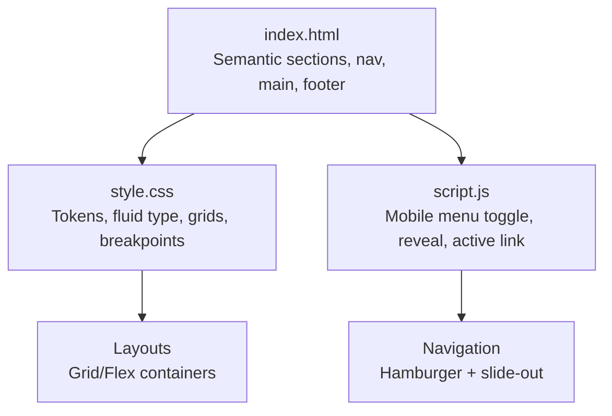
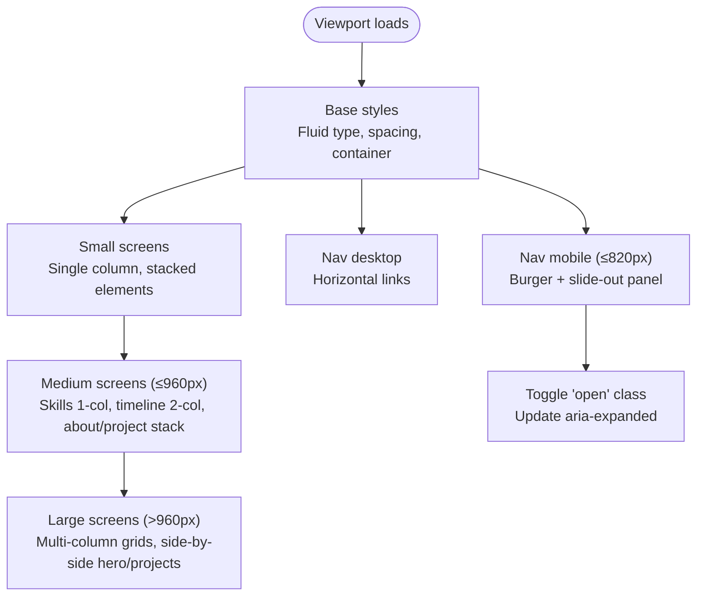
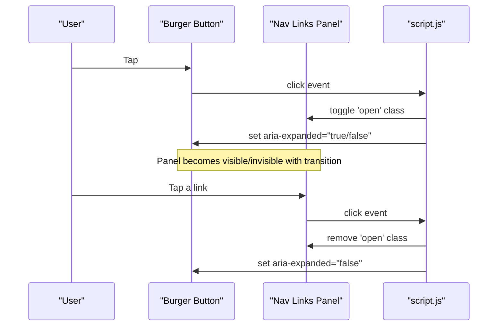
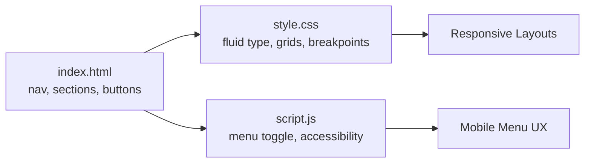

# Responsive Design Patterns

<cite>
**Referenced Files in This Document**   
- [style.css](file://files/arsalan-portfolio-vanilla/site/style.css)
- [index.html](file://files/arsalan-portfolio-vanilla/site/index.html)
- [script.js](file://files/arsalan-portfolio-vanilla/site/script.js)
</cite>

## Table of Contents
1. [Introduction](#introduction)
2. [Project Structure](#project-structure)
3. [Core Components](#core-components)
4. [Architecture Overview](#architecture-overview)
5. [Detailed Component Analysis](#detailed-component-analysis)
6. [Dependency Analysis](#dependency-analysis)
7. [Performance Considerations](#performance-considerations)
8. [Troubleshooting Guide](#troubleshooting-guide)
9. [Conclusion](#conclusion)

## Introduction
This document explains the responsive design architecture and mobile-first approach used in the portfolio site. It focuses on fluid typography with clamp(), flexible grid layouts using CSS Grid and Flexbox, breakpoint strategies at 960px, 820px, and 560px, and the mobile navigation implementation with a hamburger menu and slide-out panel. It also provides guidance for maintaining consistency across devices, testing responsive behavior, and optimizing for different screen sizes and orientations.

## Project Structure
The responsive behavior is implemented primarily through:
- A single stylesheet that defines tokens, fluid spacing/typography, layout grids, and media queries.
- Semantic HTML structure with accessible attributes and roles.
- Minimal JavaScript to toggle the mobile menu, manage accessibility state, and handle scroll-based interactions.

**Diagram sources**
- [index.html:13-29](file://files/arsalan-portfolio-vanilla/site/index.html#L13-L29)
- [style.css:18-181](file://files/arsalan-portfolio-vanilla/site/style.css#L18-L181)
- [script.js:36-44](file://files/arsalan-portfolio-vanilla/site/script.js#L36-L44)

**Section sources**
- [index.html:1-135](file://files/arsalan-portfolio-vanilla/site/index.html#L1-L135)
- [style.css:1-182](file://files/arsalan-portfolio-vanilla/site/style.css#L1-L182)
- [script.js:1-75](file://files/arsalan-portfolio-vanilla/site/script.js#L1-L75)

## Core Components
- Fluid typography and spacing via clamp() for scalable text and section padding.
- Flexible grid layouts using CSS Grid and Flexbox for cards, timelines, projects, and forms.
- Breakpoint-driven adaptations at 960px, 820px, and 560px.
- Mobile navigation with a hamburger button, slide-out panel, and touch-friendly interactions.
- Container-level constraints using a max-width container and min() sizing.

Key implementation references:
- Fluid typography and spacing: clamp() usage for headings, lead text, and section padding.
- Grid and Flexbox: skills grid, timeline, project cards, contact cards, form rows.
- Breakpoints: three media queries adjusting layouts and navigation behavior.
- Navigation: burger button toggles an open class on the nav links; aria-expanded updates for accessibility.

**Section sources**
- [style.css:18-40](file://files/arsalan-portfolio-vanilla/site/style.css#L18-L40)
- [style.css:88-143](file://files/arsalan-portfolio-vanilla/site/style.css#L88-L143)
- [style.css:161-181](file://files/arsalan-portfolio-vanilla/site/style.css#L161-L181)
- [script.js:36-44](file://files/arsalan-portfolio-vanilla/site/script.js#L36-L44)

## Architecture Overview
The responsive system follows a mobile-first strategy:
- Base styles define the smallest-screen experience (single-column layouts, compact spacing).
- Media queries progressively enhance layouts as viewport width increases.
- Fluid values (clamp()) ensure smooth scaling without abrupt jumps between breakpoints.
- The navigation adapts from a horizontal bar on desktop to a collapsible panel on smaller screens.

**Diagram sources**
- [style.css:161-181](file://files/arsalan-portfolio-vanilla/site/style.css#L161-L181)
- [style.css:51-65](file://files/arsalan-portfolio-vanilla/site/style.css#L51-L65)
- [script.js:36-44](file://files/arsalan-portfolio-vanilla/site/script.js#L36-L44)

## Detailed Component Analysis

### Fluid Typography and Spacing
- Headings and lead text use clamp() to scale smoothly between minimum and maximum font sizes based on viewport width.
- Section padding uses clamp() to maintain proportional vertical rhythm across devices.
- Container width uses min() to constrain content while preserving margins.

Guidelines:
- Prefer clamp() for type and spacing to reduce reliance on many breakpoints.
- Keep ratios consistent by pairing clamp() with relative units (vw, rem).
- Test readability at extreme widths to ensure text remains legible.

**Section sources**
- [style.css:18-40](file://files/arsalan-portfolio-vanilla/site/style.css#L18-L40)

### Flexible Grid Layouts (CSS Grid and Flexbox)
- Skills grid transitions from multi-column to single-column at ≤960px.
- Timeline shifts from four columns to two columns at ≤960px and to one column at ≤560px.
- About and project cards stack vertically at ≤960px.
- Contact cards and form rows collapse to single column at ≤560px.
- Buttons wrap and stretch to full width on small screens for touch targets.

Best practices:
- Use CSS Grid for complex two-dimensional layouts (timeline, skills, contact cards).
- Use Flexbox for one-dimensional flows (actions, pills, footer).
- Combine gap and flex-wrap to create responsive, touch-friendly spacing.

**Section sources**
- [style.css:88-143](file://files/arsalan-portfolio-vanilla/site/style.css#L88-L143)
- [style.css:161-181](file://files/arsalan-portfolio-vanilla/site/style.css#L161-L181)

### Breakpoint Strategy
- 960px: Simplifies dense grids (skills, timeline, about, projects) to fewer columns or stacks them.
- 820px: Switches navigation to mobile mode (hamburger), hides GitHub CTA, and shows mobile-only link.
- 560px: Collapses remaining multi-column structures (timeline, contact cards, form rows) and makes buttons full-width.

Recommendations:
- Treat these breakpoints as anchors; adjust if content density changes significantly.
- Pair breakpoints with fluid values to avoid jarring layout shifts.

**Section sources**
- [style.css:161-181](file://files/arsalan-portfolio-vanilla/site/style.css#L161-L181)

### Mobile Navigation Implementation
- Burger button toggles an “open” class on the navigation links container.
- At ≤820px, the nav links become an absolute-positioned, backdrop-blurred panel with fade/slide transitions.
- Accessibility: aria-expanded reflects the current state; clicking any link closes the menu.
- Touch-friendly: larger tap targets and spacing within the mobile panel.

**Diagram sources**
- [style.css:51-65](file://files/arsalan-portfolio-vanilla/site/style.css#L51-L65)
- [style.css:168-176](file://files/arsalan-portfolio-vanilla/site/style.css#L168-L176)
- [script.js:36-44](file://files/arsalan-portfolio-vanilla/site/script.js#L36-L44)

**Section sources**
- [index.html:13-29](file://files/arsalan-portfolio-vanilla/site/index.html#L13-L29)
- [style.css:51-65](file://files/arsalan-portfolio-vanilla/site/style.css#L51-L65)
- [style.css:168-176](file://files/arsalan-portfolio-vanilla/site/style.css#L168-L176)
- [script.js:36-44](file://files/arsalan-portfolio-vanilla/site/script.js#L36-L44)

### Container Queries and Adaptive Component Layouts
- The site currently relies on viewport-based media queries rather than container queries.
- To adopt container queries:
  - Wrap components in a container element with a defined width.
  - Apply @container rules to adapt internal layouts when the container size changes.
  - Use this for reusable components (cards, timelines) to behave consistently inside different page contexts.

Adaptive layout tips:
- Favor clamp() for spacing and type to complement container queries.
- Keep component internals self-contained so they can respond to their own container size.

[No sources needed since this section provides conceptual guidance]

## Dependency Analysis
The responsive behavior depends on coordinated changes across HTML structure, CSS layout, and minimal JavaScript for interactivity.

**Diagram sources**
- [index.html:13-29](file://files/arsalan-portfolio-vanilla/site/index.html#L13-L29)
- [style.css:161-181](file://files/arsalan-portfolio-vanilla/site/style.css#L161-L181)
- [script.js:36-44](file://files/arsalan-portfolio-vanilla/site/script.js#L36-L44)

**Section sources**
- [index.html:13-29](file://files/arsalan-portfolio-vanilla/site/index.html#L13-L29)
- [style.css:161-181](file://files/arsalan-portfolio-vanilla/site/style.css#L161-L181)
- [script.js:36-44](file://files/arsalan-portfolio-vanilla/site/script.js#L36-L44)

## Performance Considerations
- Prefer clamp() and native CSS features to minimize heavy media query sets.
- Avoid excessive backdrop-filter layers on low-end devices; test performance on mobile GPUs.
- Keep animations simple and respect prefers-reduced-motion.
- Optimize images and provide fallbacks to prevent layout shifts.

[No sources needed since this section provides general guidance]

## Troubleshooting Guide
Common issues and resolutions:
- Mobile menu not closing after link tap: Ensure each link triggers the close logic and aria-expanded is updated.
- Panel not appearing: Verify the .open class is applied and the media query for ≤820px is active.
- Text too large/small: Adjust clamp() min/max values to improve readability at extremes.
- Overlapping content: Check container width and padding; ensure grid gaps are sufficient.
- Orientation changes causing layout glitches: Test both portrait and landscape; consider adding orientation-specific tweaks if necessary.

**Section sources**
- [script.js:36-44](file://files/arsalan-portfolio-vanilla/site/script.js#L36-L44)
- [style.css:161-181](file://files/arsalan-portfolio-vanilla/site/style.css#L161-L181)

## Conclusion
The portfolio’s responsive design leverages fluid typography and spacing, flexible grids, and targeted breakpoints to deliver a consistent experience across devices. The mobile navigation is accessible and touch-friendly, while the overall approach minimizes complexity and maximizes scalability. Adopting container queries and continuing to refine clamp() usage will further strengthen adaptive layouts and maintain design consistency across varying contexts.

[No sources needed since this section summarizes without analyzing specific files]