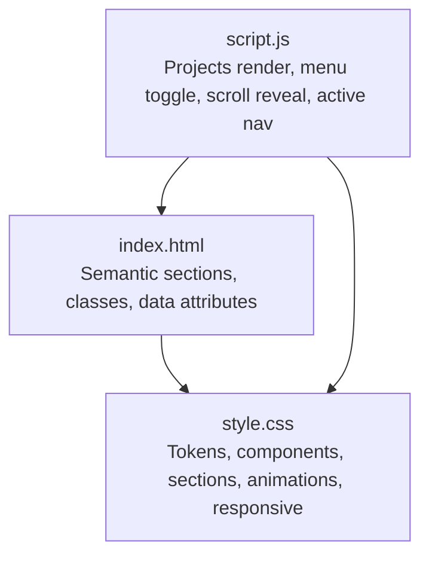
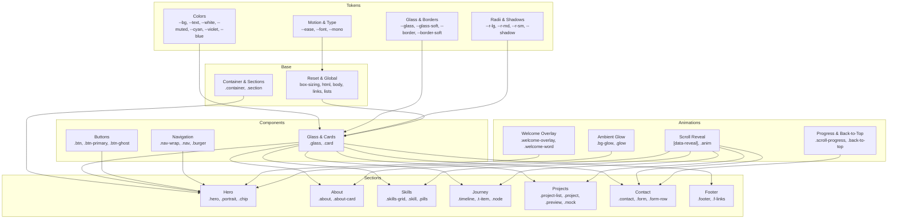
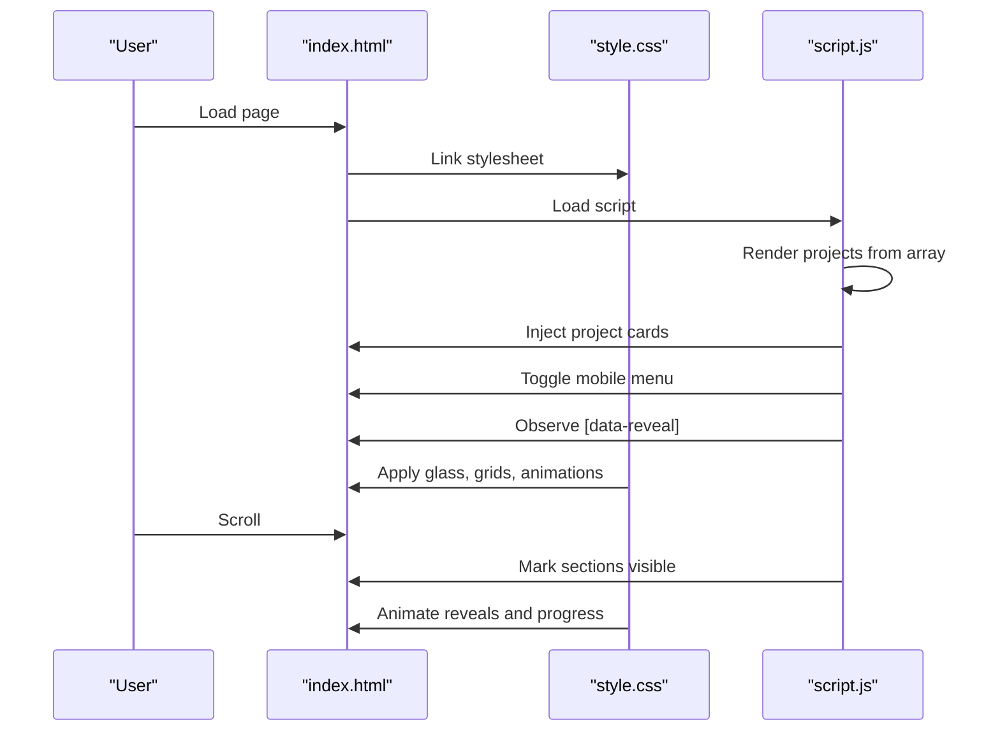

# Styling System

<cite>
**Referenced Files in This Document**
- [style.css](file://files/style.css)
- [index.html](file://files/arsalan-portfolio-vanilla\site\index.html)
- [script.js](file://files/arsalan-portfolio-vanilla\site\script.js)
</cite>

## Table of Contents
1. [Introduction](#introduction)
2. [Project Structure](#project-structure)
3. [Core Components](#core-components)
4. [Architecture Overview](#architecture-overview)
5. [Detailed Component Analysis](#detailed-component-analysis)
6. [Dependency Analysis](#dependency-analysis)
7. [Performance Considerations](#performance-considerations)
8. [Troubleshooting Guide](#troubleshooting-guide)
9. [Conclusion](#conclusion)
10. [Appendices](#appendices)

## Introduction
This document explains the styling system used by the portfolio site. It focuses on:
- The design system built around CSS custom properties for theming and tokens
- Glass morphism using backdrop-filter, transparency, and layered gradients
- Responsive layouts with CSS Grid and Flexbox
- Animation systems including staggered reveals, hover effects, scroll-triggered animations, and a welcome screen
- Color scheme, typography (Google Fonts Inter), and spacing conventions
- Practical customization examples and performance guidelines

The primary styles live in a single stylesheet that defines tokens, components, sections, animations, and responsive rules. HTML provides semantic structure and data attributes to drive animations. A small script handles project rendering, mobile menu toggling, scroll-based reveal, active section highlighting, image fallbacks, and form behavior.

## Project Structure
The styling architecture is centered around one main stylesheet and a minimal HTML page that references it. JavaScript enhances interactivity and animation triggers.

**Diagram sources**
- [index.html:1-135](file://files/arsalan-portfolio-vanilla\site\index.html#L1-L135)
- [style.css:1-268](file://files/style.css#L1-L268)
- [script.js:1-75](file://files/arsalan-portfolio-vanilla\site\script.js#L1-L75)

**Section sources**
- [index.html:1-135](file://files/arsalan-portfolio-vanilla\site\index.html#L1-L135)
- [style.css:1-268](file://files/style.css#L1-L268)
- [script.js:1-75](file://files/arsalan-portfolio-vanilla\site\script.js#L1-L75)

## Core Components
This section documents the building blocks defined in the stylesheet and how they are composed across the site.

- Design tokens and theme variables
- Glass morphism cards and surfaces
- Buttons and interactive states
- Navigation and mobile menu
- Hero section and portrait
- About, Skills, Journey timeline, Projects, Contact, Footer
- Scroll progress indicator and back-to-top button
- Animations and reduced motion support

Key implementation highlights:
- Tokens are centralized under :root for easy theming.
- Glass morphism uses backdrop-filter blur, subtle borders, and layered pseudo-elements for light reflections.
- Layouts rely on CSS Grid for complex structures and Flexbox for alignment and wrapping.
- Animations use CSS transitions and keyframes; scroll-triggered reveals are driven by IntersectionObserver in JavaScript.

**Section sources**
- [style.css:1-268](file://files/style.css#L1-L268)

## Architecture Overview
The styling system follows a token-driven approach:
- Tokens define colors, radii, shadows, easing curves, fonts, and glass variants.
- Base styles set global resets, typography defaults, and container widths.
- Component styles encapsulate reusable UI elements like buttons, cards, badges, and chips.
- Section styles compose components into full-page areas.
- Animation utilities provide consistent entrance and reveal behaviors.
- Media queries adjust layout and interactions per breakpoint.

**Diagram sources**
- [style.css:1-268](file://files/style.css#L1-L268)

## Detailed Component Analysis

### Design Tokens and Theming
- Colors: background, text, white, muted, cyan, violet, blue.
- Glass: two levels of translucent backgrounds and border opacities.
- Radii: large, medium, small for consistent corner rounding.
- Shadow: deep shadow for elevated surfaces.
- Easing: a smooth cubic-bezier curve used across transitions.
- Typography: Inter as primary font with system fallbacks; monospace stack for labels and tags.

Customization guidance:
- Change brand accents by updating the color tokens.
- Adjust glass intensity via --glass and --glass-soft.
- Modify roundness globally through radius tokens.
- Swap fonts by replacing the font-family token values.

**Section sources**
- [style.css:1-12](file://files/style.css#L1-L12)

### Glass Morphism Surfaces
- The .glass class applies a translucent background, backdrop blur, subtle border, and shadow.
- Pseudo-elements add diagonal light reflections on hover for cards, projects, and portraits.
- Variants include soft glass for exploratory items and dashed borders for future skills.

Practical usage:
- Apply .glass to any container to achieve frosted glass.
- Combine with .card for elevation and hover lift.
- Use .glass-soft for low-emphasis panels or explore states.

**Section sources**
- [style.css:43-50](file://files/style.css#L43-L50)
- [style.css:152-155](file://files/style.css#L152-L155)

### Buttons and Interactive States
- Primary and ghost button variants share base styles but differ in background, border, and hover glow.
- Hover lifts and active scale-down provide tactile feedback.
- Arrow icon inside buttons rotates on hover for directional cues.

Customization guidance:
- Override .btn-primary or .btn-ghost to create new variants.
- Adjust hover transforms and shadows to match brand motion.

**Section sources**
- [style.css:75-84](file://files/style.css#L75-L84)

### Navigation and Mobile Menu
- Fixed navigation bar with rounded pill shape and optional scrolled state.
- Active link underline indicator animates width and opacity.
- Burger toggles a dropdown menu on smaller screens with backdrop blur and fade/slide transitions.

Accessibility:
- Burger uses aria-expanded to reflect state.
- Links have focus-visible outlines.

**Section sources**
- [style.css:86-105](file://files/style.css#L86-L105)
- [script.js:36-44](file://files/arsalan-portfolio-vanilla\site\script.js#L36-L44)

### Hero Section and Portrait
- Two-column grid layout with badge, headline, lead copy, actions, and visual portrait.
- Portrait includes a blurred gradient halo behind it and floating chips with staggered delays.
- Image fallback shows an initial when the image fails to load.

Interactions:
- Hover intensifies the halo behind the portrait.
- Chips animate in after the welcome screen completes.

**Section sources**
- [style.css:107-131](file://files/style.css#L107-L131)
- [index.html:33-53](file://files/arsalan-portfolio-vanilla\site\index.html#L33-L53)
- [script.js:61-66](file://files/arsalan-portfolio-vanilla\site\script.js#L61-L66)

### About Section
- Two-column grid with eyebrow label, heading, and a glass card containing paragraphs.
- Uses scroll reveal for entrance.

**Section sources**
- [style.css:133-135](file://files/style.css#L133-L135)
- [index.html:55-62](file://files/arsalan-portfolio-vanilla\site\index.html#L55-L62)

### Skills Section
- Three-column grid of skill cards with header numbers and tag pills.
- Pill items stagger their reveal using CSS custom property delays.
- Current and explore states apply distinct borders, glows, and dashed styles.

Customization guidance:
- Add more skills by duplicating the card structure.
- Adjust pill hover effects and colors via tokens.

**Section sources**
- [style.css:137-155](file://files/style.css#L137-L155)
- [index.html:64-86](file://files/arsalan-portfolio-vanilla\site\index.html#L64-L86)

### Journey Timeline
- Vertical timeline with alternating left/right items and animated connecting lines.
- Nodes and connecting lines animate on scroll reveal.
- States include done, now, and next with distinct node visuals.

Responsive behavior:
- On smaller screens, the timeline collapses to a single column with a left-aligned spine.

**Section sources**
- [style.css:157-179](file://files/style.css#L157-L179)
- [index.html:88-97](file://files/arsalan-portfolio-vanilla\site\index.html#L88-L97)

### Projects Section
- Dynamically rendered from a JavaScript array.
- Each project card has a preview area with mock UI or real image, description, tags, and action buttons.
- Hover effects include tilt-like perspective transforms, image zoom, and radial glow overlay.

Extensibility:
- Add projects by pushing objects into the projects array in script.js.
- Optional fields include live URL, repo URL, image path, and tags.

**Section sources**
- [style.css:181-199](file://files/style.css#L181-L199)
- [script.js:1-34](file://files/arsalan-portfolio-vanilla\site\script.js#L1-L34)
- [index.html:99-103](file://files/arsalan-portfolio-vanilla\site\index.html#L99-L103)

### Contact Section
- Centered contact card with eyebrow, heading, lead copy, quick links, and a UI-only form.
- Form inputs use glass-like backgrounds and focus rings.
- Submitting the form updates a note color without sending data.

**Section sources**
- [style.css:201-215](file://files/style.css#L201-L215)
- [index.html:105-123](file://files/arsalan-portfolio-vanilla\site\index.html#L105-L123)
- [script.js:68-72](file://files/arsalan-portfolio-vanilla\site\script.js#L68-L72)

### Footer
- Flex layout with branding, links, and copyright year updated by script.

**Section sources**
- [style.css:217-221](file://files/style.css#L217-L221)
- [index.html:126-130](file://files/arsalan-portfolio-vanilla\site\index.html#L126-L130)
- [script.js:74-75](file://files/arsalan-portfolio-vanilla\site\script.js#L74-L75)

### Welcome Screen and Ambient Glow
- Welcome overlay displays a word with blur-to-sharp transition and orbs that fade in.
- After completion, the overlay hides and the main content fades/slides in.
- Ambient glow uses three large blurred circles that drift slowly; mood shifts change color order per section via data-mood on body.

**Section sources**
- [style.css:24-63](file://files/style.css#L24-L63)

### Scroll Progress and Back-to-Top
- Thin progress bar at the top scales based on scroll position.
- Back-to-top button appears after scrolling, with hover lift and glow.

Note: These elements are styled but not present in the provided HTML; they can be added to the markup to activate the styles.

**Section sources**
- [style.css:227-232](file://files/style.css#L227-L232)

### Animations and Reduced Motion
- Staggered reveals:
  - .anim elements fade/scale/blur-in after the welcome screen completes.
  - [data-reveal] elements fade/slide/blur-in when intersecting the viewport.
- Keyframes:
  - float for gentle vertical oscillation.
  - pulse for badge dot opacity.
  - ambientDrift for background glow movement.
- Accessibility:
  - prefers-reduced-motion disables animations and forces immediate visibility for revealed elements.

**Section sources**
- [style.css:107-131](file://files/style.css#L107-L131)
- [style.css:223-240](file://files/style.css#L223-L240)
- [script.js:46-50](file://files/arsalan-portfolio-vanilla\site\script.js#L46-L50)

## Dependency Analysis
The following diagram maps how HTML, CSS, and JS interact to produce the final experience.

**Diagram sources**
- [index.html:1-135](file://files/arsalan-portfolio-vanilla\site\index.html#L1-L135)
- [style.css:1-268](file://files/style.css#L1-L268)
- [script.js:1-75](file://files/arsalan-portfolio-vanilla\site\script.js#L1-L75)

**Section sources**
- [index.html:1-135](file://files/arsalan-portfolio-vanilla\site\index.html#L1-L135)
- [style.css:1-268](file://files/style.css#L1-L268)
- [script.js:1-75](file://files/arsalan-portfolio-vanilla\site\script.js#L1-L75)

## Performance Considerations
- Prefer CSS transforms and opacity for animations to leverage GPU acceleration.
- Avoid heavy filters and excessive backdrop-blur on frequently animated elements.
- Use intersection observers sparingly and unobserve elements once revealed.
- Keep selectors simple and avoid deep nesting to improve style computation.
- Limit the number of simultaneously animated elements; stagger where possible.
- Use will-change judiciously only for elements that will animate soon.
- Minimize layout thrashing by reading and writing DOM properties separately.
- Compress images and provide appropriate sizes to reduce paint cost.

[No sources needed since this section provides general guidance]

## Troubleshooting Guide
Common issues and resolutions:
- Images missing:
  - The script adds a fallback when the profile image fails to load. Ensure the image path exists or update the fallback logic.
- Animations not triggering:
  - Verify that [data-reveal] elements exist and are observed by the IntersectionObserver.
  - Check that body.ready is applied if relying on welcome-screen-driven animations.
- Mobile menu not opening:
  - Confirm the burger button has the correct id and that the open class toggles correctly.
- Active section highlight not updating:
  - Ensure each section has an id matching the nav link href.
- Form submission does nothing:
  - The form is UI-only; submit handler prevents default and updates a note. Connect a backend if needed.

**Section sources**
- [script.js:61-72](file://files/arsalan-portfolio-vanilla\site\script.js#L61-L72)
- [style.css:234-240](file://files/style.css#L234-L240)

## Conclusion
The portfolio’s styling system is a cohesive, token-driven architecture that emphasizes accessibility, performance, and maintainability. Centralized tokens enable consistent theming, while glass morphism and layered gradients deliver a modern aesthetic. Responsive Grid and Flexbox layouts ensure adaptability across devices. Animations are carefully orchestrated with staggered reveals and scroll-triggered effects, all respecting user preferences for reduced motion. By following the customization and maintenance guidelines here, you can extend the design system confidently and consistently.

[No sources needed since this section summarizes without analyzing specific files]

## Appendices

### Customization Examples

- Customize colors:
  - Update the color tokens in the root scope to shift the palette globally.
  - For section-specific moods, set data-mood on the body element to swap glow color orders.

- Modify animations:
  - Adjust timing and easing via the shared easing token.
  - Extend stagger delays using inline custom properties for staggered children.
  - Toggle welcome screen behavior by managing the ready class on the body.

- Extend the design system:
  - Create new component classes that reuse tokens and glass patterns.
  - Follow existing naming conventions and keep selectors flat and scoped.
  - Add new sections by composing existing components and applying reveal attributes.

**Section sources**
- [style.css:1-12](file://files/style.css#L1-L12)
- [style.css:24-63](file://files/style.css#L24-L63)
- [style.css:223-240](file://files/style.css#L223-L240)